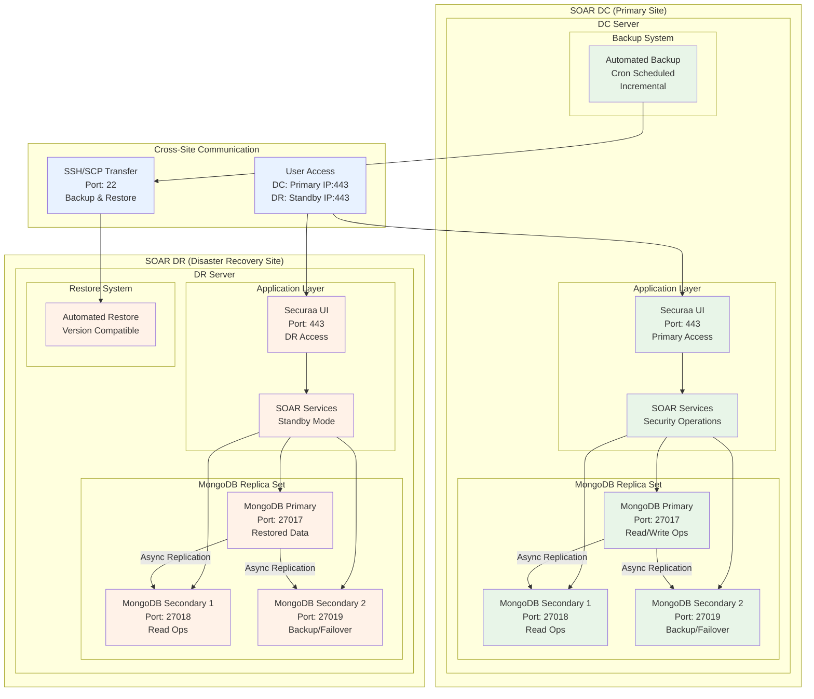
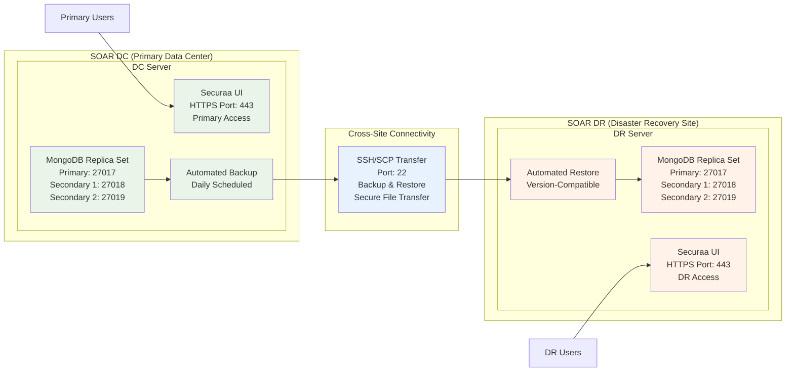
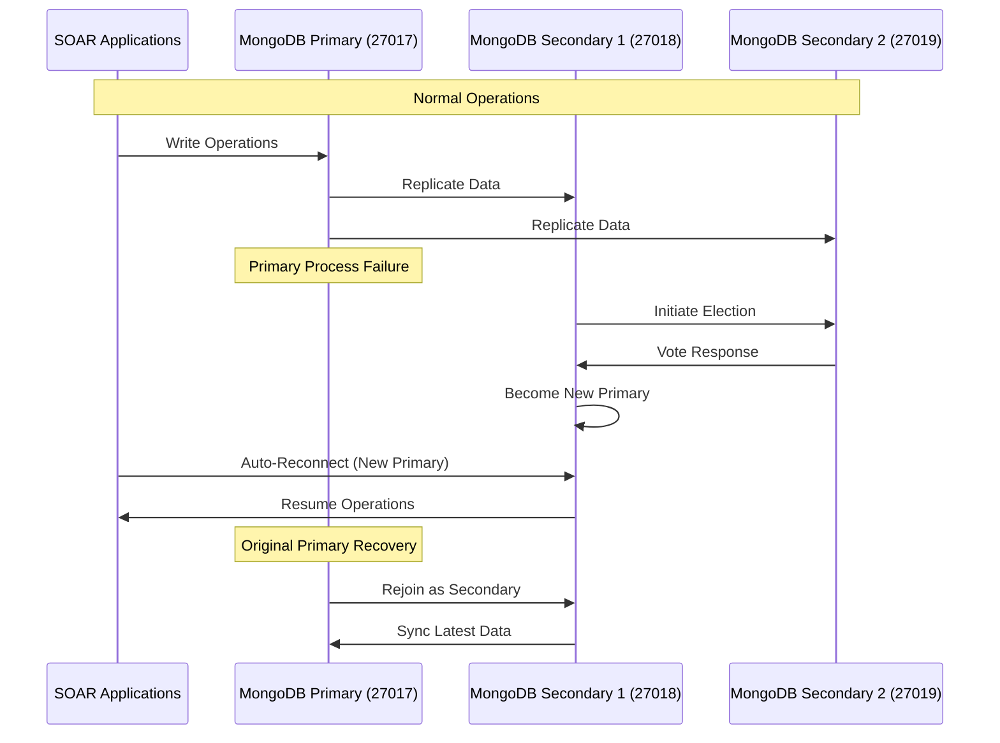
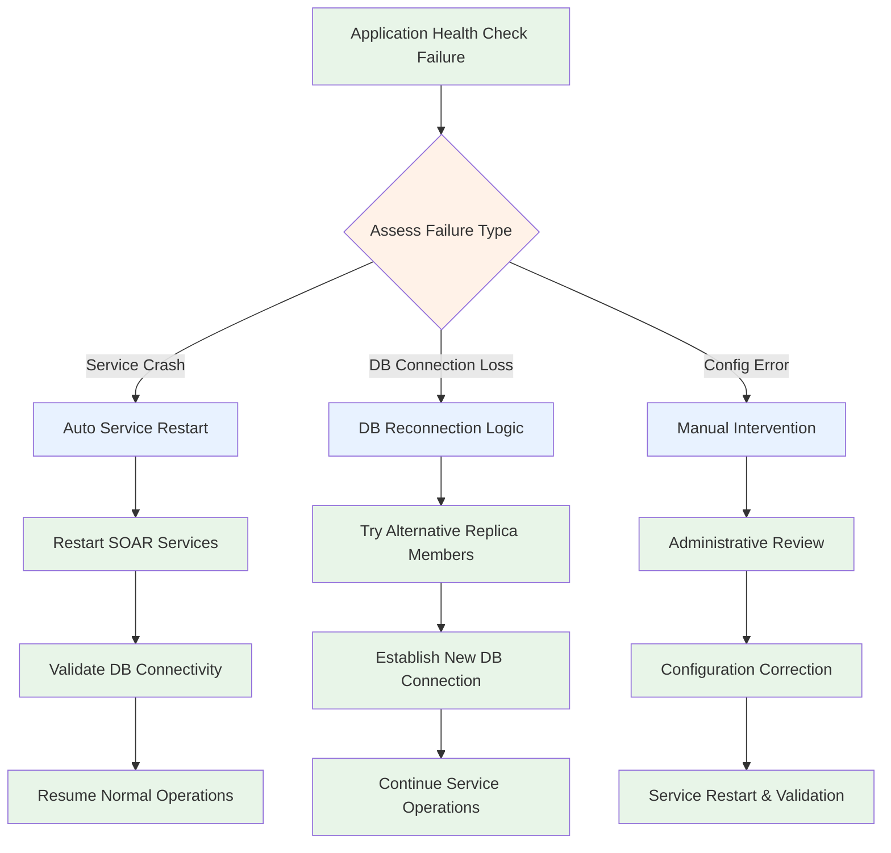
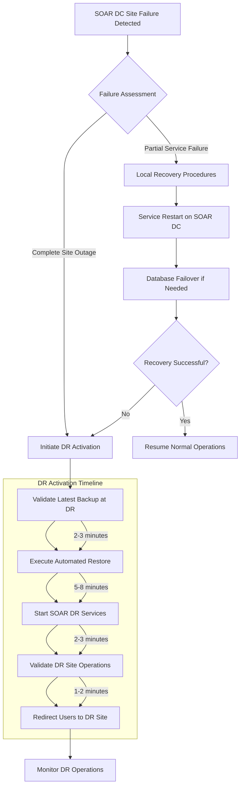
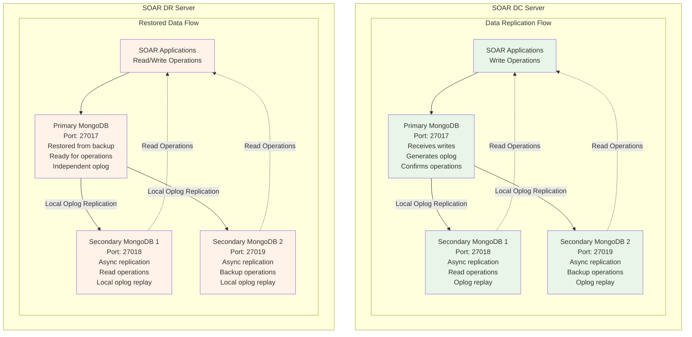
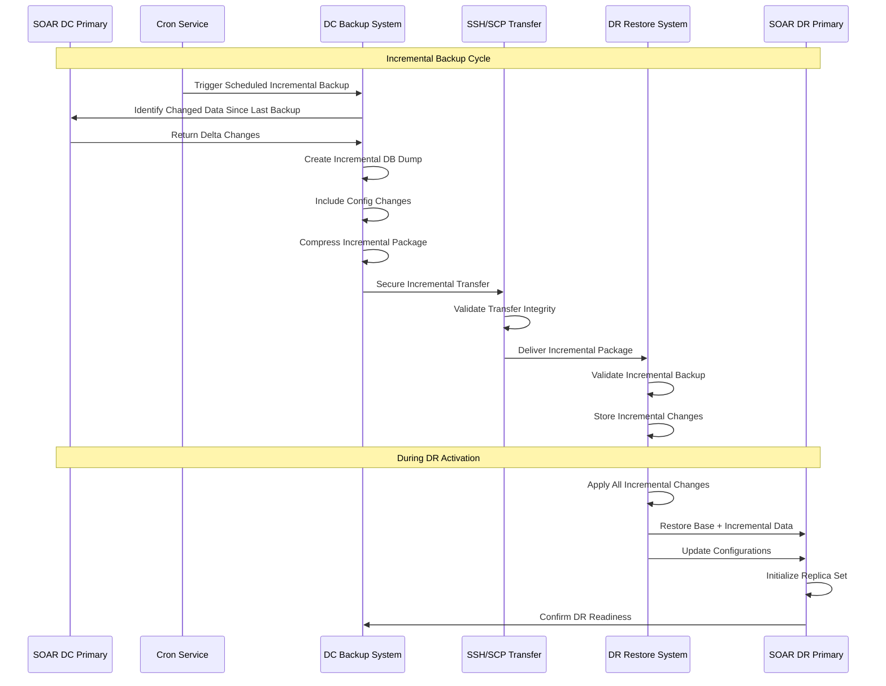

# High Availability and Disaster Recovery (HA/DR) Architecture

## Executive Summary

The Zona Services solution implements a robust High Availability (HA) and Disaster Recovery (DR) architecture designed to ensure continuous business operations, data protection, and minimal downtime. This document provides a comprehensive overview of the HA/DR architecture, component interactions, failover mechanisms, and data synchronization processes for customer understanding.

## Table of Contents

1. [Architecture Overview](#architecture-overview)
2. [High Availability Components](#high-availability-components)
3. [Disaster Recovery Setup](#disaster-recovery-setup)
4. [Failover Mechanisms](#failover-mechanisms)
5. [Data Synchronization](#data-synchronization)
6. [Recovery Procedures](#recovery-procedures)

---

## Architecture Overview

### High-Level HA/DR Architecture

The SOAR Services platform implements a comprehensive HA/DR strategy with single-machine MongoDB replica sets for both primary and disaster recovery sites:

- **Single-Machine Architecture**: Each site (DC and DR) operates on a dedicated server
- **MongoDB Replica Set HA**: 3-node MongoDB replica set (1 Primary + 2 Secondary) per site
- **Cross-Site DR**: Automated incremental database backup and restore between SOAR DC and SOAR DR using cron-scheduled intervals
- **User Interface Access**: Securaa UI accessible via port 443 at each site
- **Database Synchronization**: Port 22 SSH/SCP based incremental backup transfer

---

## High Availability Components

### 1. Single-Server MongoDB Replica Set Architecture

The platform implements MongoDB replica sets within single servers for both SOAR DC and SOAR DR sites:

#### MongoDB Replica Set Configuration per Site
- **Single Server Deployment**: Each site operates MongoDB replica set on one dedicated server
- **3-Node Replica Set**: 1 Primary + 2 Secondary nodes per site
- **Port Allocation**: Primary (27017), Secondary 1 (27018), Secondary 2 (27019)
- **Automatic Failover**: Sub-30 second failover within the replica set
- **Local High Availability**: Protection against individual MongoDB process failures

```mermaid
graph TB
    subgraph "SOAR DC - Single Server"
        subgraph "MongoDB Replica Set (DC)"
            PRIMARY_DC[Primary Node<br/>Port: 27017<br/>All Write Operations<br/>Read Operations<br/>Oplog Generation]
            
            SECONDARY1_DC[Secondary Node 1<br/>Port: 27018<br/>Read Operations<br/>Async Replication<br/>Failover Candidate]
            
            SECONDARY2_DC[Secondary Node 2<br/>Port: 27019<br/>Read Operations<br/>Async Replication<br/>Failover Candidate]
        end
        
        subgraph "Application Services (DC)"
            UI_APP_DC[Securaa UI<br/>Port: 443<br/>Primary User Interface]
            SOAR_SERVICES_DC[SOAR Services<br/>Security Operations<br/>Analytics & Reporting]
        end
    end
    
    subgraph "SOAR DR - Single Server"
        subgraph "MongoDB Replica Set (DR)"
            PRIMARY_DR[Primary Node<br/>Port: 27017<br/>Restored Data<br/>Read/Write Ready<br/>Standby Operations]
            
            SECONDARY1_DR[Secondary Node 1<br/>Port: 27018<br/>Read Operations<br/>Async Replication<br/>Failover Candidate]
            
            SECONDARY2_DR[Secondary Node 2<br/>Port: 27019<br/>Read Operations<br/>Async Replication<br/>Failover Candidate]
        end
        
        subgraph "Application Services (DR)"
            UI_APP_DR[Securaa UI<br/>Port: 443<br/>DR User Interface]
            SOAR_SERVICES_DR[SOAR Services<br/>Standby Mode<br/>Ready for Activation]
        end
    end
    
    %% DC Internal Connections
    UI_APP_DC --> SOAR_SERVICES_DC
    SOAR_SERVICES_DC --> PRIMARY_DC
    SOAR_SERVICES_DC --> SECONDARY1_DC
    SOAR_SERVICES_DC --> SECONDARY2_DC
    
    %% DC Replica Set Replication
    PRIMARY_DC -->|Async Replication| SECONDARY1_DC
    PRIMARY_DC -->|Async Replication| SECONDARY2_DC
    SECONDARY1_DC -.->|Election Process| PRIMARY_DC
    SECONDARY2_DC -.->|Election Process| PRIMARY_DC
    
    %% DR Internal Connections
    UI_APP_DR --> SOAR_SERVICES_DR
    SOAR_SERVICES_DR --> PRIMARY_DR
    SOAR_SERVICES_DR --> SECONDARY1_DR
    SOAR_SERVICES_DR --> SECONDARY2_DR
    
    %% DR Replica Set Replication
    PRIMARY_DR -->|Async Replication| SECONDARY1_DR
    PRIMARY_DR -->|Async Replication| SECONDARY2_DR
    SECONDARY1_DR -.->|Election Process| PRIMARY_DR
    SECONDARY2_DR -.->|Election Process| PRIMARY_DR
    
    %% Styling
    classDef dcSite fill:#e8f5e8
    classDef drSite fill:#fff2e8
    
    class PRIMARY_DC,SECONDARY1_DC,SECONDARY2_DC,UI_APP_DC,SOAR_SERVICES_DC dcSite
    class PRIMARY_DR,SECONDARY1_DR,SECONDARY2_DR,UI_APP_DR,SOAR_SERVICES_DR drSite
```

#### Single-Server HA Benefits
- **Process-Level Protection**: Guards against individual MongoDB process failures
- **Service Continuity**: Automatic primary election ensures continuous database availability
- **Read Scaling**: Multiple secondary nodes provide read operation distribution
- **Data Redundancy**: 3 copies of data within the same server environment
- **Fast Recovery**: Local failover without network dependencies

### 2. Application Layer High Availability

#### SOAR Application Architecture
- **Securaa UI**: Web-based user interface accessible via HTTPS (Port 443)
- **SOAR Services**: Core security operations, analytics, and reporting services
- **Database Integration**: Multi-connection support to replica set nodes
- **Health Monitoring**: Continuous application and database health validation

#### Key HA Features
- **Database Connection Resilience**: Automatic reconnection to available replica set members
- **Service Health Checks**: Built-in health monitoring and status reporting
- **Graceful Degradation**: Continued operation during partial system failures
- **User Session Management**: Persistent user sessions across service restarts

---

## Disaster Recovery Setup

### 1. SOAR DC to SOAR DR Architecture

The SOAR platform implements a comprehensive disaster recovery solution between two geographically separated single-server sites:

### 2. Automated Backup and Restore Process

#### Backup System Components

**SOAR DC Incremental Backup Process:**
- **Cron-Based Scheduling**: Automated incremental backups using configurable cron intervals
- **Multi-Tenant Database Backup**: Incremental MongoDB dumps for all active tenant databases
- **System Configuration Backup**: Application settings, user configurations, and security policies
- **Operational Data Backup**: Reports, dashboards, custom analytics, and operational logs
- **Metadata Backup**: License information, tenant configurations, and system metadata
- **Change Detection**: Only modified data since last backup is captured and transferred

#### Cross-Site Transfer Mechanism

**Secure Incremental Data Transfer (Port 22):**
- **SSH/SCP Protocol**: Encrypted file transfer between SOAR DC and SOAR DR
- **Authentication Methods**: SSH key-based or credential-based authentication
- **Transfer Validation**: Checksum verification and integrity validation
- **Cron-Based Scheduling**: Configurable interval backups (hourly, daily, or custom intervals)
- **Incremental Transfer**: Only changed data since last backup is transferred
- **Retry Logic**: Automatic retry mechanisms for failed transfers
- **Bandwidth Optimization**: Reduced transfer times due to incremental nature

#### SOAR DR Incremental Restore Process

**Automated Incremental Recovery System:**
- **Version Compatibility**: Ensures backup version matches DR environment version
- **Pre-Restore Safety**: Creates safety backup of existing DR data before restoration
- **Incremental Database Restoration**: Applies incremental changes to MongoDB replica set
- **Cron-Based Restore**: Automated restore process triggered by cron intervals
- **Change Tracking**: Maintains incremental change logs for efficient restoration
- **Configuration Update**: Automatic update of connection strings and host configurations
- **Service Activation**: Restart and validation of SOAR services post-restoration
- **Rollback Capability**: Ability to rollback to previous incremental backup points

### 3. DR Site Readiness and Activation

#### Standby Configuration
- **Infrastructure Readiness**: DR server maintains identical configuration to primary
- **Service Standby**: SOAR services configured and ready for immediate activation
- **Incremental Data Synchronization**: Regular cron-based incremental backup transfers ensure data currency
- **Network Preparation**: UI accessibility via DR site IP address (Port 443)
- **Cron Service Management**: Automated cron jobs handle backup scheduling and execution

#### DR Activation Process
1. **Failure Detection**: Primary site unavailability detection
2. **Backup Validation**: Verify latest backup integrity and completeness
3. **Restore Execution**: Automated database and configuration restoration
4. **Service Startup**: SOAR services activation and health validation
5. **User Redirection**: DNS update or manual redirection to DR site UI
6. **Operational Validation**: End-to-end functionality testing and monitoring

---

## Failover Mechanisms

### 1. Single-Server MongoDB Replica Set Failover

#### Automatic Primary Election Process

**Single-Server Failover Characteristics:**
- **Detection Time**: 10-15 seconds (MongoDB heartbeat interval)
- **Election Time**: 5-20 seconds (local server, no network latency)
- **Total Failover**: 15-35 seconds end-to-end
- **Data Consistency**: Zero data loss with proper write concerns
- **Application Impact**: Brief connection interruption, automatic reconnection

#### Failover Scenarios and Recovery

**Process-Level Failures:**
1. **Primary MongoDB Process Failure**: Automatic election of Secondary 1 or Secondary 2 to Primary
2. **Secondary Process Failure**: Continued operation with remaining nodes, automatic rejoin on restart
3. **Multiple Process Failure**: Replica set continues with majority (2 out of 3 nodes)

### 2. SOAR Application Layer Failover

#### Application Service Recovery

**Application Recovery Features:**
- **Database Connection Resilience**: Automatic retry with different replica set members
- **Service Health Monitoring**: Continuous health checks and automatic restart capabilities
- **Graceful Degradation**: Read-only operations during partial database failures
- **Session Persistence**: User session preservation during brief service interruptions

### 3. Cross-Site Disaster Recovery Failover

#### SOAR DR Site Activation Process

**DR Failover Characteristics:**
- **Detection Phase**: 1-2 minutes for complete site failure assessment
- **Restoration Phase**: 5-8 minutes for database and service restoration
- **Validation Phase**: 2-3 minutes for end-to-end functionality verification
- **User Redirection**: 1-2 minutes for DNS updates or manual redirection
- **Total DR RTO**: 10-15 minutes for complete site recovery

### 4. User Access Failover

#### Securaa UI Access Management

**Primary Site Access (Normal Operations):**
- **Primary URL**: https://[SOAR-DC-IP]:443
- **Automatic Load Balancing**: Internal replica set connection balancing
- **Session Management**: Persistent user sessions across internal failovers

**DR Site Access (During DR Activation):**
- **DR URL**: https://[SOAR-DR-IP]:443
- **Manual Redirection**: Users directed to DR site URL
- **Session Recovery**: User re-authentication required on DR site
- **Data Continuity**: Access to restored data from latest backup

---

## Data Synchronization

### 1. Single-Server MongoDB Replica Set Synchronization

#### Intra-Server Replication Process

**Single-Server Synchronization Characteristics:**
- **Replication Method**: Local asynchronous oplog-based replication
- **Replication Lag**: < 5ms (same server, no network latency)
- **Consistency Model**: Strong consistency for writes, eventual consistency for reads
- **Write Acknowledgment**: Configurable write concerns for durability
- **Local Availability**: Immediate failover within server environment

### 2. Cross-Site Data Synchronization (SOAR DC to SOAR DR)

#### Backup-Based Disaster Recovery Synchronization

#### Cross-Site Synchronization Features

**Data Transfer Protocol:**
- **Security**: SSH-based encrypted file transfer (Port 22)
- **Authentication**: Key-based or credential-based authentication
- **Compression**: Efficient data compression for bandwidth optimization
- **Integrity**: Checksum validation and error detection
- **Automation**: Cron-scheduled transfers with configurable intervals
- **Incremental Transfer**: Only changed data since last backup is transferred

**Synchronization Schedule and Metrics:**
- **Backup Frequency**: Configurable cron intervals (hourly, daily, or custom)
- **Incremental Transfer**: Reduced transfer times (5-30 minutes depending on changes)
- **RPO (Recovery Point Objective)**: Based on cron interval (1-24 hours configurable)
- **Validation Process**: Automated integrity checks for each incremental transfer
- **Retention Policy**: Multiple incremental backup points maintained at both sites
- **Change Detection**: Efficient delta identification and transfer optimization

### 3. SOAR Application Data Consistency

#### Multi-Tenant Incremental Data Management

**Tenant Database Synchronization:**
- **Tenant Isolation**: Each tenant's incremental data backed up independently
- **Configuration Consistency**: Tenant-specific configuration changes preserved
- **Security Context**: Encrypted credentials and access controls maintained
- **Operational Continuity**: User sessions and operational state preservation
- **Change Tracking**: Efficient tracking of per-tenant data modifications

**System Metadata Synchronization:**
- **License Information**: Platform licensing and activation data changes
- **User Management**: User accounts, roles, and permissions modifications
- **System Configuration**: SOAR operational parameter changes
- **Custom Content**: Reports, dashboards, and analytical configuration updates
- **Incremental Updates**: Only modified metadata transferred during backup cycles

### 4. Data Integrity and Validation

#### Incremental Backup Validation Process

**Pre-Transfer Validation:**
- **Database Consistency**: Verify replica set consistency before incremental backup
- **Change Detection**: Ensure all modifications since last backup are captured
- **Data Completeness**: Validate incremental backup includes all changed collections and indexes
- **Version Compatibility**: Validate incremental backup format and version compatibility
- **Access Permissions**: Verify backup file permissions and security

**Post-Transfer Validation:**
- **Transfer Integrity**: Checksum verification of incremental backup files
- **Incremental Completeness**: Validate all incremental changes received
- **Restore Readiness**: Confirm DR environment compatibility with incremental changes
- **Storage Management**: Monitor DR storage capacity and incremental backup retention
- **Chain Validation**: Ensure incremental backup chain integrity for proper restoration

---

## Recovery Procedures

### 1. Database Recovery Procedures

#### MongoDB Replica Set Recovery
The MongoDB replica set provides automatic recovery capabilities through its built-in election process. When a primary node fails, the remaining secondary nodes automatically elect a new primary within 15-35 seconds, ensuring minimal service disruption.

**Recovery Process:**
- **Failure Detection**: Automatic detection of primary node unavailability
- **Election Process**: Secondary nodes initiate election for new primary
- **Service Restoration**: Applications automatically reconnect to new primary
- **Data Synchronization**: Failed node rejoins as secondary and syncs latest data

#### Point-in-Time Recovery
For scenarios requiring restoration to a specific point in time, the platform supports database restoration from backups with oplog replay capabilities.

**Recovery Steps:**
1. **Service Isolation**: Temporarily isolate affected services
2. **Backup Restoration**: Restore database from the most recent backup
3. **Oplog Application**: Apply operational logs to reach desired recovery point
4. **Service Reactivation**: Restart services and validate functionality

### 2. Application Recovery Procedures

#### Service Recovery
SOAR application services include built-in health monitoring and automatic recovery mechanisms to ensure continuous operation.

**Application Recovery Features:**
- **Health Check Validation**: Continuous monitoring of service endpoints
- **Automatic Restart**: Failed services automatically restart with retry logic
- **Database Reconnection**: Automatic reconnection to available database nodes
- **Service Validation**: Post-recovery functionality verification

#### Cache Recovery
The platform includes resilient caching mechanisms that can recover from cache failures without impacting core functionality.

**Cache Recovery Process:**
- **Cache Status Monitoring**: Continuous monitoring of cache availability
- **Failover Logic**: Automatic switching to alternative cache instances
- **Configuration Updates**: Dynamic updating of application cache connections
- **Service Restart**: Restart dependent services with updated configurations

### 3. Cross-Site DR Recovery

#### DR Site Activation
The disaster recovery process provides comprehensive site activation capabilities for business continuity during primary site failures.

**DR Activation Process:**
1. **DR Readiness Validation**: Verify DR site infrastructure and service readiness
2. **Traffic Redirection**: Update DNS or direct users to DR site
3. **Service Activation**: Start SOAR services and validate operational status
4. **Operational Validation**: Confirm end-to-end functionality and performance

#### Primary Site Recovery (Failback)
When the primary site is restored, the platform supports controlled failback to resume normal operations.

**Failback Process:**
1. **Primary Site Validation**: Verify complete restoration of primary site services
2. **Data Synchronization**: Sync any incremental changes from DR to primary
3. **Service Migration**: Gradually migrate services back to primary site
4. **Traffic Restoration**: Redirect user traffic back to primary site
5. **DR Standby**: Return DR site to standby mode for future activation

---

## Conclusion

The SOAR Services High Availability and Disaster Recovery architecture provides enterprise-grade reliability and business continuity through a well-designed single-machine MongoDB replica set architecture with cross-site disaster recovery capabilities.

### Key Architectural Strengths

1. **Single-Server MongoDB Replica Sets**: Each site (SOAR DC and SOAR DR) operates with a 3-node MongoDB replica set providing local high availability
2. **Automated Cross-Site Backup**: Daily automated backup and restore processes ensure data protection between sites
3. **Rapid Local Failover**: Sub-30 second failover within MongoDB replica sets for process-level failures
4. **Secure Data Transfer**: SSH/SCP based encrypted file transfer for cross-site data synchronization
5. **Independent Site Operations**: Each site can operate independently with full SOAR functionality

### Business Benefits

- **High Availability**: MongoDB replica sets provide continuous database availability within each site
- **Disaster Recovery**: Complete DR site activation capabilities within 10-15 minutes
- **Data Protection**: Daily backup synchronization with 24-hour RPO for cross-site recovery
- **User Access**: Direct UI access via HTTPS (Port 443) at both DC and DR sites
- **Simple Architecture**: Single-machine deployment simplifies management and maintenance

### Recovery Capabilities

**Local High Availability:**
- **Process Failures**: Automatic MongoDB primary election within 15-35 seconds
- **Service Restart**: Built-in application service recovery and health monitoring
- **Data Consistency**: Zero data loss within replica set operations

**Cross-Site Disaster Recovery:**
- **Site Failures**: Complete DR site activation and service restoration
- **Data Recovery**: Full database restoration from latest backup with configuration updates
- **User Redirection**: Manual redirection to DR site UI for continued operations

This architecture ensures that the SOAR Services platform can maintain high availability within each site through MongoDB replica sets while providing comprehensive disaster recovery capabilities through automated backup and restore processes between geographically separated sites.

---

*This architecture document provides customers with a comprehensive understanding of the SOAR Services HA/DR capabilities. The single-machine MongoDB replica set design ensures both simplicity and reliability for enterprise deployments.*