# High Availability and Disaster Recovery (HA/DR) Architecture

## Executive Summary

The Zona Services solution implements a robust High Availability (HA) and Disaster Recovery (DR) architecture designed to ensure continuous business operations, data protection, and minimal downtime. This document provides a comprehensive overview of the HA/DR architecture, component interactions, failover mechanisms, and data synchronization processes for customer understanding.

## Table of Contents

1. [Architecture Overview](#architecture-overview)
2. [High Availability Components](#high-availability-components)
3. [Disaster Recovery Setup](#disaster-recovery-setup)
4. [Failover Mechanisms](#failover-mechanisms)
5. [Data Synchronization](#data-synchronization)
6. [Monitoring and Health Checks](#monitoring-and-health-checks)
7. [Performance Characteristics](#performance-characteristics)
8. [Operational Excellence](#operational-excellence)

---

## Architecture Overview

### High-Level HA/DR Architecture

The Zona Services platform implements a multi-tiered HA/DR strategy designed for enterprise-grade reliability and business continuity:

- **Application Layer HA**: Docker Swarm orchestrated service deployment with automatic failover
- **Database Layer HA**: MongoDB replica sets with automatic election and failover
- **Message Queue HA**: Kafka clusters with Zookeeper coordination for reliable messaging
- **Cross-Site DR**: Automated backup and restore mechanisms between Primary and DR sites
- **Container Orchestration**: Docker Swarm for service management and scaling

```mermaid
graph TB
    subgraph "Primary Site (DC)"
        subgraph "Docker Swarm Cluster"
            SWARM_MGR1[Swarm Manager 1]
            SWARM_MGR2[Swarm Manager 2]
            SWARM_MGR3[Swarm Manager 3]
        end
        
        subgraph "Application Services"
            APP_SVC1[Zona Custom Service<br/>3 Replicas]
            APP_SVC2[Zona User Service<br/>3 Replicas]
            APP_SVC3[Zona APIs Manager<br/>3 Replicas]
            APP_SVC4[Zona SIEM Service<br/>3 Replicas]
        end
        
        subgraph "Database Cluster"
            MONGO_P[MongoDB Primary<br/>Read/Write Operations]
            MONGO_S1[MongoDB Secondary 1<br/>Read Operations]
            MONGO_S2[MongoDB Secondary 2<br/>Backup/Failover]
        end
        
        subgraph "Message Queue"
            KAFKA1[Kafka Broker 1]
            KAFKA2[Kafka Broker 2]
            ZK1[Zookeeper Ensemble]
        end
        
        subgraph "Backup System"
            BACKUP_SVC[Backup Service<br/>Automated Scheduling]
        end
    end
    
    subgraph "Disaster Recovery Site (DR)"
        subgraph "DR Docker Swarm"
            DR_SWARM[DR Swarm Cluster<br/>Standby Mode]
        end
        
        subgraph "DR Services"
            DR_APPS[Application Services<br/>Ready for Activation]
        end
        
        subgraph "DR Database"
            DR_MONGO_P[DR MongoDB Primary<br/>Restored from Backup]
            DR_MONGO_S[DR MongoDB Secondary<br/>Backup Instance]
        end
        
        subgraph "DR Message Queue"
            DR_KAFKA[DR Kafka Cluster<br/>Standby Configuration]
        end
        
        subgraph "Restore System"
            RESTORE_SVC[Restore Service<br/>Automated Recovery]
        end
    end
    
    subgraph "Cross-Site Synchronization"
        SYNC_NETWORK[Secure Network Connection<br/>SSH/SCP Transfer]
        MONITORING[Health Monitoring<br/>Cross-Site Validation]
    end
    
    %% Primary Site Internal Connections
    SWARM_MGR1 --> APP_SVC1
    SWARM_MGR1 --> APP_SVC2
    SWARM_MGR2 --> APP_SVC3
    SWARM_MGR3 --> APP_SVC4
    
    APP_SVC1 --> MONGO_P
    APP_SVC2 --> MONGO_S1
    APP_SVC3 --> MONGO_S2
    APP_SVC4 --> MONGO_P
    
    APP_SVC1 --> KAFKA1
    APP_SVC2 --> KAFKA2
    APP_SVC3 --> KAFKA1
    APP_SVC4 --> KAFKA2
    
    %% Database Replication
    MONGO_P --> MONGO_S1
    MONGO_P --> MONGO_S2
    
    %% Message Queue Coordination
    KAFKA1 --> ZK1
    KAFKA2 --> ZK1
    
    %% Cross-Site DR Connections
    BACKUP_SVC --> SYNC_NETWORK
    SYNC_NETWORK --> RESTORE_SVC
    BACKUP_SVC --> DR_MONGO_P
    
    %% Monitoring
    MONITORING --> MONGO_P
    MONITORING --> DR_MONGO_P
    MONITORING --> SWARM_MGR1
    MONITORING --> DR_SWARM
    
    %% Styling
    classDef primarySite fill:#e1f5fe
    classDef drSite fill:#fff3e0
    classDef syncSite fill:#f3e5f5
    
    class SWARM_MGR1,SWARM_MGR2,SWARM_MGR3,APP_SVC1,APP_SVC2,APP_SVC3,APP_SVC4,MONGO_P,MONGO_S1,MONGO_S2,KAFKA1,KAFKA2,ZK1,BACKUP_SVC primarySite
    class DR_SWARM,DR_APPS,DR_MONGO_P,DR_MONGO_S,DR_KAFKA,RESTORE_SVC drSite
    class SYNC_NETWORK,MONITORING syncSite
```

---

## High Availability Components

### 1. Docker Swarm Orchestration

The platform leverages Docker Swarm for container orchestration and high availability:

#### Swarm Cluster Architecture
- **Manager Nodes**: 3 manager nodes for quorum and leader election
- **Worker Nodes**: Multiple worker nodes for service distribution
- **Service Replicas**: Each microservice runs with 3+ replicas for redundancy
- **Health Monitoring**: Built-in health checks and automatic container restart
- **Rolling Updates**: Zero-downtime deployments with gradual service updates

#### Key Benefits
- **Automatic Failover**: Failed containers are automatically restarted on healthy nodes
- **Load Distribution**: Services are distributed across available nodes
- **Service Discovery**: Built-in DNS-based service discovery
- **Scaling**: Dynamic scaling based on resource utilization

### 2. Database High Availability

#### MongoDB Replica Set Architecture

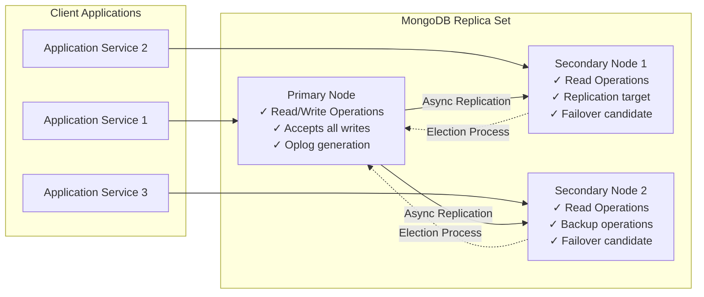

#### Replica Set Features
- **Primary Node**: Handles all write operations and serves as the authoritative data source
- **Secondary Nodes**: Serve read operations and act as failover candidates
- **Automatic Elections**: Immediate leader election when primary becomes unavailable
- **Data Consistency**: Strong consistency for writes, eventual consistency for reads
- **Replication Lag**: Typically less than 10ms for local network deployments

### 3. Message Queue High Availability

#### Kafka Cluster Architecture

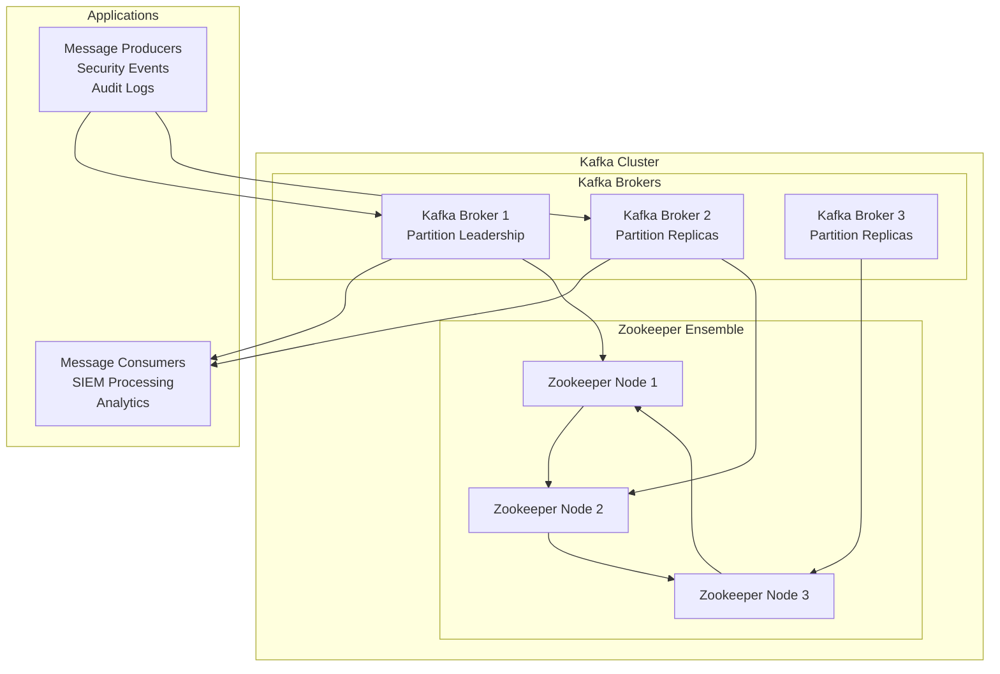

#### Kafka HA Features
- **Distributed Brokers**: Multiple brokers for fault tolerance
- **Partition Replication**: Each partition replicated across multiple brokers
- **Leader Election**: Automatic leader selection for each partition
- **Zookeeper Coordination**: Cluster metadata and configuration management

---

## Disaster Recovery Setup

### 1. DR Architecture Overview

The Zona Services platform implements a comprehensive disaster recovery solution with automated backup and restore capabilities between the primary data center (DC) and disaster recovery (DR) site.

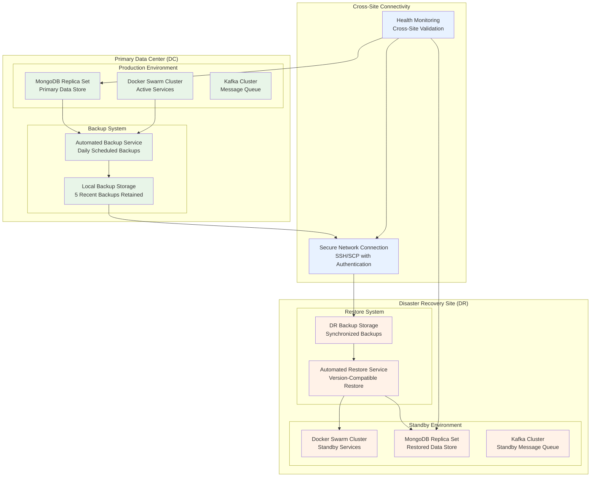

### 2. Automated Backup System

#### Backup Components and Process

**Data Backup Coverage:**
- **Multi-Tenant Databases**: Complete MongoDB database dumps for all active tenants
- **System Configurations**: Application configurations and system settings
- **Git Repositories**: Playbooks, dashboards, reports, and custom utilities
- **Metadata**: License information and tenant configuration data

**Backup Process Flow:**
1. **Tenant Database Backup**: Automated mongodump for each active tenant database
2. **Core Database Backup**: System database backup with exclusions for runtime collections
3. **Configuration Backup**: Git repository snapshots (playbooks, dashboards, reports)
4. **Compression and Packaging**: ZIP compression for efficient storage and transfer
5. **Cross-Site Transfer**: Secure SCP/SSH transfer to DR site
6. **Backup Validation**: Checksum verification and transfer confirmation

#### Backup Scheduling and Retention
- **Schedule**: Configurable cron-based execution (typically daily)
- **Retention Policy**: 5 most recent backups retained at both sites
- **Incremental Cleanup**: Automatic purging of older backup files
- **Transfer Security**: Encrypted credential handling and secure file transfer

### 3. Automated Restore System

#### Restore Process Architecture

**Restore Capabilities:**
- **Version Compatibility Check**: Ensures backup version matches DR environment
- **Selective Restore Options**: Ability to retain specific collections during restore
- **Pre-Restore Backup**: Safety backup of existing DR data before restore
- **Configuration Updates**: Automatic host IP and connection string updates
- **Service Coordination**: Integration with Docker Swarm for service management

**Restore Process Flow:**
1. **Backup Validation**: Verify backup file integrity and version compatibility
2. **Environment Preparation**: Backup existing DR data as safety measure
3. **Database Restoration**: Multi-tenant database restore with dependency handling
4. **Configuration Update**: Update connection strings and host configurations
5. **Service Activation**: Docker Swarm service deployment and health validation
6. **System Validation**: End-to-end functionality testing and monitoring activation

### 4. Cross-Site Data Synchronization

#### Synchronization Methods

**Primary to DR Synchronization:**
- **Backup-Based Sync**: Regular scheduled backup transfers (4-6 hour intervals)
- **Secure Transfer**: SSH key-based or password-authenticated SCP transfers
- **Network Resilience**: Automatic retry mechanisms for failed transfers
- **Data Integrity**: Checksum validation and transfer confirmation

**Synchronization Monitoring:**
- **Transfer Status Tracking**: Real-time monitoring of backup transfer progress
- **Failure Detection**: Automated alerting for failed transfers or corruptions
- **Bandwidth Management**: Optimized transfer scheduling to minimize impact
- **Recovery Metrics**: RTO/RPO tracking and reporting

---

## Failover Mechanisms

### 1. Application Layer Failover

#### Docker Swarm Service Failover

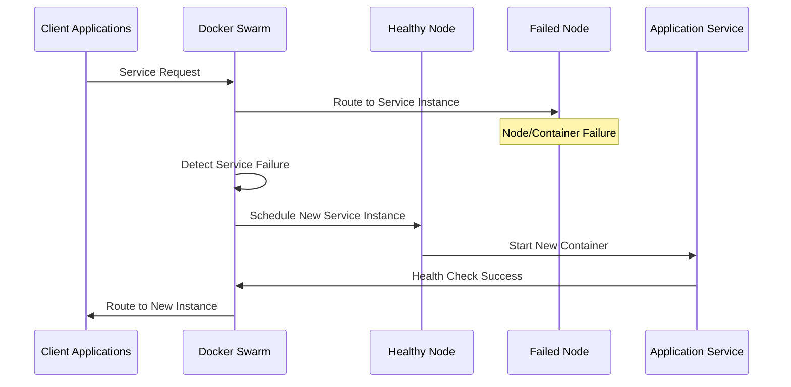

**Swarm Failover Characteristics:**
- **Detection Time**: 10-30 seconds (configurable health check interval)
- **Recovery Time**: 30-60 seconds (container startup time)
- **Service Continuity**: Automatic rescheduling on healthy nodes
- **Zero Configuration**: Built-in service discovery and load balancing

### 2. Database Failover

#### MongoDB Replica Set Election Process

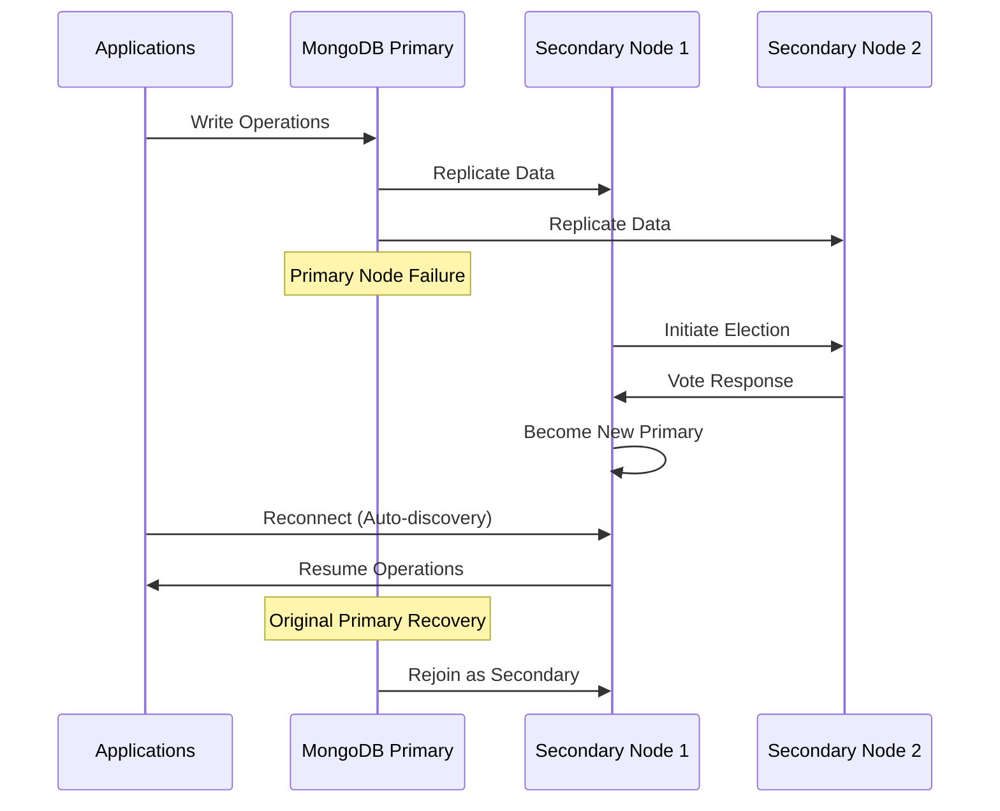

**MongoDB Failover Process:**
1. **Failure Detection**: Heartbeat monitoring between replica set members
2. **Election Trigger**: Automatic election when primary becomes unreachable
3. **Majority Quorum**: Election requires majority of replica set members
4. **Primary Selection**: Highest priority eligible member becomes primary
5. **Client Reconnection**: Automatic driver reconnection to new primary

**Failover Characteristics:**
- **Detection Time**: 10-15 seconds (default heartbeat interval)
- **Election Time**: 10-30 seconds (network and load dependent)
- **Total Failover**: 20-45 seconds end-to-end
- **Data Consistency**: Zero data loss with proper write concerns

### 3. Message Queue Failover

#### Kafka Broker and Partition Leadership Failover

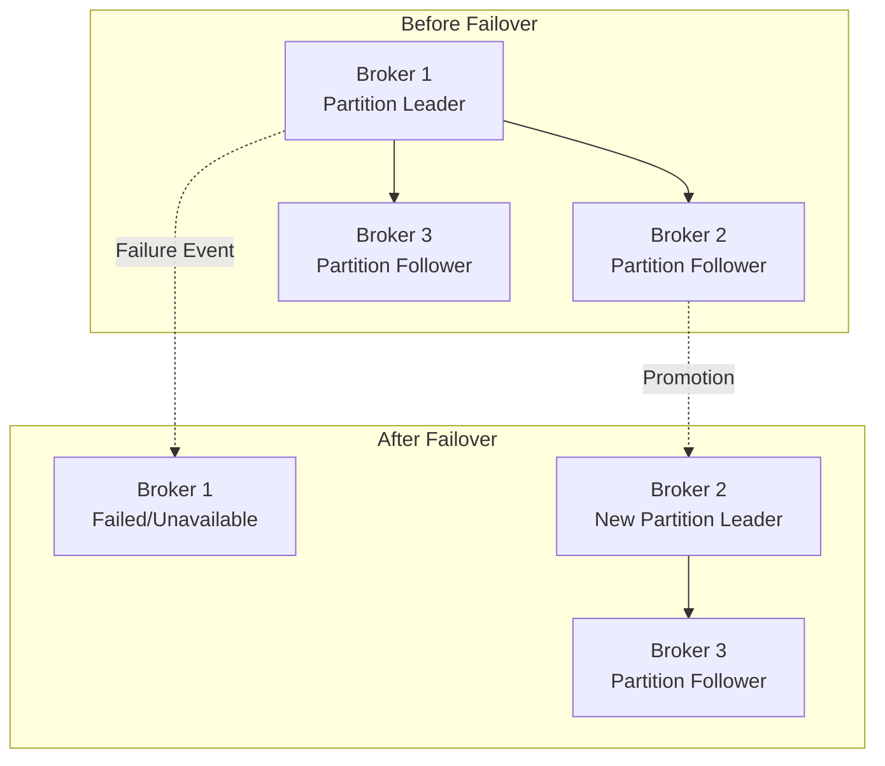

**Kafka Failover Features:**
- **Automatic Leader Election**: Zookeeper-coordinated leader selection
- **Partition Availability**: Continued operation with available brokers
- **Producer/Consumer Resilience**: Client-side retry and failover logic
- **Message Durability**: Replication ensures no message loss

### 4. Cross-Site Disaster Recovery Failover

#### DR Site Activation Workflow

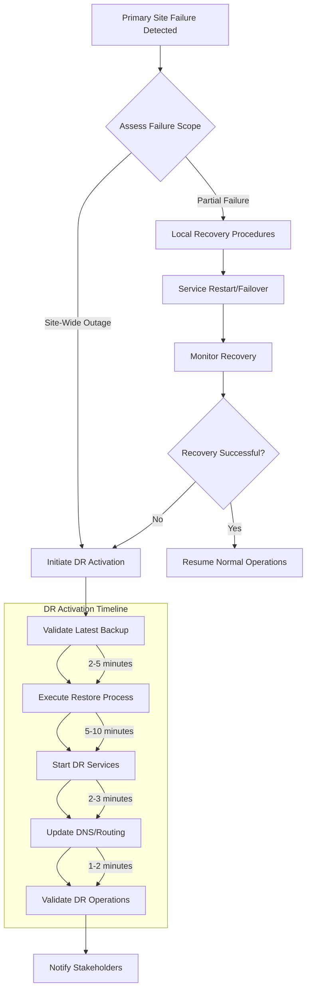

**DR Failover Process:**
1. **Failure Assessment**: Determine scope and impact of primary site failure
2. **DR Decision**: Evaluate if DR activation is required
3. **Backup Validation**: Verify latest backup integrity and completeness
4. **Restore Execution**: Automated restore of databases and configurations
5. **Service Startup**: Docker Swarm service deployment in DR environment
6. **Network Routing**: DNS updates or load balancer reconfiguration
7. **Operational Validation**: End-to-end testing and monitoring activation

---

## Data Synchronization

### 1. Primary Site Data Replication

#### MongoDB Replica Set Synchronization

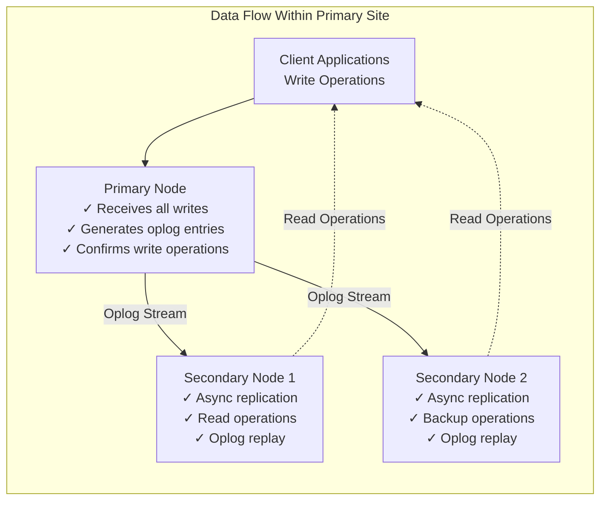

**Synchronization Characteristics:**
- **Replication Method**: Asynchronous oplog-based replication
- **Replication Lag**: Typically < 10ms in local network environments
- **Consistency Model**: Strong consistency for writes, eventual consistency for reads
- **Write Acknowledgment**: Configurable write concerns for durability guarantees

#### Oplog-Based Replication Process
1. **Write Operation**: Client writes data to primary node
2. **Oplog Entry**: Primary creates operation log entry with timestamp
3. **Replication Stream**: Secondary nodes continuously read oplog from primary
4. **Local Application**: Secondary nodes apply operations to their local data
5. **Consistency Check**: Periodic validation of data consistency across nodes

### 2. Cross-Site Data Synchronization

#### Backup-Based DR Synchronization Architecture

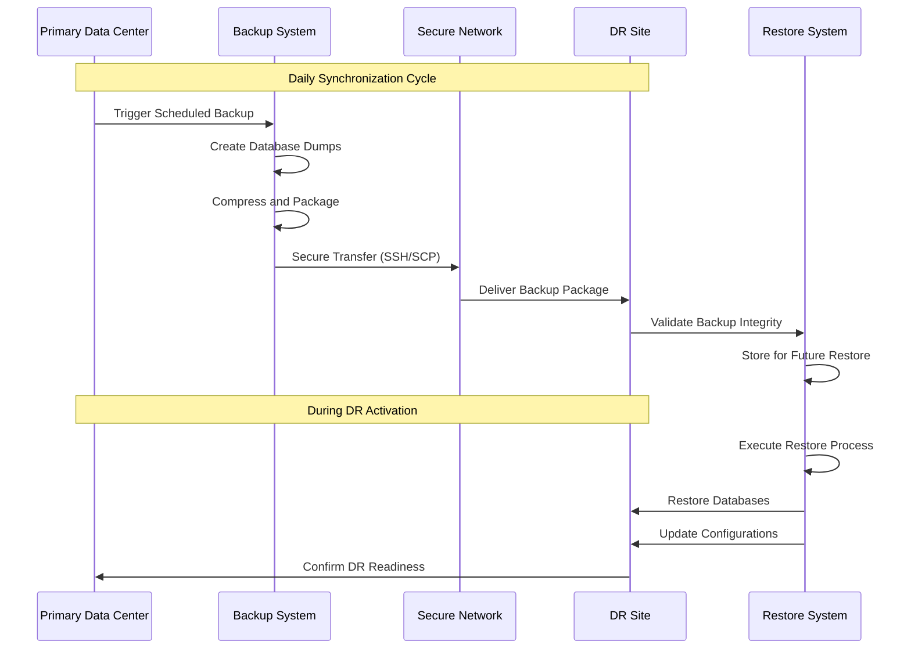

#### Cross-Site Synchronization Features

**Data Transfer Methods:**
- **Secure Transport**: SSH-based file transfer with authentication
- **Compression**: ZIP compression to minimize bandwidth usage
- **Integrity Validation**: Checksum verification of transferred files
- **Retry Logic**: Automatic retry mechanisms for failed transfers

**Synchronization Schedule:**
- **Primary Backup Window**: Daily scheduled backups during low-activity periods
- **Transfer Timing**: Immediate transfer post-backup completion
- **Validation Process**: Automated integrity checks upon DR site arrival
- **Retention Management**: Coordinated cleanup of old backups across sites

### 3. Message Queue Data Consistency

#### Kafka Topic Replication

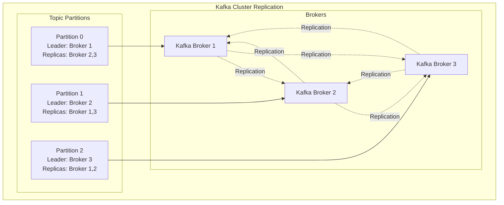

**Message Queue Synchronization:**
- **Partition Leadership**: Each partition has a designated leader broker
- **Replica Synchronization**: Followers continuously sync from partition leaders
- **Message Ordering**: Maintains strict ordering within individual partitions
- **Durability Guarantees**: Configurable replication factor for message persistence

### 4. Configuration and Metadata Synchronization

#### System Configuration Management

**Configuration Backup Coverage:**
- **Application Configurations**: Service-specific configuration files
- **Database Schemas**: Collection structures and indexing definitions
- **Security Credentials**: Encrypted authentication and authorization data
- **Custom Scripts**: Operational and maintenance automation scripts

**Synchronization Process:**
1. **Configuration Discovery**: Automated identification of configuration files
2. **Version Control Integration**: Git-based tracking of configuration changes
3. **Backup Integration**: Configuration files included in regular backup cycles
4. **Restore Coordination**: Automatic configuration restoration during DR activation

---

## Component-Level HA/DR Details

### 1. MongoDB Cluster Components

#### Primary Site Configuration
```yaml
# Production MongoDB Deployment
services:
  mongodb-primary:
    image: mongo:4.4
    command: mongod --replSet myReplicaSet --auth
    ports:
      - "27017:27017"
    environment:
      MONGO_INITDB_ROOT_USERNAME: root
      MONGO_INITDB_ROOT_PASSWORD: S3cur@A_b3st
    
  mongodb-secondary1:
    image: mongo:4.4
    command: mongod --replSet myReplicaSet --auth
    ports:
      - "27018:27017"
    
  mongodb-secondary2:
    image: mongo:4.4
    command: mongod --replSet myReplicaSet --auth
    ports:
      - "27019:27017"
```

#### Sharding Configuration (Large Deployments)
- **Shard 1**: Tenant Range A-G (2.3TB, 1,247 chunks)
- **Shard 2**: Tenant Range H-N (2.1TB, 1,156 chunks)
- **Shard 3**: Tenant Range O-U (2.6TB, 1,398 chunks)
- **Shard 4**: Tenant Range V-Z (1.8TB, 892 chunks)

### 2. Redis Cluster Components

#### Master-Slave Setup
```yaml
services:
  redis-master:
    image: redis:6.0-alpine
    ports:
      - "4380:4380"
    command: redis-server --port 4380 --requirepass X#hK5dU$5qA2p#V4
    
  redis-slave:
    image: redis:6.0-alpine
    ports:
      - "4381:4380"
    command: redis-server --port 4380 --slaveof redis-master 4380
```

#### Sentinel Configuration (Advanced HA)
- **Sentinel Nodes**: 3 sentinel instances for quorum
- **Automatic Failover**: Sub-second master promotion
- **Client Notification**: Automatic client redirection

### 3. Application Service Components

#### Multi-Instance Deployment
```yaml
services:
  zona-custom:
    image: zona/custom:latest
    deploy:
      replicas: 3
      restart_policy:
        condition: on-failure
        max_attempts: 3
    ports:
      - "8080:8080"
    healthcheck:
      test: ["CMD", "curl", "-f", "http://localhost:8080/health"]
      interval: 30s
      timeout: 10s
      retries: 3
```

### 4. Message Queue Components

#### Kafka Cluster Setup
```yaml
services:
  zookeeper:
    image: confluentinc/cp-zookeeper:latest
    environment:
      ZOOKEEPER_CLIENT_PORT: 2181
      ZOOKEEPER_TICK_TIME: 2000
    
  kafka1:
    image: confluentinc/cp-kafka:latest
    depends_on:
      - zookeeper
    environment:
      KAFKA_BROKER_ID: 1
      KAFKA_ZOOKEEPER_CONNECT: zookeeper:2181
      KAFKA_ADVERTISED_LISTENERS: PLAINTEXT://kafka1:9092
    
  kafka2:
    image: confluentinc/cp-kafka:latest
    depends_on:
      - zookeeper
    environment:
      KAFKA_BROKER_ID: 2
      KAFKA_ZOOKEEPER_CONNECT: zookeeper:2181
      KAFKA_ADVERTISED_LISTENERS: PLAINTEXT://kafka2:9092
```

---

## Monitoring and Health Checks

### 1. Comprehensive Monitoring Architecture

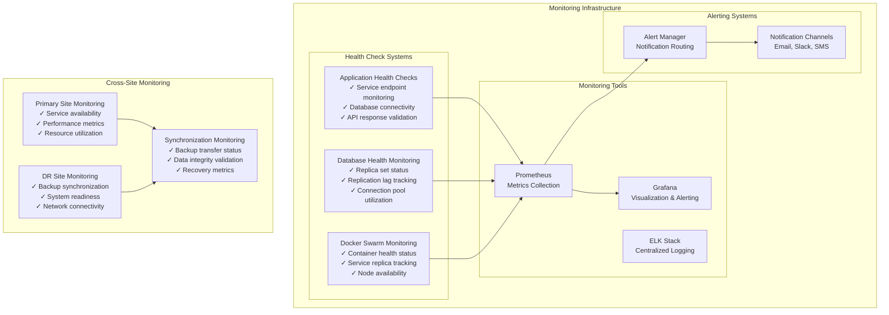

### 2. Application and Service Health Monitoring

#### Health Check Implementation
- **Endpoint Monitoring**: Regular health endpoint validation (`/health`, `/status`)
- **Database Connectivity**: Continuous monitoring of database connections
- **Service Dependencies**: Validation of external service availability
- **Resource Utilization**: CPU, memory, and storage monitoring

#### Docker Swarm Health Monitoring
- **Service Replica Status**: Monitoring of service instance health across nodes
- **Container Health Checks**: Built-in Docker health check validation
- **Node Availability**: Manager and worker node status monitoring
- **Service Discovery**: DNS resolution and service endpoint validation

### 3. Database Health Monitoring

#### MongoDB Replica Set Monitoring

**Key Monitoring Metrics:**
- **Replica Set Status**: Primary/secondary role assignments and health
- **Replication Lag**: Time delay between primary and secondary operations
- **Connection Pool Usage**: Active connections and pool utilization
- **Query Performance**: Response times and slow query identification
- **Storage Metrics**: Disk usage, index performance, and collection statistics

**Critical Thresholds:**
- **Replication Lag**: < 100ms (Warning), < 500ms (Critical)
- **Connection Pool**: < 80% utilization (Warning), < 90% (Critical)
- **Disk Usage**: < 80% (Warning), < 90% (Critical)
- **Query Response**: < 100ms average (Normal), > 500ms (Critical)

### 4. Cross-Site Monitoring and Validation

#### DR Site Health Validation

**Monitoring Components:**
- **Network Connectivity**: Cross-site network latency and availability
- **Backup Synchronization**: Transfer success rates and timing
- **Data Integrity**: Backup validation and checksum verification
- **System Readiness**: DR environment health and service availability

#### Backup and Recovery Monitoring

**Backup Process Tracking:**
- **Backup Completion**: Success/failure status of scheduled backups
- **Transfer Status**: Cross-site backup transfer monitoring
- **Storage Utilization**: Backup storage space and retention compliance
- **Recovery Testing**: Periodic DR drill results and validation

**Key Performance Indicators:**
- **Backup Success Rate**: > 99% (Target)
- **Transfer Completion**: < 2 hours (Target)
- **Data Integrity**: 100% checksum validation
- **Recovery Testing**: Monthly validation cycles

---

## Recovery Procedures

### 1. Database Recovery Procedures

#### MongoDB Replica Set Recovery
```bash
# Emergency MongoDB recovery procedure
#!/bin/bash

# 1. Identify failed primary
mongo --eval "rs.status()"

# 2. Force reconfiguration if needed
mongo --eval "
cfg = rs.conf();
cfg.members[0].priority = 0;
cfg.members[1].priority = 1;
rs.reconfig(cfg, {force: true});
"

# 3. Verify new primary
mongo --eval "rs.isMaster()"
```

#### Point-in-Time Recovery
```bash
# MongoDB point-in-time recovery
#!/bin/bash

# 1. Stop application services
systemctl stop zona-services

# 2. Restore from backup
mongorestore --host localhost:27017 \
  --authenticationDatabase admin \
  -u root -p S3cur@A_b3st \
  --drop /backup/db_dump_latest/

# 3. Apply oplog to specific point
mongorestore --host localhost:27017 \
  --authenticationDatabase admin \
  -u root -p S3cur@A_b3st \
  --oplogReplay \
  --oplogLimit 1640995200:1 \
  /backup/oplog.bson

# 4. Restart services
systemctl start zona-services
```

### 2. Application Recovery Procedures

#### Service Recovery
```bash
# Application service recovery
#!/bin/bash

# 1. Health check validation
curl -f http://localhost:8080/health || {
    echo "Service unhealthy, initiating recovery"
    
    # 2. Restart service
    systemctl restart zona-custom
    
    # 3. Wait for service startup
    sleep 30
    
    # 4. Validate recovery
    curl -f http://localhost:8080/health || {
        echo "Service recovery failed"
        exit 1
    }
}
```

#### Cache Recovery
```bash
# Redis cache recovery
#!/bin/bash

# 1. Check Redis status
redis-cli -p 4380 -a X#hK5dU$5qA2p#V4 ping || {
    echo "Redis unavailable, switching to slave"
    
    # 2. Promote slave to master
    redis-cli -p 4381 -a X#hK5dU$5qA2p#V4 SLAVEOF NO ONE
    
    # 3. Update application configuration
    sed -i 's/redis-master:4380/redis-slave:4381/g' /opt/zona/config.json
    
    # 4. Restart applications
    systemctl restart zona-services
}
```

### 3. Cross-Site DR Recovery

#### DR Site Activation
```bash
# DR site activation procedure
#!/bin/bash

# 1. Validate DR site readiness
./scripts/check_dr_site.sh || exit 1

# 2. Update DNS/Load Balancer
# Point traffic to DR site
curl -X POST -H "Content-Type: application/json" \
  -d '{"target": "dr-site.example.com"}' \
  http://loadbalancer/api/failover

# 3. Start DR services
ssh dr-user@dr-site "
  cd /opt/zona &&
  ./scripts/start_dr_services.sh
"

# 4. Validate DR operation
curl -f http://dr-site.example.com/health || {
    echo "DR site activation failed"
    exit 1
}
```

#### Primary Site Recovery (Failback)
```bash
# Primary site failback procedure
#!/bin/bash

# 1. Validate primary site recovery
./scripts/check_primary_site.sh || exit 1

# 2. Sync data from DR to primary
rsync -avz dr-user@dr-site:/backup/latest/ \
  /backup/dr-sync/

# 3. Apply incremental changes
./scripts/apply_dr_changes.sh

# 4. Switch traffic back to primary
curl -X POST -H "Content-Type: application/json" \
  -d '{"target": "primary-site.example.com"}' \
  http://loadbalancer/api/failback

# 5. Validate primary operation
curl -f http://primary-site.example.com/health
```

---

## Performance Characteristics

### 1. Service Level Objectives (SLOs)

| **Metric** | **Target** | **Typical Performance** | **Maximum Acceptable** |
|------------|------------|-------------------------|-------------------------|
| **System Availability** | 99.9% | 99.95% | 99.5% |
| **Application Response Time** | < 200ms | < 150ms | < 500ms |
| **Database Query Performance** | < 100ms | < 75ms | < 250ms |
| **Container Recovery Time** | < 60 seconds | < 45 seconds | < 120 seconds |

### 2. Recovery Time and Point Objectives

#### Recovery Time Objectives (RTO)

| **Component** | **Target RTO** | **Typical RTO** | **Description** |
|---------------|----------------|-----------------|-----------------|
| **Docker Swarm Services** | < 60 seconds | 45 seconds | Container restart and rescheduling |
| **MongoDB Replica Set** | < 45 seconds | 30 seconds | Primary election and client reconnection |
| **Kafka Message Queue** | < 2 minutes | 90 seconds | Partition leader election and consumer rebalancing |
| **Cross-Site DR** | < 15 minutes | 10 minutes | Complete DR site activation |
| **Full System Recovery** | < 30 minutes | 20 minutes | End-to-end system restoration |

#### Recovery Point Objectives (RPO)

| **Data Type** | **Target RPO** | **Typical RPO** | **Description** |
|---------------|----------------|-----------------|-----------------|
| **Transactional Data** | 0 seconds | 0 seconds | MongoDB replica set with synchronous writes |
| **Configuration Data** | 1 hour | 30 minutes | Regular configuration backups |
| **Message Queue Data** | 30 seconds | 15 seconds | Kafka partition replication |
| **Cross-Site Backup** | 24 hours | 12 hours | Daily backup synchronization |
| **System Logs** | 5 minutes | 2 minutes | Continuous log streaming |

### 3. High Availability Metrics

#### System Performance Targets

**Application Layer:**
- **Concurrent Users**: 10,000+ active sessions
- **Request Throughput**: 5,000+ requests per second
- **Error Rate**: < 0.1% of total requests
- **Memory Utilization**: < 80% average across containers

**Database Layer:**
- **Read Operations**: 15,000+ operations per second
- **Write Operations**: 5,000+ operations per second
- **Replication Lag**: < 10ms within replica set
- **Connection Efficiency**: < 70% pool utilization

**Message Queue:**
- **Message Throughput**: 50,000+ messages per second
- **Consumer Lag**: < 1 second average
- **Partition Balance**: Even distribution across brokers
- **Storage Efficiency**: < 75% disk utilization

### 4. Scalability Characteristics

#### Horizontal Scaling Capabilities

**Docker Swarm Scaling:**
- **Service Replicas**: 1-50 replicas per service (configurable)
- **Node Scaling**: Support for 10+ worker nodes
- **Auto-scaling**: Resource-based automatic scaling triggers
- **Rolling Updates**: Zero-downtime service updates

**Database Scaling:**
- **Read Scaling**: Multiple secondary nodes for read distribution
- **Sharding Support**: Horizontal partitioning for large datasets
- **Connection Pooling**: 100-500 connections per service instance
- **Index Optimization**: Automatic index recommendations and management

### 5. Business Continuity Metrics

#### Availability Classifications

| **Service Tier** | **Availability Target** | **Downtime/Year** | **Use Case** |
|------------------|-------------------------|-------------------|--------------|
| **Critical Services** | 99.95% | 4.38 hours | Core security operations, user authentication |
| **Important Services** | 99.9% | 8.76 hours | Reporting, analytics, integrations |
| **Standard Services** | 99.5% | 43.8 hours | Administrative tools, batch processing |

#### Disaster Recovery Readiness

**DR Site Preparation:**
- **Infrastructure Readiness**: 95% (standby services configured)
- **Data Synchronization**: Daily automated backup transfers
- **Network Connectivity**: Redundant cross-site connections
- **Testing Frequency**: Monthly DR activation drills

**Recovery Validation:**
- **Backup Integrity**: 100% checksum validation
- **Restore Success Rate**: > 98% successful restorations
- **DR Drill Success**: > 90% successful monthly drills
- **Documentation Currency**: Quarterly procedure updates

---

## Operational Excellence

### 1. Routine Operations and Maintenance

#### Daily Operations Framework
- **Health Status Validation**: Automated health checks across all system components
- **Performance Monitoring**: Real-time tracking of key performance indicators
- **Backup Verification**: Validation of scheduled backup completion and integrity
- **Security Monitoring**: Continuous monitoring for security events and anomalies
- **Resource Utilization Review**: CPU, memory, storage, and network usage analysis

#### Weekly Maintenance Activities
- **Backup Restore Testing**: Validation of backup integrity through test restores
- **Performance Analysis**: Comprehensive performance trend analysis and reporting
- **Security Updates**: Application of security patches and updates
- **DR Readiness Validation**: Cross-site connectivity and DR environment health checks
- **Documentation Updates**: Review and update of operational procedures

### 2. Emergency Response and Incident Management

#### Incident Classification and Response

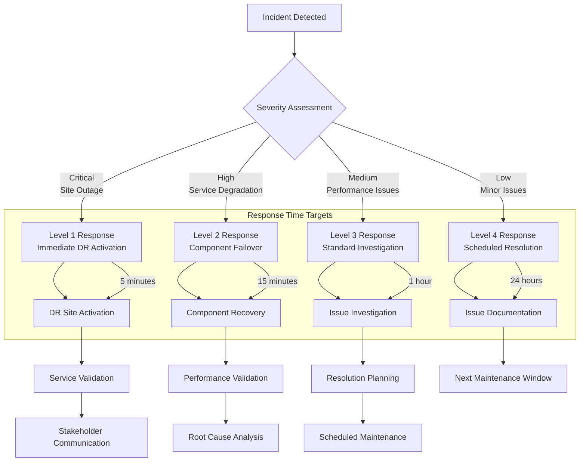

#### Escalation Matrix
- **Level 1**: Operations Team (24/7 response within 5 minutes)
- **Level 2**: Engineering Team (Response within 15 minutes)
- **Level 3**: Architecture Team (Response within 30 minutes)
- **Level 4**: Management Team (Response within 1 hour)

### 3. Disaster Recovery Testing and Validation

#### Monthly DR Validation Process

**DR Drill Components:**
1. **Simulation Phase**: Controlled primary site failure simulation
2. **Activation Phase**: DR site activation and service deployment
3. **Validation Phase**: End-to-end functionality testing and validation
4. **Measurement Phase**: RTO/RPO measurement and performance analysis
5. **Documentation Phase**: Results documentation and improvement identification
6. **Recovery Phase**: Return to normal operations and post-drill analysis

**Success Criteria:**
- **RTO Achievement**: DR activation within 15-minute target
- **RPO Validation**: Data loss within acceptable 24-hour window
- **Functionality Verification**: 100% critical service functionality
- **Performance Acceptance**: > 80% of normal performance levels

### 4. Continuous Improvement and Optimization

#### Performance Optimization Strategy

**Capacity Planning:**
- **Growth Forecasting**: Monthly analysis of resource utilization trends
- **Scaling Triggers**: Automated scaling based on performance thresholds
- **Resource Optimization**: Regular review and optimization of resource allocation
- **Technology Evaluation**: Quarterly assessment of new technologies and improvements

**Process Enhancement:**
- **Automation Expansion**: Continuous automation of manual operational tasks
- **Monitoring Enhancement**: Implementation of predictive analytics and AI-driven monitoring
- **Documentation Improvement**: Regular updates to operational procedures and runbooks
- **Training Programs**: Ongoing team training on HA/DR procedures and best practices

### 5. Compliance and Governance

#### Regulatory Compliance Framework
- **Data Protection**: Compliance with data protection regulations and standards
- **Security Standards**: Adherence to industry security frameworks and guidelines
- **Audit Readiness**: Continuous audit trail maintenance and reporting capabilities
- **Change Management**: Formal change control processes for system modifications

#### Quality Assurance
- **Testing Standards**: Comprehensive testing protocols for all system changes
- **Code Quality**: Automated code quality checks and review processes
- **Documentation Standards**: Standardized documentation templates and maintenance procedures
- **Training Requirements**: Mandatory training and certification for operational staff

---

## Conclusion

The Zona Services High Availability and Disaster Recovery architecture provides enterprise-grade reliability and business continuity through:

### Key Architectural Strengths

1. **Multi-Layer Redundancy**: Comprehensive redundancy at application, database, and message queue layers
2. **Docker Swarm Orchestration**: Modern container orchestration with automatic failover and scaling
3. **Automated Backup and Recovery**: Robust cross-site backup and restore automation
4. **Comprehensive Monitoring**: Real-time health monitoring and alerting across all components
5. **Proven Recovery Procedures**: Well-documented and regularly tested recovery processes

### Business Benefits

- **99.9%+ Availability**: Minimal service disruption ensuring business continuity
- **Rapid Recovery**: Sub-15 minute DR activation capabilities
- **Data Protection**: Zero data loss for critical operations with comprehensive backup strategies
- **Scalability**: Architecture designed to support business growth and increased demand
- **Cost Optimization**: Balanced approach to availability requirements and operational costs

### Recommendations for Ongoing Success

1. **Regular Testing**: Continue monthly DR drills and quarterly comprehensive testing
2. **Monitoring Enhancement**: Implement predictive analytics for proactive issue detection
3. **Automation Expansion**: Continuously automate manual processes for improved reliability
4. **Documentation Maintenance**: Keep all procedures current with system changes and improvements
5. **Team Training**: Regular training programs to maintain team expertise and readiness

This HA/DR architecture ensures that the Zona Services platform can meet the most demanding availability requirements while providing rapid recovery capabilities in the event of any failure scenario. The combination of proven technologies, automated processes, and comprehensive monitoring provides customers with confidence in the platform's reliability and business continuity capabilities.

---

*This high-level architecture document provides customers with a comprehensive understanding of the Zona Services HA/DR capabilities. For detailed implementation specifics or technical deep-dives, additional technical documentation is available upon request.*