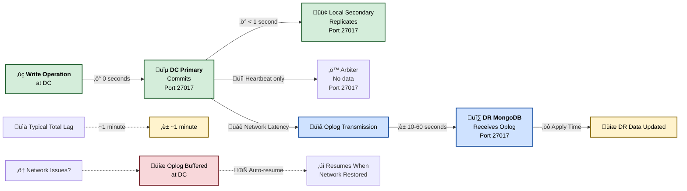
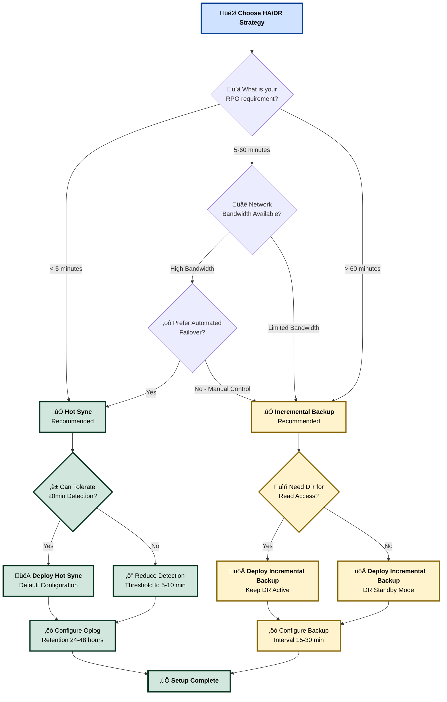

# High Availability and Disaster Recovery (HA/DR) Architecture

## Executive Summary

The Securaa solution implements a High Availability (HA) and Disaster Recovery (DR) architecture designed to ensure business continuity, data protection, and recovery capabilities. 

**Local Site HA (Automatic):** Each site (DC and DR independently) operates a 3-server MongoDB replica set (Server 1 Primary, Server 2 Secondary, Server 3 Arbiter) providing automatic failover within 15-35 seconds for server-level failures.

**Cross-Site DR (Manual):** This document describes two supported manual DR synchronization methods between the Data Center (DC) and Disaster Recovery (DR) site: (1) DC–DR Incremental Backup & Restore (manual/cron-based incremental backups; recommended interval: 30 minutes) and (2) Hot Sync (oplog-based near real-time replication with manual DR activation). **DR activation requires manual administrator intervention** - there are no automated failover agents or health-check systems for cross-site DR.

While both provide business continuity capabilities, Hot Sync delivers faster replication and lower RPO (~1 minute) than periodic backup/restore (30 minutes).

## Table of Contents

1. [Architecture Overview](#architecture-overview)
2. [High Availability Components](#high-availability-components)
3. [Disaster Recovery Setup — Supported HA Modes](#disaster-recovery-setup---supported-ha-modes)
     - [DC–DR Incremental Backup & Restore](#dc–dr-incremental-backup--restore)
     - [Hot Sync (Near Real‑Time Replication)](#hot-sync-near-real-time-replication)
4. [Failover Mechanisms](#failover-mechanisms)
5. [Data Synchronization](#data-synchronization)
6. [Recovery Procedures](#recovery-procedures)
7. [Conclusion](#conclusion)

---

## Architecture Overview

The SOAR Services platform implements a flexible HA/DR strategy that supports two alternate cross-site synchronization mechanisms between the primary Data Center (DC) and the Disaster Recovery (DR) site:

- DC–DR Incremental Backup & Restore (periodic incremental archives; default: every 30 minutes)
- Hot Sync (oplog-based, near real-time MongoDB replication; directory data synchronized periodically)

Both approaches use the existing three-server MongoDB replica set design locally within each site (DC and DR operate independently) for distributed HA, and provide manual cross-site DR capability. They differ in replication latency and data synchronization method.

```mermaid
graph TB
    subgraph DC["<b>SOAR DC Site</b>"]
        subgraph DC_HA["<b>SOAR DC HA Setup</b>"]
            DC_PRI["<b>PRIMARY</b><br/>Port: 27017<br/>IP: 192.0.2.10<br/>✓ Data Master"]
            DC_SEC1["<b>SECONDARY</b><br/>Port: 27017<br/>IP: 192.0.2.11<br/>✓ Data Replica"]
            DC_SEC2["<b>SECONDARY (Arbiter)</b><br/>Port: 27017<br/>IP: 192.0.2.12<br/>✗ No Data<br/>✓ Voting Only"]
            
            DC_PRI ---|"Data Replication"| DC_SEC1
            DC_PRI -.->|"Heartbeat Only"| DC_SEC2
            DC_SEC1 -.->|"Heartbeat"| DC_SEC2
        end
    end

    subgraph DR["<b>SOAR DR Site</b>"]
        subgraph DR_HA["<b>SOAR DR HA Setup</b>"]
            DR_PRI["<b>PRIMARY</b><br/>Port: 27017<br/>IP: 203.0.113.10<br/>✓ Data Master"]
            DR_SEC1["<b>SECONDARY</b><br/>Port: 27017<br/>IP: 203.0.113.11<br/>✓ Data Replica"]
            DR_SEC2["<b>SECONDARY (Arbiter)</b><br/>Port: 27017<br/>IP: 203.0.113.12<br/>✗ No Data<br/>✓ Voting Only"]
            
            DR_PRI ---|"Data Replication"| DR_SEC1
            DR_PRI -.->|"Heartbeat Only"| DR_SEC2
            DR_SEC1 -.->|"Heartbeat"| DR_SEC2
        end
    end

    USER["<b>👤 User</b>"]

    %% Cross-site backup/restore
    DC -.->|"<b>Port: 22</b><br/>Database Backup and Restore"| DR

    %% User access
    USER -->|"<b>UI Port: 443</b><br/>Securaa UI (DC Primary IP)"| DC_PRI
    USER -.->|"<b>UI Port: 443</b><br/>Securaa UI (DR Primary IP)<br/>(Manual Failover)"| DR_PRI

    classDef primaryStyle fill:#4169e1,stroke:#1e3a8a,stroke-width:3px,color:#fff,font-weight:bold
    classDef secondaryStyle fill:#10b981,stroke:#047857,stroke-width:3px,color:#fff,font-weight:bold
    classDef arbiterStyle fill:#6b7280,stroke:#374151,stroke-width:3px,color:#fff,font-weight:bold
    classDef userStyle fill:#f59e0b,stroke:#b45309,stroke-width:3px,color:#fff,font-weight:bold
    classDef siteStyle fill:#e5e7eb,stroke:#6b7280,stroke-width:2px,color:#000
    
    class DC_PRI,DR_PRI primaryStyle
    class DC_SEC1,DR_SEC1 secondaryStyle
    class DC_SEC2,DR_SEC2 arbiterStyle
    class USER userStyle
    class DC_HA,DR_HA siteStyle
```



---

## High Availability Components

### 1. Three-Server MongoDB Replica Set Architecture (per site)

Each site runs a MongoDB replica set across three separate servers: 1 Primary, 1 Secondary (data-bearing), and 1 Arbiter (voting-only, no data). This provides distributed HA, automatic elections, and quick recovery from server failures.

Key properties:
- **PRIMARY Node (Port 27017)**: Runs SOAR Primary application + MongoDB Primary; handles all read and write operations; replicates data to Secondary
- **SECONDARY Node (Port 27017)**: Runs SOAR Secondary application + MongoDB Secondary; maintains a complete copy of data; participates in elections; can become Primary on failover
- **SECONDARY Node (Arbiter - Port 27017)**: Runs Arbiter service only (labeled as "SECONDARY" in diagrams); participates in elections; **does NOT store data**; acts as tiebreaker
- Distributed election and failover within ~15–35 seconds
- **All operations (read + write) performed on Primary node only**
- When the Secondary becomes Primary, all read/write operations switch to the new Primary
- **All three MongoDB instances use port 27017**
- **Each component runs on a separate physical/virtual machine**

### 2. Cross‑Site Disaster Recovery (Manual Activation)

The DR site maintains an identical 3-server MongoDB replica set architecture as the DC site (1 Primary + 1 Secondary with data + 1 Arbiter without data). DR activation is a **manual process** that requires administrator intervention.

- **Manual DR Activation** — Administrators manually activate DR site during DC disasters
- **Data Synchronization** — Manual periodic backups transferred over SCP (port 22) or manual oplog-based sync
- **No Automatic Agents** — No automated backup/restore agents; synchronization performed manually or via manual cron jobs
- **Identical Architecture** — DR site has the same 3-server structure (1 Primary + 1 Secondary data-bearing + 1 Arbiter voting-only)

Both synchronization approaches are described in the Disaster Recovery Setup section below.

### 3. Detailed Three-Server MongoDB Replica Set Architecture


---

## Disaster Recovery Setup — Supported HA Modes

This section describes the two supported DC↔DR synchronization modes and their operational behavior.

### DC–DR Incremental Backup & Restore

Overview:
- Manual periodic backups are taken at DC and manually restored to DR at administrator-defined intervals. Default recommendation: every 30 minutes.

Process:
1. Administrator or manual cron job performs MongoDB logical/physical and file backups at the DC (incremental dumps or snapshots).
2. Compress and manually transfer backup archives to the DR system via SCP (port 22).
3. Administrator manually validates archives and restores MongoDB data and files to their locations on the DR site servers.

Behavior:
- DR instance can remain active and continuously running (services can be available for testing).
- Data on DR is updated on each manual restore based on administrator-defined intervals (≈ every 30 minutes recommended).
- Initial downtime: the first restore to a new DR environment requires downtime on DR while the baseline restore completes — depends on production data size (typical order: ≈ 1 hour; varies).
- Sync duration: ≈ 30 minutes per incremental cycle (depends on data volume and transfer frequency).
- RPO is bounded by the backup interval (default 30 minutes recommendation).

Notes and operational considerations:
- Ensure sufficient DR storage and retention for incremental chains.
- Validate incremental chain integrity and version compatibility during each transfer.
- DR services may be kept active for testing/read access; **DR activation for production traffic requires manual administrator intervention**.

#### Incremental Backup & Restore Workflow


### Hot Sync (Near Real‑Time Replication)

Overview:
- MongoDB oplog-based replication from DC to DR (manually configured) provides near real-time synchronization for database operations. Directory/file data is synchronized manually at administrator-defined intervals (via SCP) as needed.

Process:
1. DC MongoDB replicates oplog entries to the DR MongoDB over port 27017 (manually configured replication); this creates near real-time data parity for database contents. Typical sync duration for DB ops: ≈ 1 minute (dependent on network bandwidth and workload).
2. Directory and file data are synchronized separately at manual intervals using SCP (port 22) or rsync+ssh.

Behavior:
- DR remains in standby mode with application services inactive (not accepting user traffic).
- **Manual DR Activation**: Administrator must manually activate DR site when DC becomes unavailable.
- Failover duration = Administrator detection time + manual DR service activation time.

Notes and operational considerations:
- Hot Sync provides lower RPO and faster recovery than periodic backup/restore.
- Monitor oplog window sizes and network reliability; configure appropriate oplog retention.
- Directory/file synchronization frequency should be chosen to balance consistency and bandwidth.
- **No automatic health-check monitoring or automated failover** - administrator intervention required.

Notes and operational considerations:
- Hot Sync provides lower RPO and faster recovery than periodic backup/restore.
- Monitor oplog window sizes and network reliability; configure appropriate oplog retention.
- Directory/file synchronization frequency should be chosen to balance consistency and bandwidth.

#### Hot Sync Replication Workflow

```mermaid
sequenceDiagram
    autonumber
    participant APP as 🖥 DC Application
    participant PRI as 🔵 DC Primary<br/>(Port 27017)
    participant SEC as 🟢 DC Secondary<br/>(Port 27017)
    participant ARB as ⚪ DC Arbiter<br/>(Port 27017)
    participant OPLOG as 📋 Oplog Stream
    participant DR as 🔷 DR MongoDB<br/>(Port 27017)
    participant ADMIN as 👤 Administrator
    participant DRAPP as 💤 DR App<br/>(Standby)
    
    Note over APP,DRAPP: <b>Normal Operations - Continuous Replication</b>
    
    loop Real-time Operations
        APP->>PRI: <b>Read & Write Operations</b>
        PRI->>SEC: <b>Replicate</b> (oplog sync)
        PRI->>ARB: Heartbeat (no data)
        PRI->>OPLOG: Generate oplog entries
        OPLOG->>DR: <b>Stream oplog</b> (port 27017)
        DR->>DR: Apply ops (~1 min lag)
        Note over DR: ✓ Data synchronized<br/>✗ Services inactive
    end
    
    ADMIN->>APP: Monitor DC health
    APP-->>ADMIN: ✓ Healthy response
    
    rect rgb(255, 235, 230)
        Note over APP,DRAPP: <b>⚠ DC Failure Scenario - Manual Activation</b>
        APP-xAPP: ⚠ DC Site Failure
        
        ADMIN->>APP: Monitor DC health
        APP--xADMIN: ✗ No response
        ADMIN->>ADMIN: Assess DC failure<br/>(manual verification)
        
        alt Administrator decides to activate DR
            ADMIN->>DRAPP: <b>⚡ Manually activate DR services</b>
            DRAPP->>DRAPP: Start services
            DRAPP->>DR: Verify data consistency
            DR-->>DRAPP: ✓ Data up-to-date<br/>(~1 min behind)
            ADMIN->>DRAPP: Reconfigure connections
            DRAPP-->>ADMIN: ✓ Services active
            Note over DRAPP: <b>✓ DR now serves traffic</b><br/>Manual failover complete
        end
    end
```



---

## Failover Mechanisms

### 1. DC–DR Incremental Backup & Restore Failover (Manual Process)

- Detection: Administrator monitors DC and detects unavailability.
- Administrator validates latest incremental backup is present and intact on DR.
- Administrator manually applies baseline and incremental backup archives to DR (initial baseline restore may be lengthy — ≈ 1 hour; incremental restores follow).
- Administrator manually starts and validates services on DR.
- Users are redirected (DNS / load balancer / manual configuration) to DR UI.

Estimated timings:
- Detection phase: minutes to hours (depends on manual monitoring).
- Restore & service activation: baseline ≈ 30–60+ minutes (varies by dataset) + incremental application time.
- Total RTO depends on size of baseline and incremental chain, plus manual intervention time.

#### Incremental Backup Failover Flow


### 2. Hot Sync Failover (Manual Activation - Standby → Active)

- DC MongoDB oplog replication keeps DR data near up-to-date.
- DR services remain stopped; administrator monitors DC health.
- Upon DC unavailability, administrator manually triggers DR activation workflow:
    - Manually start application services on DR
    - Manually reconfigure connection strings (if required)
    - Manually configure DR MongoDB for write operations
    - Manually validate application health and redirect users

Estimated timings:
- Oplog replication lag: typically ~1 minute (network-dependent)
- Failover duration: Administrator detection time + manual DR activation time (minutes to hours)
- RTO depends on administrator availability and manual intervention time.

#### Hot Sync Failover Flow

```mermaid
flowchart TD
    A["🟢 <b>DC Site Operating</b><br/>Oplog Streaming Active"] --> B["👤 <b>Administrator</b><br/>Monitors DC"]
    
    B --> C{"✓ DC Responding?"}
    C -->|"Yes"| D["✓ Continue Normal<br/>Operations"]
    D --> B
    
    C -->|"No"| E["⏱ <b>Administrator Assesses</b><br/><b>DC Failure</b>"]
    E --> F{"⚠ DC Truly Failed?"}
    
    F -->|"No - Transient"| G["🔄 Continue Monitoring<br/>Wait for Recovery"]
    G --> H{"✓ DC Recovered?"}
    H -->|"Yes"| D
    H -->|"No"| F
    
    F -->|"Yes"| I["⚡ <b>Administrator Manually</b><br/><b>Activates DR</b>"]
    
    I --> J["🔍 Verify DR MongoDB<br/>Data Consistency"]
    J --> K{"Data Lag Acceptable?"}
    
    K -->|"No"| L["⏳ Wait for Final<br/>Oplog Sync if Possible"]
    L --> M["⚠ Accept Data Loss<br/>Beyond RPO"]
    
    K -->|"Yes"| M
    M --> N["📝 Manually Configure DR MongoDB<br/>for Write Operations"]
    N --> O["🚀 Manually Start SOAR Services<br/>on DR"]
    O --> P["⚙ Manually Update Connection<br/>Strings & Config"]
    P --> Q["✅ Run Service<br/>Health Checks"]
    
    Q --> R{"All Services<br/>Healthy?"}
    R -->|"No"| S["🔄 Restart Failed<br/>Services"]
    S --> Q
    
    R -->|"Yes"| T["🌐 Manually Update DNS/LB<br/>to DR Site"]
    T --> U["📢 Send Notifications<br/>to Users/Admins"]
    U --> V["📊 Monitor DR<br/>Operations"]
    
    V --> W{"🔧 DC Site<br/>Restored?"}
    W -->|"No"| V
    W -->|"Yes"| X["📋 Coordinate Manual Failback"]
    X --> Y{"Use DC or<br/>Continue DR?"}
    
    Y -->|"Failback to DC"| Z["🔄 Manual Reverse Sync<br/>DR → DC"]
    Z --> AA["🔀 Redirect Traffic<br/>to DC"]
    AA --> AB["💤 DR Returns to<br/>Standby Mode"]
    
    Y -->|"Stay on DR"| AC["🔄 Make DR the<br/>New Primary"]
    AC --> AD["⚙ Reconfigure DC<br/>as New DR"]
    
    classDef normalOps fill:#d4edda,stroke:#155724,stroke-width:2px,color:#000
    classDef warning fill:#fff3cd,stroke:#856404,stroke-width:2px,color:#000
    classDef critical fill:#f8d7da,stroke:#721c24,stroke-width:2px,color:#000
    classDef active fill:#cfe2ff,stroke:#084298,stroke-width:2px,color:#000
    classDef success fill:#d1e7dd,stroke:#0a3622,stroke-width:2px,color:#000
    
    class A,D,AB,AD normalOps
    class E,F,G,L warning
    class I,M critical
    class V,AC active
    class T,U,AA success
```



### 3. Local Site Failover (MongoDB replica set)

- Within each site, the 3-server replica set (1 PRIMARY + 1 SECONDARY with data + 1 Arbiter without data) offers automatic election on Primary failure (15–35 seconds).

#### Local MongoDB Replica Set Failover Flow

```mermaid
flowchart TD
    A["🟢 <b>MongoDB Replica Set</b><br/>Normal Operations"] --> B["All 3 instances on Port 27017<br/>🔵 PRIMARY | 🟢 SECONDARY (data) | ⚪ Arbiter (no data)"]
    
    B --> C{"⚠ PRIMARY<br/>Node Fails?"}
    C -->|"No"| A
    
    C -->|"Yes"| D["🔔 SECONDARY + Arbiter<br/>Detect Missing Heartbeat"]
    D --> E["⏱ 10-15 seconds<br/>Failure Detection"]
    
    E --> F["🗳 Election Initiated<br/>SECONDARY + Arbiter Vote"]
    F --> G["✋ SECONDARY + Arbiter<br/>Cast Votes (2 out of 3)"]
    G --> H["⏱ 5-20 seconds<br/>Election Process"]
    
    H --> I{"Majority<br/>Achieved?"}
    I -->|"No"| J["🔄 Retry Election"]
    J --> F
    
    I -->|"Yes"| K["🎯 <b>SECONDARY Promoted</b><br/>to New Primary"]
    K --> L["✓ New PRIMARY Port 27017<br/>Accepts ALL Read/Write"]
    
    L --> M["🔌 Application<br/>Auto-Reconnects to New Primary"]
    M --> N["🔍 Failed PRIMARY Detected"]
    
    N --> O{"Old PRIMARY<br/>Can Restart?"}
    O -->|"Yes"| P["🔄 Restart MongoDB on Old PRIMARY"]
    P --> Q["➕ Rejoins as Secondary"]
    Q --> R["🔄 Syncs Latest Data<br/>from New Primary"]
    R --> S["✅ <b>Replica Set Healthy</b><br/>PRIMARY + SECONDARY + Arbiter"]
    
    O -->|"No"| T["⚠ Manual Intervention<br/>Required"]
    T --> U["🔧 Admin Investigates<br/>Root Cause"]
    U --> V{"Can Fix?"}
    V -->|"Yes"| P
    V -->|"No"| W["⚠ Run with 2 Nodes<br/>(1 data + 1 arbiter)<br/>Reduced Redundancy"]
    
    classDef normalOps fill:#d4edda,stroke:#155724,stroke-width:3px,color:#000
    classDef warning fill:#fff3cd,stroke:#856404,stroke-width:3px,color:#000
    classDef critical fill:#f8d7da,stroke:#721c24,stroke-width:3px,color:#000
    classDef election fill:#cfe2ff,stroke:#084298,stroke-width:3px,color:#000
    classDef success fill:#d1e7dd,stroke:#0a3622,stroke-width:3px,color:#000
    
    class A,S normalOps
    class C,D,E,N,O warning
    class T,U,W critical
    class F,G,H,I,J election
    class K,L,M,P,Q,R success
```



**Failover Characteristics:**
- **Detection Time**: 10-15 seconds (heartbeat timeout)
- **Election Time**: 5-20 seconds (across servers within site, minimal latency)
- **Total Failover**: 15-35 seconds end-to-end
- **Application Impact**: Brief connection interruption, automatic reconnection
- **Data Consistency**: Zero data loss with proper write concerns

---

## Data Synchronization

We support two cross-site synchronization methods; the synchronization descriptions below incorporate both modes.

### 1. DC–DR Incremental Backup Synchronization

- Backup agent at DC detects changes and produces incremental dumps.
- Archives compressed and transferred over SCP (port 22).
- Transfer integrity validated (checksums).
- Restore agent on DR applies increments to the DR MongoDB.
- Default configurable interval: 30 minutes; can be tuned to smaller or larger windows depending on bandwidth and RPO needs.
- Sync duration: ~30 minutes typical for incremental cycle (varies on data volume).

#### Incremental Backup Data Flow


### 2. Hot Sync (Oplog) Synchronization

- MongoDB oplog entries are streamed/replicated from DC primary (Server 1) to DR replica set (Server 1 primary) via port 27017.
- Near real-time database parity: typical lag ~1 minute subject to network speed and write workload.
- Directory/file sync is still performed periodically (SCP) to transfer non-database artifacts between server pairs.
- Ensure network security and authentication for replication: TLS and authenticated MongoDB users; secure network connectivity between DC and DR sites.

#### Hot Sync Data Flow

```mermaid
graph TB
    subgraph DC["<b>🏢 DC Site - Real-Time Operations</b>"]
        A["🖥 <b>SOAR Application</b>"] --> B["🔵 <b>DC MongoDB Primary</b><br/>Port 27017"]
        B --> C["✍ Write to Database"]
        C --> D["📋 Generate Oplog Entry"]
        D --> E["🔄 Local Replication<br/>to Secondary & Arbiter<br/>All on Port 27017"]
    end
    
    subgraph STREAM["<b>🌐 Oplog Streaming</b>"]
        D --> F["📦 Oplog Stream Buffer"]
        F --> G{"🔌 Network<br/>Available?"}
        G -->|"No"| H["💾 Buffer Oplog<br/>Up to Window Size"]
        H --> G
        G -->|"Yes"| I["📤 Stream to DR<br/>Port 27017"]
    end
    
    subgraph DR["<b>🏢 DR Site - Near Real-Time</b>"]
        I --> J["🔷 <b>DR MongoDB</b><br/>Receives Oplog<br/>Port 27017"]
        J --> K["⚙ Apply Operations<br/>(~1 minute lag)"]
        K --> L["💾 Update DR Data"]
        L --> M["💤 Maintain Standby State"]
        M --> N{"✓ DC Available?"}
        N -->|"Yes"| J
        N -->|"No"| O["⚡ Activate DR Services"]
        O --> P["🔄 Promote to Active<br/>Accept Writes"]
    end
    
    subgraph FILES["<b>📁 File/Directory Sync - Periodic</b>"]
        Q["📂 DC File System"] --> R["🔄 rsync/SCP<br/>Configurable Interval"]
        R --> S["📂 DR File System"]
    end
    
    classDef dcStyle fill:#d4edda,stroke:#155724,stroke-width:3px,color:#000
    classDef streamStyle fill:#cfe2ff,stroke:#084298,stroke-width:3px,color:#000
    classDef drStyle fill:#fff3cd,stroke:#856404,stroke-width:3px,color:#000
    classDef alertStyle fill:#f8d7da,stroke:#721c24,stroke-width:3px,color:#000
    
    class A,B,C,D,E dcStyle
    class F,G,H,I streamStyle
    class J,K,L,M,P drStyle
    class O alertStyle
    
    style A fill:#90EE90
    style F fill:#FFE4B5
    style K fill:#87CEEB
    style P fill:#FFB6C1
    style R fill:#DDA0DD
```



#### Oplog Window and Data Consistency



### Data Integrity and Validation

Common checks for both methods:
- Pre-transfer: verify replica set health on DC; ensure oplog retention (Hot Sync) or incremental chain integrity (Backup).
- Transfer: checksum validation, retries and alerting on failures.
- Post-transfer: restore/replication validation; monitoring to confirm DR readiness.

---

## Recovery Procedures

### 1. DR Activation — DC–DR Incremental Backup & Restore (Manual Process)

1. Administrator detects primary outage via monitoring.
2. Administrator confirms latest incremental backup archive is available and validated on DR.
3. If DR baseline not present, administrator performs manual baseline restore (initial baseline may take ≈ 1 hour).
4. Administrator manually applies subsequent increments until caught up to the most recent consistent point.
5. Administrator manually starts and validates application services on DR.
6. Administrator redirects traffic (DNS/load balancer) to DR site.
7. Administrator monitors system health and application correctness.

Rollback / Failback:
- After primary is restored, administrator manually replicates incremental changes from DR back to DC if needed.
- Administrator gradually shifts traffic back to DC once verified.

### 2. DR Activation — Hot Sync (Manual Process)

1. Administrator detects DC unavailability through monitoring.
2. Administrator runs manual activation procedure: manually start services on DR, manually configure DB for write operations, manually update connection strings, manually run service health checks.
3. Administrator redirects traffic to DR.
4. Continue monitoring and, after DC recovery, administrator coordinates manual failback (controlled data synchronization).

### 3. Local MongoDB Recovery (Automatic)

- For MongoDB PRIMARY node failures, the replica set will **automatically** elect the SECONDARY node to become the new Primary (with Arbiter providing the deciding vote). Application reconnection logic should handle transient disconnects during the 15-35 second election process.
- This is the ONLY automatic failover in the system - local site failover within DC or DR between PRIMARY, SECONDARY, and Arbiter.

---

## Failover Test Plan (short)

- Test 1 (Periodic Backup mode): Simulate DC outage; administrator manually validates DR archive availability; administrator manually measures baseline restore time and incremental application; verify app functionality on DR after manual activation.
- Test 2 (Hot Sync mode): Verify oplog replication under load; simulate DC unavailability; administrator manually activates DR and verifies data consistency.
- Test 3 (Local automatic failover): Simulate PRIMARY node failure (power off or network disconnect); ensure replica set election automatically promotes SECONDARY to Primary (with Arbiter voting) and app reconnection within expected window (15–35s).

Success criteria:
- Data consistency within expected RPO (backup interval for Backup mode; near real-time for Hot Sync).
- Manual RTO within planned window based on administrator response time (document test results).
- Clear documentation and runbooks for manual DR activation procedures.

---

## Conclusion

The platform supports two manual DR synchronization methods between DC and DR:

1. **DC–DR Incremental Backup & Restore**: Manual or cron-based incremental backups (recommended: every 30 minutes). Administrator manually applies backups to DR. Initial baseline restore may require ≈ 1 hour. Suitable when network constraints or operational policies favor periodic transfer.

2. **Hot Sync (Near Real‑Time Replication)**: MongoDB oplog-based replication offers near-real-time DB synchronization (typical ~1 minute lag); DR stays in standby. **Administrator manually activates DR** when DC fails. Preferred for lower RPO.

**Key Architecture Points:**
- **Local Site HA (Automatic)**: Each site (DC and DR) has 3-server MongoDB replica set (1 PRIMARY + 1 SECONDARY with data + 1 Arbiter without data) with automatic failover (15-35 seconds)
- **2x Data Redundancy**: PRIMARY and SECONDARY store complete copies of data; Arbiter has no data
- **Cross-Site DR (Manual)**: DC to DR synchronization and failover requires manual administrator intervention
- **No Automated Agents**: No automated backup/restore agents or automated DR activation
- **Identical Architecture**: DR site mirrors DC site structure (3 servers: 2 data-bearing + 1 arbiter)

Choose the mode that matches your RPO/RTO, network, and operational requirements. Hot Sync provides faster replication and lower RPO; incremental backup/restore is simpler and can be used where continuous replication is not feasible.

### HA Mode Comparison Matrix

| **Aspect** | **DC–DR Incremental Backup & Restore** | **Hot Sync (Near Real-Time)** |
|------------|----------------------------------------|-------------------------------|
| **Synchronization Method** | Manual/cron incremental backups via SCP | Continuous oplog replication (manual config) |
| **Default Interval** | 30 minutes recommended | Near real-time (~1 minute lag) |
| **Network Ports** | Port 22 (SSH/SCP) | Port 27017 (MongoDB) + Port 22 (file sync) |
| **RPO (Recovery Point Objective)** | 30 minutes (backup interval) | ~1 minute (replication lag) |
| **RTO (Recovery Time Objective)** | Manual intervention time + 30-60+ min restore | Manual intervention time + activation |
| **DR State During Normal Operations** | Standby (can be active for testing) | Standby (services inactive) |
| **DR Activation** | Manual by administrator | Manual by administrator |
| **Initial Setup Time** | ~1 hour (baseline restore) | ~1 hour (initial baseline + oplog catchup) |
| **Data Loss on Failover** | Up to 30 minutes | Up to ~1 minute |
| **Bandwidth Requirements** | Moderate (periodic transfers) | Higher (continuous streaming) |
| **Complexity** | Simple (manual/cron jobs) | Moderate (oplog management, manual monitoring) |
| **Automation Level** | Manual or scheduled cron | Manual activation required |
| **Best For** | Network constraints, batch updates | Mission-critical, low RPO requirements |
| **Failover Trigger** | Manual or monitoring-based | Automated via health check (20 min threshold) |
| **DR Activation** | Restore + service start | Service start only (data already synced) |

### Architecture Decision Guide



### Complete HA/DR Architecture Summary

```mermaid
graph TB
    subgraph OVERVIEW["<b>🎯 OVERVIEW</b>"]
        TITLE["<b>Securaa HA/DR Architecture</b>"]
    end
    
    subgraph LHA["<b>🔄 LOCAL HA - Both DC & DR Sites</b>"]
        LHA1["<b>MongoDB Replica Set</b><br/>3 Servers (2 data + 1 arbiter)<br/>Port 27017"]
        LHA2["<b>Auto Failover</b><br/>⏱ 15-35 seconds"]
        LHA3["<b>2x Data Redundancy</b><br/>PRIMARY + SECONDARY (data)<br/>+ Arbiter (voting only)"]
        
        LHA1 --> LHA2 --> LHA3
    end
    
    subgraph IB["<b>📦 OPTION 1: Incremental Backup & Restore</b>"]
        IB1["⏱ Every 30 Minutes<br/>(Configurable)"]
        IB2["🔒 SCP Transfer<br/>Port 22"]
        IB3["✅ DR Active State<br/>(Services Running)"]
        IB4["📊 RPO: 30 min"]
        IB5["⏱ RTO: 30-60 min"]
        
        IB1 --> IB2 --> IB3
        IB4 -.-> IB5
    end
    
    subgraph HS["<b>⚡ OPTION 2: Hot Sync (Near Real-Time)</b>"]
        HS1["🔄 Continuous Oplog<br/>Replication"]
        HS2["🌐 Port 27017 Stream<br/>Real-time"]
        HS3["💤 DR Standby State<br/>(Services Inactive)"]
        HS4["📊 RPO: ~1 min"]
        HS5["⏱ RTO: ~20-25 min"]
        
        HS1 --> HS2 --> HS3
        HS4 -.-> HS5
    end
    
    subgraph FO["<b>🚨 FAILOVER PROCESS</b>"]
        FO1["🔍 Detection"] --> FO2["✓ Validation"]
        FO2 --> FO3["⚡ Activation"]
        FO3 --> FO4["🔀 Redirection"]
        FO4 --> FO5["📊 Monitoring"]
    end
    
    TITLE --> LHA1
    TITLE --> IB1
    TITLE --> HS1
    
    LHA3 -.->|"Combined with"| IB1
    LHA3 -.->|"Combined with"| HS1
    
    IB3 --> FO1
    HS3 --> FO1
    
    classDef titleStyle fill:#4169e1,stroke:#1e3a8a,stroke-width:4px,color:#fff,font-size:16px
    classDef localHA fill:#d1e7dd,stroke:#0a3622,stroke-width:3px,color:#000
    classDef backup fill:#fff3cd,stroke:#856404,stroke-width:3px,color:#000
    classDef hotSync fill:#d4edda,stroke:#155724,stroke-width:3px,color:#000
    classDef failover fill:#f8d7da,stroke:#721c24,stroke-width:3px,color:#000
    
    class TITLE titleStyle
    class LHA1,LHA2,LHA3 localHA
    class IB1,IB2,IB3,IB4,IB5 backup
    class HS1,HS2,HS3,HS4,HS5 hotSync
    class FO1,FO2,FO3,FO4,FO5 failover
```



---

## MongoDB Replica Set Architecture Explained

### Understanding the Three-Server Configuration (1 Primary + 1 Secondary + 1 Arbiter)

Each site (DC and DR) operates a MongoDB replica set distributed across three separate servers:

#### Component Distribution

**PRIMARY Node (Port 27017):**
- Example IP: 192.0.2.10 (DC), 203.0.113.10 (DR)
- Hosts **SOAR Application** (UI & services on HTTPS port 443)
- Runs **MongoDB Primary instance** (port 27017)
- Handles **ALL** read operations from applications
- Handles **ALL** write operations from applications  
- Replicates data changes to Secondary node via oplog
- Sends heartbeat signals to Secondary and Arbiter
- Only one Primary exists at any time

**SECONDARY Node (Port 27017):**
- Example IP: 192.0.2.11 (DC), 203.0.113.11 (DR)
- Hosts **SOAR Application** in standby mode (UI & services on HTTPS port 443)
- Runs **MongoDB Secondary instance** (port 27017)
- Maintains a **complete copy** of all data from Primary
- Continuously applies oplog entries from Primary to stay synchronized
- **Does NOT serve read operations** in this configuration (all reads go to Primary)
- Participates in elections when Primary fails
- Becomes the new Primary if elected during failover
- Acts as data redundancy and failover candidate

**SECONDARY Node (Arbiter - Port 27017):**
- Example IP: 192.0.2.12 (DC), 203.0.113.12 (DR)
- Labeled as "SECONDARY" in architecture diagrams but functions as an **Arbiter**
- Runs **MongoDB Arbiter instance** (port 27017)
- **Does NOT store any data** (no database files, no SOAR application)
- Participates in elections only (voting member)
- Provides tiebreaker vote between Primary and Secondary
- Consumes minimal resources (CPU, memory, disk)
- Sends/receives heartbeat signals only
- Cannot become Primary

**Important Note:** All three MongoDB instances run on port 27017. They are differentiated by their physical/virtual server location and replica set member configuration, not by different ports. Only PRIMARY and SECONDARY (data-bearing) nodes store data; the Arbiter node stores no data.

### Operation Flow

**Normal Operations (All traffic to PRIMARY node on Port 27017):**
```
Application → PRIMARY (Port 27017: 192.0.2.10) → [ALL Reads + Writes]
PRIMARY → SECONDARY (Port 27017: 192.0.2.11) → [Oplog replication - DATA]
PRIMARY ↔ SECONDARY ↔ Arbiter (Port 27017: 192.0.2.12) → [Heartbeat signals only]
Users → PRIMARY SOAR (HTTPS 443: 192.0.2.10) → [Active UI & Services]
```

**Failover Scenario (PRIMARY node fails):**
```
1. PRIMARY (Port 27017: 192.0.2.10) fails → No heartbeat detected
2. SECONDARY (192.0.2.11) + Arbiter (192.0.2.12) → Initiate election
3. SECONDARY receives majority vote (2 out of 3) → Promoted to Primary
4. Application → New PRIMARY (Port 27017: 192.0.2.11) → [ALL Reads + Writes]
5. Users → New PRIMARY SOAR (HTTPS 443: 192.0.2.11) → [Active UI & Services]
6. Old PRIMARY restarts → Rejoins as Secondary (Port 27017)
```

### Key Characteristics

- **Three-Server Architecture**: Distributed deployment across separate physical/virtual servers
- **2x Data Redundancy**: 2 nodes store complete copies of data (PRIMARY + SECONDARY); Arbiter has no data
- **Single Port Configuration**: All three replica set members use port 27017
- **Single Point of Read/Write**: All operations always go to the current Primary node (never split between nodes)
- **Automatic Failover**: SECONDARY can be automatically promoted when PRIMARY fails (15-35 seconds)
- **Data Redundancy**: 2 complete copies of data (PRIMARY + SECONDARY); Arbiter stores no data
- **Election Quorum**: Requires majority vote (2 out of 3) to elect new Primary
- **Zero Data Loss**: SECONDARY stays synchronized; no data loss on failover with proper write concerns
- **Application Failover**: When MongoDB fails over to SECONDARY, the SOAR application on that server also becomes active
- **Arbiter Role**: Provides tiebreaker vote; minimal resource usage; no data storage

This design provides high availability through distributed server architecture, with all MongoDB instances using the standard port 27017 and automatic server-level failover between Server 1 and Server 2.

---

*This document was updated to explicitly describe both DC–DR Incremental Backup & Restore and Hot Sync (oplog) modes, their processes, timings, and failover behaviors. Adjust configuration parameters (backup interval, detection threshold, directory sync interval) to match your operational requirements and test before production cutover.*

