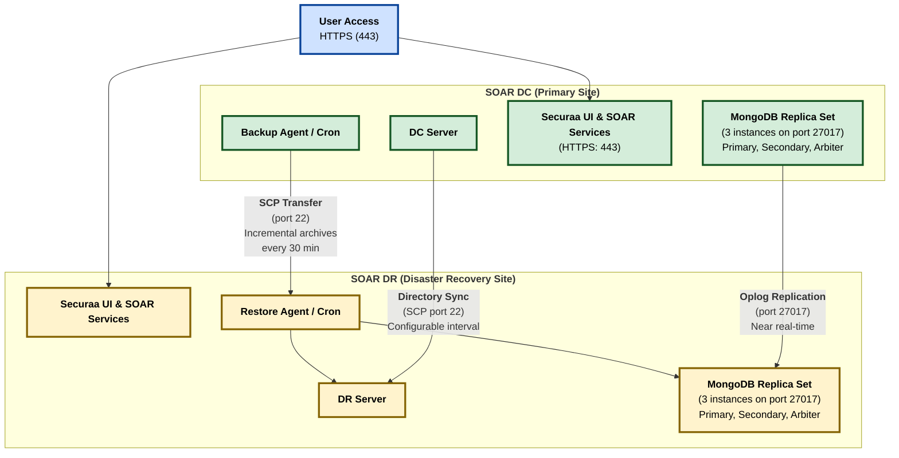

# High Availability and Disaster Recovery (HA/DR) Architecture

## Executive Summary

The Securaa solution implements a robust High Availability (HA) and Disaster Recovery (DR) architecture designed to ensure continuous business operations, data protection, and minimal downtime. This document describes two supported HA mechanisms between the Data Center (DC) and the Disaster Recovery (DR) site: (1) DC–DR Incremental Backup & Restore (periodic incremental backups; default interval: 30 minutes) and (2) Hot Sync (oplog-based near real-time replication). While both provide business continuity, Hot Sync delivers faster replication and higher operational reliability than periodic backup/restore.

## Table of Contents

1. [Architecture Overview](#architecture-overview)
2. [High Availability Components](#high-availability-components)
3. [Disaster Recovery Setup — Supported HA Modes](#disaster-recovery-setup---supported-ha-modes)
     - [DC–DR Incremental Backup & Restore](#dc–dr-incremental-backup--restore)
     - [Hot Sync (Near Real‑Time Replication)](#hot-sync-near-real-time-replication)
4. [Failover Mechanisms](#failover-mechanisms)
5. [Data Synchronization](#data-synchronization)
6. [Recovery Procedures](#recovery-procedures)
7. [Conclusion](#conclusion)

---

## Architecture Overview

The SOAR Services platform implements a flexible HA/DR strategy that supports two alternate cross-site synchronization mechanisms between the primary Data Center (DC) and the Disaster Recovery (DR) site:

- DC–DR Incremental Backup & Restore (periodic incremental archives; default: every 30 minutes)
- Hot Sync (oplog-based, near real-time MongoDB replication; directory data synchronized periodically)

Both approaches use the existing single-server replica-set design locally (per site) for process-level HA and provide cross-site continuity, but they differ in replication latency, DR behavior, and failover activation.



---

## High Availability Components

### 1. Single-Server MongoDB Replica Set Architecture (per site)

Each site runs a MongoDB replica set on a single server with 3 mongod processes: 1 Primary (data + operations), 1 Secondary (data replica), and 1 Arbiter (voting only, no data). All three instances run on port 27017. This provides local process-level HA, automatic elections, and quick recovery from process failures.

Key properties:
- **Primary (Port 27017)**: Handles all read and write operations; replicates data to Secondary
- **Secondary (Port 27017)**: Maintains a copy of data; participates in elections; becomes Primary on failover
- **Arbiter (Port 27017)**: Participates in elections only; does not store data; acts as tiebreaker
- Local election and failover within ~15–35 seconds
- **All operations (read + write) performed on Primary only**
- When Secondary becomes Primary, all read/write operations switch to the new Primary
- **All three MongoDB instances use port 27017**

### 2. Cross‑Site High Availability (two supported mechanisms)

We support two mechanisms for achieving cross-site HA between DC and DR:

- DC–DR Incremental Backup & Restore — Periodic incremental backups transferred over SCP (port 22). Default transfer interval: 30 minutes (configurable).
- Hot Sync (Near Real‑Time Replication) — MongoDB oplog replication from DC to DR for near real-time data replication; directory/file sync remains periodic using SCP.

Both modes are described in the Disaster Recovery Setup section below.

### 3. Detailed Single-Server MongoDB Replica Set Architecture

```mermaid
graph TB
    subgraph SERVER["<b>Single Server (DC or DR)</b>"]
        subgraph REPLICA["<b>MongoDB Replica Set - 3 Processes on Port 27017</b>"]
            PRIMARY["<b>Primary mongod</b><br/>Port: 27017<br/>✓ ALL Read Operations<br/>✓ ALL Write Operations<br/>✓ Replicates to Secondary"]
            SECONDARY["<b>Secondary mongod</b><br/>Port: 27017<br/>✓ Data Replica<br/>✓ Standby for Election<br/>✓ Sync from Primary"]
            ARBITER["<b>Arbiter mongod</b><br/>Port: 27017<br/>✗ No Data Storage<br/>✓ Voting Only<br/>✓ Election Participant"]
            
            PRIMARY ==>|"<b>Oplog Replication</b><br/>(Data Sync)"| SECONDARY
            PRIMARY -.->|"Heartbeat"| SECONDARY
            PRIMARY -.->|"Heartbeat"| ARBITER
            SECONDARY -.->|"Heartbeat"| ARBITER
        end
        
        APP["<b>SOAR Application</b><br/>Securaa UI<br/>SOAR Services"]
        
        APP ==>|"<b>ALL Read Operations</b>"| PRIMARY
        APP ==>|"<b>ALL Write Operations</b>"| PRIMARY
    end
    
    subgraph FAILOVER["<b>Failover Scenario</b>"]
        FAIL["<b>⚠ Primary Failure Detected</b>"]
        ELECT["<b>Election Process</b><br/>Secondary + Arbiter Vote<br/>⏱ 15-35 seconds"]
        NEWPRIMARY["<b>✓ Secondary becomes Primary</b><br/>ALL Read/Write operations<br/>switch to new Primary"]
        
        FAIL --> ELECT
        ELECT --> NEWPRIMARY
    end
    
    classDef primaryStyle fill:#4CAF50,stroke:#2e7d32,stroke-width:3px,color:#fff,font-size:14px
    classDef secondaryStyle fill:#2196F3,stroke:#1565c0,stroke-width:3px,color:#fff,font-size:14px
    classDef arbiterStyle fill:#757575,stroke:#424242,stroke-width:3px,color:#fff,font-size:14px
    classDef appStyle fill:#FF9800,stroke:#e65100,stroke-width:3px,color:#fff,font-size:14px
    classDef failoverStyle fill:#f44336,stroke:#c62828,stroke-width:3px,color:#fff,font-size:14px
    
    class PRIMARY,NEWPRIMARY primaryStyle
    class SECONDARY secondaryStyle
    class ARBITER arbiterStyle
    class APP appStyle
    class FAIL,ELECT failoverStyle
```



---

## Disaster Recovery Setup — Supported HA Modes

This section describes the two supported DC↔DR synchronization modes and their operational behavior.

### DC–DR Incremental Backup & Restore

Overview:
- Periodic incremental backups are taken at DC and restored to DR at a configurable interval. Default: every 30 minutes.

Process:
1. Perform MongoDB logical/physical and file backups at the DC (incremental dumps or snapshots).
2. Compress and transfer backup archives to the DR system via SCP (port 22).
3. The DR restore agent validates archives and restores MongoDB data and files to their locations on the DR server.

Behavior:
- DR instance remains active and continuously running (services can be available).
- Data on DR is updated on each restore based on the configured interval (≈ every 30 minutes by default).
- Initial downtime: the first restore to a new DR environment requires downtime on DR while the baseline restore completes — depends on production data size (typical order: ≈ 1 hour; varies).
- Sync duration: ≈ 30 minutes per incremental cycle (depends on data volume and configured frequency).
- RPO is bounded by the backup interval (default 30 minutes).

Notes and operational considerations:
- Ensure sufficient DR storage and retention for incremental chains.
- Validate incremental chain integrity and version compatibility during each transfer.
- DR services may be kept active for read access; consider whether application-level write suppression is required on DR depending on your failover policy.

#### Incremental Backup & Restore Workflow


### Hot Sync (Near Real‑Time Replication)

Overview:
- MongoDB oplog-based replication from DC to DR provides near real-time synchronization for database operations. Directory/file data is synchronized at a configurable interval (via SCP) as needed.

Process:
1. DC MongoDB replicates oplog entries to the DR MongoDB over port 27017; this creates near real-time data parity for database contents. Typical sync duration for DB ops: ≈ 1 minute (dependent on network bandwidth and workload).
2. Directory and file data are synchronized separately at configurable intervals using SCP (port 22) or rsync+ssh.

Behavior:
- DR remains in standby mode with application services inactive (not accepting user traffic).
- DR becomes active only when the health-check/monitoring service detects DC unavailability beyond a configured threshold (default: 20 minutes).
- Failover duration = DC downtime detection window (default 20 minutes) + DR boot/service activation time.

Notes and operational considerations:
- Hot Sync provides lower RPO and faster recovery than periodic backup/restore.
- Monitor oplog window sizes and network reliability; configure appropriate oplog retention.
- Directory/file synchronization frequency should be chosen to balance consistency and bandwidth.

#### Hot Sync Replication Workflow

```mermaid
sequenceDiagram
    autonumber
    participant APP as 🖥 DC Application
    participant PRI as 🔵 DC Primary<br/>(Port 27017)
    participant SEC as 🟢 DC Secondary<br/>(Port 27017)
    participant ARB as ⚪ DC Arbiter<br/>(Port 27017)
    participant OPLOG as 📋 Oplog Stream
    participant DR as 🔷 DR MongoDB<br/>(Port 27017)
    participant HEALTH as 🏥 Health Check
    participant DRAPP as 💤 DR App<br/>(Standby)
    
    Note over APP,DRAPP: <b>Normal Operations - Continuous Replication</b>
    
    loop Real-time Operations
        APP->>PRI: <b>Read & Write Operations</b>
        PRI->>SEC: <b>Replicate</b> (oplog sync)
        PRI->>ARB: Heartbeat (no data)
        PRI->>OPLOG: Generate oplog entries
        OPLOG->>DR: <b>Stream oplog</b> (port 27017)
        DR->>DR: Apply ops (~1 min lag)
        Note over DR: ✓ Data synchronized<br/>✗ Services inactive
    end
    
    HEALTH->>APP: Health check ping
    APP-->>HEALTH: ✓ Healthy response
    
    rect rgb(255, 235, 230)
        Note over APP,DRAPP: <b>⚠ DC Failure Scenario</b>
        APP-xAPP: ⚠ DC Site Failure
        
        HEALTH->>APP: Health check ping
        APP--xHEALTH: ✗ No response
        HEALTH->>HEALTH: Wait & retry<br/>(20 min threshold)
        
        alt After 20 minutes downtime
            HEALTH->>DRAPP: <b>⚡ Trigger DR activation</b>
            DRAPP->>DRAPP: Start services
            DRAPP->>DR: Verify data consistency
            DR-->>DRAPP: ✓ Data up-to-date<br/>(~1 min behind)
            DRAPP->>DRAPP: Reconfigure connections
            DRAPP->>HEALTH: ✓ Services active
            Note over DRAPP: <b>✓ DR now serves traffic</b><br/>Failover complete
        end
    end
```



---

## Failover Mechanisms

### 1. DC–DR Incremental Backup & Restore Failover

- Detection: Monitoring detects DC unavailability.
- Validate latest incremental backup is present and intact on DR.
- If baseline and incremental chain sufficient, DR restore agent applies archives (initial baseline restore may be lengthy — ≈ 1 hour; incremental restores follow configured intervals).
- Services on DR are started and validated.
- Users are redirected (DNS / load balancer / manual) to DR UI.

Estimated timings:
- Detection phase: minutes (depends on monitoring).
- Restore & service activation: baseline ≈ 30–60+ minutes (varies by dataset) + incremental application per cycle.
- Total RTO depends on size of baseline and incremental chain.

#### Incremental Backup Failover Flow


### 2. Hot Sync Failover (Standby → Active)

- DC MongoDB oplog replication keeps DR data near up-to-date.
- DR services remain stopped; health-check monitors DC.
- Upon DC unavailability beyond detection threshold (default: 20 minutes), health-check triggers DR activation workflow:
    - Start application services on DR
    - Reconfigure connection strings (if required)
    - Promote any DR mongod to be writable (if configured)
    - Validate application health and redirect users

Estimated timings:
- Oplog replication lag: typically ~1 minute (network-dependent)
- Failover duration: detection window (default 20 minutes) + DR activation time (minutes)
- RTO roughly equals configured detection threshold plus activation time.

#### Hot Sync Failover Flow

```mermaid
flowchart TD
    A["🟢 <b>DC Site Operating</b><br/>Oplog Streaming Active"] --> B["🏥 <b>Health Check Service</b><br/>Monitors DC"]
    
    B --> C{"✓ DC Responding?"}
    C -->|"Yes"| D["✓ Continue Normal<br/>Operations"]
    D --> B
    
    C -->|"No"| E["⏱ <b>Start Detection Timer</b>"]
    E --> F{"⚠ DC Down > 20 min?"}
    
    F -->|"No - Retry"| G["🔄 Continue Health Checks<br/>(every 30-60 sec)"]
    G --> H{"✓ DC Recovered?"}
    H -->|"Yes"| D
    H -->|"No"| F
    
    F -->|"Yes"| I["⚡ <b>Trigger Automated</b><br/><b>DR Activation</b>"]
    
    I --> J["🔍 Verify DR MongoDB<br/>Data Consistency"]
    J --> K{"Data Lag < 5 min?"}
    
    K -->|"No"| L["⏳ Wait for Final<br/>Oplog Sync if Possible"]
    L --> M["⚠ Accept Data Loss<br/>Beyond RPO"]
    
    K -->|"Yes"| M
    M --> N["📝 Promote DR MongoDB<br/>to Writable"]
    N --> O["🚀 Start SOAR Services<br/>on DR"]
    O --> P["⚙ Update Connection<br/>Strings & Config"]
    P --> Q["✅ Run Service<br/>Health Checks"]
    
    Q --> R{"All Services<br/>Healthy?"}
    R -->|"No"| S["🔄 Restart Failed<br/>Services"]
    S --> Q
    
    R -->|"Yes"| T["🌐 Update DNS/LB<br/>to DR Site"]
    T --> U["📢 Send Notifications<br/>to Users/Admins"]
    U --> V["📊 Monitor DR<br/>Operations"]
    
    V --> W{"🔧 DC Site<br/>Restored?"}
    W -->|"No"| V
    W -->|"Yes"| X["📋 Coordinate Failback"]
    X --> Y{"Use DC or<br/>Continue DR?"}
    
    Y -->|"Failback to DC"| Z["🔄 Reverse Sync<br/>DR → DC"]
    Z --> AA["🔀 Redirect Traffic<br/>to DC"]
    AA --> AB["💤 DR Returns to<br/>Standby Mode"]
    
    Y -->|"Stay on DR"| AC["🔄 Make DR the<br/>New Primary"]
    AC --> AD["⚙ Reconfigure DC<br/>as New DR"]
    
    classDef normalOps fill:#d4edda,stroke:#155724,stroke-width:2px,color:#000
    classDef warning fill:#fff3cd,stroke:#856404,stroke-width:2px,color:#000
    classDef critical fill:#f8d7da,stroke:#721c24,stroke-width:2px,color:#000
    classDef active fill:#cfe2ff,stroke:#084298,stroke-width:2px,color:#000
    classDef success fill:#d1e7dd,stroke:#0a3622,stroke-width:2px,color:#000
    
    class A,D,AB,AD normalOps
    class E,F,G,L warning
    class I,M critical
    class V,AC active
    class T,U,AA success
```



### 3. Local Site Failover (MongoDB replica set)

- Within each server, the 3-node replica set (1 Primary, 1 Secondary, 1 Arbiter) offers automatic election on Primary failure (15–35 seconds).

#### Local MongoDB Replica Set Failover Flow


**Failover Characteristics:**
- **Detection Time**: 10-15 seconds (heartbeat timeout)
- **Election Time**: 5-20 seconds (local server, minimal latency)
- **Total Failover**: 15-35 seconds end-to-end
- **Application Impact**: Brief connection interruption, automatic reconnection
- **Data Consistency**: Zero data loss with proper write concerns

---

## Data Synchronization

We support two cross-site synchronization methods; the synchronization descriptions below incorporate both modes.

### 1. DC–DR Incremental Backup Synchronization

- Backup agent at DC detects changes and produces incremental dumps.
- Archives compressed and transferred over SCP (port 22).
- Transfer integrity validated (checksums).
- Restore agent on DR applies increments to the DR MongoDB.
- Default configurable interval: 30 minutes; can be tuned to smaller or larger windows depending on bandwidth and RPO needs.
- Sync duration: ~30 minutes typical for incremental cycle (varies on data volume).

#### Incremental Backup Data Flow


### 2. Hot Sync (Oplog) Synchronization

- MongoDB oplog entries are streamed/replicated from DC primary to DR mongod process (port 27017).
- Near real-time database parity: typical lag ~1 minute subject to network speed and write workload.
- Directory/file sync is still performed periodically (SCP) to transfer non-database artifacts.
- Ensure network security and authentication for replication: TLS and authenticated MongoDB users; secure network connectivity between DC and DR.

#### Hot Sync Data Flow

```mermaid
graph TB
    subgraph DC["<b>🏢 DC Site - Real-Time Operations</b>"]
        A["🖥 <b>SOAR Application</b>"] --> B["🔵 <b>DC MongoDB Primary</b><br/>Port 27017"]
        B --> C["✍ Write to Database"]
        C --> D["📋 Generate Oplog Entry"]
        D --> E["🔄 Local Replication<br/>to Secondary & Arbiter<br/>All on Port 27017"]
    end
    
    subgraph STREAM["<b>🌐 Oplog Streaming</b>"]
        D --> F["📦 Oplog Stream Buffer"]
        F --> G{"🔌 Network<br/>Available?"}
        G -->|"No"| H["💾 Buffer Oplog<br/>Up to Window Size"]
        H --> G
        G -->|"Yes"| I["📤 Stream to DR<br/>Port 27017"]
    end
    
    subgraph DR["<b>🏢 DR Site - Near Real-Time</b>"]
        I --> J["🔷 <b>DR MongoDB</b><br/>Receives Oplog<br/>Port 27017"]
        J --> K["⚙ Apply Operations<br/>(~1 minute lag)"]
        K --> L["💾 Update DR Data"]
        L --> M["💤 Maintain Standby State"]
        M --> N{"✓ DC Available?"}
        N -->|"Yes"| J
        N -->|"No"| O["⚡ Activate DR Services"]
    end
    
    classDef dcStyle fill:#d4edda,stroke:#155724,stroke-width:3px,color:#000
    classDef streamStyle fill:#cfe2ff,stroke:#084298,stroke-width:3px,color:#000
    classDef drStyle fill:#fff3cd,stroke:#856404,stroke-width:3px,color:#000
    classDef alertStyle fill:#f8d7da,stroke:#721c24,stroke-width:3px,color:#000
    
    class A,B,C,D,E dcStyle
    class F,G,H,I streamStyle
    class J,K,L,M drStyle
    class O alertStyle
```


        N -->|Yes| J
        N -->|No| O[Health Check<br/>Triggers Activation]
        O --> P[Promote to Active<br/>Accept Writes]
    end
    
    subgraph "File/Directory Sync - Periodic"
        Q[DC File System] --> R[rsync/SCP<br/>Configurable Interval]
        R --> S[DR File System]
    end
    
    style A fill:#90EE90
    style F fill:#FFE4B5
    style K fill:#87CEEB
    style P fill:#FFB6C1
    style R fill:#DDA0DD
```

#### Oplog Window and Data Consistency


### Data Integrity and Validation

Common checks for both methods:
- Pre-transfer: verify replica set health on DC; ensure oplog retention (Hot Sync) or incremental chain integrity (Backup).
- Transfer: checksum validation, retries and alerting on failures.
- Post-transfer: restore/replication validation; monitoring to confirm DR readiness.

---

## Recovery Procedures

### 1. DR Activation — DC–DR Incremental Backup & Restore

1. Detect primary outage via monitoring/health-check.
2. Confirm latest incremental backup archive is available and validated on DR.
3. If DR baseline not present, perform baseline restore (initial baseline may take ≈ 1 hour).
4. Apply subsequent increments until caught up to the most recent consistent point.
5. Start/validate application services on DR.
6. Redirect traffic (DNS/load balancer) to DR site.
7. Monitor system health and application correctness.

Rollback / Failback:
- After primary is restored, replicate incremental changes from DR back to DC if needed (method depends on chosen mode — Hot Sync or Backup).
- Gradually shift traffic back to DC once verified.

### 2. DR Activation — Hot Sync

1. Health check detects DC unavailability past threshold (default 20 minutes).
2. Run activation playbook: start services on DR, ensure DB is in a writable/primary state if required by topology, update connection strings, run service health checks.
3. Redirect traffic to DR.
4. Continue monitoring and, after DC recovery, coordinate failback (prefer controlled data synchronization).

### 3. Local MongoDB Recovery

- For mongod process failures, the in-server replica set will elect a new primary automatically. Application reconnection logic should handle transient disconnects.

---

## Failover Test Plan (short)

- Test 1 (Periodic Backup mode): Simulate DC outage; validate DR archive availability; measure baseline restore time and incremental application; verify app functionality on DR.
- Test 2 (Hot Sync mode): Verify oplog replication under load; simulate DC unavailability for >20 minutes; verify DR activation time and data consistency.
- Test 3 (Local failover): Kill primary mongod process; ensure replica election and app reconnection within expected window (15–35s).

Success criteria:
- Data consistency within expected RPO (backup interval for Backup mode; near real-time for Hot Sync).
- RTO within planned window (document test results and tune detection thresholds accordingly).
- Automated alerts for failed transfers or replication lag.

---

## Conclusion

The platform supports two HA methods between DC and DR:

1. DC–DR Incremental Backup & Restore: configurable incremental backups (default: every 30 minutes). DR can remain active; initial baseline restore may require downtime (≈ 1 hour). Suitable when network constraints or operational policies favor periodic transfer.
2. Hot Sync (Near Real‑Time Replication): oplog-based replication offers near-real-time DB synchronization (typical ~1 minute lag); DR stays in standby (services inactive) and is activated after DC detection threshold (default 20 minutes). Preferred for lower RPO and faster recoveries.

Choose the mode that matches your RPO/RTO, network, and operational requirements. Hot Sync provides faster replication and higher reliability; incremental backup/restore is simpler and can be used where continuous replication is not feasible.

### HA Mode Comparison Matrix

| **Aspect** | **DC–DR Incremental Backup & Restore** | **Hot Sync (Near Real-Time)** |
|------------|----------------------------------------|-------------------------------|
| **Synchronization Method** | Periodic incremental backups via SCP | Continuous oplog replication |
| **Default Interval** | 30 minutes (configurable) | Near real-time (~1 minute lag) |
| **Network Ports** | Port 22 (SSH/SCP) | Port 27017 (MongoDB) + Port 22 (file sync) |
| **RPO (Recovery Point Objective)** | 30 minutes (backup interval) | ~1 minute (replication lag) |
| **RTO (Recovery Time Objective)** | 30-60+ minutes (restore time) | 20-25 minutes (detection + activation) |
| **DR State During Normal Operations** | Active (services running) | Standby (services inactive) |
| **Initial Setup Time** | ~1 hour (baseline restore) | ~1 hour (initial baseline + oplog catchup) |
| **Data Loss on Failover** | Up to 30 minutes | Up to ~1 minute |
| **Bandwidth Requirements** | Moderate (periodic transfers) | Higher (continuous streaming) |
| **Complexity** | Simple (scheduled jobs) | Moderate (oplog management, monitoring) |
| **Best For** | Network constraints, batch updates | Mission-critical, low RPO requirements |
| **Failover Trigger** | Manual or monitoring-based | Automated via health check (20 min threshold) |
| **DR Activation** | Restore + service start | Service start only (data already synced) |

### Architecture Decision Guide

```mermaid
flowchart TD
    A["🎯 <b>Choose HA/DR Strategy</b>"] --> B{"📊 What is your<br/>RPO requirement?"}
    
    B -->|"< 5 minutes"| C["✅ <b>Hot Sync</b><br/>Recommended"]
    B -->|"5-60 minutes"| D{"🌐 Network<br/>Bandwidth Available?"}
    B -->|"> 60 minutes"| E["✅ <b>Incremental Backup</b><br/>Recommended"]
    
    D -->|"High Bandwidth"| F{"⚙ Prefer Automated<br/>Failover?"}
    D -->|"Limited Bandwidth"| E
    
    F -->|"Yes"| C
    F -->|"No - Manual Control"| E
    
    C --> G{"⏱ Can Tolerate<br/>20min Detection?"}
    G -->|"Yes"| H["🚀 <b>Deploy Hot Sync</b><br/>Default Configuration"]
    G -->|"No"| I["⚡ Reduce Detection<br/>Threshold to 5-10 min"]
    
    E --> J{"📖 Need DR for<br/>Read Access?"}
    J -->|"Yes"| K["🚀 <b>Deploy Incremental Backup</b><br/>Keep DR Active"]
    J -->|"No"| L["🚀 <b>Deploy Incremental Backup</b><br/>DR Standby Mode"]
    
    H --> M["⚙ Configure Oplog<br/>Retention 24-48 hours"]
    I --> M
    K --> N["⚙ Configure Backup<br/>Interval 15-30 min"]
    L --> N
    
    M --> O["✅ <b>Setup Complete</b>"]
    N --> O
    
    classDef start fill:#cfe2ff,stroke:#084298,stroke-width:3px,color:#000
    classDef hotSync fill:#d1e7dd,stroke:#0a3622,stroke-width:3px,color:#000
    classDef backup fill:#fff3cd,stroke:#856404,stroke-width:3px,color:#000
    classDef deploy fill:#d4edda,stroke:#155724,stroke-width:3px,color:#000
    classDef success fill:#d1e7dd,stroke:#0a3622,stroke-width:4px,color:#000
    
    class A start
    class C,G,H,I,M hotSync
    class E,J,K,L,N backup
    class O success
```



### Complete HA/DR Architecture Summary

```mermaid
graph TB
    subgraph OVERVIEW["<b>🎯 OVERVIEW</b>"]
        TITLE["<b>Securaa HA/DR Architecture</b>"]
    end
    
    subgraph LHA["<b>🔄 LOCAL HA - Both DC & DR Sites</b>"]
        LHA1["<b>MongoDB Replica Set</b><br/>3 Processes per Server<br/>Port 27017"]
        LHA2["<b>Auto Failover</b><br/>⏱ 15-35 seconds"]
        LHA3["<b>Process-Level Redundancy</b><br/>Primary + Secondary + Arbiter"]
        
        LHA1 --> LHA2 --> LHA3
    end
    
    subgraph IB["<b>📦 OPTION 1: Incremental Backup & Restore</b>"]
        IB1["⏱ Every 30 Minutes<br/>(Configurable)"]
        IB2["🔒 SCP Transfer<br/>Port 22"]
        IB3["✅ DR Active State<br/>(Services Running)"]
        IB4["📊 RPO: 30 min"]
        IB5["⏱ RTO: 30-60 min"]
        
        IB1 --> IB2 --> IB3
        IB4 -.-> IB5
    end
    
    subgraph HS["<b>⚡ OPTION 2: Hot Sync (Near Real-Time)</b>"]
        HS1["🔄 Continuous Oplog<br/>Replication"]
        HS2["🌐 Port 27017 Stream<br/>Real-time"]
        HS3["💤 DR Standby State<br/>(Services Inactive)"]
        HS4["📊 RPO: ~1 min"]
        HS5["⏱ RTO: ~20-25 min"]
        
        HS1 --> HS2 --> HS3
        HS4 -.-> HS5
    end
    
    subgraph FO["<b>🚨 FAILOVER PROCESS</b>"]
        FO1["🔍 Detection"] --> FO2["✓ Validation"]
        FO2 --> FO3["⚡ Activation"]
        FO3 --> FO4["🔀 Redirection"]
        FO4 --> FO5["📊 Monitoring"]
    end
    
    TITLE --> LHA1
    TITLE --> IB1
    TITLE --> HS1
    
    LHA3 -.->|"Combined with"| IB1
    LHA3 -.->|"Combined with"| HS1
    
    IB3 --> FO1
    HS3 --> FO1
    
    classDef titleStyle fill:#4169e1,stroke:#1e3a8a,stroke-width:4px,color:#fff,font-size:16px
    classDef localHA fill:#d1e7dd,stroke:#0a3622,stroke-width:3px,color:#000
    classDef backup fill:#fff3cd,stroke:#856404,stroke-width:3px,color:#000
    classDef hotSync fill:#d4edda,stroke:#155724,stroke-width:3px,color:#000
    classDef failover fill:#f8d7da,stroke:#721c24,stroke-width:3px,color:#000
    
    class TITLE titleStyle
    class LHA1,LHA2,LHA3 localHA
    class IB1,IB2,IB3,IB4,IB5 backup
    class HS1,HS2,HS3,HS4,HS5 hotSync
    class FO1,FO2,FO3,FO4,FO5 failover
```



---

## MongoDB Replica Set Architecture Explained

### Understanding the Primary-Secondary-Arbiter Configuration

Each site (DC and DR) operates a MongoDB replica set with three mongod processes on a single server:

#### Component Roles

**Primary (Port 27017):**
- Handles **ALL** read operations from applications
- Handles **ALL** write operations from applications  
- Replicates data changes to the Secondary via oplog
- Sends heartbeat signals to Secondary and Arbiter
- Only one Primary exists at any time

**Secondary (Port 27017):**
- Maintains a **complete copy** of all data from Primary
- Continuously applies oplog entries from Primary to stay synchronized
- **Does NOT serve read operations** in this configuration (all reads go to Primary)
- Participates in elections when Primary fails
- Becomes the new Primary if elected during failover
- Acts as data redundancy and failover candidate

**Arbiter (Port 27017):**
- **Does NOT store any data** (no database files)
- Participates in elections only (voting member)
- Provides tiebreaker vote in 2-member scenarios
- Consumes minimal resources (CPU, memory, disk)
- Sends/receives heartbeat signals only
- Cannot become Primary

**Important Note:** All three MongoDB instances (Primary, Secondary, Arbiter) run on port 27017. They are differentiated by their replica set member configuration and roles, not by different ports.

### Operation Flow

**Normal Operations (All traffic to Primary on Port 27017):**
```
Application → Primary (Port 27017) → [ALL Reads + Writes]
Primary → Secondary (Port 27017) → [Oplog replication]
Primary ↔ Arbiter (Port 27017) → [Heartbeat only]
```

**Failover Scenario (Primary fails):**
```
1. Primary (Port 27017) fails → No heartbeat detected
2. Secondary (Port 27017) + Arbiter (Port 27017) → Initiate election
3. Secondary receives majority vote → Promoted to Primary
4. Application → New Primary (Port 27017) → [ALL Reads + Writes]
5. Old Primary restarts → Rejoins as Secondary (Port 27017)
```

### Key Characteristics

- **Single Port Configuration**: All three replica set members use port 27017
- **Single Point of Read/Write**: All operations always go to the current Primary (never split between nodes)
- **Automatic Failover**: Secondary automatically promoted when Primary fails (15-35 seconds)
- **Data Redundancy**: 2 copies of data (Primary + Secondary); Arbiter has none
- **Election Quorum**: Requires 2 out of 3 votes (Secondary + Arbiter can elect new Primary)
- **Zero Data Loss**: Secondary stays synchronized; no data loss on failover with proper write concerns

This design provides high availability while maintaining operational simplicity on a single server per site, with all MongoDB instances using the standard port 27017.

---

*This document was updated to explicitly describe both DC–DR Incremental Backup & Restore and Hot Sync (oplog) modes, their processes, timings, and failover behaviors. Adjust configuration parameters (backup interval, detection threshold, directory sync interval) to match your operational requirements and test before production cutover.*

