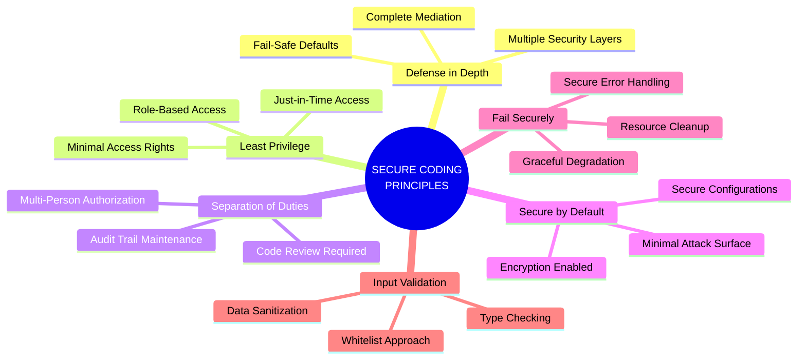
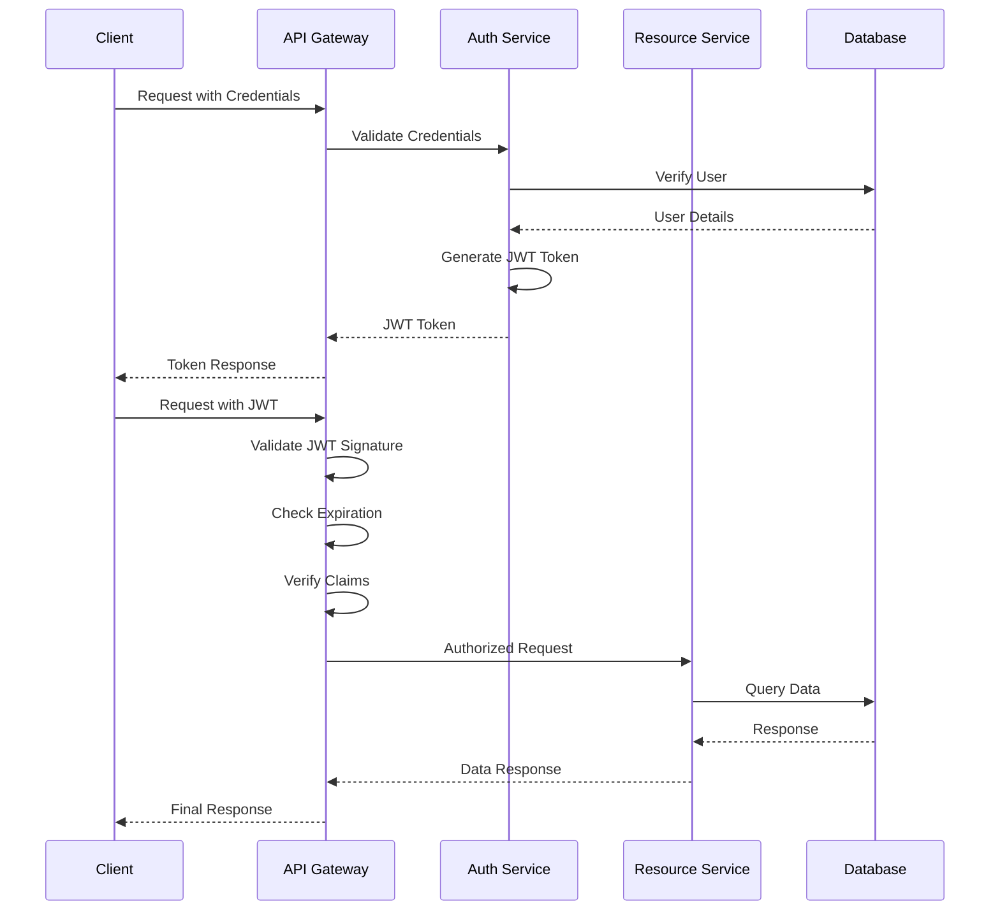
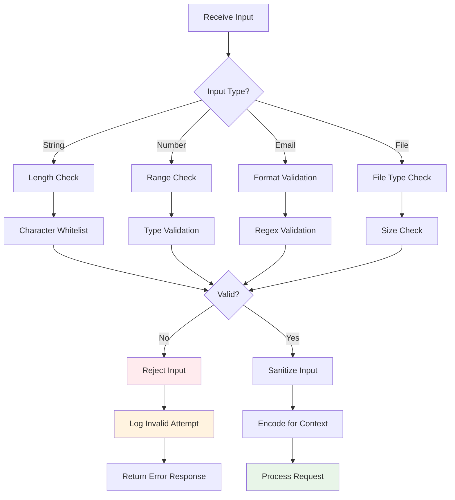
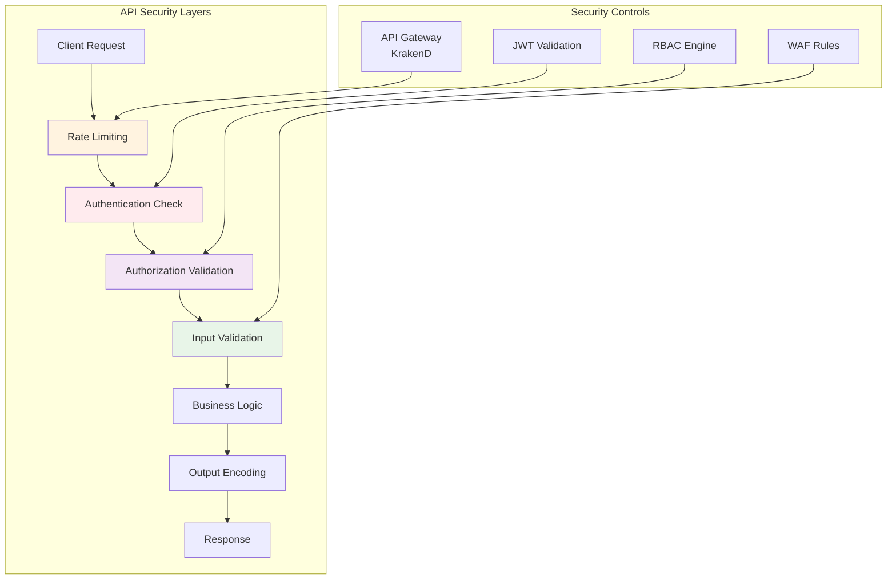
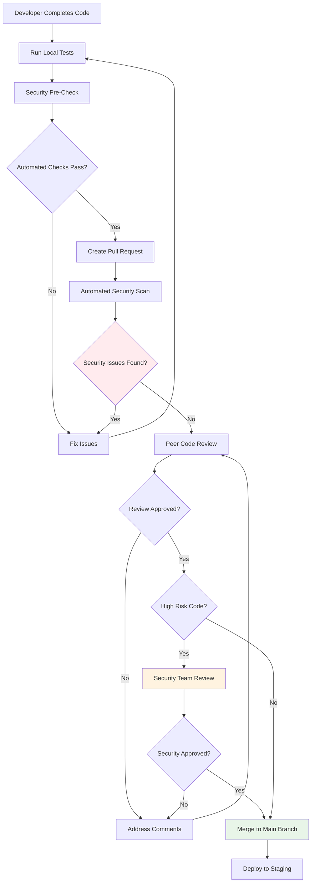
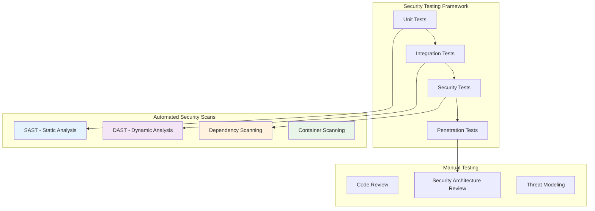

# SECURAA Secure Coding Policy
## Enterprise Secure Development Standards and Guidelines

---

## Document Control

| **Document Title** | Secure Coding Policy |
|-------------------|---------------------|
| **Document ID** | SECURAA-SCP-001 |
| **Version** | 1.0 |
| **Effective Date** | November 2025 |
| **Next Review** | November 2026 |
| **Owner** | Application Security Team |
| **Approved By** | Chief Information Security Officer |
| **Classification** | Internal Use |

---

## Table of Contents

1. [Executive Summary](#executive-summary)
2. [Purpose and Scope](#purpose-and-scope)
3. [Secure Coding Principles](#secure-coding-principles)
4. [Language-Specific Guidelines](#language-specific-guidelines)
5. [Authentication and Authorization](#authentication-and-authorization)
6. [Data Protection and Encryption](#data-protection-and-encryption)
7. [Input Validation and Output Encoding](#input-validation-and-output-encoding)
8. [Error Handling and Logging](#error-handling-and-logging)
9. [Database Security](#database-security)
10. [API Security](#api-security)
11. [Third-Party Dependencies](#third-party-dependencies)
12. [Code Review Requirements](#code-review-requirements)
13. [Security Testing](#security-testing)
14. [Compliance and Enforcement](#compliance-and-enforcement)

---

## Executive Summary

This Secure Coding Policy establishes mandatory security standards and best practices for all software development activities within SECURAA. The policy ensures that security is integrated throughout the software development lifecycle, reducing vulnerabilities and protecting sensitive data.

### Policy Objectives

- **Prevent Security Vulnerabilities**: Proactively address common security flaws during development
- **Protect Sensitive Data**: Ensure proper handling of customer and business-critical information
- **Ensure Compliance**: Meet regulatory requirements and industry standards
- **Standardize Practices**: Provide consistent security guidelines across all development teams
- **Enable Security Automation**: Support integration of security tools in CI/CD pipelines

---

## Purpose and Scope

### Purpose

This policy provides comprehensive secure coding guidelines for SECURAA development teams to:
- Minimize security vulnerabilities in application code
- Establish consistent security practices across all projects
- Facilitate security code reviews and assessments
- Support automated security testing and validation
- Ensure compliance with SOC 2, ISO 27001, and GDPR requirements

### Scope

**Applicable To:**
- All software development activities for SECURAA platform
- All programming languages and frameworks in use
- All developers, contractors, and third-party development partners
- All code repositories and development environments

**Covered Technologies:**
- **Backend**: Go (primary language)
- **Frontend**: JavaScript, React, Node.js
- **Databases**: MongoDB, PostgreSQL
- **Infrastructure**: Docker, Kubernetes, AWS
- **Build Tools**: Make, shell scripts, AWS CodeBuild

---

## Secure Coding Principles

### Core Security Principles



### OWASP Top 10 Protection

| OWASP Risk | Protection Measures | Implementation Status |
|------------|-------------------|----------------------|
| **A01: Broken Access Control** | RBAC, JWT validation, authorization checks | ✅ Implemented |
| **A02: Cryptographic Failures** | AES-256 encryption, TLS 1.2+, secure key management | ✅ Implemented |
| **A03: Injection** | Parameterized queries, input validation, ORM usage | ✅ Implemented |
| **A04: Insecure Design** | Threat modeling, security requirements, design reviews | 🟡 In Progress |
| **A05: Security Misconfiguration** | Hardened configs, automated scanning, secure defaults | ✅ Implemented |
| **A06: Vulnerable Components** | Dependency scanning, version management, patching | 🟡 In Progress |
| **A07: Authentication Failures** | MFA, secure session management, password policies | ✅ Implemented |
| **A08: Software/Data Integrity** | Code signing, integrity checks, secure pipelines | 🟡 In Progress |
| **A09: Logging Failures** | Comprehensive logging, secure log storage, monitoring | ✅ Implemented |
| **A10: SSRF** | URL validation, network segmentation, allowlisting | ✅ Implemented |

---

## Language-Specific Guidelines

### Go (Golang) Secure Coding Standards

#### 1. Error Handling

**❌ INSECURE PRACTICE:**
```go
result, _ := someFunction()  // Ignoring errors
```

**✅ SECURE PRACTICE:**
```go
result, err := someFunction()
if err != nil {
    logger.Error("Failed to execute function", err.Error())
    return fmt.Errorf("operation failed: %w", err)
}
```

#### 2. SQL Injection Prevention

**❌ INSECURE PRACTICE:**
```go
query := "SELECT * FROM users WHERE username = '" + username + "'"
db.Query(query)
```

**✅ SECURE PRACTICE:**
```go
query := "SELECT * FROM users WHERE username = $1"
db.Query(query, username)
```

#### 3. Cryptographic Operations

**❌ INSECURE PRACTICE:**
```go
import "crypto/md5"  // Weak hash algorithm
hash := md5.Sum([]byte(password))
```

**✅ SECURE PRACTICE:**
```go
import "golang.org/x/crypto/bcrypt"
hashedPassword, err := bcrypt.GenerateFromPassword([]byte(password), bcrypt.DefaultCost)
if err != nil {
    return err
}
```

#### 4. MongoDB Query Security

**Current Implementation (securaa_lib):**
```go
// Secure MongoDB connection with authentication
mongoDBDialInfo := &mgo.DialInfo{
    Addrs:    []string{config["mongoDbHost"]},
    Timeout:  60 * time.Second,
    Database: config["mongoAuthDb"],
    Username: config["mongoUserName"],
    Password: config["mongoPassword"],
}
```

**Security Requirements:**
- Always use authenticated connections
- Implement connection timeouts
- Use encrypted credentials (never hardcode)
- Validate all query parameters
- Use MongoDB's built-in parameterization

#### 5. JWT Token Handling

**Current Implementation (securaa):**
```go
import "github.com/dgrijalva/jwt-go"

// Token generation must include:
// - Expiration time
// - Issuer validation
// - Strong signing key
// - Claim validation
```

**Security Requirements:**
- Use strong signing algorithms (RS256 or HS256)
- Implement token expiration (max 24 hours)
- Validate all claims on receipt
- Store signing keys securely (environment variables)
- Implement token revocation mechanism

#### 6. Goroutine and Concurrency Safety

**✅ SECURE PRACTICE:**
```go
var mu sync.Mutex
var safeMap = make(map[string]string)

func updateMap(key, value string) {
    mu.Lock()
    defer mu.Unlock()
    safeMap[key] = value
}
```

**Requirements:**
- Use mutexes for shared data access
- Implement proper defer statements for cleanup
- Avoid race conditions with `go test -race`
- Handle panic recovery in goroutines

### JavaScript/React Secure Coding Standards

#### 1. XSS Prevention

**❌ INSECURE PRACTICE:**
```javascript
element.innerHTML = userInput;  // Vulnerable to XSS
```

**✅ SECURE PRACTICE:**
```javascript
// Use React's built-in XSS protection
<div>{userInput}</div>  // Automatically escaped

// Or use DOMPurify for HTML content
import DOMPurify from 'dompurify';
element.innerHTML = DOMPurify.sanitize(userInput);
```

#### 2. Client-Side Encryption (Current Implementation)

**From zonareact/src/crypto.js:**
```javascript
var CryptoJS = require("crypto-js");

export function encrypt(data) {
    let processedData = CryptoJS.AES.encrypt(data, encryptionKey);
    return processedData.toString();
}

export function decrypt(data) {
    try {
        processedData = CryptoJS.AES.decrypt(data, encryptionKey)
        processedData = processedData.toString(CryptoJS.enc.Utf8);
    } catch (e) {
        // Secure session cleanup on failure
        window.sessionStorage.clear();
        window.localStorage.clear();
        window.location.href = "tokenexpired";
    }
    return processedData;
}
```

**Security Requirements:**
- Never store encryption keys in source code
- Use environment variables for key management
- Implement proper error handling
- Clear sensitive data from memory after use
- Use HTTPS for all communications

#### 3. Secure API Calls

**✅ SECURE PRACTICE:**
```javascript
const fetchData = async () => {
    try {
        const response = await fetch('/api/data', {
            method: 'POST',
            headers: {
                'Content-Type': 'application/json',
                'Authorization': `Bearer ${getAuthToken()}`,
                'X-CSRF-Token': getCsrfToken()
            },
            body: JSON.stringify(sanitizedData)
        });
        
        if (!response.ok) {
            throw new Error('API request failed');
        }
        
        return await response.json();
    } catch (error) {
        logger.error('API call failed:', error);
        throw error;
    }
};
```

#### 4. Secure Local Storage

**❌ INSECURE PRACTICE:**
```javascript
localStorage.setItem('authToken', token);  // Vulnerable to XSS
localStorage.setItem('password', password);  // Never store passwords
```

**✅ SECURE PRACTICE:**
```javascript
// Use encrypted session storage for sensitive data
sessionStorage.setItem('encryptedToken', encrypt(token));

// Never store passwords or sensitive credentials
// Use secure, httpOnly cookies for authentication tokens
```

### Shell Script Security (Build Scripts)

#### 1. Input Validation

**❌ INSECURE PRACTICE:**
```bash
eval $USER_INPUT  # Command injection vulnerability
```

**✅ SECURE PRACTICE:**
```bash
# Validate input before use
if [[ ! "$USER_INPUT" =~ ^[a-zA-Z0-9_-]+$ ]]; then
    echo "Invalid input"
    exit 1
fi
```

#### 2. Secure File Operations

**From build_securaa scripts:**
```bash
# Use absolute paths
BUILD_LOG="/var/log/securaa/build.log"

# Check file existence before operations
if [ ! -f "$CONFIG_FILE" ]; then
    log_and_exit "Configuration file not found"
fi

# Set appropriate permissions
chmod 600 "$SENSITIVE_FILE"
chown root:root "$SENSITIVE_FILE"
```

#### 3. Credential Management

**✅ SECURE PRACTICE:**
```bash
# Never hardcode credentials
# Use environment variables or secure vaults
MONGO_PASSWORD="${MONGO_PASSWORD:-$(aws secretsmanager get-secret-value --secret-id mongo-pwd)}"

# Avoid logging sensitive information
set +x  # Disable command echoing for sensitive operations
mysql -u "$DB_USER" -p"$DB_PASS" < script.sql
set -x  # Re-enable command echoing
```

---

## Authentication and Authorization

### JWT Implementation Standards



### Authentication Requirements

**Mandatory Controls:**

1. **Password Security**
   - Minimum 12 characters length
   - Complexity requirements: uppercase, lowercase, numbers, special characters
   - Use bcrypt or Argon2 for password hashing
   - Implement password history (prevent reuse of last 5 passwords)
   - Account lockout after 5 failed attempts

2. **Multi-Factor Authentication (MFA)**
   - Implement MFA for administrative access
   - Support TOTP (Time-based One-Time Password)
   - Provide backup codes for account recovery
   - Enforce MFA for sensitive operations

3. **Session Management**
   - Generate cryptographically secure session tokens
   - Implement session timeout (30 minutes idle, 8 hours absolute)
   - Secure session storage (httpOnly, secure cookies)
   - Session invalidation on logout
   - Single session per user (optional: allow multiple sessions)

4. **Token Management**
   - JWT token expiration: 1 hour for access tokens
   - Refresh tokens: 24 hours maximum
   - Include issuer (iss), audience (aud), expiration (exp) claims
   - Implement token revocation mechanism
   - Rotate signing keys periodically (every 90 days)

### Authorization Requirements

**Role-Based Access Control (RBAC):**

```go
// Example authorization middleware
func AuthorizeRole(allowedRoles []string) mux.MiddlewareFunc {
    return func(next http.Handler) http.Handler {
        return http.HandlerFunc(func(w http.ResponseWriter, r *http.Request) {
            // Extract user role from JWT token
            claims := r.Context().Value("claims").(*jwt.MapClaims)
            userRole := (*claims)["role"].(string)
            
            // Check if user role is authorized
            authorized := false
            for _, role := range allowedRoles {
                if role == userRole {
                    authorized = true
                    break
                }
            }
            
            if !authorized {
                http.Error(w, "Forbidden", http.StatusForbidden)
                return
            }
            
            next.ServeHTTP(w, r)
        })
    }
}
```

**Authorization Checklist:**
- ✅ Implement least privilege principle
- ✅ Validate authorization for every request
- ✅ Use role-based access control (RBAC)
- ✅ Implement resource-level permissions
- ✅ Log all authorization decisions
- ✅ Regular access review and audit

---

## Data Protection and Encryption

### Encryption Standards

#### Data at Rest

**Requirements:**
- **Algorithm**: AES-256 encryption
- **Key Management**: AWS KMS, Azure Key Vault, or HSM
- **Key Rotation**: Every 90 days
- **Scope**: All sensitive data, PII, credentials, payment information

**Implementation (Current - securaa_lib):**
```go
package encrypt_decrypt

import (
    "crypto/aes"
    "crypto/cipher"
    "encoding/base64"
)

func CredentialsEncrypt(stringToEncrypt string, key string) (string, error) {
    origData := []byte(stringToEncrypt)
    k := []byte(key)
    
    // AES encryption
    block, err := aes.NewCipher(k)
    if err != nil {
        return "", err
    }
    
    blockSize := block.BlockSize()
    origData = PKCS7Padding(origData, blockSize)
    blockMode := cipher.NewCBCEncrypter(block, k[:blockSize])
    crypted := make([]byte, len(origData))
    blockMode.CryptBlocks(crypted, origData)
    
    return base64.StdEncoding.EncodeToString(crypted), nil
}
```

**Security Requirements:**
- Use 256-bit keys minimum
- Implement proper padding (PKCS7)
- Use CBC or GCM mode for block ciphers
- Never reuse initialization vectors (IVs)
- Securely delete decrypted data after use

#### Data in Transit

**Requirements:**
- **Protocol**: TLS 1.2 or higher (TLS 1.3 preferred)
- **Cipher Suites**: Strong ciphers only (AES-GCM, ChaCha20-Poly1305)
- **Certificate Management**: Valid certificates from trusted CAs
- **Certificate Rotation**: Annual rotation minimum

**Configuration Example:**
```go
// TLS configuration for HTTPS servers
tlsConfig := &tls.Config{
    MinVersion: tls.VersionTLS12,
    CipherSuites: []uint16{
        tls.TLS_ECDHE_RSA_WITH_AES_256_GCM_SHA384,
        tls.TLS_ECDHE_RSA_WITH_AES_128_GCM_SHA256,
        tls.TLS_ECDHE_ECDSA_WITH_AES_256_GCM_SHA384,
        tls.TLS_ECDHE_ECDSA_WITH_AES_128_GCM_SHA256,
    },
    PreferServerCipherSuites: true,
}

server := &http.Server{
    Addr:      ":443",
    TLSConfig: tlsConfig,
}
```

### Sensitive Data Handling

**Data Classification:**

| Classification | Examples | Encryption Required | Access Controls |
|----------------|----------|-------------------|-----------------|
| **Critical** | Payment card data, SSN | Yes - AES-256 | Named individuals only |
| **High** | PII, authentication credentials | Yes - AES-256 | Role-based access |
| **Medium** | Business data, internal communications | Yes - TLS in transit | Authenticated users |
| **Low** | Public information, marketing content | TLS in transit | Public access allowed |

**Handling Requirements:**
- Never log sensitive data (passwords, tokens, PII)
- Mask sensitive data in logs (show only last 4 digits)
- Use secure memory for sensitive operations
- Implement data retention policies
- Secure data disposal (cryptographic erasure)

---

## Input Validation and Output Encoding

### Input Validation Framework



### Validation Rules

#### String Input Validation

**✅ SECURE PRACTICE:**
```go
import (
    "regexp"
    "strings"
)

func ValidateUsername(username string) error {
    // Length validation
    if len(username) < 3 || len(username) > 50 {
        return errors.New("username must be between 3 and 50 characters")
    }
    
    // Character whitelist
    validUsername := regexp.MustCompile(`^[a-zA-Z0-9_-]+$`)
    if !validUsername.MatchString(username) {
        return errors.New("username contains invalid characters")
    }
    
    // Prevent SQL injection patterns
    sqlPatterns := []string{"'", "\"", ";", "--", "/*", "*/", "xp_", "sp_"}
    for _, pattern := range sqlPatterns {
        if strings.Contains(strings.ToLower(username), pattern) {
            return errors.New("username contains prohibited patterns")
        }
    }
    
    return nil
}
```

#### Email Validation

```go
func ValidateEmail(email string) error {
    emailRegex := regexp.MustCompile(`^[a-zA-Z0-9._%+\-]+@[a-zA-Z0-9.\-]+\.[a-zA-Z]{2,}$`)
    if !emailRegex.MatchString(email) {
        return errors.New("invalid email format")
    }
    return nil
}
```

#### URL Validation

```go
import "net/url"

func ValidateURL(rawURL string) error {
    parsedURL, err := url.Parse(rawURL)
    if err != nil {
        return errors.New("invalid URL format")
    }
    
    // Whitelist allowed schemes
    allowedSchemes := map[string]bool{
        "http":  true,
        "https": true,
    }
    
    if !allowedSchemes[parsedURL.Scheme] {
        return errors.New("unsupported URL scheme")
    }
    
    // Prevent SSRF - block internal IP ranges
    host := parsedURL.Hostname()
    if isInternalIP(host) {
        return errors.New("access to internal resources not allowed")
    }
    
    return nil
}
```

### Output Encoding

#### HTML Context

```javascript
// React automatically escapes output
function UserProfile({ username }) {
    return <div>{username}</div>;  // Safe from XSS
}

// For raw HTML, use DOMPurify
import DOMPurify from 'dompurify';

function RenderHTML({ htmlContent }) {
    const sanitized = DOMPurify.sanitize(htmlContent, {
        ALLOWED_TAGS: ['b', 'i', 'em', 'strong', 'a'],
        ALLOWED_ATTR: ['href']
    });
    return <div dangerouslySetInnerHTML={{ __html: sanitized }} />;
}
```

#### JSON Context

```go
import "encoding/json"

func SerializeJSON(data interface{}) ([]byte, error) {
    // Use json.Marshal for automatic escaping
    jsonData, err := json.Marshal(data)
    if err != nil {
        return nil, err
    }
    return jsonData, nil
}
```

#### SQL Context

```go
// Always use parameterized queries
query := "SELECT * FROM users WHERE email = $1 AND active = $2"
rows, err := db.Query(query, email, true)
```

---

## Error Handling and Logging

### Secure Error Handling

**❌ INSECURE PRACTICE:**
```go
func HandleLogin(w http.ResponseWriter, r *http.Request) {
    user, err := db.GetUser(username)
    if err != nil {
        http.Error(w, err.Error(), 500)  // Exposes internal details
    }
}
```

**✅ SECURE PRACTICE:**
```go
func HandleLogin(w http.ResponseWriter, r *http.Request) {
    user, err := db.GetUser(username)
    if err != nil {
        // Log detailed error internally
        logger.Error("Database error during login", 
            "error", err.Error(),
            "username", username,
            "ip", r.RemoteAddr)
        
        // Return generic error to client
        http.Error(w, "An error occurred. Please try again later.", 500)
        return
    }
}
```

### Logging Standards

#### What to Log

**Security Events:**
- Authentication attempts (success and failure)
- Authorization failures
- Input validation failures
- Session creation and termination
- Sensitive data access
- Configuration changes
- Admin actions

**Example Implementation:**
```go
import "go.uber.org/zap"

var logger *zap.Logger

func InitLogger() {
    logger, _ = zap.NewProduction()
    defer logger.Sync()
}

// Security event logging
func LogSecurityEvent(eventType, username, ip, details string) {
    logger.Info("Security Event",
        zap.String("event_type", eventType),
        zap.String("username", username),
        zap.String("ip_address", ip),
        zap.String("details", details),
        zap.Time("timestamp", time.Now()),
    )
}
```

#### What NOT to Log

**Prohibited Data:**
- Passwords or password hashes
- Session tokens or JWT tokens
- API keys or secrets
- Credit card numbers or CVV codes
- Social Security Numbers
- Private encryption keys

**Sanitization Example:**
```go
func SanitizeForLogging(data string, fieldType string) string {
    switch fieldType {
    case "creditCard":
        if len(data) > 4 {
            return "****" + data[len(data)-4:]
        }
    case "email":
        parts := strings.Split(data, "@")
        if len(parts) == 2 && len(parts[0]) > 2 {
            return parts[0][:2] + "***@" + parts[1]
        }
    case "token":
        return "[REDACTED]"
    }
    return data
}
```

### Log Security

**Requirements:**
- Store logs in a centralized, secure location
- Implement log rotation and retention policies
- Encrypt logs containing sensitive information
- Implement access controls on log files
- Monitor logs for security events
- Implement log integrity verification

---

## Database Security

### MongoDB Security (Primary Database)

#### Connection Security

**Current Implementation:**
```go
// From zona_batch/config/batch.conf and securaa_lib
mongoDBDialInfo := &mgo.DialInfo{
    Addrs:    []string{config["mongoDbHost"]},
    Timeout:  60 * time.Second,
    Database: config["mongoAuthDb"],
    Username: config["mongoUserName"],
    Password: config["mongoPassword"],
}
```

**Security Requirements:**
1. **Authentication**
   - Always enable MongoDB authentication
   - Use strong passwords (16+ characters)
   - Implement role-based access control
   - Use SCRAM-SHA-256 authentication mechanism

2. **Connection String Security**
   - Never hardcode credentials
   - Use environment variables or secret managers
   - Encrypt connection strings in configuration files
   - Implement connection pooling with limits

3. **Query Security**
   ```go
   // ❌ INSECURE - String concatenation
   query := bson.M{"username": username}  // If username is from user input
   
   // ✅ SECURE - Proper parameterization
   query := bson.M{"username": bson.M{"$eq": username}}
   
   // ✅ SECURE - Input validation before query
   if err := ValidateUsername(username); err != nil {
       return err
   }
   query := bson.M{"username": username}
   ```

#### MongoDB Security Checklist

- ✅ Enable authentication (`security.authorization: enabled`)
- ✅ Use encrypted connections (TLS/SSL)
- ✅ Implement network access restrictions
- ✅ Regular security updates and patching
- ✅ Audit logging enabled
- ✅ Backup encryption
- ✅ Least privilege user accounts
- ✅ Disable unnecessary features

### PostgreSQL Security

**Connection Security:**
```go
import "github.com/lib/pq"

// Secure PostgreSQL connection
connStr := fmt.Sprintf(
    "host=%s port=%s user=%s password=%s dbname=%s sslmode=require",
    host, port, user, password, dbname,
)

db, err := sql.Open("postgres", connStr)
if err != nil {
    return err
}

// Set connection pool limits
db.SetMaxOpenConns(25)
db.SetMaxIdleConns(5)
db.SetConnMaxLifetime(5 * time.Minute)
```

**Query Security:**
```go
// Always use parameterized queries
query := `
    SELECT id, username, email 
    FROM users 
    WHERE username = $1 AND status = $2
`
rows, err := db.Query(query, username, "active")
```

---

## API Security

### RESTful API Security Standards



### API Security Requirements

#### 1. Authentication

```go
// JWT middleware for API authentication
func AuthenticateJWT(next http.Handler) http.Handler {
    return http.HandlerFunc(func(w http.ResponseWriter, r *http.Request) {
        authHeader := r.Header.Get("Authorization")
        if authHeader == "" {
            http.Error(w, "Missing authorization header", http.StatusUnauthorized)
            return
        }
        
        tokenString := strings.TrimPrefix(authHeader, "Bearer ")
        token, err := jwt.Parse(tokenString, func(token *jwt.Token) (interface{}, error) {
            // Validate signing method
            if _, ok := token.Method.(*jwt.SigningMethodHMAC); !ok {
                return nil, fmt.Errorf("unexpected signing method")
            }
            return []byte(jwtSecret), nil
        })
        
        if err != nil || !token.Valid {
            http.Error(w, "Invalid token", http.StatusUnauthorized)
            return
        }
        
        // Add claims to context
        claims := token.Claims.(jwt.MapClaims)
        ctx := context.WithValue(r.Context(), "claims", claims)
        next.ServeHTTP(w, r.WithContext(ctx))
    })
}
```

#### 2. Rate Limiting

```go
import "golang.org/x/time/rate"

// Rate limiter per IP address
var limiters = make(map[string]*rate.Limiter)
var mu sync.Mutex

func RateLimitMiddleware(requestsPerMinute int) mux.MiddlewareFunc {
    return func(next http.Handler) http.Handler {
        return http.HandlerFunc(func(w http.ResponseWriter, r *http.Request) {
            ip := r.RemoteAddr
            
            mu.Lock()
            limiter, exists := limiters[ip]
            if !exists {
                limiter = rate.NewLimiter(rate.Limit(requestsPerMinute), requestsPerMinute)
                limiters[ip] = limiter
            }
            mu.Unlock()
            
            if !limiter.Allow() {
                http.Error(w, "Rate limit exceeded", http.StatusTooManyRequests)
                return
            }
            
            next.ServeHTTP(w, r)
        })
    }
}
```

#### 3. CORS Configuration

```go
func CORSMiddleware(next http.Handler) http.Handler {
    return http.HandlerFunc(func(w http.ResponseWriter, r *http.Request) {
        // Whitelist allowed origins (never use "*" in production)
        allowedOrigins := []string{
            "https://app.securaa.com",
            "https://dashboard.securaa.com",
        }
        
        origin := r.Header.Get("Origin")
        for _, allowed := range allowedOrigins {
            if origin == allowed {
                w.Header().Set("Access-Control-Allow-Origin", origin)
                break
            }
        }
        
        w.Header().Set("Access-Control-Allow-Methods", "GET, POST, PUT, DELETE, OPTIONS")
        w.Header().Set("Access-Control-Allow-Headers", "Content-Type, Authorization")
        w.Header().Set("Access-Control-Max-Age", "3600")
        
        if r.Method == "OPTIONS" {
            w.WriteHeader(http.StatusOK)
            return
        }
        
        next.ServeHTTP(w, r)
    })
}
```

#### 4. API Security Checklist

- ✅ Implement authentication for all endpoints
- ✅ Use HTTPS for all API communications
- ✅ Validate and sanitize all inputs
- ✅ Implement rate limiting
- ✅ Use appropriate HTTP status codes
- ✅ Implement proper error handling
- ✅ Version your APIs
- ✅ Implement API logging and monitoring
- ✅ Use security headers (HSTS, CSP, etc.)
- ✅ Implement request/response validation

---

## Third-Party Dependencies

### Dependency Management

#### Go Modules (go.mod)

**Current Dependencies Analysis:**
```
// From securaa/go.mod
- github.com/dgrijalva/jwt-go v3.2.0 (⚠️ Deprecated - Update Required)
- gopkg.in/mgo.v2 (⚠️ Unmaintained - Consider migration)
- go.uber.org/zap v1.21.0 (✅ Active)
- github.com/gorilla/mux v1.8.0 (✅ Active)
```

**Security Requirements:**

1. **Vulnerability Scanning**
   ```bash
   # Run security scan on dependencies
   go list -json -m all | nancy sleuth
   
   # Or use govulncheck
   govulncheck ./...
   ```

2. **Dependency Updates**
   ```bash
   # Check for updates
   go list -u -m all
   
   # Update dependencies
   go get -u ./...
   go mod tidy
   ```

3. **Version Pinning**
   ```go
   // In go.mod, use specific versions
   require (
       github.com/gorilla/mux v1.8.0  // Pinned version
       go.uber.org/zap v1.21.0
   )
   ```

#### JavaScript Dependencies (package.json)

**Security Requirements:**

1. **Audit Dependencies**
   ```bash
   npm audit
   npm audit fix
   ```

2. **Use Lock Files**
   - Commit `package-lock.json` to version control
   - Use `npm ci` in CI/CD pipelines (not `npm install`)

3. **Dependency Review**
   - Review new dependencies before adding
   - Check license compatibility
   - Verify package authenticity
   - Review package maintainer activity

### Third-Party Component Security Checklist

- ✅ Maintain inventory of all dependencies
- ✅ Regular vulnerability scanning (weekly minimum)
- ✅ Automated dependency updates
- ✅ Security advisory monitoring
- ✅ License compliance verification
- ✅ Source code review for critical dependencies
- ✅ Vendor security assessment
- ✅ Dependency isolation and sandboxing

---

## Code Review Requirements

### Mandatory Code Review Process



### Code Review Checklist

#### Security Review Items

**Authentication & Authorization:**
- [ ] Authentication required for all sensitive operations
- [ ] Authorization checks implemented for all resources
- [ ] Session management properly implemented
- [ ] Passwords properly hashed (never stored in plain text)
- [ ] JWT tokens properly validated

**Input Validation:**
- [ ] All user inputs validated and sanitized
- [ ] Whitelist validation used where possible
- [ ] File uploads validated (type, size, content)
- [ ] SQL injection prevention (parameterized queries)
- [ ] XSS prevention (output encoding)

**Data Protection:**
- [ ] Sensitive data encrypted at rest
- [ ] TLS/SSL used for data in transit
- [ ] Credentials stored securely (never hardcoded)
- [ ] PII handled according to privacy requirements
- [ ] Secure data disposal implemented

**Error Handling:**
- [ ] Errors handled gracefully without exposing internals
- [ ] Sensitive information not logged
- [ ] Generic error messages returned to clients
- [ ] Detailed errors logged for debugging

**Dependencies:**
- [ ] No new vulnerabilities introduced
- [ ] Dependencies up to date
- [ ] Only necessary dependencies included
- [ ] License compliance verified

### High-Risk Code Areas

Require additional security team review:
- Authentication and authorization logic
- Cryptographic implementations
- Payment processing code
- File upload/download functionality
- Database query construction
- API endpoint implementations
- Privilege escalation paths
- External service integrations

---

## Security Testing

### Testing Requirements



### Testing Types

#### 1. Unit Testing

**Security-Focused Unit Tests:**
```go
func TestPasswordHashing(t *testing.T) {
    password := "SecureP@ssw0rd"
    
    // Test password hashing
    hashed, err := HashPassword(password)
    if err != nil {
        t.Fatalf("Failed to hash password: %v", err)
    }
    
    // Verify hash is not the same as password
    if hashed == password {
        t.Error("Password hash should not equal plain password")
    }
    
    // Verify password comparison works
    if !ComparePassword(hashed, password) {
        t.Error("Password comparison failed")
    }
    
    // Verify wrong password fails
    if ComparePassword(hashed, "WrongPassword") {
        t.Error("Wrong password should not match")
    }
}

func TestInputValidation(t *testing.T) {
    tests := []struct {
        input    string
        expected error
    }{
        {"validuser123", nil},
        {"user@domain", errors.New("invalid characters")},
        {"admin' OR '1'='1", errors.New("prohibited patterns")},
        {"<script>alert(1)</script>", errors.New("invalid characters")},
    }
    
    for _, test := range tests {
        err := ValidateUsername(test.input)
        if (err != nil) != (test.expected != nil) {
            t.Errorf("ValidateUsername(%s) = %v, expected %v", 
                test.input, err, test.expected)
        }
    }
}
```

#### 2. Integration Testing

**API Security Testing:**
```go
func TestAPIAuthentication(t *testing.T) {
    // Test without authentication
    req := httptest.NewRequest("GET", "/api/users", nil)
    w := httptest.NewRecorder()
    router.ServeHTTP(w, req)
    
    if w.Code != http.StatusUnauthorized {
        t.Errorf("Expected 401, got %d", w.Code)
    }
    
    // Test with invalid token
    req = httptest.NewRequest("GET", "/api/users", nil)
    req.Header.Set("Authorization", "Bearer invalid_token")
    w = httptest.NewRecorder()
    router.ServeHTTP(w, req)
    
    if w.Code != http.StatusUnauthorized {
        t.Errorf("Expected 401 for invalid token, got %d", w.Code)
    }
    
    // Test with valid token
    validToken := generateTestToken()
    req = httptest.NewRequest("GET", "/api/users", nil)
    req.Header.Set("Authorization", "Bearer "+validToken)
    w = httptest.NewRecorder()
    router.ServeHTTP(w, req)
    
    if w.Code != http.StatusOK {
        t.Errorf("Expected 200 for valid token, got %d", w.Code)
    }
}
```

#### 3. Static Application Security Testing (SAST)

**Tools and Implementation:**
```bash
# GoSec - Go security checker
gosec -fmt=json -out=results.json ./...

# Go vet - Built-in static analysis
go vet ./...

# Staticcheck - Additional static analysis
staticcheck ./...
```

#### 4. Dynamic Application Security Testing (DAST)

**Tools:**
- OWASP ZAP (Zed Attack Proxy)
- Burp Suite
- Netsparker
- Acunetix

#### 5. Dependency Scanning

```bash
# Nancy - Dependency vulnerability scanner
go list -json -m all | nancy sleuth

# Govulncheck - Official Go vulnerability checker
govulncheck ./...

# npm audit - JavaScript dependencies
npm audit --production
```

### Testing Schedule

| Test Type | Frequency | Automation | Responsibility |
|-----------|-----------|------------|----------------|
| **Unit Tests** | Every commit | Yes | Developers |
| **Integration Tests** | Every commit | Yes | Developers |
| **SAST** | Every commit | Yes | CI/CD Pipeline |
| **Dependency Scan** | Daily | Yes | CI/CD Pipeline |
| **DAST** | Weekly | Partial | Security Team |
| **Penetration Test** | Quarterly | No | Security Team |
| **Security Review** | Per feature | No | Security Team |

---

## Compliance and Enforcement

### Policy Compliance

**Enforcement Mechanisms:**

1. **Automated Checks**
   - Pre-commit hooks for basic security checks
   - CI/CD pipeline security gates
   - Automated code review tools
   - Continuous security monitoring

2. **Manual Reviews**
   - Peer code reviews (mandatory)
   - Security team reviews (high-risk code)
   - Architecture security reviews
   - Quarterly security audits

3. **Training Requirements**
   - Secure coding training (annual)
   - OWASP Top 10 awareness
   - Language-specific security training
   - Threat modeling workshops

### Violation Handling

**Severity Levels:**

| Severity | Examples | Response Time | Action Required |
|----------|----------|---------------|-----------------|
| **Critical** | Hardcoded credentials, SQL injection | Immediate | Block deployment, immediate fix |
| **High** | Missing authentication, weak crypto | 24 hours | Block deployment, mandatory fix |
| **Medium** | Input validation issues, logging sensitive data | 1 week | Warning, fix before release |
| **Low** | Code quality issues, minor vulnerabilities | 1 month | Advisory, fix in next sprint |

**Escalation Path:**
1. Developer notified of violation
2. Team lead review and approval required
3. Security team consultation for high/critical issues
4. CISO approval for critical security exceptions

### Metrics and Reporting

**Security Metrics:**
- Number of security issues by severity
- Time to remediate security issues
- Security test coverage percentage
- Dependency vulnerability count
- Security training completion rate

**Monthly Security Report:**
- Security issues identified and resolved
- Trends in security vulnerabilities
- Compliance status
- Training completion status
- Recommendations for improvement

---

## Conclusion

This Secure Coding Policy establishes the foundation for secure software development at SECURAA. All development team members must adhere to these guidelines to ensure the security and integrity of the SECURAA platform.

**Key Takeaways:**
- Security is everyone's responsibility
- Implement defense in depth
- Validate all inputs, encode all outputs
- Use secure defaults and fail securely
- Keep dependencies up to date
- Regular security testing is mandatory
- Continuous learning and improvement

---

## Appendices

### Appendix A: Security Tools and Resources

**Recommended Tools:**
- **SAST**: GoSec, ESLint Security Plugin
- **DAST**: OWASP ZAP, Burp Suite
- **Dependency Scanning**: Nancy, npm audit
- **Secrets Detection**: git-secrets, trufflehog
- **Container Security**: Trivy, Clair

### Appendix B: Security Contact Information

**Security Team:**
- Security Email: security@securaa.com
- Security Hotline: [Phone Number]
- Bug Bounty Program: bugbounty.securaa.com
- Security Portal: security.securaa.com

### Appendix C: References

- OWASP Top 10: https://owasp.org/www-project-top-ten/
- CWE Top 25: https://cwe.mitre.org/top25/
- NIST Secure Software Development Framework
- ISO 27034 - Application Security Standard

---

**Document Approval:**

| Role | Name | Signature | Date |
|------|------|-----------|------|
| **CISO** | [Name] | [Digital Signature] | [Date] |
| **Engineering Director** | [Name] | [Digital Signature] | [Date] |
| **Security Architect** | [Name] | [Digital Signature] | [Date] |

---

*This document contains confidential and proprietary information. Distribution is restricted to authorized personnel only.*