# SOAR Platform Architecture and Integration with SIEM & Threat Intelligence Solutions

## Executive Summary

This document provides a comprehensive overview of the SOAR (Security Orchestration, Automation and Response) platform architecture and its seamless integration capabilities with SIEM (Security Information and Event Management) and Threat Intelligence (TI) solutions. The platform demonstrates sophisticated integration patterns with Graylog SIEM and ThreatMon TI, along with extensive support for other industry-leading security tools.

## Table of Contents

1. [SOAR Platform Architecture Overview](#soar-platform-architecture-overview)
2. [Integration Architecture Framework](#integration-architecture-framework)
3. [Graylog SIEM Integration](#graylog-siem-integration)
4. [ThreatMon Threat Intelligence Integration](#threatmon-threat-intelligence-integration)
5. [Data Flow and Processing](#data-flow-and-processing)
6. [Security and Authentication](#security-and-authentication)
7. [Scalability and Performance](#scalability-and-performance)
8. [Use Cases and Benefits](#use-cases-and-benefits)

---

## SOAR Platform Architecture Overview

### Core Platform Components

The SOAR platform is built on a microservices architecture designed for scalability, resilience, and seamless integration with external security tools.

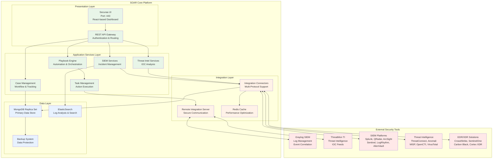

### Key Architectural Principles

**1. Microservices Design**
- Independent, loosely-coupled services
- Technology-agnostic integration capabilities
- Horizontal scalability and fault tolerance
- Container-based deployment with Docker Swarm

**2. Event-Driven Architecture**
- Asynchronous event processing
- Real-time incident handling
- Message queue-based communication (Kafka)
- Stream processing for high-volume data

**3. API-First Approach**
- RESTful APIs for all integrations
- Standardized authentication mechanisms
- Comprehensive API documentation
- Webhook support for real-time updates

**4. Security-by-Design**
- End-to-end encryption for data in transit
- Role-based access control (RBAC)
- Multi-tenant architecture with data isolation
- Audit logging and compliance tracking

---

## Integration Architecture Framework

### Supported SIEM and Security Platforms

The SOAR platform provides native connectors and integration capabilities for a wide range of SIEM and security tools:

#### SIEM Platforms
- **Graylog**: Open-source log management with powerful search capabilities
- **Splunk**: Industry-leading data platform for search, monitoring, and analysis
- **IBM QRadar**: AI-powered SIEM with advanced threat detection
- **Microsoft Sentinel**: Cloud-native SIEM and SOAR solution
- **ArcSight ESM**: Enterprise security management with real-time correlation
- **LogRhythm**: Unified security analytics and incident response
- **AlienVault OSSIM**: Open-source security information management
- **Elastic Security**: Built on Elastic Stack for security analytics
- **RSA NetWitness**: Network and endpoint analysis platform
- **McAfee ESM**: Enterprise security manager with threat intelligence

#### Threat Intelligence Platforms
- **ThreatMon**: Real-time threat intelligence and IOC feeds
- **ThreatConnect**: Threat intelligence platform with automation
- **Anomali**: Threat intelligence management and analytics
- **MISP**: Open-source threat intelligence sharing platform
- **OpenCTI**: Open cyber threat intelligence platform
- **VirusTotal**: File and URL analysis with malware detection
- **ThreatQuotient**: Threat intelligence platform with data lake
- **Recorded Future**: Real-time threat intelligence and analytics
- **Intel 471**: Underground threat intelligence and monitoring
- **Digital Shadows**: Digital risk protection with threat intelligence

#### Endpoint Detection and Response (EDR/XDR)
- **CrowdStrike Falcon**: Cloud-native endpoint protection platform
- **SentinelOne**: AI-powered endpoint security and response
- **Carbon Black**: Advanced endpoint detection and response
- **Palo Alto Cortex XDR**: Extended detection and response platform
- **Microsoft Defender**: Integrated endpoint and cloud security
- **Trend Micro**: Endpoint security with machine learning
- **Symantec Endpoint Protection**: Enterprise endpoint security
- **FireEye HX**: Endpoint security and forensic analysis

#### Vulnerability Management Platforms
- **Tenable Nessus**: Comprehensive vulnerability assessment
- **Qualys VMDR**: Cloud-based vulnerability management
- **Rapid7 InsightVM**: Real-time vulnerability management
- **OpenVAS**: Open-source vulnerability scanner
- **Greenbone**: Enterprise vulnerability management

#### Network Security Tools
- **Palo Alto Firewalls**: Next-generation firewall with threat prevention
- **Cisco ASA/Firepower**: Network security and threat detection
- **Fortinet FortiGate**: Unified threat management platform
- **Check Point**: Advanced threat prevention and security management
- **Juniper SRX**: High-performance network security platform

### Universal Integration Model

The SOAR platform employs a universal integration model that supports multiple communication protocols and data formats, enabling seamless connectivity with diverse security tools.

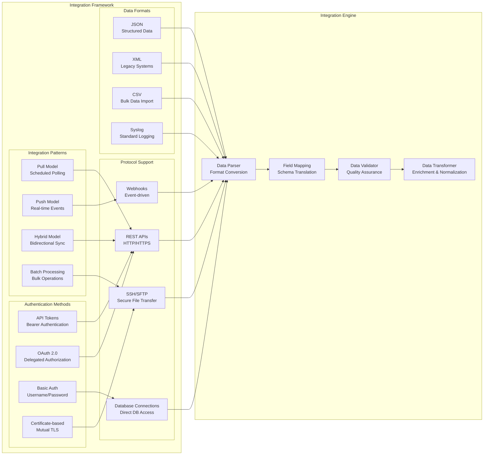

### Integration Lifecycle Management

**1. Discovery Phase**
- Automatic detection of available endpoints
- Capability assessment and feature mapping
- Security requirement analysis
- Performance baseline establishment

**2. Configuration Phase**
- Connection parameter setup
- Authentication credential management
- Data mapping and field correlation
- Polling interval and threshold configuration

**3. Testing and Validation**
- Connectivity testing with health checks
- Data flow validation and integrity testing
- Performance benchmarking
- Error handling and retry mechanism testing

**4. Deployment and Monitoring**
- Production deployment with monitoring
- Real-time performance metrics
- Alert configuration for integration failures
- Automated failover and recovery procedures

---

## Graylog SIEM Integration

### Overview

Graylog integration enables comprehensive log management, security event correlation, and incident response automation. The platform connects with Graylog's REST API to ingest security events, perform searches, and automate response actions.

### Integration Architecture

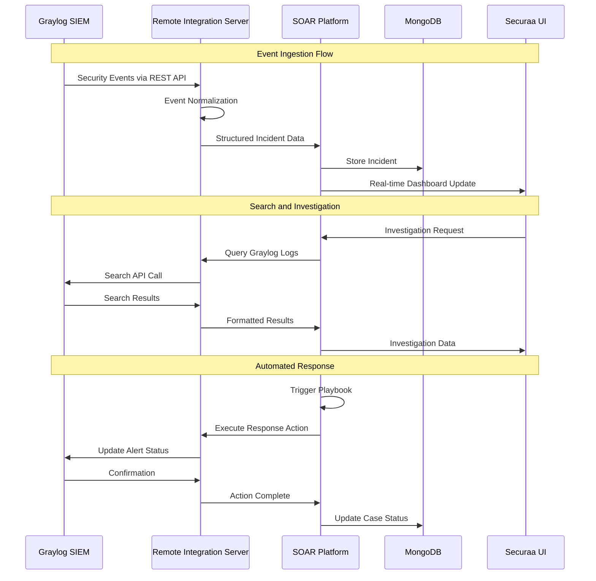

### Technical Integration Details

#### Configuration Parameters

| Parameter | Type | Description | Example |
|-----------|------|-------------|---------|
| **Base URL** | String | Graylog server endpoint | `https://graylog.company.com:9000` |
| **Access Token** | String | API authentication token | `2bnv8hu34l89sd6fghjk...` |
| **Instance Name** | String | Unique identifier for integration | `GraylogProduction` |
| **Query Field** | String | Custom search queries | `source:firewall AND level:error` |
| **Incidents Fetch Limit** | Integer | Maximum events per poll | `50` |
| **Ingest Offense** | Boolean | Auto-create cases from events | `true` |

#### Supported Capabilities

**1. Event Ingestion**
- Real-time security event collection
- Automated incident creation from Graylog alerts
- Custom query-based event filtering
- Multi-stream support for different log sources

**2. Log Search and Analysis**
- Advanced search capabilities using Graylog's query language
- Historical log analysis for forensic investigations
- Pattern recognition and anomaly detection
- Cross-correlation with other security tools

**3. Alert Management**
- Bi-directional alert synchronization
- Alert status updates and acknowledgments
- Custom alert routing based on severity and type
- Escalation workflows for unresolved alerts

**4. Dashboards and Reporting**
- Integration with SOAR dashboard widgets
- Custom report generation using Graylog data
- Real-time metrics and KPI tracking
- Executive summary reports with visual analytics

### Data Flow and Processing

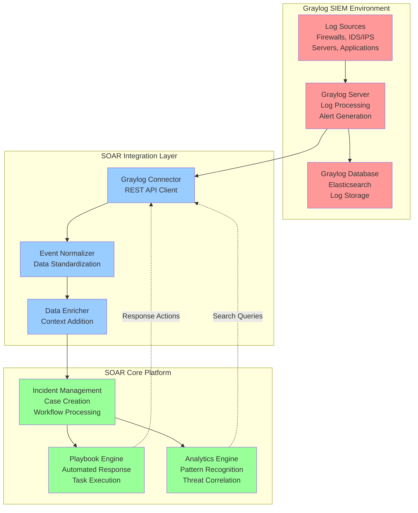

---

## ThreatMon Threat Intelligence Integration

### Overview

ThreatMon integration provides advanced threat intelligence capabilities, enabling the SOAR platform to leverage real-time threat feeds, IOC analysis, and contextual threat information for enhanced security decision-making.

### Integration Architecture

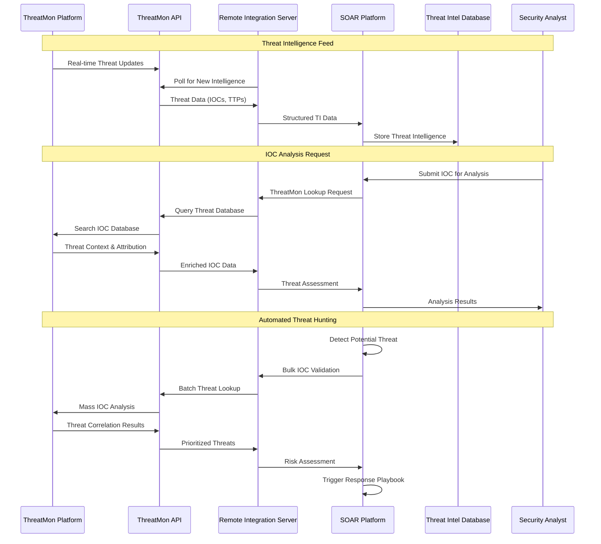

### Threat Intelligence Capabilities

#### IOC (Indicators of Compromise) Management

**1. Multi-Type IOC Support**
- **IP Addresses**: Malicious IP reputation and geolocation data
- **Domain Names**: Suspicious domains and DNS analysis
- **URL Analysis**: Malicious URL detection and categorization
- **File Hashes**: Malware signature matching (MD5, SHA1, SHA256)
- **Email Addresses**: Threat actor identification and phishing detection

**2. Threat Attribution and Context**
- **Threat Actor Mapping**: Attribution to known threat groups
- **Campaign Tracking**: Connection to active threat campaigns
- **TTP Analysis**: Tactics, Techniques, and Procedures correlation
- **Timeline Correlation**: Historical threat activity patterns

#### Advanced Threat Analysis Features

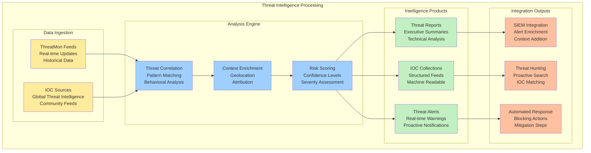

### Configuration and API Integration

#### ThreatMon Configuration Parameters

| Parameter | Type | Description | Security Notes |
|-----------|------|-------------|----------------|
| **API Base URL** | String | ThreatMon API endpoint | `https://api.threatmon.io/v1/` |
| **API Key** | String | Authentication token | Encrypted storage required |
| **Access ID** | String | Account identifier | Multi-tenant support |
| **Feed Types** | Array | Selected intelligence feeds | `["indicators", "reports", "alerts"]` |
| **Update Frequency** | Integer | Polling interval (minutes) | `15` (minimum recommended) |
| **IOC Types** | Array | Supported indicator types | `["ip", "domain", "url", "hash"]` |

#### Supported API Operations

**1. Intelligence Retrieval**
- **Get Latest Threats**: Retrieve recent threat intelligence updates
- **IOC Lookup**: Single and batch IOC validation
- **Threat Reports**: Detailed threat analysis documents
- **Campaign Information**: Active threat campaign details

**2. Search and Query**
- **Advanced Search**: Complex queries across threat database
- **Historical Analysis**: Time-based threat pattern analysis
- **Correlation Queries**: Related threat indicator discovery
- **Attribution Search**: Threat actor and group identification

**3. Real-time Feeds**
- **Streaming Updates**: Real-time threat intelligence feeds
- **Webhook Integration**: Event-driven threat notifications
- **Custom Alerts**: Tailored threat monitoring rules
- **Priority Feeds**: High-confidence, actionable intelligence

---

## Data Flow and Processing

### Unified Security Data Pipeline

The SOAR platform implements a sophisticated data processing pipeline that normalizes, enriches, and correlates security data from multiple sources including SIEM and threat intelligence platforms.

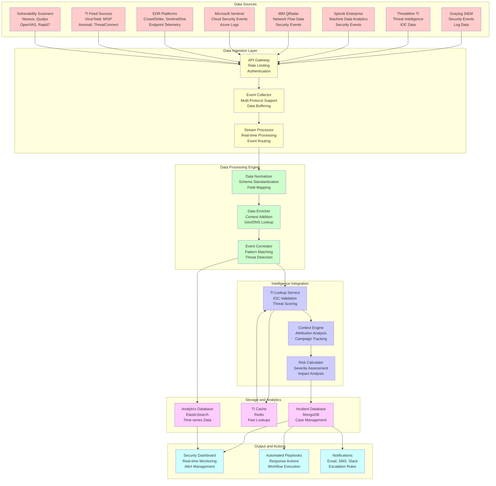

### Event Processing Workflow

#### 1. Event Ingestion and Normalization

**Graylog Event Processing:**
```
Input: Raw Graylog Alert
↓
Schema Validation → Field Mapping → Data Type Conversion
↓
Normalized Event: {
  "event_id": "unique_identifier",
  "timestamp": "ISO8601_datetime",
  "source": "graylog",
  "event_type": "security_alert",
  "severity": "high|medium|low",
  "description": "human_readable_text",
  "source_ip": "ip_address",
  "destination_ip": "ip_address",
  "indicators": ["ioc1", "ioc2"],
  "metadata": {...}
}
```

**ThreatMon Intelligence Processing:**
```
Input: ThreatMon IOC Data
↓
IOC Validation → Threat Scoring → Context Enrichment
↓
Processed Intelligence: {
  "ioc_id": "threat_indicator_id",
  "ioc_type": "ip|domain|url|hash",
  "ioc_value": "actual_indicator_value",
  "threat_type": "malware|phishing|c2",
  "confidence": "high|medium|low",
  "threat_actor": "apt_group_name",
  "campaign": "campaign_identifier",
  "first_seen": "timestamp",
  "last_seen": "timestamp",
  "references": ["url1", "url2"]
}
```

#### 2. Correlation and Enrichment

**Multi-Source Correlation:**
- **Temporal Correlation**: Events occurring within time windows
- **Spatial Correlation**: Events from same network segments
- **IOC Correlation**: Matching indicators across sources
- **Behavioral Correlation**: Similar attack patterns and TTPs

**Enrichment Process:**
- **Geolocation Data**: IP address to country/region mapping
- **DNS Resolution**: Domain to IP resolution and vice versa
- **Threat Intelligence**: IOC reputation and threat context
- **Asset Information**: Internal asset identification and criticality

#### 3. Incident Creation and Prioritization

**Automated Incident Creation Rules:**
```yaml
Incident_Creation_Rules:
  - Rule: "High Severity TI Match"
    Condition: "TI_confidence >= 0.8 AND event_severity == 'high'"
    Action: "create_incident"
    Priority: "critical"
    
  - Rule: "Multiple IOC Correlation"
    Condition: "matched_iocs >= 3 AND time_window <= '1h'"
    Action: "create_incident"
    Priority: "high"
    
  - Rule: "Known Campaign Activity"
    Condition: "campaign_match == true AND threat_actor != 'unknown'"
    Action: "create_incident"
    Priority: "high"
```

### Integration Examples and Use Cases

#### Multi-SIEM Environment Support

**Enterprise Scenario: Hybrid SIEM Deployment**
```yaml
Integration_Configuration:
  Primary_SIEM: "Splunk Enterprise (On-Premises)"
  Secondary_SIEM: "Microsoft Sentinel (Cloud)"
  Legacy_SIEM: "IBM QRadar (Legacy Systems)"
  Log_Management: "Graylog (Cost-Effective Logs)"
  
Data_Flow_Strategy:
  Critical_Assets: "Splunk + Sentinel (Dual Processing)"
  Cloud_Workloads: "Microsoft Sentinel (Native Integration)"
  Legacy_Systems: "QRadar (Existing Investment)"
  High_Volume_Logs: "Graylog (Cost Optimization)"
```

#### Threat Intelligence Orchestration

**Multi-Feed Intelligence Fusion**
```yaml
TI_Feed_Hierarchy:
  Commercial_Feeds:
    - "ThreatMon (Primary IOC Source)"
    - "Recorded Future (Contextual Intelligence)"
    - "ThreatConnect (Campaign Tracking)"
  
  Open_Source_Feeds:
    - "MISP (Community Intelligence)"
    - "OpenCTI (Structured Threat Data)"
    - "VirusTotal (File/URL Analysis)"
  
  Government_Feeds:
    - "US-CERT Feeds (Government Alerts)"
    - "NCSC Feeds (National Cyber Security)"
    - "Industry ISAC Feeds (Sector-Specific)"

Processing_Logic:
  High_Confidence: "Commercial feeds take precedence"
  Volume_Processing: "Open source for bulk validation"
  Specialized_Intel: "Government feeds for APT attribution"
```

---

## Security and Authentication

### Multi-Layered Security Architecture

The SOAR platform implements comprehensive security measures to protect sensitive security data and ensure secure integration with external systems.

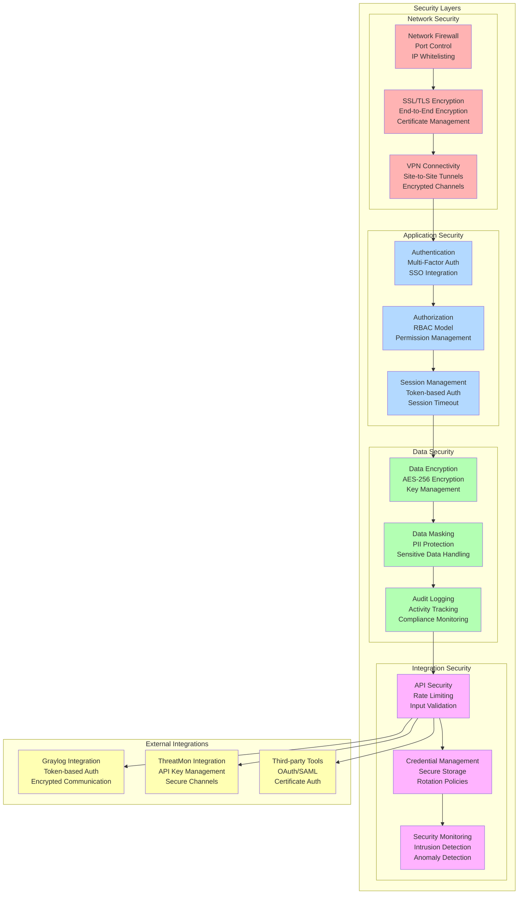

### Authentication and Authorization Framework

#### 1. Multi-Factor Authentication (MFA)

**Supported Authentication Methods:**
- **Primary**: Username/Password with complexity requirements
- **Secondary**: SMS OTP, Email OTP, TOTP (Google Authenticator)
- **Advanced**: Hardware tokens, Biometric authentication
- **Enterprise**: SAML 2.0, OAuth 2.0, LDAP/Active Directory

#### 2. Role-Based Access Control (RBAC)

**Predefined Roles:**
```yaml
Security_Roles:
  - Role: "Security Administrator"
    Permissions:
      - "full_system_access"
      - "user_management"
      - "integration_configuration"
      - "playbook_modification"
    
  - Role: "Security Analyst"
    Permissions:
      - "incident_management"
      - "investigation_tools"
      - "report_generation"
      - "dashboard_access"
    
  - Role: "SOC Manager"
    Permissions:
      - "team_management"
      - "report_access"
      - "metrics_dashboard"
      - "audit_trail_access"
    
  - Role: "Integration Specialist"
    Permissions:
      - "integration_testing"
      - "connector_configuration"
      - "data_mapping"
      - "health_monitoring"
```

#### 3. API Security and Rate Limiting

**API Protection Mechanisms:**
- **Rate Limiting**: Configurable limits per user/integration
- **Input Validation**: Schema validation and sanitization
- **Output Filtering**: Sensitive data redaction
- **Audit Logging**: Complete API access logging

**Integration-Specific Security:**
```yaml
Graylog_Integration_Security:
  Authentication: "Bearer Token"
  Encryption: "TLS 1.3"
  Rate_Limit: "100 requests/minute"
  Timeout: "30 seconds"
  Retry_Policy: "Exponential backoff"

ThreatMon_Integration_Security:
  Authentication: "API Key + Secret"
  Encryption: "TLS 1.3 + Certificate Pinning"
  Rate_Limit: "500 requests/hour"
  Timeout: "15 seconds"
  Data_Validation: "JSON Schema validation"
```

---

## Scalability and Performance

### Horizontal Scaling Architecture

The SOAR platform is designed for enterprise-scale deployments with support for high-volume security data processing and integration with multiple SIEM and TI sources.

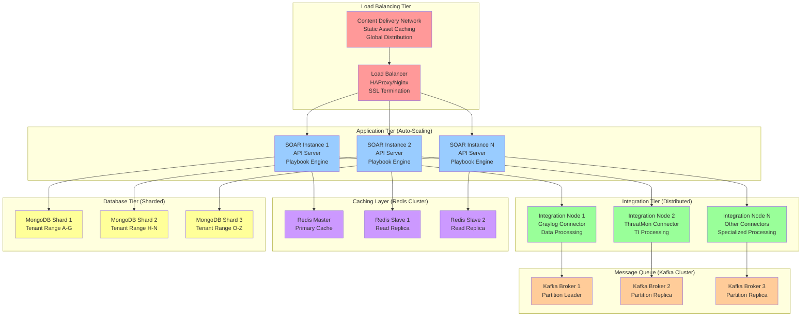

### Performance Optimization Strategies

#### 1. Data Processing Optimization

**Stream Processing Architecture:**
- **Apache Kafka**: High-throughput message streaming
- **Event Partitioning**: Parallel processing across topics
- **Consumer Groups**: Distributed event consumption
- **Backpressure Handling**: Flow control for high-volume data

**Caching Strategy:**
- **Multi-Level Caching**: Application, database, and CDN caching
- **Intelligent Cache Warming**: Predictive cache population
- **Cache Invalidation**: Event-driven cache updates
- **Distributed Caching**: Redis cluster for session and data caching

#### 2. Auto-Scaling Configuration

**Scaling Triggers:**
```yaml
Auto_Scaling_Rules:
  CPU_Utilization:
    Scale_Up: "> 70% for 5 minutes"
    Scale_Down: "< 30% for 10 minutes"
    
  Memory_Utilization:
    Scale_Up: "> 80% for 3 minutes"
    Scale_Down: "< 40% for 15 minutes"
    
  Queue_Depth:
    Scale_Up: "> 1000 messages"
    Scale_Down: "< 100 messages for 10 minutes"
    
  API_Request_Rate:
    Scale_Up: "> 500 requests/second"
    Scale_Down: "< 100 requests/second for 10 minutes"
```

---

## Use Cases and Benefits

### 1. Automated Incident Response

#### Graylog-Triggered Automation

**Use Case: Malware Detection and Response**

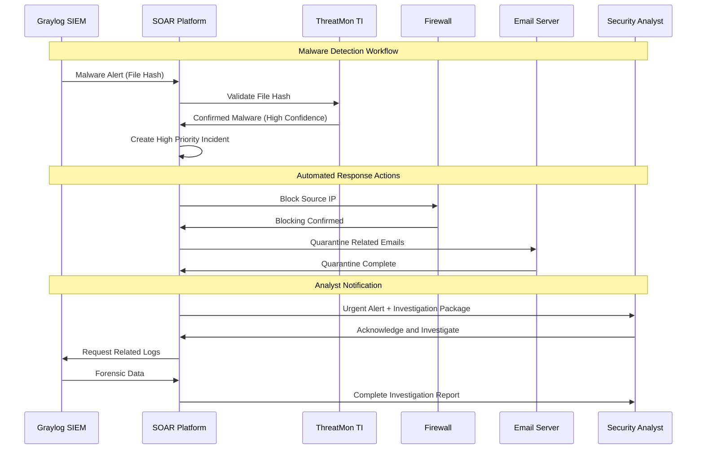

**Business Benefits:**
- **Faster Response**: Automated response reduces manual intervention time
- **Consistency**: Standardized response procedures across all incidents
- **Documentation**: Comprehensive incident documentation and audit trails
- **Intelligent Escalation**: Context-aware escalation based on threat severity

#### ThreatMon-Enhanced Threat Hunting

**Use Case: Proactive Threat Hunting**

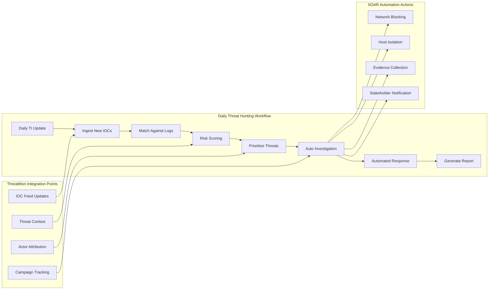

### 2. Security Operations Center (SOC) Enhancement

#### Unified Security Dashboard

**Dashboard Capabilities:**
- **Real-time Threat Landscape**: Combined SIEM and TI intelligence
- **Incident Management**: Centralized case tracking and workflow
- **Performance Metrics**: SOC efficiency and response time analytics
- **Threat Intelligence Visualization**: IOC trends and threat actor activity

#### Analytics and Reporting

**Executive Reporting Features:**
- **Monthly Security Posture Reports**: Combined metrics from all integrated tools
- **Threat Intelligence Briefings**: ThreatMon-sourced executive summaries
- **Incident Response Effectiveness**: SOAR automation impact analysis
- **Compliance Reporting**: Automated compliance documentation

### 3. Cost Reduction and Efficiency Gains

#### Enhanced Security Operations

The integrated SOAR platform provides significant operational improvements through automation and centralized management:

**Key Operational Benefits:**
- **Automated Threat Detection**: Continuous monitoring and analysis across all integrated tools
- **Streamlined Incident Response**: Coordinated response workflows with minimal manual intervention
- **Reduced False Positives**: Intelligent correlation reduces alert fatigue
- **Enhanced Analyst Productivity**: Automation handles routine tasks, allowing focus on complex investigations
- **Simplified Tool Management**: Single platform reduces complexity and training requirements

#### Return on Investment (ROI)

**Cost Savings Areas:**
- **Personnel Efficiency**: Significant reduction in manual investigation and response time
- **Tool Consolidation**: Single integrated platform reduces licensing and maintenance costs
- **Operational Efficiency**: Automated workflows reduce human error and accelerate response
- **Training Costs**: Unified platform reduces training complexity across multiple tools

**Business Value:**
- **Faster Threat Detection**: Proactive identification reduces potential business impact
- **Improved Security Posture**: Enhanced visibility and response capabilities
- **Regulatory Compliance**: Automated documentation and reporting streamlines compliance
- **Risk Mitigation**: Comprehensive threat intelligence reduces exposure to advanced threats

---

## Conclusion

The SOAR platform's integration with Graylog SIEM and ThreatMon TI represents a comprehensive approach to modern security operations. By combining automated event processing, intelligent threat analysis, and orchestrated response capabilities, organizations can achieve:

### Key Platform Strengths

1. **Unified Security Operations**: Single platform for SIEM, TI, and response automation
2. **Advanced Threat Intelligence**: Real-time IOC validation and threat context
3. **Automated Response**: Rapid, consistent response to security threats
4. **Scalable Architecture**: Enterprise-ready platform with horizontal scaling
5. **Comprehensive Integration**: Support for industry-leading security tools

### Strategic Business Value

- **Enhanced Security Posture**: Proactive threat detection and response
- **Operational Efficiency**: Automated workflows reduce manual effort
- **Cost Optimization**: Consolidated platform reduces tool sprawl
- **Compliance Readiness**: Automated documentation and reporting
- **Future-Proof Architecture**: Extensible platform for emerging threats

The combination of Graylog's comprehensive log management capabilities with ThreatMon's advanced threat intelligence, orchestrated through the SOAR platform, provides organizations with a powerful, integrated security operations solution that scales with business needs while maintaining the highest levels of security and performance.

---

*This document provides a comprehensive overview of the SOAR platform's integration capabilities. For detailed implementation guidance, API documentation, or specific configuration assistance, please refer to the technical implementation guides or contact the integration support team.*