# SOAR Platform Architecture and Integration

## Executive Summary

The SOAR (Security Orchestration, Automation and Response) platform integrates SIEM tools, Threat Intelligence feeds, and vulnerability scanners through specialized TIP and CSAM services. The platform provides centralized orchestration, automated workflows, and unified dashboards for comprehensive security operations.

## Table of Contents

1. [Platform Architecture](#platform-architecture)
2. [SIEM Integration](#siem-integration)
3. [Threat Intelligence Feeds](#threat-intelligence-feeds)
4. [Vulnerability Management](#vulnerability-management)
5. [Service Communication](#service-communication)

---

## Platform Architecture

### System Overview

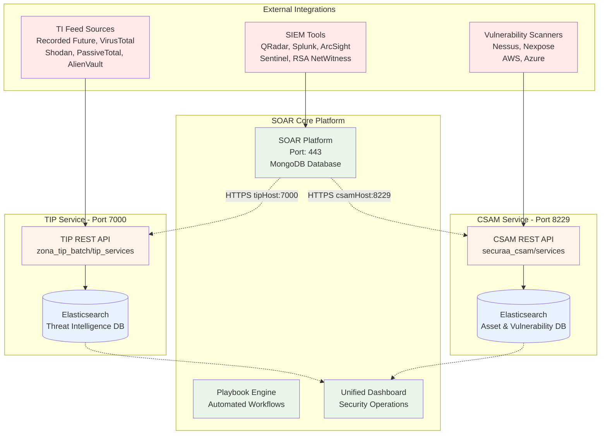
```mermaid
graph TB
    subgraph "SOAR Core Platform"
        SOAR[SOAR Platform<br/>Port: 443<br/>MongoDB Database]
        PLAYBOOKS[Playbook Engine<br/>Automated Workflows]
        DASHBOARD[Unified Dashboard<br/>Security Operations]
    end
    
    subgraph "TIP Service - Port 7000"
        TIP_API[TIP REST API<br/>zona_tip_batch/tip_services]
        TIP_ES[("Elasticsearch<br/>Threat Intelligence DB")]
    end
    
    subgraph "CSAM Service - Port 8229"
        CSAM_API[CSAM REST API<br/>securaa_csam/services]
        CSAM_ES[("Elasticsearch<br/>Asset & Vulnerability DB")]
    end
    
    subgraph "External Integrations"
        SIEM_TOOLS[SIEM Tools<br/>QRadar, Splunk, ArcSight<br/>Sentinel, RSA NetWitness]
        TI_FEEDS[TI Feed Sources<br/>Recorded Future, VirusTotal<br/>Shodan, PassiveTotal, AlienVault]
        VULN_SCANNERS[Vulnerability Scanners<br/>Nessus, Nexpose<br/>AWS, Azure]
    end
    
    %% Service Communication
    SOAR -.->|HTTPS tipHost:7000| TIP_API
    SOAR -.->|HTTPS csamHost:8229| CSAM_API
    
    %% Data Storage
    TIP_API --> TIP_ES
    CSAM_API --> CSAM_ES
    
    %% External Data Sources
    SIEM_TOOLS --> SOAR
    TI_FEEDS --> TIP_API
    VULN_SCANNERS --> CSAM_API
    
    %% Dashboard Integration
    TIP_ES -.-> DASHBOARD
    CSAM_ES -.-> DASHBOARD
    
    classDef soarCore fill:#e8f5e8
    classDef services fill:#fff2e8
    classDef databases fill:#e8f2ff
    classDef external fill:#ffe8e8
    
    class SOAR,PLAYBOOKS,DASHBOARD soarCore
    class TIP_API,CSAM_API services
    class TIP_ES,CSAM_ES databases
    class SIEM_TOOLS,TI_FEEDS,VULN_SCANNERS external
```

### Core Components

| Component | Port | Database | Purpose |
|-----------|------|----------|---------|
| **SOAR Platform** | 443 | MongoDB | Central orchestration, case management, playbook execution |
| **TIP Service** | 7000 | Elasticsearch | Threat intelligence processing and API |
| **CSAM Service** | 8229 | Elasticsearch | Asset management and vulnerability tracking |

---

## SIEM Integration

### Supported SIEM Platforms

The SOAR platform integrates with various SIEM tools for security event ingestion and incident management:

#### Enterprise SIEM Solutions
- **IBM QRadar**: Enterprise SIEM with threat detection
- **IBM QRadar on Cloud**: Cloud-based QRadar instances
- **Splunk**: Data platform for security monitoring
- **ArcSight ESM**: Enterprise security management
- **Microsoft Sentinel**: Cloud-native SIEM solution
- **RSA NetWitness**: Network detection and response
- **Chronicle Security**: Google Cloud SIEM
- **Elastic Security**: Elasticsearch-based security analytics

#### Integration Methods
- **REST API**: Direct API integration for event ingestion
- **Webhooks**: Real-time event notifications
- **Log Forwarding**: Syslog and structured log ingestion
- **Database Connections**: Direct database queries

### SIEM Data Flow

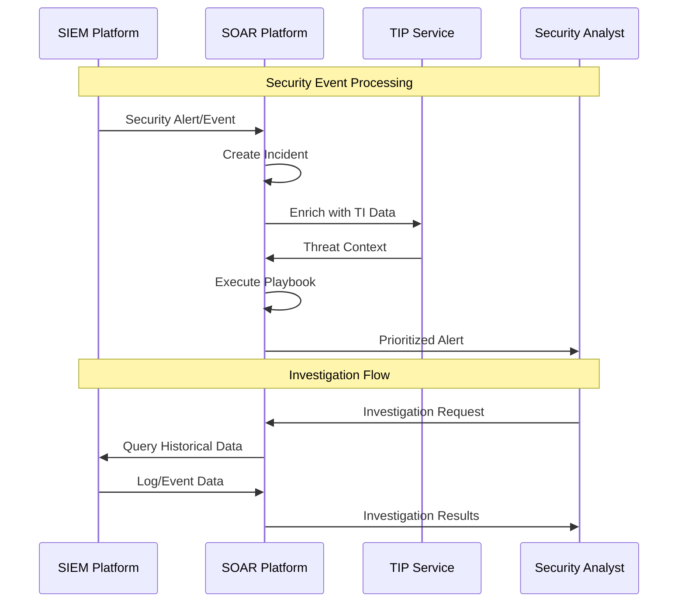
```mermaid
sequenceDiagram
    participant SIEM as SIEM Platform
    participant SOAR as SOAR Platform
    participant TIP as TIP Service
    participant ANALYST as Security Analyst
    
    Note over SIEM,ANALYST: Security Event Processing
    
    SIEM->>SOAR: Security Alert/Event
    SOAR->>SOAR: Create Incident
    SOAR->>TIP: Enrich with TI Data
    TIP->>SOAR: Threat Context
    SOAR->>SOAR: Execute Playbook
    SOAR->>ANALYST: Prioritized Alert
    
    Note over SIEM,ANALYST: Investigation Flow
    
    ANALYST->>SOAR: Investigation Request
    SOAR->>SIEM: Query Historical Data
    SIEM->>SOAR: Log/Event Data
    SOAR->>ANALYST: Investigation Results
```

### SIEM Configuration Examples

**QRadar Integration:**
```yaml
Connection_Type: "REST API"
Endpoint: "https://qradar.company.com/api/siem"
Authentication: "SEC Token"
Data_Format: "JSON"
Offenses: "Auto-import high severity offenses"
```

**Splunk Integration:**
```yaml
Connection_Type: "REST API"
Endpoint: "https://splunk.company.com:8089/services"
Authentication: "Bearer Token"
Data_Format: "JSON"
Search_Queries: "SPL-based threat hunting"
```

---

## Threat Intelligence Feeds

### TI Feed Processing Architecture

The TIP service processes multiple threat intelligence sources through dedicated batch processors:

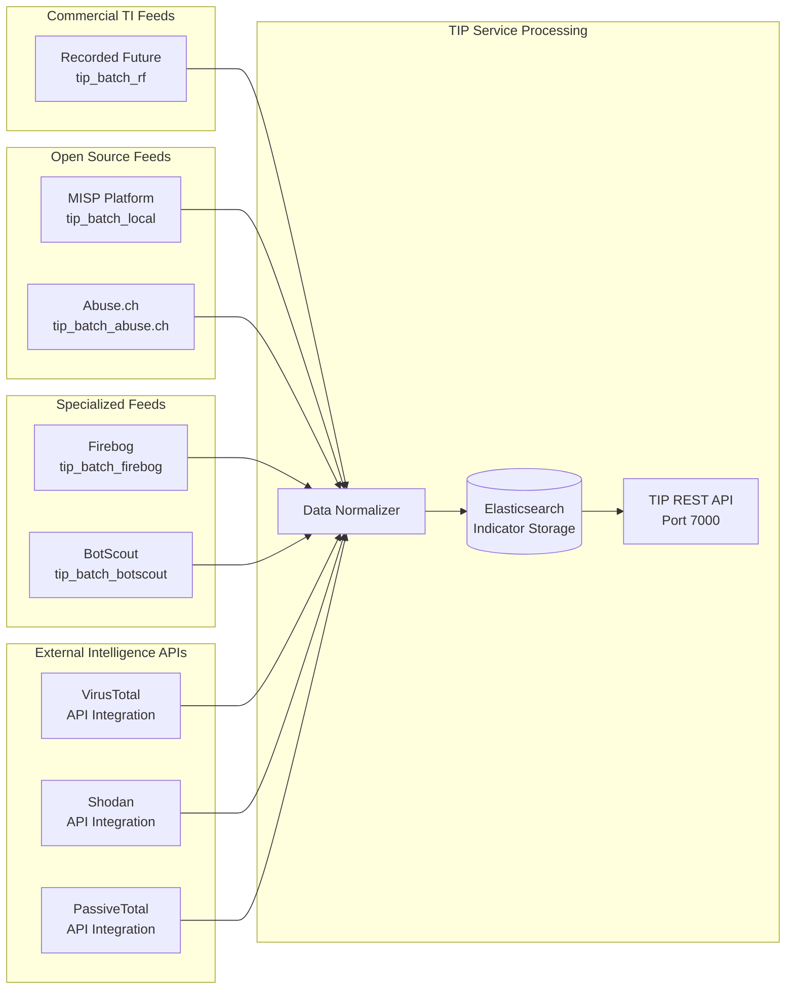
```mermaid
graph LR
    subgraph "Commercial TI Feeds"
        RF[Recorded Future<br/>tip_batch_rf]
    end
    
    subgraph "Open Source Feeds"
        MISP[MISP Platform<br/>tip_batch_local]
        ABUSE[Abuse.ch<br/>tip_batch_abuse.ch]
    end
    
    subgraph "Specialized Feeds"
        FIREBOG[Firebog<br/>tip_batch_firebog]
        BOTSCOUT[BotScout<br/>tip_batch_botscout]
    end
    
    subgraph "External Intelligence APIs"
        VIRUSTOTAL[VirusTotal<br/>API Integration]
        SHODAN[Shodan<br/>API Integration]
        PASSIVETOTAL[PassiveTotal<br/>API Integration]
    end
    
    subgraph "TIP Service Processing"
        NORMALIZER[Data Normalizer]
        STORAGE[("Elasticsearch<br/>Indicator Storage")]
        API[TIP REST API<br/>Port 7000]
    end
    
    RF --> NORMALIZER
    MISP --> NORMALIZER
    ABUSE --> NORMALIZER
    FIREBOG --> NORMALIZER
    BOTSCOUT --> NORMALIZER
    VIRUSTOTAL --> NORMALIZER
    SHODAN --> NORMALIZER
    PASSIVETOTAL --> NORMALIZER
    
    NORMALIZER --> STORAGE
    STORAGE --> API
```

### Supported Indicator Types

| Indicator Type | Description | Sources |
|----------------|-------------|---------|
| **IP Addresses** | Malicious IPs, C2 servers | Recorded Future, Abuse.ch, Blocklist.de, AbuseIPDB |
| **Domain Names** | Malicious domains, DGA domains | Recorded Future, MISP, Bambenek, Firebog |
| **URLs** | Malicious URLs, phishing sites | Recorded Future, MISP, URLScan.io, PhishTank |
| **File Hashes** | Malware hashes (MD5, SHA1, SHA256) | Recorded Future, MISP, Abuse.ch, VirusTotal, Hybrid Analysis |
| **Email Addresses** | Phishing/spam email addresses | Recorded Future, MISP, BotScout, HaveIBeenPwned |

### TI Feed Configuration

**Batch Processing Schedule:**
```yaml
Recorded_Future:
  interval: 60  # minutes
  enabled: true
  endpoint: "RF API"

MISP_Local:
  interval: 30  # minutes
  enabled: true
  format: "STIX"

Abuse_ch:
  interval: 120 # minutes
  enabled: true
  feeds: ["malware", "botnet", "c2"]
```

### TI Service API Endpoints

| Endpoint | Method | Purpose |
|----------|---------|---------|
| `/search/{userid}/{indicator}/{tiptype}/` | GET | Search indicators |
| `/datalist/` | POST | Retrieve indicator tables |
| `/importindicators/` | POST | Import custom indicators |
| `/addassociates/` | POST | Manage associations |
| `/exportindicator/` | POST | Export indicator data |

---

## Vulnerability Management

### CSAM Service Architecture

The CSAM service integrates with various vulnerability scanners and cloud platforms for comprehensive asset management:

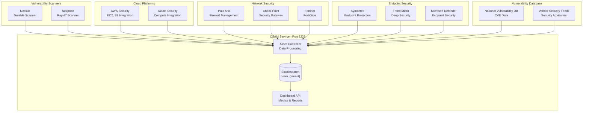
```mermaid
graph TB
    subgraph "Vulnerability Scanners"
        NESSUS[Nessus<br/>Tenable Scanner]
        NEXPOSE[Nexpose<br/>Rapid7 Scanner]
    end
    
    subgraph "Cloud Platforms"
        AWS[AWS Security<br/>EC2, S3 Integration]
        AZURE[Azure Security<br/>Compute Integration]
    end
    
    subgraph "Network Security"
        PALOALTO[Palo Alto<br/>Firewall Management]
        CHECKPOINT[Check Point<br/>Security Gateway]
        FORTINET[Fortinet<br/>FortiGate]
    end
    
    subgraph "Endpoint Security"
        SYMANTEC[Symantec<br/>Endpoint Protection]
        TRENDMICRO[Trend Micro<br/>Deep Security]
        DEFENDER[Microsoft Defender<br/>Endpoint Security]
    end
    
    subgraph "CSAM Service - Port 8229"
        ASSET_CTRL[Asset Controller<br/>Data Processing]
        CSAM_DB[("Elasticsearch<br/>csam_{tenant}")]
        DASHBOARD_API[Dashboard API<br/>Metrics & Reports]
    end
    
    subgraph "Vulnerability Database"
        NVD[National Vulnerability DB<br/>CVE Data]
        VENDOR_FEEDS[Vendor Security Feeds<br/>Security Advisories]
    end
    
    NESSUS --> ASSET_CTRL
    NEXPOSE --> ASSET_CTRL
    
    AWS --> ASSET_CTRL
    AZURE --> ASSET_CTRL
    
    PALOALTO --> ASSET_CTRL
    CHECKPOINT --> ASSET_CTRL
    FORTINET --> ASSET_CTRL
    
    SYMANTEC --> ASSET_CTRL
    TRENDMICRO --> ASSET_CTRL
    DEFENDER --> ASSET_CTRL
    
    NVD --> ASSET_CTRL
    VENDOR_FEEDS --> ASSET_CTRL
    
    ASSET_CTRL --> CSAM_DB
    CSAM_DB --> DASHBOARD_API
```

### Asset Management Features

**Cloud Asset Discovery:**
- **AWS**: EC2 instances, S3 buckets
- **Azure**: Virtual machines, compute resources

**Vulnerability Assessment:**
- **Nessus**: Comprehensive vulnerability scanning
- **Nexpose**: Rapid7 vulnerability management
- **CVE Database**: National Vulnerability Database integration
- **Asset Criticality**: Business impact assessment
- **Patch Management**: Vulnerability remediation tracking
- **Compliance Mapping**: Regulatory compliance status

### CSAM Service API Endpoints

| Endpoint | Method | Purpose |
|----------|---------|---------|
| `/assets` | GET | Retrieve asset information |
| `/vulnerability-details/{cve-id}` | GET | CVE vulnerability details |
| `/tasks/asset-info` | POST | Asset information tasks |
| `/assets/export` | POST | Export asset data |
| `/dashboarddata` | GET | Dashboard metrics |

---

## Comprehensive Integration Matrix

### SIEM & Security Analytics (8 Platforms)
| Platform | Category | Capabilities |
|----------|----------|--------------|
| **IBM QRadar** | Enterprise SIEM | Event correlation, offense management, search queries |
| **IBM QRadar on Cloud** | Cloud SIEM | Cloud-based threat detection and response |
| **Splunk Enterprise** | Data Analytics | Log analysis, dashboards, alert management |
| **ArcSight ESM** | Enterprise SIEM | Real-time correlation, case management |
| **Microsoft Sentinel** | Cloud SIEM | Azure-native security operations |
| **RSA NetWitness** | NDR Platform | Network detection and response |
| **Chronicle Security** | Cloud SIEM | Google Cloud security analytics |
| **Elastic Security** | Open Source | Elasticsearch-based security monitoring |

### Threat Intelligence Sources (19 Sources)
| Source | Type | Feed Content |
|--------|------|--------------|
| **Recorded Future** | Commercial | Comprehensive threat intelligence |
| **VirusTotal** | Freemium | File/URL reputation analysis |
| **Shodan** | Freemium | Internet-connected device intelligence |
| **PassiveTotal** | Commercial | DNS/WHOIS historical data |
| **AlienVault OTX** | Open Source | Community threat intelligence |
| **IBM X-Force** | Commercial | Enterprise threat intelligence |
| **ThreatMiner** | Open Source | Threat data mining |
| **AbuseIPDB** | Community | IP address reputation |
| **URLScan.io** | Freemium | URL analysis and screenshots |
| **Hybrid Analysis** | Freemium | Malware analysis sandbox |
| **PhishTank** | Open Source | Phishing URL database |
| **HaveIBeenPwned** | Freemium | Breach notification service |
| **MISP Platform** | Open Source | Structured threat sharing |
| **Abuse.ch** | Open Source | Malware and botnet feeds |
| **Bambenek** | Open Source | Domain and IP intelligence |
| **Blocklist.de** | Open Source | Attack source tracking |
| **Team Cymru Bogons** | Open Source | Invalid IP space tracking |
| **Firebog** | Open Source | DNS blocking lists |
| **BotScout** | Open Source | Bot and spam detection |

### Vulnerability Management (8 Tools)
| Tool | Category | Capabilities |
|------|----------|--------------|
| **Nessus** | Vulnerability Scanner | Comprehensive vulnerability assessment |
| **Nexpose** | Vulnerability Scanner | Rapid7 vulnerability management |
| **CVE Database** | Vulnerability DB | National Vulnerability Database |
| **AWS EC2** | Cloud Security | EC2 instance vulnerability scanning |
| **AWS S3** | Cloud Security | S3 bucket security assessment |
| **Azure Compute** | Cloud Security | Azure VM vulnerability management |
| **Azure Security Center** | Cloud Security | Azure security posture management |
| **Neutrino API** | IP Intelligence | IP geolocation and threat data |

### Network Security (3 Platforms)
| Platform | Category | Capabilities |
|----------|----------|--------------|
| **Palo Alto Networks** | Next-Gen Firewall | Traffic analysis, policy management |
| **Check Point** | Security Gateway | Firewall management, threat prevention |
| **Fortinet FortiGate** | UTM Platform | Unified threat management |

### Endpoint Security (3 Solutions)
| Solution | Category | Capabilities |
|----------|----------|--------------|
| **Symantec Endpoint** | Endpoint Protection | Antivirus, threat detection |
| **Trend Micro Deep Security** | Endpoint Security | Server and workstation protection |
| **Microsoft Defender** | Endpoint Detection | Windows endpoint security |

### Identity & Access Management (4 Systems)
| System | Category | Capabilities |
|--------|----------|--------------|
| **Active Directory** | Identity Provider | User authentication, directory services |
| **Microsoft Outlook** | Email Security | Email threat detection |
| **Azure Active Directory** | Cloud Identity | Cloud-based identity management |
| **Security Token Service** | Authentication | Token-based authentication |

### Communication & Collaboration (1 Platform)
| Platform | Category | Capabilities |
|----------|----------|--------------|
| **Slack** | Team Communication | Alert notifications, incident collaboration |

### ITSM Integration (1 Platform)
| Platform | Category | Capabilities |
|----------|----------|--------------|
| **ServiceNow** | ITSM Platform | Ticket creation, workflow automation |

### Specialized Security Tools (12 Tools)
| Tool | Category | Purpose |
|------|----------|---------|
| **IPInfo** | IP Intelligence | IP geolocation and ASN data |
| **Cymon** | Threat Intelligence | IP and domain reputation |
| **DNSDB** | DNS Intelligence | Historical DNS data |
| **MXToolbox** | Email Security | Email server analysis |
| **StackPath IP Info** | IP Intelligence | Enhanced IP data |
| **URLVoid** | URL Analysis | URL reputation checking |
| **IPVoid** | IP Analysis | IP reputation analysis |
| **MalShare** | Malware Samples | Malware sample sharing |
| **Safe Browsing** | Web Security | Google Safe Browsing API |
| **Phishing Initiative** | Anti-Phishing | Phishing URL detection |
| **WhatIsMyBrowser** | Browser Analysis | Browser fingerprinting |
| **Alexa Traffic** | Web Analytics | Website traffic analysis |

### Vulnerability Data Structure

```yaml
Asset_Schema:
  asset_id: "unique identifier"
  ip_address: "asset IP"
  hostname: "asset hostname"
  os_type: "operating system"
  business_hierarchy: "organizational unit"
  vulnerabilities:
    - cve_id: "CVE-2023-XXXX"
      cvss_score: 9.8
      severity: "Critical"
      patch_available: true
      scanner_source: "Nessus"
```

---

## Service Communication

### Integration Architecture

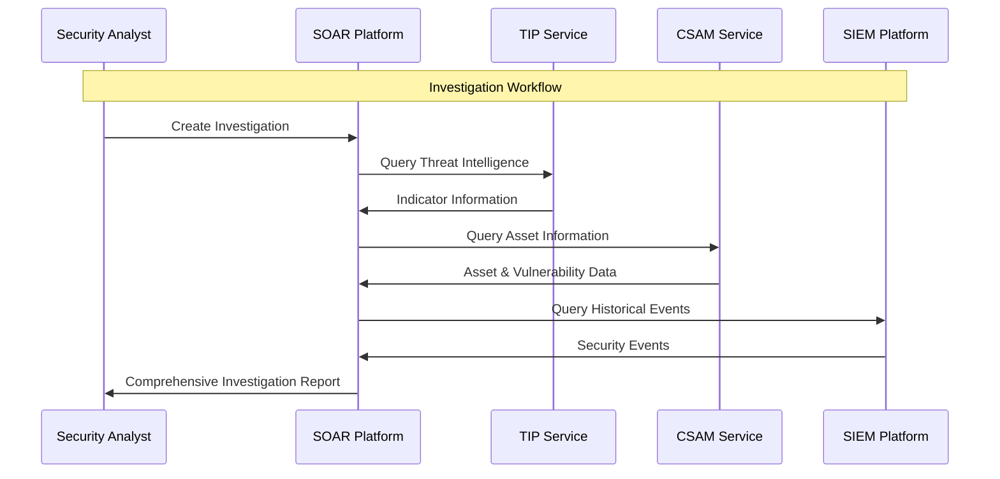
```mermaid
sequenceDiagram
    participant USER as Security Analyst
    participant SOAR as SOAR Platform
    participant TIP as TIP Service
    participant CSAM as CSAM Service
    participant SIEM as SIEM Platform
    
    Note over USER,SIEM: Investigation Workflow
    
    USER->>SOAR: Create Investigation
    SOAR->>TIP: Query Threat Intelligence
    TIP->>SOAR: Indicator Information
    SOAR->>CSAM: Query Asset Information
    CSAM->>SOAR: Asset & Vulnerability Data
    SOAR->>SIEM: Query Historical Events
    SIEM->>SOAR: Security Events
    SOAR->>USER: Comprehensive Investigation Report
```

### Configuration Parameters

**Service Endpoints:**
```yaml
TIP_Service:
  host: "${tipHost}"
  port: 7000
  protocol: "HTTPS"
  elasticsearch: "${ESHostURL}"

CSAM_Service:
  host: "${csamHost}"
  port: 8229
  protocol: "HTTPS"
  elasticsearch: "https://${csamHost}:9200"

SOAR_Platform:
  port: 443
  database: "MongoDB"
  protocol: "HTTPS"
```

**Authentication:**
- **Service-to-Service**: HTTPS with TLS certificates
- **Elasticsearch**: Basic authentication (username/password)
- **External APIs**: Token-based authentication

### Data Flow Patterns

1. **Real-time Integration**: Webhook-based event notifications
2. **Scheduled Polling**: Periodic data synchronization
3. **On-demand Queries**: User-initiated data retrieval
4. **Batch Processing**: Bulk data import and processing

---

## Conclusion

The SOAR platform provides comprehensive security orchestration through:

- **SIEM Integration**: Multi-platform security event management
- **Threat Intelligence**: Automated TI feed processing and correlation
- **Vulnerability Management**: Cloud-native asset and vulnerability tracking
- **Unified Operations**: Centralized dashboard and workflow automation

This architecture enables organizations to achieve integrated security operations with automated threat detection, investigation, and response capabilities.

*Document reflects actual implementation based on zona_tip_batch and securaa_csam codebase analysis.*

## TIP and CSAM Service Integration

### Integration Architecture

The SOAR platform integrates with TIP and CSAM services via HTTPS REST API calls. The integration configuration is managed through host configuration parameters.

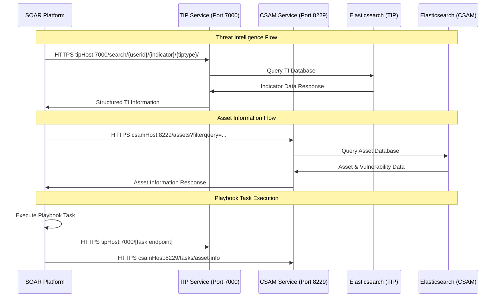
```mermaid
sequenceDiagram
    participant SOAR as SOAR Platform
    participant TIP as TIP Service (Port 7000)
    participant CSAM as CSAM Service (Port 8229)
    participant ELASTIC_TIP as Elasticsearch (TIP)
    participant ELASTIC_CSAM as Elasticsearch (CSAM)
    
    Note over SOAR,ELASTIC_CSAM: Threat Intelligence Flow
    
    SOAR->>TIP: HTTPS tipHost:7000/search/{userid}/{indicator}/{tiptype}/
    TIP->>ELASTIC_TIP: Query TI Database
    ELASTIC_TIP->>TIP: Indicator Data Response
    TIP->>SOAR: Structured TI Information
    
    Note over SOAR,ELASTIC_CSAM: Asset Information Flow
    
    SOAR->>CSAM: HTTPS csamHost:8229/assets?filterquery=...
    CSAM->>ELASTIC_CSAM: Query Asset Database
    ELASTIC_CSAM->>CSAM: Asset & Vulnerability Data
    CSAM->>SOAR: Asset Information Response
    
    Note over SOAR,ELASTIC_CSAM: Playbook Task Execution
    
    SOAR->>SOAR: Execute Playbook Task
    SOAR->>TIP: HTTPS tipHost:7000/[task endpoint]
    SOAR->>CSAM: HTTPS csamHost:8229/tasks/asset-info
```

### Configuration Parameters

**TIP Service Configuration:**
- **Host**: Configured via `tipHost` parameter
- **Port**: 7000 (hardcoded in main.go)
- **Protocol**: HTTPS with TLS certificates
- **Elasticsearch**: Configurable ESHostURL (host:port)

**CSAM Service Configuration:**
- **Host**: Configured via `csamHost` parameter  
- **Port**: 8229 (hardcoded in main.go)
- **Protocol**: HTTPS with TLS certificates
- **Elasticsearch**: https://csamHost:9200 (port 9200)

### Service Integration Points

**TIP Service Endpoints (Port 7000):**
- `/search/{userid}/{indicator}/{tiptype}/` - Indicator search
- `/datalist/` - Table data retrieval
- `/settags/{indicator}/{tiptype}/` - Tag management
- `/gethistory/{userid}` - Search history
- `/importindicators/` - Indicator import
- `/addassociates/` - Association management
- `/exportindicator/` - Data export

**CSAM Service Endpoints (Port 8229):**
- `/assets` - Asset data retrieval
- `/assets/{asset-id}/attribute/{attribute-type}` - Asset attributes
- `/tasks/asset-info` - Asset information tasks
- `/assets/export` - Asset data export
- `/vulnerability-details/{cve-id}` - Vulnerability information
- `/dashboarddata` - Dashboard metrics

---

## Threat Intelligence Processing

### TIP Service Architecture

The TIP service (`zona_tip_batch/tip_services`) processes threat intelligence from multiple sources and stores data in Elasticsearch.

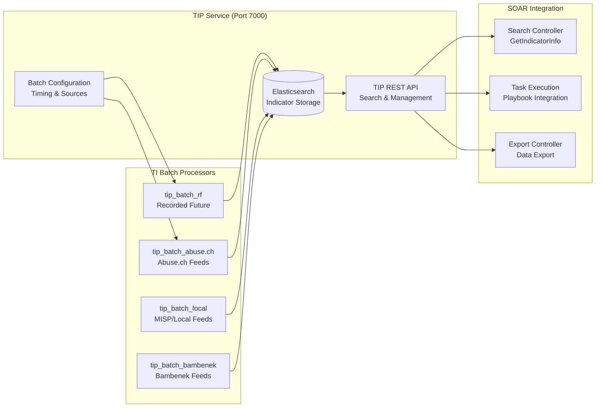
```mermaid
graph LR
    subgraph "TI Batch Processors"
        RF_BATCH[tip_batch_rf<br/>Recorded Future]
        ABUSE_BATCH[tip_batch_abuse.ch<br/>Abuse.ch Feeds]
        MISP_BATCH[tip_batch_local<br/>MISP/Local Feeds]
        BAMBENEK_BATCH[tip_batch_bambenek<br/>Bambenek Feeds]
    end
    
    subgraph "TIP Service (Port 7000)"
        TIP_API[TIP REST API<br/>Search & Management]
        TIP_STORAGE[("Elasticsearch<br/>Indicator Storage")]
        BATCH_CONFIG[Batch Configuration<br/>Timing & Sources]
    end
    
    subgraph "SOAR Integration"
        SEARCH_API[Search Controller<br/>GetIndicatorInfo]
        TASK_EXEC[Task Execution<br/>Playbook Integration]
        EXPORT_API[Export Controller<br/>Data Export]
    end
    
    RF_BATCH --> TIP_STORAGE
    ABUSE_BATCH --> TIP_STORAGE
    MISP_BATCH --> TIP_STORAGE
    BAMBENEK_BATCH --> TIP_STORAGE
    
    TIP_STORAGE --> TIP_API
    TIP_API --> SEARCH_API
    TIP_API --> TASK_EXEC
    TIP_API --> EXPORT_API
    
    BATCH_CONFIG --> RF_BATCH
    BATCH_CONFIG --> ABUSE_BATCH
```

### Elasticsearch Schema

**TIP Elasticsearch Configuration:**
- **Connection**: HTTP/HTTPS configurable via ESHostURL
- **Authentication**: Basic auth with ESUsername/ESPassword
- **Index**: Configurable index name (ESIndex constant)
- **Data Structure**: Indicator data with sources, timestamps, associations

**Key Data Fields:**
- `indicator`: The actual indicator value
- `source`: Source of the intelligence (rf, misp, etc.)
- `indicator_type`: Type (ip, domain, url, hash, email)
- `updatedts`: Last update timestamp
- `firstseen`: First seen timestamp
- `othersources`: Array of additional sources for same indicator

---

## Asset and Vulnerability Management

### CSAM Service Architecture

The CSAM service (`securaa_csam/services`) manages cloud assets and vulnerability data with Elasticsearch storage.

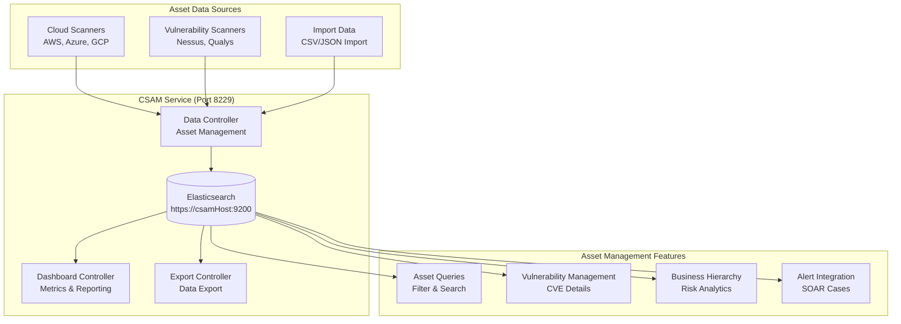
```mermaid
graph TB
    subgraph "Asset Data Sources"
        CLOUD_SCANNERS[Cloud Scanners<br/>AWS, Azure, GCP]
        VULN_SCANNERS[Vulnerability Scanners<br/>Nessus, Qualys]
        IMPORT_DATA[Import Data<br/>CSV/JSON Import]
    end
    
    subgraph "CSAM Service (Port 8229)"
        DATA_CONTROLLER[Data Controller<br/>Asset Management]
        CSAM_ELASTIC[("Elasticsearch<br/>https://csamHost:9200")]
        DASHBOARD_CTRL[Dashboard Controller<br/>Metrics & Reporting]
        EXPORT_CTRL[Export Controller<br/>Data Export]
    end
    
    subgraph "Asset Management Features"
        ASSET_QUERY[Asset Queries<br/>Filter & Search]
        VULN_MGMT[Vulnerability Management<br/>CVE Details]
        BH_ANALYTICS[Business Hierarchy<br/>Risk Analytics]
        ALERT_INTEGRATION[Alert Integration<br/>SOAR Cases]
    end
    
    CLOUD_SCANNERS --> DATA_CONTROLLER
    VULN_SCANNERS --> DATA_CONTROLLER
    IMPORT_DATA --> DATA_CONTROLLER
    
    DATA_CONTROLLER --> CSAM_ELASTIC
    CSAM_ELASTIC --> DASHBOARD_CTRL
    CSAM_ELASTIC --> EXPORT_CTRL
    
    CSAM_ELASTIC --> ASSET_QUERY
    CSAM_ELASTIC --> VULN_MGMT
    CSAM_ELASTIC --> BH_ANALYTICS
    CSAM_ELASTIC --> ALERT_INTEGRATION
```

### CSAM Elasticsearch Configuration

**Database Setup:**
- **Connection**: https://csamHost:9200
- **Authentication**: Basic auth (ESUsername/ESPassword)
- **Index Pattern**: `csam_{tenantcode}` for tenant isolation
- **Configuration Index**: `csam_config_{tenantcode}`

**Asset Data Structure:**
- **Asset Information**: IP, hostname, OS, business hierarchy
- **Vulnerability Data**: CVE details, CVSS scores, scan results
- **History Tracking**: Change history in `csam_{tenantcode}_history`
- **Compliance Data**: Security compliance and risk ratings

---

## Integration Patterns

### SOAR-TIP Integration

**Search Integration:**
```yaml
Endpoint: "https://{tipHost}:7000/search/{userid}/{indicator}/{tiptype}/"
Method: GET
Purpose: Real-time indicator lookups from SOAR platform
Response: Structured indicator data with sources and metadata
```

**Playbook Task Integration:**
```yaml
URL_Construction: "https://" + configobj["tipHost"] + ":7000" + task.RestURL
Validation: URL must contain ":7000/" for TIP service identification
Task_Types: Search, import, export, association management
```

### SOAR-CSAM Integration

**Asset Query Integration:**
```yaml
Endpoint: "https://{csamHost}:8229/assets"
Method: GET
Parameters: filterquery for asset filtering
Purpose: Asset discovery and vulnerability assessment
Response: Asset data with vulnerability information
```

**Task Execution Integration:**
```yaml
URL_Construction: "https://" + configobj["csamHost"] + ":8229" + task.RestURL
Task_Endpoint: "/tasks/asset-info"
Purpose: Asset information retrieval for playbook tasks
Response: Structured asset and vulnerability data
```

### Service Communication Patterns

**Authentication:**
- HTTPS with TLS certificates
- Basic authentication for Elasticsearch
- API key management for external integrations

**Data Flow:**
- Pull-based integration (SOAR queries services)
- RESTful API communication
- JSON data format
- Error handling and retry mechanisms

**Configuration Management:**
- Host configuration via config files
- Port configuration hardcoded in main.go files
- Elasticsearch connection strings configurable
- Service discovery via host:port patterns

---

## Conclusion

The SOAR platform provides a centralized orchestration layer that integrates with specialized TIP and CSAM services. The architecture supports:

### Key Benefits

- **Service Separation**: TIP and CSAM services run independently with dedicated databases
- **Scalable Architecture**: Services can be deployed on same or different machines
- **RESTful Integration**: HTTPS API-based communication between services
- **Data Isolation**: Elasticsearch databases provide service-specific data storage
- **Flexible Configuration**: Configurable host settings for different deployment scenarios

*This document reflects the actual implementation based on codebase analysis of zona_tip_batch and securaa_csam services.*

### Supported SIEM and Security Platforms

The SOAR platform provides native connectors and integration capabilities for a wide range of SIEM and security tools:

#### SIEM Platforms
- **Graylog**: Open-source log management with powerful search capabilities
- **Splunk**: Industry-leading data platform for search, monitoring, and analysis
- **IBM QRadar**: AI-powered SIEM with advanced threat detection
- **Microsoft Sentinel**: Cloud-native SIEM and SOAR solution
- **ArcSight ESM**: Enterprise security management with real-time correlation
- **LogRhythm**: Unified security analytics and incident response
- **AlienVault OSSIM**: Open-source security information management
- **Elastic Security**: Built on Elastic Stack for security analytics
- **RSA NetWitness**: Network and endpoint analysis platform
- **McAfee ESM**: Enterprise security manager with threat intelligence

#### Threat Intelligence Platforms
- **ThreatMon**: Real-time threat intelligence and IOC feeds
- **ThreatConnect**: Threat intelligence platform with automation
- **Anomali**: Threat intelligence management and analytics
- **MISP**: Open-source threat intelligence sharing platform
- **OpenCTI**: Open cyber threat intelligence platform
- **VirusTotal**: File and URL analysis with malware detection
- **ThreatQuotient**: Threat intelligence platform with data lake
- **Recorded Future**: Real-time threat intelligence and analytics
- **Intel 471**: Underground threat intelligence and monitoring
- **Digital Shadows**: Digital risk protection with threat intelligence

#### Endpoint Detection and Response (EDR/XDR)
- **CrowdStrike Falcon**: Cloud-native endpoint protection platform
- **SentinelOne**: AI-powered endpoint security and response
- **Carbon Black**: Advanced endpoint detection and response
- **Palo Alto Cortex XDR**: Extended detection and response platform
- **Microsoft Defender**: Integrated endpoint and cloud security
- **Trend Micro**: Endpoint security with machine learning
- **Symantec Endpoint Protection**: Enterprise endpoint security
- **FireEye HX**: Endpoint security and forensic analysis

#### Vulnerability Management Platforms
- **Tenable Nessus**: Comprehensive vulnerability assessment
- **Qualys VMDR**: Cloud-based vulnerability management
- **Rapid7 InsightVM**: Real-time vulnerability management
- **OpenVAS**: Open-source vulnerability scanner
- **Greenbone**: Enterprise vulnerability management

#### Network Security Tools
- **Palo Alto Firewalls**: Next-generation firewall with threat prevention
- **Cisco ASA/Firepower**: Network security and threat detection
- **Fortinet FortiGate**: Unified threat management platform
- **Check Point**: Advanced threat prevention and security management
- **Juniper SRX**: High-performance network security platform

### Universal Integration Model

The SOAR platform employs a universal integration model that supports multiple communication protocols and data formats, enabling seamless connectivity with diverse security tools.

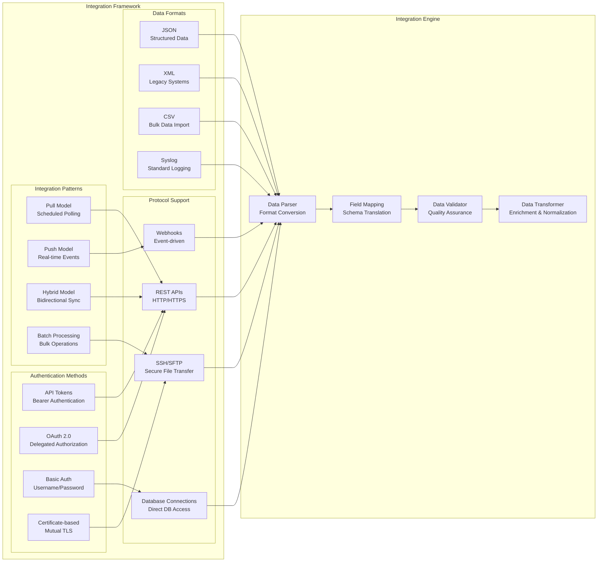
```mermaid
graph LR
    subgraph "Integration Framework"
        subgraph "Protocol Support"
            REST[REST APIs<br/>HTTP/HTTPS]
            WEBHOOK[Webhooks<br/>Event-driven]
            SSH[SSH/SFTP<br/>Secure File Transfer]
            DATABASE[Database Connections<br/>Direct DB Access]
        end
        
        subgraph "Data Formats"
            JSON[JSON<br/>Structured Data]
            XML[XML<br/>Legacy Systems]
            CSV[CSV<br/>Bulk Data Import]
            SYSLOG[Syslog<br/>Standard Logging]
        end
        
        subgraph "Authentication Methods"
            TOKEN[API Tokens<br/>Bearer Authentication]
            OAUTH[OAuth 2.0<br/>Delegated Authorization]
            BASIC[Basic Auth<br/>Username/Password]
            CERT[Certificate-based<br/>Mutual TLS]
        end
        
        subgraph "Integration Patterns"
            PULL[Pull Model<br/>Scheduled Polling]
            PUSH[Push Model<br/>Real-time Events]
            HYBRID[Hybrid Model<br/>Bidirectional Sync]
            BATCH[Batch Processing<br/>Bulk Operations]
        end
    end
    
    subgraph "Integration Engine"
        PARSER[Data Parser<br/>Format Conversion]
        MAPPER[Field Mapping<br/>Schema Translation]
        VALIDATOR[Data Validator<br/>Quality Assurance]
        TRANSFORMER[Data Transformer<br/>Enrichment & Normalization]
    end
    
    %% Protocol to Engine
    REST --> PARSER
    WEBHOOK --> PARSER
    SSH --> PARSER
    DATABASE --> PARSER
    
    %% Engine Flow
    PARSER --> MAPPER
    MAPPER --> VALIDATOR
    VALIDATOR --> TRANSFORMER
    
    %% Data Format Support
    JSON --> PARSER
    XML --> PARSER
    CSV --> PARSER
    SYSLOG --> PARSER
    
    %% Authentication Integration
    TOKEN --> REST
    OAUTH --> REST
    BASIC --> DATABASE
    CERT --> SSH
    
    %% Pattern Support
    PULL --> REST
    PUSH --> WEBHOOK
    HYBRID --> REST
    BATCH --> SSH
```

### Integration Lifecycle Management

**1. Discovery Phase**
- Automatic detection of available endpoints
- Capability assessment and feature mapping
- Security requirement analysis
- Performance baseline establishment

**2. Configuration Phase**
- Connection parameter setup
- Authentication credential management
- Data mapping and field correlation
- Polling interval and threshold configuration

**3. Testing and Validation**
- Connectivity testing with health checks
- Data flow validation and integrity testing
- Performance benchmarking
- Error handling and retry mechanism testing

**4. Deployment and Monitoring**
- Production deployment with monitoring
- Real-time performance metrics
- Alert configuration for integration failures
- Automated failover and recovery procedures

---

## Graylog SIEM Integration

### Overview

Graylog integration enables comprehensive log management, security event correlation, and incident response automation. The platform connects with Graylog's REST API to ingest security events, perform searches, and automate response actions.

### Integration Architecture

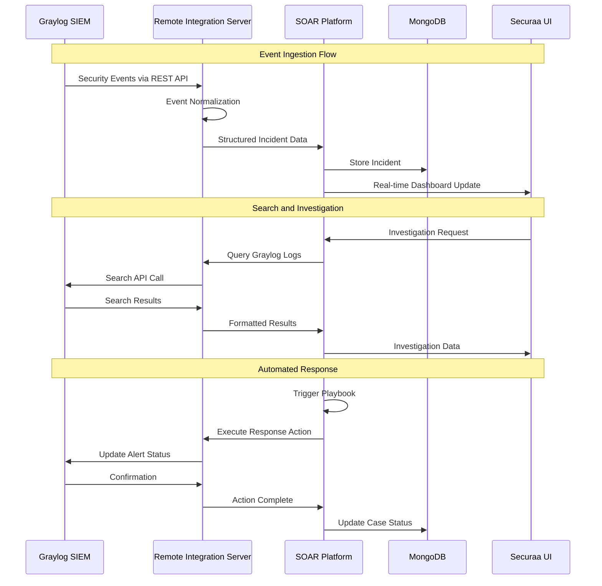
```mermaid
sequenceDiagram
    participant GL as Graylog SIEM
    participant RIS as Remote Integration Server
    participant SOAR as SOAR Platform
    participant DB as MongoDB
    participant UI as Securaa UI
    
    Note over GL,UI: Event Ingestion Flow
    
    GL->>RIS: Security Events via REST API
    RIS->>RIS: Event Normalization
    RIS->>SOAR: Structured Incident Data
    SOAR->>DB: Store Incident
    SOAR->>UI: Real-time Dashboard Update
    
    Note over GL,UI: Search and Investigation
    
    UI->>SOAR: Investigation Request
    SOAR->>RIS: Query Graylog Logs
    RIS->>GL: Search API Call
    GL->>RIS: Search Results
    RIS->>SOAR: Formatted Results
    SOAR->>UI: Investigation Data
    
    Note over GL,UI: Automated Response
    
    SOAR->>SOAR: Trigger Playbook
    SOAR->>RIS: Execute Response Action
    RIS->>GL: Update Alert Status
    GL->>RIS: Confirmation
    RIS->>SOAR: Action Complete
    SOAR->>DB: Update Case Status
```

### Technical Integration Details

#### Configuration Parameters

| Parameter | Type | Description | Example |
|-----------|------|-------------|---------|
| **Base URL** | String | Graylog server endpoint | `https://graylog.company.com:9000` |
| **Access Token** | String | API authentication token | `2bnv8hu34l89sd6fghjk...` |
| **Instance Name** | String | Unique identifier for integration | `GraylogProduction` |
| **Query Field** | String | Custom search queries | `source:firewall AND level:error` |
| **Incidents Fetch Limit** | Integer | Maximum events per poll | `50` |
| **Ingest Offense** | Boolean | Auto-create cases from events | `true` |

#### Supported Capabilities

**1. Event Ingestion**
- Real-time security event collection
- Automated incident creation from Graylog alerts
- Custom query-based event filtering
- Multi-stream support for different log sources

**2. Log Search and Analysis**
- Advanced search capabilities using Graylog's query language
- Historical log analysis for forensic investigations
- Pattern recognition and anomaly detection
- Cross-correlation with other security tools

**3. Alert Management**
- Bi-directional alert synchronization
- Alert status updates and acknowledgments
- Custom alert routing based on severity and type
- Escalation workflows for unresolved alerts

**4. Dashboards and Reporting**
- Integration with SOAR dashboard widgets
- Custom report generation using Graylog data
- Real-time metrics and KPI tracking
- Executive summary reports with visual analytics

### Data Flow and Processing

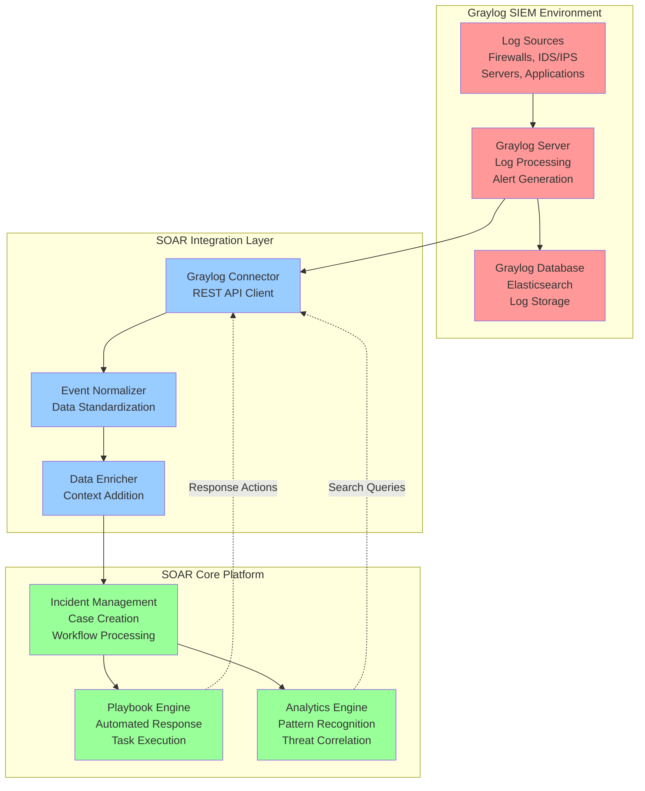
```mermaid
graph TD
    subgraph "Graylog SIEM Environment"
        LOG_SOURCES[Log Sources<br/>Firewalls, IDS/IPS<br/>Servers, Applications]
        GRAYLOG_SERVER[Graylog Server<br/>Log Processing<br/>Alert Generation]
        GRAYLOG_DB[Graylog Database<br/>Elasticsearch<br/>Log Storage]
    end
    
    subgraph "SOAR Integration Layer"
        CONNECTOR[Graylog Connector<br/>REST API Client]
        NORMALIZER[Event Normalizer<br/>Data Standardization]
        ENRICHER[Data Enricher<br/>Context Addition]
    end
    
    subgraph "SOAR Core Platform"
        INCIDENT_MGT[Incident Management<br/>Case Creation<br/>Workflow Processing]
        PLAYBOOK_ENGINE[Playbook Engine<br/>Automated Response<br/>Task Execution]
        ANALYTICS[Analytics Engine<br/>Pattern Recognition<br/>Threat Correlation]
    end
    
    %% Data Flow
    LOG_SOURCES --> GRAYLOG_SERVER
    GRAYLOG_SERVER --> GRAYLOG_DB
    GRAYLOG_SERVER --> CONNECTOR
    
    CONNECTOR --> NORMALIZER
    NORMALIZER --> ENRICHER
    ENRICHER --> INCIDENT_MGT
    
    INCIDENT_MGT --> PLAYBOOK_ENGINE
    INCIDENT_MGT --> ANALYTICS
    
    %% Bidirectional Communication
    PLAYBOOK_ENGINE -.->|Response Actions| CONNECTOR
    ANALYTICS -.->|Search Queries| CONNECTOR
    
    %% Styling
    classDef graylogComponent fill:#ff9999
    classDef integrationComponent fill:#99ccff
    classDef soarComponent fill:#99ff99
    
    class LOG_SOURCES,GRAYLOG_SERVER,GRAYLOG_DB graylogComponent
    class CONNECTOR,NORMALIZER,ENRICHER integrationComponent
    class INCIDENT_MGT,PLAYBOOK_ENGINE,ANALYTICS soarComponent
```

---

## ThreatMon Threat Intelligence Integration

### Overview

ThreatMon integration provides advanced threat intelligence capabilities, enabling the SOAR platform to leverage real-time threat feeds, IOC analysis, and contextual threat information for enhanced security decision-making.

### Integration Architecture

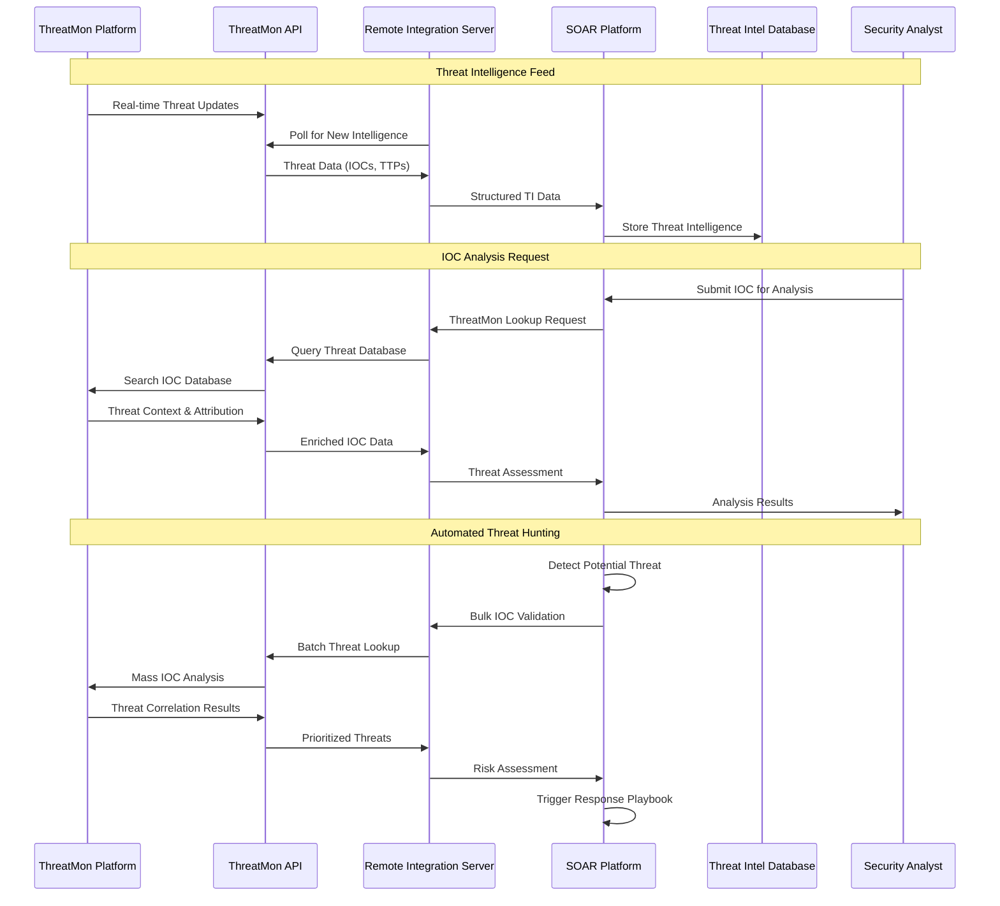
```mermaid
sequenceDiagram
    participant TM as ThreatMon Platform
    participant API as ThreatMon API
    participant RIS as Remote Integration Server
    participant SOAR as SOAR Platform
    participant TI_DB as Threat Intel Database
    participant ANALYST as Security Analyst
    
    Note over TM,ANALYST: Threat Intelligence Feed
    
    TM->>API: Real-time Threat Updates
    RIS->>API: Poll for New Intelligence
    API->>RIS: Threat Data (IOCs, TTPs)
    RIS->>SOAR: Structured TI Data
    SOAR->>TI_DB: Store Threat Intelligence
    
    Note over TM,ANALYST: IOC Analysis Request
    
    ANALYST->>SOAR: Submit IOC for Analysis
    SOAR->>RIS: ThreatMon Lookup Request
    RIS->>API: Query Threat Database
    API->>TM: Search IOC Database
    TM->>API: Threat Context & Attribution
    API->>RIS: Enriched IOC Data
    RIS->>SOAR: Threat Assessment
    SOAR->>ANALYST: Analysis Results
    
    Note over TM,ANALYST: Automated Threat Hunting
    
    SOAR->>SOAR: Detect Potential Threat
    SOAR->>RIS: Bulk IOC Validation
    RIS->>API: Batch Threat Lookup
    API->>TM: Mass IOC Analysis
    TM->>API: Threat Correlation Results
    API->>RIS: Prioritized Threats
    RIS->>SOAR: Risk Assessment
    SOAR->>SOAR: Trigger Response Playbook
```

### Threat Intelligence Capabilities

#### IOC (Indicators of Compromise) Management

**1. Multi-Type IOC Support**
- **IP Addresses**: Malicious IP reputation and geolocation data
- **Domain Names**: Suspicious domains and DNS analysis
- **URL Analysis**: Malicious URL detection and categorization
- **File Hashes**: Malware signature matching (MD5, SHA1, SHA256)
- **Email Addresses**: Threat actor identification and phishing detection

**2. Threat Attribution and Context**
- **Threat Actor Mapping**: Attribution to known threat groups
- **Campaign Tracking**: Connection to active threat campaigns
- **TTP Analysis**: Tactics, Techniques, and Procedures correlation
- **Timeline Correlation**: Historical threat activity patterns

#### Advanced Threat Analysis Features

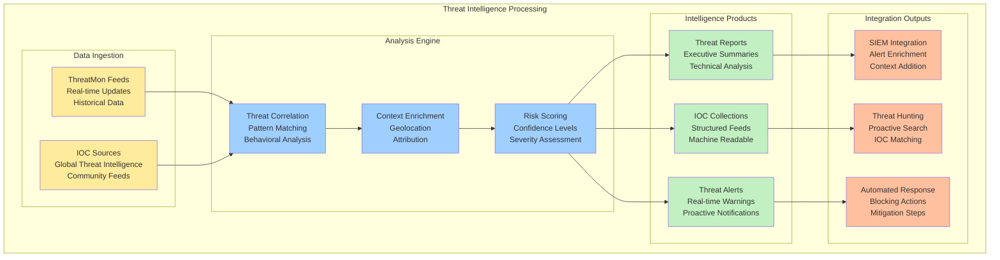
```mermaid
graph TB
    subgraph "Threat Intelligence Processing"
        subgraph "Data Ingestion"
            FEEDS[ThreatMon Feeds<br/>Real-time Updates<br/>Historical Data]
            IOC_SOURCES[IOC Sources<br/>Global Threat Intelligence<br/>Community Feeds]
        end
        
        subgraph "Analysis Engine"
            CORRELATION[Threat Correlation<br/>Pattern Matching<br/>Behavioral Analysis]
            ENRICHMENT[Context Enrichment<br/>Geolocation<br/>Attribution]
            SCORING[Risk Scoring<br/>Confidence Levels<br/>Severity Assessment]
        end
        
        subgraph "Intelligence Products"
            REPORTS[Threat Reports<br/>Executive Summaries<br/>Technical Analysis]
            INDICATORS[IOC Collections<br/>Structured Feeds<br/>Machine Readable]
            ALERTS[Threat Alerts<br/>Real-time Warnings<br/>Proactive Notifications]
        end
        
        subgraph "Integration Outputs"
            SIEM_FEED[SIEM Integration<br/>Alert Enrichment<br/>Context Addition]
            HUNT_DATA[Threat Hunting<br/>Proactive Search<br/>IOC Matching]
            RESPONSE[Automated Response<br/>Blocking Actions<br/>Mitigation Steps]
        end
    end
    
    %% Data Flow
    FEEDS --> CORRELATION
    IOC_SOURCES --> CORRELATION
    CORRELATION --> ENRICHMENT
    ENRICHMENT --> SCORING
    
    SCORING --> REPORTS
    SCORING --> INDICATORS
    SCORING --> ALERTS
    
    REPORTS --> SIEM_FEED
    INDICATORS --> HUNT_DATA
    ALERTS --> RESPONSE
    
    %% Styling
    classDef inputLayer fill:#ffeb9c
    classDef processingLayer fill:#9fcfff
    classDef outputLayer fill:#c2f0c2
    classDef integrationLayer fill:#ffc09f
    
    class FEEDS,IOC_SOURCES inputLayer
    class CORRELATION,ENRICHMENT,SCORING processingLayer
    class REPORTS,INDICATORS,ALERTS outputLayer
    class SIEM_FEED,HUNT_DATA,RESPONSE integrationLayer
```

### Configuration and API Integration

#### ThreatMon Configuration Parameters

| Parameter | Type | Description | Security Notes |
|-----------|------|-------------|----------------|
| **API Base URL** | String | ThreatMon API endpoint | `https://api.threatmon.io/v1/` |
| **API Key** | String | Authentication token | Encrypted storage required |
| **Access ID** | String | Account identifier | Multi-tenant support |
| **Feed Types** | Array | Selected intelligence feeds | `["indicators", "reports", "alerts"]` |
| **Update Frequency** | Integer | Polling interval (minutes) | `15` (minimum recommended) |
| **IOC Types** | Array | Supported indicator types | `["ip", "domain", "url", "hash"]` |

#### Supported API Operations

**1. Intelligence Retrieval**
- **Get Latest Threats**: Retrieve recent threat intelligence updates
- **IOC Lookup**: Single and batch IOC validation
- **Threat Reports**: Detailed threat analysis documents
- **Campaign Information**: Active threat campaign details

**2. Search and Query**
- **Advanced Search**: Complex queries across threat database
- **Historical Analysis**: Time-based threat pattern analysis
- **Correlation Queries**: Related threat indicator discovery
- **Attribution Search**: Threat actor and group identification

**3. Real-time Feeds**
- **Streaming Updates**: Real-time threat intelligence feeds
- **Webhook Integration**: Event-driven threat notifications
- **Custom Alerts**: Tailored threat monitoring rules
- **Priority Feeds**: High-confidence, actionable intelligence

---

## Data Flow and Processing

### Unified Security Data Pipeline

The SOAR platform implements a sophisticated data processing pipeline that normalizes, enriches, and correlates security data from multiple sources including SIEM and threat intelligence platforms.

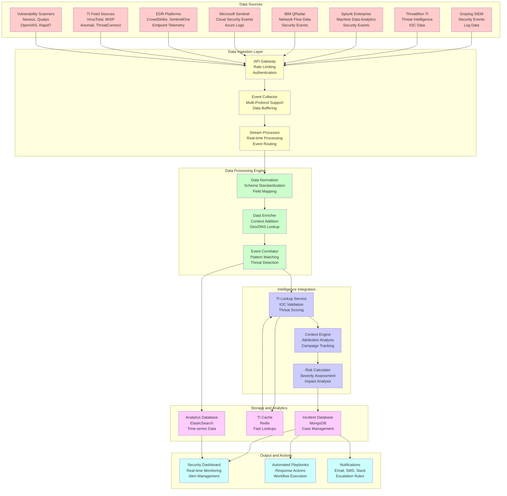
```mermaid
graph TD
    subgraph "Data Sources"
        GRAYLOG_SRC[Graylog SIEM<br/>Security Events<br/>Log Data]
        THREATMON_SRC[ThreatMon TI<br/>Threat Intelligence<br/>IOC Data]
        SPLUNK_SRC[Splunk Enterprise<br/>Machine Data Analytics<br/>Security Events]
        QRADAR_SRC[IBM QRadar<br/>Network Flow Data<br/>Security Events]
        SENTINEL_SRC[Microsoft Sentinel<br/>Cloud Security Events<br/>Azure Logs]
        EDR_SRC[EDR Platforms<br/>CrowdStrike, SentinelOne<br/>Endpoint Telemetry]
        TI_FEEDS_SRC[TI Feed Sources<br/>VirusTotal, MISP<br/>Anomali, ThreatConnect]
        VULN_SRC[Vulnerability Scanners<br/>Nessus, Qualys<br/>OpenVAS, Rapid7]
    end
    
    subgraph "Data Ingestion Layer"
        API_GATEWAY[API Gateway<br/>Rate Limiting<br/>Authentication]
        EVENT_COLLECTOR[Event Collector<br/>Multi-Protocol Support<br/>Data Buffering]
        STREAM_PROCESSOR[Stream Processor<br/>Real-time Processing<br/>Event Routing]
    end
    
    subgraph "Data Processing Engine"
        NORMALIZER[Data Normalizer<br/>Schema Standardization<br/>Field Mapping]
        ENRICHER[Data Enricher<br/>Context Addition<br/>Geo/DNS Lookup]
        CORRELATOR[Event Correlator<br/>Pattern Matching<br/>Threat Detection]
    end
    
    subgraph "Intelligence Integration"
        TI_LOOKUP[TI Lookup Service<br/>IOC Validation<br/>Threat Scoring]
        CONTEXT_ENGINE[Context Engine<br/>Attribution Analysis<br/>Campaign Tracking]
        RISK_CALCULATOR[Risk Calculator<br/>Severity Assessment<br/>Impact Analysis]
    end
    
    subgraph "Storage and Analytics"
        INCIDENT_DB[Incident Database<br/>MongoDB<br/>Case Management]
        TI_CACHE[TI Cache<br/>Redis<br/>Fast Lookups]
        ANALYTICS_DB[Analytics Database<br/>ElasticSearch<br/>Time-series Data]
    end
    
    subgraph "Output and Actions"
        DASHBOARD[Security Dashboard<br/>Real-time Monitoring<br/>Alert Management]
        PLAYBOOKS[Automated Playbooks<br/>Response Actions<br/>Workflow Execution]
        NOTIFICATIONS[Notifications<br/>Email, SMS, Slack<br/>Escalation Rules]
    end
    
    %% Data Flow
    GRAYLOG_SRC --> API_GATEWAY
    THREATMON_SRC --> API_GATEWAY
    SPLUNK_SRC --> API_GATEWAY
    QRADAR_SRC --> API_GATEWAY
    SENTINEL_SRC --> API_GATEWAY
    EDR_SRC --> API_GATEWAY
    TI_FEEDS_SRC --> API_GATEWAY
    VULN_SRC --> API_GATEWAY
    
    API_GATEWAY --> EVENT_COLLECTOR
    EVENT_COLLECTOR --> STREAM_PROCESSOR
    STREAM_PROCESSOR --> NORMALIZER
    
    NORMALIZER --> ENRICHER
    ENRICHER --> CORRELATOR
    CORRELATOR --> TI_LOOKUP
    
    TI_LOOKUP --> CONTEXT_ENGINE
    CONTEXT_ENGINE --> RISK_CALCULATOR
    RISK_CALCULATOR --> INCIDENT_DB
    
    INCIDENT_DB --> DASHBOARD
    INCIDENT_DB --> PLAYBOOKS
    INCIDENT_DB --> NOTIFICATIONS
    
    %% Cache Integration
    TI_LOOKUP --> TI_CACHE
    TI_CACHE --> TI_LOOKUP
    
    %% Analytics Flow
    CORRELATOR --> ANALYTICS_DB
    ANALYTICS_DB --> DASHBOARD
    
    %% Styling
    classDef sourceLayer fill:#ffcccb
    classDef ingestionLayer fill:#ffffcc
    classDef processingLayer fill:#ccffcc
    classDef intelligenceLayer fill:#ccccff
    classDef storageLayer fill:#ffccff
    classDef outputLayer fill:#ccffff
    
    class GRAYLOG_SRC,THREATMON_SRC,SPLUNK_SRC,QRADAR_SRC,SENTINEL_SRC,EDR_SRC,TI_FEEDS_SRC,VULN_SRC sourceLayer
    class API_GATEWAY,EVENT_COLLECTOR,STREAM_PROCESSOR ingestionLayer
    class NORMALIZER,ENRICHER,CORRELATOR processingLayer
    class TI_LOOKUP,CONTEXT_ENGINE,RISK_CALCULATOR intelligenceLayer
    class INCIDENT_DB,TI_CACHE,ANALYTICS_DB storageLayer
    class DASHBOARD,PLAYBOOKS,NOTIFICATIONS outputLayer
```

### Event Processing Workflow

#### 1. Event Ingestion and Normalization

**Graylog Event Processing:**
```
Input: Raw Graylog Alert
↓
Schema Validation → Field Mapping → Data Type Conversion
↓
Normalized Event: {
  "event_id": "unique_identifier",
  "timestamp": "ISO8601_datetime",
  "source": "graylog",
  "event_type": "security_alert",
  "severity": "high|medium|low",
  "description": "human_readable_text",
  "source_ip": "ip_address",
  "destination_ip": "ip_address",
  "indicators": ["ioc1", "ioc2"],
  "metadata": {...}
}
```

**ThreatMon Intelligence Processing:**
```
Input: ThreatMon IOC Data
↓
IOC Validation → Threat Scoring → Context Enrichment
↓
Processed Intelligence: {
  "ioc_id": "threat_indicator_id",
  "ioc_type": "ip|domain|url|hash",
  "ioc_value": "actual_indicator_value",
  "threat_type": "malware|phishing|c2",
  "confidence": "high|medium|low",
  "threat_actor": "apt_group_name",
  "campaign": "campaign_identifier",
  "first_seen": "timestamp",
  "last_seen": "timestamp",
  "references": ["url1", "url2"]
}
```

#### 2. Correlation and Enrichment

**Multi-Source Correlation:**
- **Temporal Correlation**: Events occurring within time windows
- **Spatial Correlation**: Events from same network segments
- **IOC Correlation**: Matching indicators across sources
- **Behavioral Correlation**: Similar attack patterns and TTPs

**Enrichment Process:**
- **Geolocation Data**: IP address to country/region mapping
- **DNS Resolution**: Domain to IP resolution and vice versa
- **Threat Intelligence**: IOC reputation and threat context
- **Asset Information**: Internal asset identification and criticality

#### 3. Incident Creation and Prioritization

**Automated Incident Creation Rules:**
```yaml
Incident_Creation_Rules:
  - Rule: "High Severity TI Match"
    Condition: "TI_confidence >= 0.8 AND event_severity == 'high'"
    Action: "create_incident"
    Priority: "critical"
    
  - Rule: "Multiple IOC Correlation"
    Condition: "matched_iocs >= 3 AND time_window <= '1h'"
    Action: "create_incident"
    Priority: "high"
    
  - Rule: "Known Campaign Activity"
    Condition: "campaign_match == true AND threat_actor != 'unknown'"
    Action: "create_incident"
    Priority: "high"
```

### Integration Examples and Use Cases

#### Multi-SIEM Environment Support

**Enterprise Scenario: Hybrid SIEM Deployment**
```yaml
Integration_Configuration:
  Primary_SIEM: "Splunk Enterprise (On-Premises)"
  Secondary_SIEM: "Microsoft Sentinel (Cloud)"
  Legacy_SIEM: "IBM QRadar (Legacy Systems)"
  Log_Management: "Graylog (Cost-Effective Logs)"
  
Data_Flow_Strategy:
  Critical_Assets: "Splunk + Sentinel (Dual Processing)"
  Cloud_Workloads: "Microsoft Sentinel (Native Integration)"
  Legacy_Systems: "QRadar (Existing Investment)"
  High_Volume_Logs: "Graylog (Cost Optimization)"
```

#### Threat Intelligence Orchestration

**Multi-Feed Intelligence Fusion**
```yaml
TI_Feed_Hierarchy:
  Commercial_Feeds:
    - "ThreatMon (Primary IOC Source)"
    - "Recorded Future (Contextual Intelligence)"
    - "ThreatConnect (Campaign Tracking)"
  
  Open_Source_Feeds:
    - "MISP (Community Intelligence)"
    - "OpenCTI (Structured Threat Data)"
    - "VirusTotal (File/URL Analysis)"
  
  Government_Feeds:
    - "US-CERT Feeds (Government Alerts)"
    - "NCSC Feeds (National Cyber Security)"
    - "Industry ISAC Feeds (Sector-Specific)"

Processing_Logic:
  High_Confidence: "Commercial feeds take precedence"
  Volume_Processing: "Open source for bulk validation"
  Specialized_Intel: "Government feeds for APT attribution"
```

---

## Security and Authentication

### Multi-Layered Security Architecture

The SOAR platform implements comprehensive security measures to protect sensitive security data and ensure secure integration with external systems.

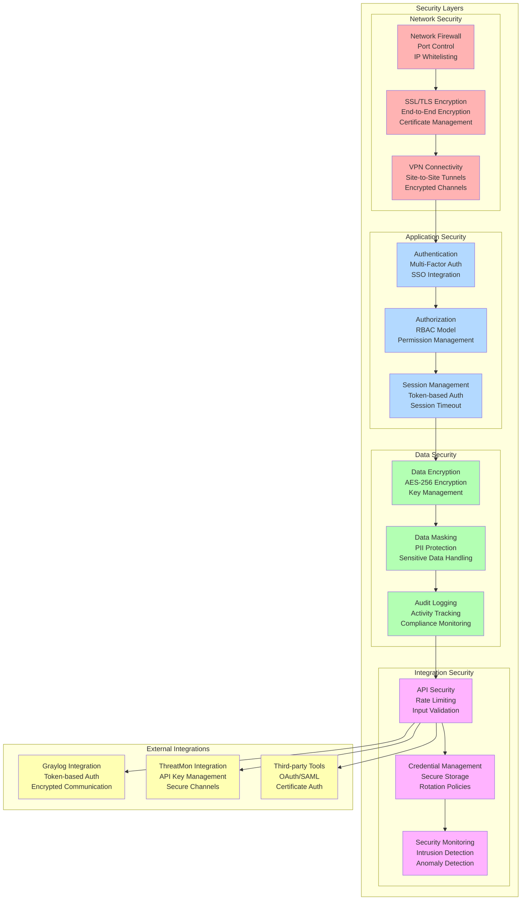
```mermaid
graph TB
    subgraph "Security Layers"
        subgraph "Network Security"
            FIREWALL[Network Firewall<br/>Port Control<br/>IP Whitelisting]
            SSL[SSL/TLS Encryption<br/>End-to-End Encryption<br/>Certificate Management]
            VPN[VPN Connectivity<br/>Site-to-Site Tunnels<br/>Encrypted Channels]
        end
        
        subgraph "Application Security"
            AUTH[Authentication<br/>Multi-Factor Auth<br/>SSO Integration]
            AUTHZ[Authorization<br/>RBAC Model<br/>Permission Management]
            SESSION[Session Management<br/>Token-based Auth<br/>Session Timeout]
        end
        
        subgraph "Data Security"
            ENCRYPT[Data Encryption<br/>AES-256 Encryption<br/>Key Management]
            MASKING[Data Masking<br/>PII Protection<br/>Sensitive Data Handling]
            AUDIT[Audit Logging<br/>Activity Tracking<br/>Compliance Monitoring]
        end
        
        subgraph "Integration Security"
            API_SEC[API Security<br/>Rate Limiting<br/>Input Validation]
            CRED_MGT[Credential Management<br/>Secure Storage<br/>Rotation Policies]
            MONITOR[Security Monitoring<br/>Intrusion Detection<br/>Anomaly Detection]
        end
    end
    
    subgraph "External Integrations"
        GRAYLOG_SEC[Graylog Integration<br/>Token-based Auth<br/>Encrypted Communication]
        THREATMON_SEC[ThreatMon Integration<br/>API Key Management<br/>Secure Channels]
        THIRD_PARTY[Third-party Tools<br/>OAuth/SAML<br/>Certificate Auth]
    end
    
    %% Security Flow
    FIREWALL --> SSL
    SSL --> VPN
    VPN --> AUTH
    AUTH --> AUTHZ
    AUTHZ --> SESSION
    
    SESSION --> ENCRYPT
    ENCRYPT --> MASKING
    MASKING --> AUDIT
    
    AUDIT --> API_SEC
    API_SEC --> CRED_MGT
    CRED_MGT --> MONITOR
    
    %% Integration Security
    API_SEC --> GRAYLOG_SEC
    API_SEC --> THREATMON_SEC
    API_SEC --> THIRD_PARTY
    
    %% Styling
    classDef networkSecurity fill:#ffb3b3
    classDef appSecurity fill:#b3d9ff
    classDef dataSecurity fill:#b3ffb3
    classDef integrationSecurity fill:#ffb3ff
    classDef externalSecurity fill:#ffffb3
    
    class FIREWALL,SSL,VPN networkSecurity
    class AUTH,AUTHZ,SESSION appSecurity
    class ENCRYPT,MASKING,AUDIT dataSecurity
    class API_SEC,CRED_MGT,MONITOR integrationSecurity
    class GRAYLOG_SEC,THREATMON_SEC,THIRD_PARTY externalSecurity
```

### Authentication and Authorization Framework

#### 1. Multi-Factor Authentication (MFA)

**Supported Authentication Methods:**
- **Primary**: Username/Password with complexity requirements
- **Secondary**: SMS OTP, Email OTP, TOTP (Google Authenticator)
- **Advanced**: Hardware tokens, Biometric authentication
- **Enterprise**: SAML 2.0, OAuth 2.0, LDAP/Active Directory

#### 2. Role-Based Access Control (RBAC)

**Predefined Roles:**
```yaml
Security_Roles:
  - Role: "Security Administrator"
    Permissions:
      - "full_system_access"
      - "user_management"
      - "integration_configuration"
      - "playbook_modification"
    
  - Role: "Security Analyst"
    Permissions:
      - "incident_management"
      - "investigation_tools"
      - "report_generation"
      - "dashboard_access"
    
  - Role: "SOC Manager"
    Permissions:
      - "team_management"
      - "report_access"
      - "metrics_dashboard"
      - "audit_trail_access"
    
  - Role: "Integration Specialist"
    Permissions:
      - "integration_testing"
      - "connector_configuration"
      - "data_mapping"
      - "health_monitoring"
```

#### 3. API Security and Rate Limiting

**API Protection Mechanisms:**
- **Rate Limiting**: Configurable limits per user/integration
- **Input Validation**: Schema validation and sanitization
- **Output Filtering**: Sensitive data redaction
- **Audit Logging**: Complete API access logging

**Integration-Specific Security:**
```yaml
Graylog_Integration_Security:
  Authentication: "Bearer Token"
  Encryption: "TLS 1.3"
  Rate_Limit: "100 requests/minute"
  Timeout: "30 seconds"
  Retry_Policy: "Exponential backoff"

ThreatMon_Integration_Security:
  Authentication: "API Key + Secret"
  Encryption: "TLS 1.3 + Certificate Pinning"
  Rate_Limit: "500 requests/hour"
  Timeout: "15 seconds"
  Data_Validation: "JSON Schema validation"
```

---

## Scalability and Performance

### Horizontal Scaling Architecture

The SOAR platform is designed for enterprise-scale deployments with support for high-volume security data processing and integration with multiple SIEM and TI sources.

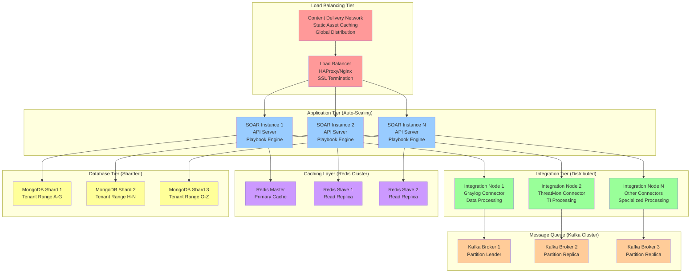
```mermaid
graph TB
    subgraph "Load Balancing Tier"
        LB[Load Balancer<br/>HAProxy/Nginx<br/>SSL Termination]
        CDN[Content Delivery Network<br/>Static Asset Caching<br/>Global Distribution]
    end
    
    subgraph "Application Tier (Auto-Scaling)"
        APP1[SOAR Instance 1<br/>API Server<br/>Playbook Engine]
        APP2[SOAR Instance 2<br/>API Server<br/>Playbook Engine]
        APP3[SOAR Instance N<br/>API Server<br/>Playbook Engine]
    end
    
    subgraph "Integration Tier (Distributed)"
        INT1[Integration Node 1<br/>Graylog Connector<br/>Data Processing]
        INT2[Integration Node 2<br/>ThreatMon Connector<br/>TI Processing]
        INT3[Integration Node N<br/>Other Connectors<br/>Specialized Processing]
    end
    
    subgraph "Message Queue (Kafka Cluster)"
        KAFKA1[Kafka Broker 1<br/>Partition Leader]
        KAFKA2[Kafka Broker 2<br/>Partition Replica]
        KAFKA3[Kafka Broker 3<br/>Partition Replica]
    end
    
    subgraph "Caching Layer (Redis Cluster)"
        REDIS1[Redis Master<br/>Primary Cache]
        REDIS2[Redis Slave 1<br/>Read Replica]
        REDIS3[Redis Slave 2<br/>Read Replica]
    end
    
    subgraph "Database Tier (Sharded)"
        MONGO1[MongoDB Shard 1<br/>Tenant Range A-G]
        MONGO2[MongoDB Shard 2<br/>Tenant Range H-N]
        MONGO3[MongoDB Shard 3<br/>Tenant Range O-Z]
    end
    
    %% Traffic Flow
    CDN --> LB
    LB --> APP1
    LB --> APP2
    LB --> APP3
    
    APP1 --> INT1
    APP2 --> INT2
    APP3 --> INT3
    
    %% Message Queue Integration
    INT1 --> KAFKA1
    INT2 --> KAFKA2
    INT3 --> KAFKA3
    
    %% Cache Integration
    APP1 --> REDIS1
    APP2 --> REDIS2
    APP3 --> REDIS3
    
    %% Database Sharding
    APP1 --> MONGO1
    APP2 --> MONGO2
    APP3 --> MONGO3
    
    %% Styling
    classDef loadBalancer fill:#ff9999
    classDef application fill:#99ccff
    classDef integration fill:#99ff99
    classDef messageQueue fill:#ffcc99
    classDef cache fill:#cc99ff
    classDef database fill:#ffff99
    
    class LB,CDN loadBalancer
    class APP1,APP2,APP3 application
    class INT1,INT2,INT3 integration
    class KAFKA1,KAFKA2,KAFKA3 messageQueue
    class REDIS1,REDIS2,REDIS3 cache
    class MONGO1,MONGO2,MONGO3 database
```

### Performance Optimization Strategies

#### 1. Data Processing Optimization

**Stream Processing Architecture:**
- **Apache Kafka**: High-throughput message streaming
- **Event Partitioning**: Parallel processing across topics
- **Consumer Groups**: Distributed event consumption
- **Backpressure Handling**: Flow control for high-volume data

**Caching Strategy:**
- **Multi-Level Caching**: Application, database, and CDN caching
- **Intelligent Cache Warming**: Predictive cache population
- **Cache Invalidation**: Event-driven cache updates
- **Distributed Caching**: Redis cluster for session and data caching

#### 2. Auto-Scaling Configuration

**Scaling Triggers:**
```yaml
Auto_Scaling_Rules:
  CPU_Utilization:
    Scale_Up: "> 70% for 5 minutes"
    Scale_Down: "< 30% for 10 minutes"
    
  Memory_Utilization:
    Scale_Up: "> 80% for 3 minutes"
    Scale_Down: "< 40% for 15 minutes"
    
  Queue_Depth:
    Scale_Up: "> 1000 messages"
    Scale_Down: "< 100 messages for 10 minutes"
    
  API_Request_Rate:
    Scale_Up: "> 500 requests/second"
    Scale_Down: "< 100 requests/second for 10 minutes"
```

---

## Use Cases and Benefits

### 1. Automated Incident Response

#### Graylog-Triggered Automation

**Use Case: Malware Detection and Response**

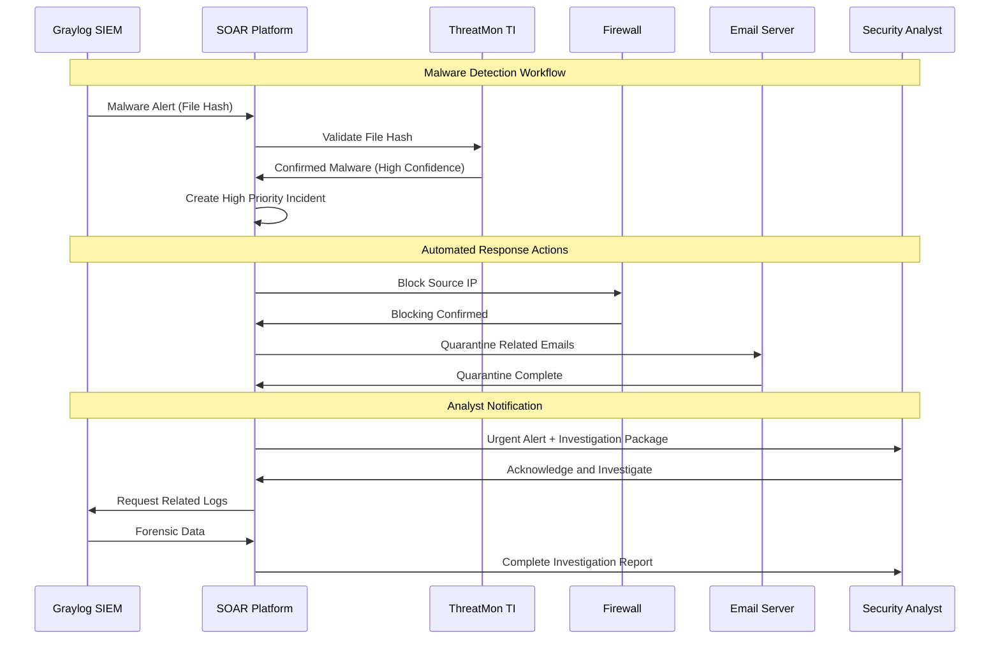
```mermaid
sequenceDiagram
    participant GL as Graylog SIEM
    participant SOAR as SOAR Platform
    participant TM as ThreatMon TI
    participant FW as Firewall
    participant EMAIL as Email Server
    participant ANALYST as Security Analyst
    
    Note over GL,ANALYST: Malware Detection Workflow
    
    GL->>SOAR: Malware Alert (File Hash)
    SOAR->>TM: Validate File Hash
    TM->>SOAR: Confirmed Malware (High Confidence)
    SOAR->>SOAR: Create High Priority Incident
    
    Note over GL,ANALYST: Automated Response Actions
    
    SOAR->>FW: Block Source IP
    FW->>SOAR: Blocking Confirmed
    SOAR->>EMAIL: Quarantine Related Emails
    EMAIL->>SOAR: Quarantine Complete
    
    Note over GL,ANALYST: Analyst Notification
    
    SOAR->>ANALYST: Urgent Alert + Investigation Package
    ANALYST->>SOAR: Acknowledge and Investigate
    SOAR->>GL: Request Related Logs
    GL->>SOAR: Forensic Data
    SOAR->>ANALYST: Complete Investigation Report
```

**Business Benefits:**
- **Faster Response**: Automated response reduces manual intervention time
- **Consistency**: Standardized response procedures across all incidents
- **Documentation**: Comprehensive incident documentation and audit trails
- **Intelligent Escalation**: Context-aware escalation based on threat severity

#### ThreatMon-Enhanced Threat Hunting

**Use Case: Proactive Threat Hunting**

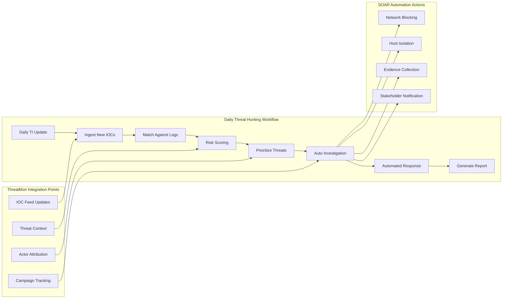
```mermaid
graph LR
    subgraph "Daily Threat Hunting Workflow"
        START[Daily TI Update] --> INGEST[Ingest New IOCs]
        INGEST --> MATCH[Match Against Logs]
        MATCH --> SCORE[Risk Scoring]
        SCORE --> PRIORITIZE[Prioritize Threats]
        PRIORITIZE --> INVESTIGATE[Auto Investigation]
        INVESTIGATE --> RESPOND[Automated Response]
        RESPOND --> REPORT[Generate Report]
    end
    
    subgraph "ThreatMon Integration Points"
        IOC_FEED[IOC Feed Updates]
        CONTEXT[Threat Context]
        ATTRIBUTION[Actor Attribution]
        CAMPAIGN[Campaign Tracking]
    end
    
    subgraph "SOAR Automation Actions"
        BLOCK[Network Blocking]
        ISOLATE[Host Isolation]
        COLLECT[Evidence Collection]
        NOTIFY[Stakeholder Notification]
    end
    
    %% Integration Flow
    IOC_FEED --> INGEST
    CONTEXT --> SCORE
    ATTRIBUTION --> PRIORITIZE
    CAMPAIGN --> INVESTIGATE
    
    %% Response Actions
    INVESTIGATE --> BLOCK
    INVESTIGATE --> ISOLATE
    INVESTIGATE --> COLLECT
    INVESTIGATE --> NOTIFY
```

### 2. Security Operations Center (SOC) Enhancement

#### Unified Security Dashboard

**Dashboard Capabilities:**
- **Real-time Threat Landscape**: Combined SIEM and TI intelligence
- **Incident Management**: Centralized case tracking and workflow
- **Performance Metrics**: SOC efficiency and response time analytics
- **Threat Intelligence Visualization**: IOC trends and threat actor activity

#### Analytics and Reporting

**Executive Reporting Features:**
- **Monthly Security Posture Reports**: Combined metrics from all integrated tools
- **Threat Intelligence Briefings**: ThreatMon-sourced executive summaries
- **Incident Response Effectiveness**: SOAR automation impact analysis
- **Compliance Reporting**: Automated compliance documentation

### 3. Cost Reduction and Efficiency Gains

#### Enhanced Security Operations

The integrated SOAR platform provides significant operational improvements through automation and centralized management:

**Key Operational Benefits:**
- **Automated Threat Detection**: Continuous monitoring and analysis across all integrated tools
- **Streamlined Incident Response**: Coordinated response workflows with minimal manual intervention
- **Reduced False Positives**: Intelligent correlation reduces alert fatigue
- **Enhanced Analyst Productivity**: Automation handles routine tasks, allowing focus on complex investigations
- **Simplified Tool Management**: Single platform reduces complexity and training requirements

#### Return on Investment (ROI)

**Cost Savings Areas:**
- **Personnel Efficiency**: Significant reduction in manual investigation and response time
- **Tool Consolidation**: Single integrated platform reduces licensing and maintenance costs
- **Operational Efficiency**: Automated workflows reduce human error and accelerate response
- **Training Costs**: Unified platform reduces training complexity across multiple tools

**Business Value:**
- **Faster Threat Detection**: Proactive identification reduces potential business impact
- **Improved Security Posture**: Enhanced visibility and response capabilities
- **Regulatory Compliance**: Automated documentation and reporting streamlines compliance
- **Risk Mitigation**: Comprehensive threat intelligence reduces exposure to advanced threats

---

## Conclusion

The SOAR platform's integration with Graylog SIEM and ThreatMon TI represents a comprehensive approach to modern security operations. By combining automated event processing, intelligent threat analysis, and orchestrated response capabilities, organizations can achieve:

### Key Platform Strengths

1. **Unified Security Operations**: Single platform for SIEM, TI, and response automation
2. **Advanced Threat Intelligence**: Real-time IOC validation and threat context
3. **Automated Response**: Rapid, consistent response to security threats
4. **Scalable Architecture**: Enterprise-ready platform with horizontal scaling
5. **Comprehensive Integration**: Support for industry-leading security tools

### Strategic Business Value

- **Enhanced Security Posture**: Proactive threat detection and response
- **Operational Efficiency**: Automated workflows reduce manual effort
- **Cost Optimization**: Consolidated platform reduces tool sprawl
- **Compliance Readiness**: Automated documentation and reporting
- **Future-Proof Architecture**: Extensible platform for emerging threats

The combination of Graylog's comprehensive log management capabilities with ThreatMon's advanced threat intelligence, orchestrated through the SOAR platform, provides organizations with a powerful, integrated security operations solution that scales with business needs while maintaining the highest levels of security and performance.

---

*This document provides a comprehensive overview of the SOAR platform's integration capabilities. For detailed implementation guidance, API documentation, or specific configuration assistance, please refer to the technical implementation guides or contact the integration support team.*
