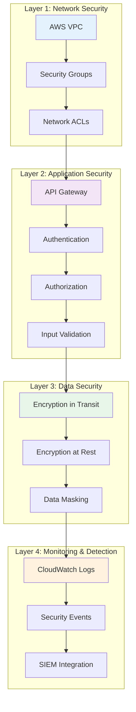
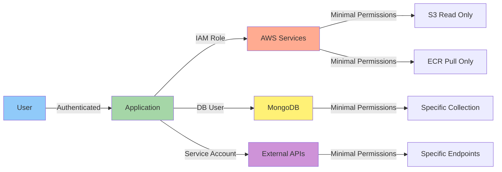
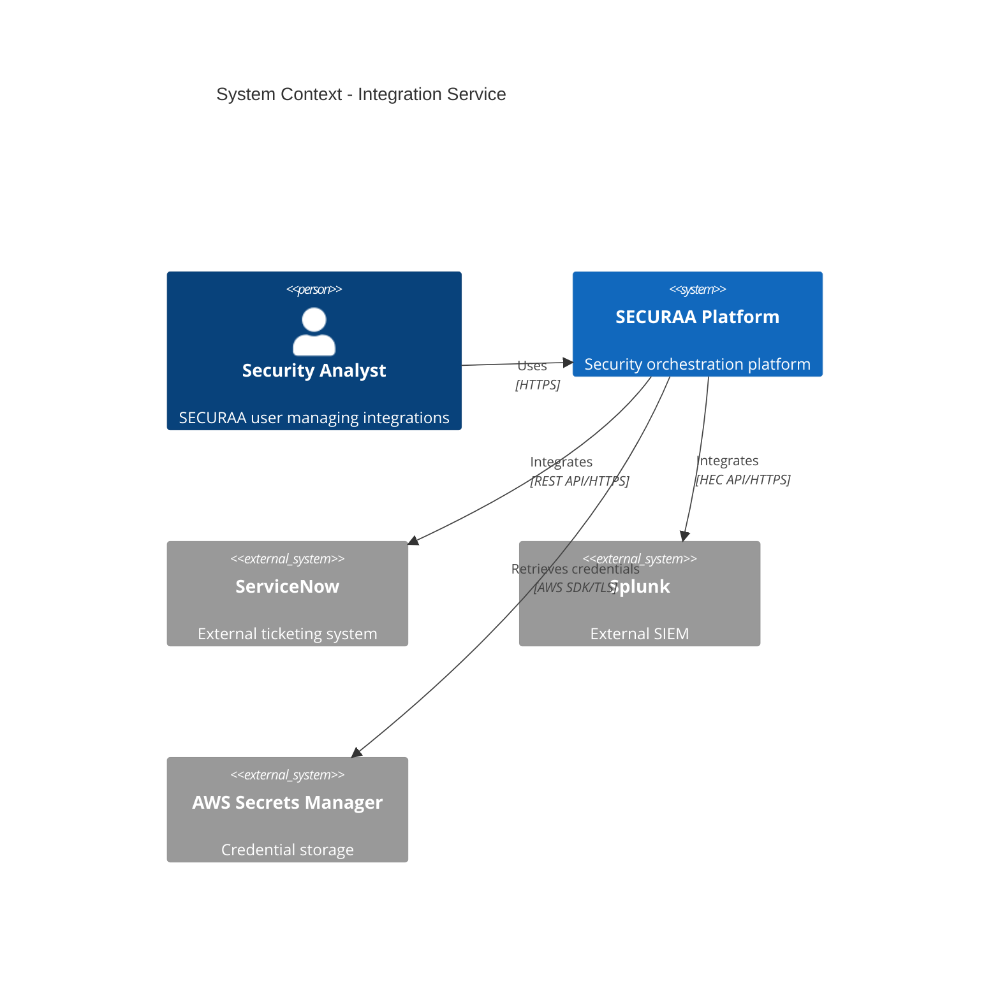
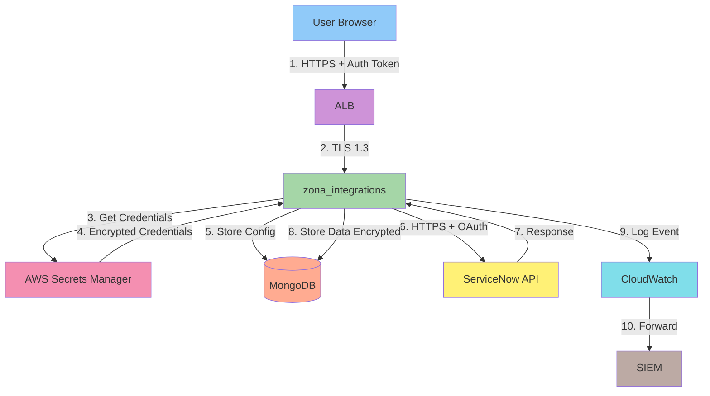
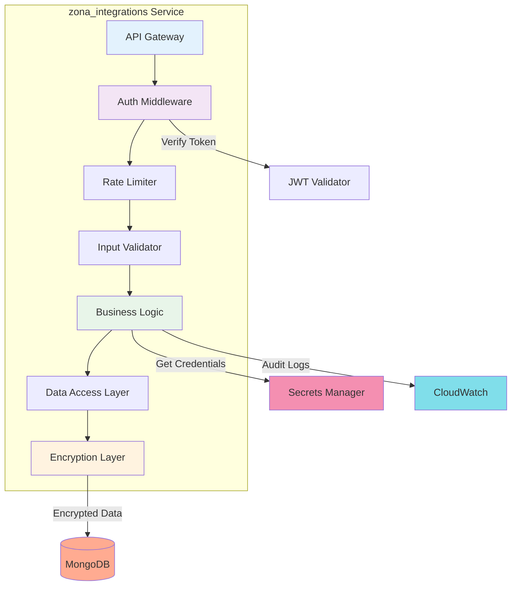
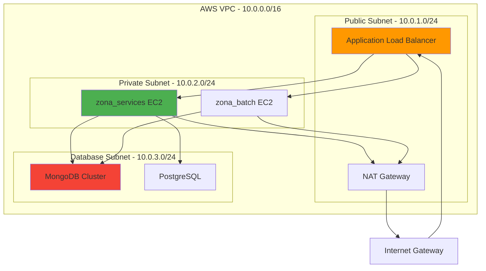

# SECURAA Secure SDLC - Design Phase
## Secure Architecture Design and Security Review

---

## Document Control

| **Document Title** | SECURAA SDLC - Design Phase |
|-------------------|----------------------------|
| **Document ID** | SECURAA-SDLC-003 |
| **Version** | 2.0 |
| **Date** | November 13, 2025 |
| **Classification** | Customer-Facing - Confidential |

---

## Phase Overview

The Design Phase translates security requirements into a secure technical architecture. This phase ensures security controls are built into the system design from the beginning, following the "Security by Design" principle.

### Phase Objectives

1. **Design Secure Architecture** - Create architecture that implements security controls
2. **Define Security Controls** - Specify technical security mechanisms
3. **Review Data Flows** - Ensure secure data handling throughout the system
4. **Plan Security Testing** - Define how security will be tested
5. **Document Security Design** - Create comprehensive security design documentation

### Phase Duration

- **Simple Feature**: 2-3 days
- **Medium Feature**: 1 week
- **Major Feature/Project**: 2-3 weeks

---

## Secure Architecture Principles

### Defense in Depth

Implement multiple layers of security controls:



### Least Privilege

Every component operates with minimum necessary permissions:



### Fail Secure

System fails in a secure state:

```go
// Example: Fail secure pattern
func AuthorizeRequest(ctx context.Context, userID string, resource string) (bool, error) {
    // If authorization service is unavailable, deny access (fail secure)
    permissions, err := authService.GetPermissions(ctx, userID)
    if err != nil {
        logger.Error("Authorization service error", "error", err)
        return false, err  // Deny access on error
    }
    
    // Check permissions
    return permissions.HasAccess(resource), nil
}
```

---

## Architecture Design Process

### Step 1: Component Diagram

Define all system components and their interactions:

**Example: Integration Service Architecture**



### Step 2: Data Flow Diagram

Map data flows with security controls:



### Step 3: Security Control Design

For each component, design security controls:

#### Authentication Design

```yaml
component: API Authentication

authentication_methods:
  primary:
    type: JWT (JSON Web Token)
    algorithm: HS256
    token_expiry: 1 hour
    refresh_token_expiry: 7 days
    secret_storage: AWS Secrets Manager
    rotation_policy: 90 days

  secondary:
    type: API Key
    format: "securaa_api_[random_32_chars]"
    storage: Hashed with bcrypt (cost factor 12)
    rate_limiting: 1000 requests/hour

  administrative:
    type: MFA (Multi-Factor Authentication)
    methods: [TOTP, SMS, Email]
    enforcement: Required for admin operations
    session_timeout: 15 minutes

implementation:
  library: github.com/golang-jwt/jwt/v5
  middleware: AuthenticationMiddleware()
  error_handling: Generic error messages (no details)
  logging: Authentication success/failure events

security_features:
  - Token signature verification
  - Token expiration validation
  - Token revocation support (blacklist)
  - Brute force protection (5 attempts, 15-minute lockout)
  - Concurrent session detection
```

#### Authorization Design

```yaml
component: Authorization & Access Control

model: Role-Based Access Control (RBAC)

roles:
  - name: admin
    permissions:
      - integration:create
      - integration:read
      - integration:update
      - integration:delete
      - integration:execute
      - user:manage
    
  - name: analyst
    permissions:
      - integration:read
      - integration:execute
      - case:create
      - case:update
    
  - name: viewer
    permissions:
      - integration:read
      - case:read

permission_format: "resource:action"

enforcement:
  - Middleware: AuthorizationMiddleware()
  - Decorator: @RequirePermission("integration:create")
  - Function: HasPermission(user, "integration", "create")

storage:
  type: MongoDB collection
  schema:
    user_id: string
    roles: array[string]
    permissions: array[string]
    granted_at: timestamp
    granted_by: string

caching:
  enabled: true
  ttl: 300 seconds
  invalidation: On permission change

audit:
  log_event: authorization_check
  fields: [user_id, resource, action, result, timestamp]
```

#### Data Protection Design

```yaml
component: Data Encryption

encryption_at_rest:
  algorithm: AES-256-GCM
  key_management:
    service: AWS KMS
    key_rotation: Automatic (365 days)
    key_alias: "alias/securaa-data-encryption"
  
  encrypted_fields:
    - integration_credentials
    - api_tokens
    - customer_pii
    - sensitive_case_data
  
  implementation:
    library: securaa_lib/encrypt_decrypt
    function: CredentialsEncrypt(data, key)

encryption_in_transit:
  protocol: TLS 1.3
  minimum_version: TLS 1.2
  cipher_suites:
    - TLS_AES_256_GCM_SHA384
    - TLS_AES_128_GCM_SHA256
    - TLS_CHACHA20_POLY1305_SHA256
  
  certificate_management:
    provider: AWS Certificate Manager
    renewal: Automatic
    validation: DNS validation

  implementation:
    load_balancer: ALB with TLS termination
    backend: TLS for service-to-service communication
    external: HTTPS only for external APIs

data_masking:
  pii_fields:
    - email: "us***@example.com"
    - phone: "***-***-1234"
    - ssn: "***-**-1234"
  
  implementation:
    logging: Mask before logging
    display: Mask in UI (unmask with permission)
    export: Mask in reports (unless authorized)

key_rotation:
  encryption_keys: 365 days
  api_keys: 90 days
  jwt_secrets: 90 days
  integration_credentials: On-demand + 180 days
```

---

## Microservices Security Design

### Service-to-Service Communication

```yaml
communication_pattern: Service Mesh

security_controls:
  authentication:
    method: mTLS (Mutual TLS)
    certificates: Service-specific certificates
    validation: Certificate pinning
  
  authorization:
    method: JWT tokens
    scope: Service-specific scopes
    validation: Token signature + claims
  
  encryption:
    protocol: TLS 1.3
    mandatory: true
    fallback: Not allowed

service_registry:
  location: MongoDB collection "service_registry"
  schema:
    service_name: string
    endpoints: array[string]
    public_key: string
    allowed_callers: array[string]

network_policies:
  default: Deny all
  allow_rules:
    - from: zona_integrations
      to: zona_apis_manager
      ports: [8080]
    - from: zona_user
      to: MongoDB
      ports: [27017]
```

### Service Security Architecture

**Example: zona_integrations Service**



---

## Database Security Design

### MongoDB Security Configuration

```yaml
mongodb_security:
  authentication:
    enabled: true
    mechanism: SCRAM-SHA-256
    users:
      - username: securaa_app
        database: admin
        roles: [readWrite on mssp_core]
        password: Stored in AWS Secrets Manager
      
      - username: securaa_readonly
        database: admin
        roles: [read on mssp_core]
        password: Stored in AWS Secrets Manager

  authorization:
    enabled: true
    role_based_access: true
    
  encryption:
    at_rest:
      enabled: true
      method: AES-256
      key_management: AWS KMS
    
    in_transit:
      tls_mode: requireTLS
      certificate_key_file: /etc/ssl/mongodb.pem
      ca_file: /etc/ssl/ca.pem

  network_security:
    bind_ip: 127.0.0.1,10.0.1.0/24
    port: 27017
    firewall_rules:
      - allow from zona_services subnet
      - deny all others

  auditing:
    enabled: true
    log_level: "auditLog"
    events:
      - authentication
      - authorization
      - DDL operations
      - DML operations on sensitive collections
    destination: CloudWatch Logs

  backup:
    frequency: Daily
    retention: 30 days
    encryption: Enabled
    location: S3 with encryption
```

### Data Schema Security

```javascript
// MongoDB schema with built-in security
{
  collection: "integrations",
  validator: {
    $jsonSchema: {
      bsonType: "object",
      required: ["tenant_id", "integration_type", "created_by"],
      properties: {
        tenant_id: {
          bsonType: "string",
          description: "Tenant ID for multi-tenancy isolation"
        },
        integration_type: {
          bsonType: "string",
          enum: ["servicenow", "splunk", "qradar", ...],
          description: "Must be a valid integration type"
        },
        credentials: {
          bsonType: "string",
          description: "Encrypted credentials (AES-256)"
        },
        api_endpoint: {
          bsonType: "string",
          pattern: "^https://",
          description: "Must be HTTPS URL"
        },
        created_by: {
          bsonType: "string",
          description: "User who created the integration"
        },
        created_at: {
          bsonType: "date"
        },
        last_modified_at: {
          bsonType: "date"
        },
        last_modified_by: {
          bsonType: "string"
        }
      }
    }
  },
  indexes: [
    { tenant_id: 1, integration_type: 1 },
    { created_at: 1 }
  ]
}
```

---

## AWS Infrastructure Security Design

### VPC Architecture



### Security Groups Design

```yaml
security_groups:
  alb_sg:
    name: "securaa-alb-sg"
    description: "Application Load Balancer security group"
    inbound_rules:
      - port: 443
        protocol: TCP
        source: 0.0.0.0/0
        description: "HTTPS from internet"
      - port: 80
        protocol: TCP
        source: 0.0.0.0/0
        description: "HTTP (redirect to HTTPS)"
    outbound_rules:
      - port: 8080
        protocol: TCP
        destination: app_sg
        description: "To application servers"

  app_sg:
    name: "securaa-app-sg"
    description: "Application servers security group"
    inbound_rules:
      - port: 8080
        protocol: TCP
        source: alb_sg
        description: "From load balancer"
      - port: 22
        protocol: TCP
        source: bastion_sg
        description: "SSH from bastion only"
    outbound_rules:
      - port: 27017
        protocol: TCP
        destination: db_sg
        description: "To MongoDB"
      - port: 5432
        protocol: TCP
        destination: db_sg
        description: "To PostgreSQL"
      - port: 443
        protocol: TCP
        destination: 0.0.0.0/0
        description: "HTTPS to external APIs"

  db_sg:
    name: "securaa-db-sg"
    description: "Database servers security group"
    inbound_rules:
      - port: 27017
        protocol: TCP
        source: app_sg
        description: "MongoDB from app servers"
      - port: 5432
        protocol: TCP
        source: app_sg
        description: "PostgreSQL from app servers"
    outbound_rules: []
```

### IAM Security Design

#### Service Roles

```yaml
iam_roles:
  codebuild_role:
    name: "SecuraaCodeBuildRole"
    description: "Role for AWS CodeBuild to build and push images"
    assume_role_policy:
      service: codebuild.amazonaws.com
    
    policies:
      - name: "SecuraaCodeBuildPolicy"
        permissions:
          ECR:
            - ecr:GetAuthorizationToken
            - ecr:BatchCheckLayerAvailability
            - ecr:PutImage
            - ecr:InitiateLayerUpload
            - ecr:UploadLayerPart
            - ecr:CompleteLayerUpload
          S3:
            - s3:GetObject
            - s3:PutObject
            resources:
              - "arn:aws:s3:::securaa-build-artifacts/*"
          CloudWatch:
            - logs:CreateLogGroup
            - logs:CreateLogStream
            - logs:PutLogEvents
          SecretsManager:
            - secretsmanager:GetSecretValue
            resources:
              - "arn:aws:secretsmanager:*:*:secret:securaa/*"

  ec2_app_role:
    name: "SecuraaEC2AppRole"
    description: "Role for EC2 application instances"
    assume_role_policy:
      service: ec2.amazonaws.com
    
    policies:
      - name: "SecuraaAppPolicy"
        permissions:
          ECR:
            - ecr:GetAuthorizationToken
            - ecr:BatchGetImage
            - ecr:GetDownloadUrlForLayer
          SecretsManager:
            - secretsmanager:GetSecretValue
            resources:
              - "arn:aws:secretsmanager:*:*:secret:securaa/prod/*"
          CloudWatch:
            - logs:CreateLogGroup
            - logs:CreateLogStream
            - logs:PutLogEvents
            - cloudwatch:PutMetricData
          S3:
            - s3:GetObject
            resources:
              - "arn:aws:s3:::securaa-config/*"
```

#### IAM Policies - Least Privilege

```json
{
  "Version": "2012-10-17",
  "Statement": [
    {
      "Sid": "AllowECRPushForCodeBuild",
      "Effect": "Allow",
      "Action": [
        "ecr:GetAuthorizationToken",
        "ecr:BatchCheckLayerAvailability",
        "ecr:PutImage",
        "ecr:InitiateLayerUpload",
        "ecr:UploadLayerPart",
        "ecr:CompleteLayerUpload"
      ],
      "Resource": "arn:aws:ecr:us-east-2:665853670667:repository/securaa/*",
      "Condition": {
        "StringEquals": {
          "aws:RequestedRegion": "us-east-2"
        }
      }
    },
    {
      "Sid": "DenyUnencryptedS3Uploads",
      "Effect": "Deny",
      "Action": "s3:PutObject",
      "Resource": "arn:aws:s3:::securaa-*/*",
      "Condition": {
        "StringNotEquals": {
          "s3:x-amz-server-side-encryption": "AES256"
        }
      }
    }
  ]
}
```

---

## API Security Design

### API Security Controls

```yaml
api_security:
  endpoint: "/api/v1/integrations"
  
  authentication:
    required: true
    methods: [JWT, API_KEY]
    location: Header "Authorization"
  
  authorization:
    required: true
    permissions: ["integration:read", "integration:create"]
  
  input_validation:
    content_type: application/json
    max_body_size: 10MB
    schema_validation: OpenAPI 3.0 spec
    sanitization: HTML entity encoding
  
  rate_limiting:
    authenticated: 1000 requests/hour
    unauthenticated: 100 requests/hour
    burst: 50 requests/minute
  
  output_encoding:
    response_type: application/json
    encoding: UTF-8
    sanitization: Remove sensitive fields
  
  security_headers:
    Content-Security-Policy: "default-src 'self'"
    X-Content-Type-Options: "nosniff"
    X-Frame-Options: "DENY"
    X-XSS-Protection: "1; mode=block"
    Strict-Transport-Security: "max-age=31536000; includeSubDomains"
  
  error_handling:
    mode: Generic messages
    status_codes:
      authentication_failure: 401
      authorization_failure: 403
      validation_failure: 400
      server_error: 500
    error_response:
      format: '{"error": "message", "code": "ERROR_CODE"}'
      no_stack_traces: true
      no_sensitive_info: true
  
  logging:
    log_requests: true
    log_responses: false
    log_errors: true
    sanitize_logs: true
    fields: [timestamp, user_id, endpoint, method, status_code]
```

### API Versioning Strategy

```yaml
versioning:
  strategy: URI versioning
  format: "/api/v{major}/resource"
  examples:
    - "/api/v1/integrations"
    - "/api/v2/integrations"
  
  deprecation_policy:
    notification_period: 6 months
    support_period: 12 months after deprecation
    sunset_date: Announced in headers
    header: "Sunset: Sat, 01 Jan 2026 00:00:00 GMT"
  
  breaking_changes:
    major_version_bump: true
    backwards_compatibility: Not required
  
  non_breaking_changes:
    minor_version: Not reflected in URI
    examples:
      - Adding optional fields
      - Adding new endpoints
      - Adding new response fields
```

---

## Container Security Design

### Docker Image Security

```dockerfile
# Secure Dockerfile example
FROM golang:1.17-alpine AS builder

# Security: Run as non-root user
RUN addgroup -S appgroup && adduser -S appuser -G appgroup

# Security: Use specific versions
WORKDIR /app
COPY go.mod go.sum ./
RUN go mod download && go mod verify

# Build application
COPY . .
RUN CGO_ENABLED=0 GOOS=linux go build -a -installsuffix cgo -o main .

# Final stage - minimal image
FROM alpine:3.18

# Security: Install security updates
RUN apk --no-cache add ca-certificates && \
    apk --no-cache upgrade

# Security: Run as non-root user
RUN addgroup -S appgroup && adduser -S appuser -G appgroup
USER appuser

WORKDIR /home/appuser

# Copy binary from builder
COPY --from=builder --chown=appuser:appgroup /app/main .

# Security: Use specific port (non-privileged)
EXPOSE 8080

# Security: Define health check
HEALTHCHECK --interval=30s --timeout=3s --start-period=5s --retries=3 \
  CMD wget --no-verbose --tries=1 --spider http://localhost:8080/health || exit 1

# Run application
CMD ["./main"]
```

### Container Runtime Security

```yaml
container_security:
  image_scanning:
    tool: AWS ECR Image Scanning
    on_push: true
    severity_threshold: HIGH
    fail_on_critical: true
  
  image_signing:
    enabled: true
    tool: Docker Content Trust
    key_management: AWS KMS
  
  runtime_security:
    read_only_root_filesystem: true
    no_new_privileges: true
    drop_capabilities: [ALL]
    add_capabilities: [NET_BIND_SERVICE]
  
  resource_limits:
    memory: 2GB
    cpu: 1.0
    pids_limit: 100
  
  network_security:
    network_mode: bridge
    port_mapping: "8080:8080"
    expose_only_necessary_ports: true
```

---

## Security Design Review Checklist

### Architecture Review

- [ ] **Authentication**
  - [ ] Authentication mechanism defined and secure
  - [ ] Token/session management designed
  - [ ] MFA requirements identified
  - [ ] Password policy defined (if applicable)

- [ ] **Authorization**
  - [ ] Authorization model defined (RBAC/ABAC)
  - [ ] Permissions and roles documented
  - [ ] Least privilege principle applied
  - [ ] Authorization enforcement points identified

- [ ] **Data Protection**
  - [ ] Sensitive data identified and classified
  - [ ] Encryption at rest designed (AES-256+)
  - [ ] Encryption in transit designed (TLS 1.3)
  - [ ] Key management strategy defined
  - [ ] Data masking strategy defined

- [ ] **Input Validation**
  - [ ] Input validation rules defined
  - [ ] Sanitization approach documented
  - [ ] File upload security designed (if applicable)
  - [ ] Output encoding strategy defined

- [ ] **API Security**
  - [ ] API authentication designed
  - [ ] API authorization designed
  - [ ] Rate limiting strategy defined
  - [ ] API versioning strategy defined
  - [ ] Security headers defined

- [ ] **Database Security**
  - [ ] Database authentication designed
  - [ ] Database authorization designed
  - [ ] Database encryption designed
  - [ ] Backup strategy defined
  - [ ] SQL/NoSQL injection prevention

- [ ] **Infrastructure Security**
  - [ ] Network segmentation designed
  - [ ] Security groups/firewalls defined
  - [ ] IAM roles and policies designed
  - [ ] Secrets management designed
  - [ ] Container security designed

- [ ] **Logging & Monitoring**
  - [ ] Security events logging designed
  - [ ] Log retention policy defined
  - [ ] Monitoring and alerting designed
  - [ ] SIEM integration designed

### Threat Model Validation

- [ ] All threats from Requirements Phase addressed
- [ ] Mitigations designed for high/critical threats
- [ ] Residual risks documented and accepted
- [ ] New threats identified during design addressed

### Compliance Validation

- [ ] SOC 2 controls addressed in design
- [ ] ISO 27001 controls addressed in design
- [ ] GDPR requirements addressed in design
- [ ] Industry-specific compliance addressed

---

## Design Phase Deliverables

### Required Documentation

1. **Architecture Diagram**
   - Component diagram
   - Data flow diagram
   - Network diagram
   - Deployment diagram

2. **Security Design Document**
   - Authentication design
   - Authorization design
   - Data protection design
   - API security design
   - Infrastructure security design

3. **Database Design**
   - Schema design with security
   - Access control design
   - Encryption design
   - Backup and recovery design

4. **API Specification**
   - OpenAPI 3.0 specification
   - Security requirements per endpoint
   - Authentication/authorization requirements
   - Rate limiting specifications

5. **Threat Model Update**
   - Updated threat model based on design
   - New threats identified
   - Mitigation strategies
   - Residual risks

6. **Security Test Plan**
   - SAST test cases
   - DAST test cases
   - Penetration testing scope
   - Security acceptance tests

---

## Phase Exit Criteria

The Design Phase is complete when:

1. ✅ **Architecture diagrams are complete and approved**
2. ✅ **Security design document is complete**
3. ✅ **All security controls are defined and documented**
4. ✅ **Threat model is updated with design-level threats**
5. ✅ **Security review completed by security team**
6. ✅ **Database design includes security controls**
7. ✅ **API security specifications are documented**
8. ✅ **Infrastructure security design is complete**
9. ✅ **Security test plan is created**
10. ✅ **Security team has approved the design**

---

## Next Phase

Once all exit criteria are met, proceed to **[04_Development_Phase.md](04_Development_Phase.md)** for secure coding and development.

---

*This document is part of the SECURAA Secure SDLC documentation suite. For questions, contact security@securaa.com*
