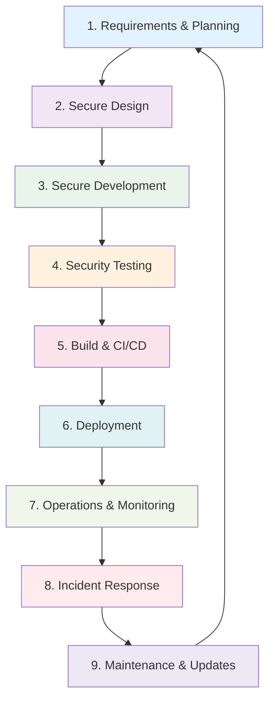
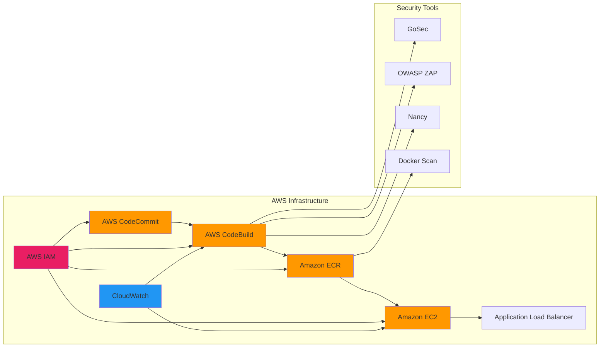
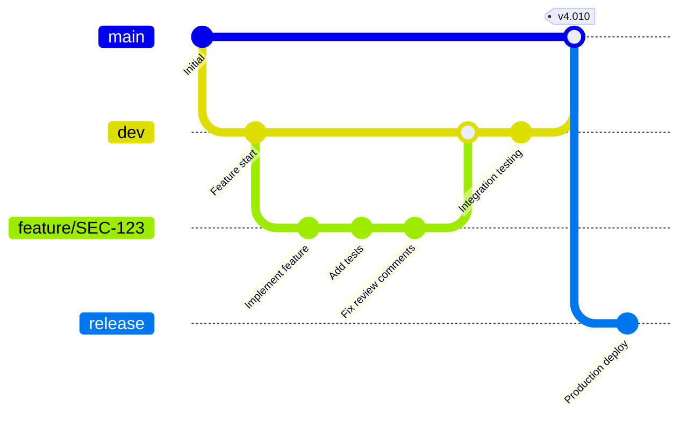
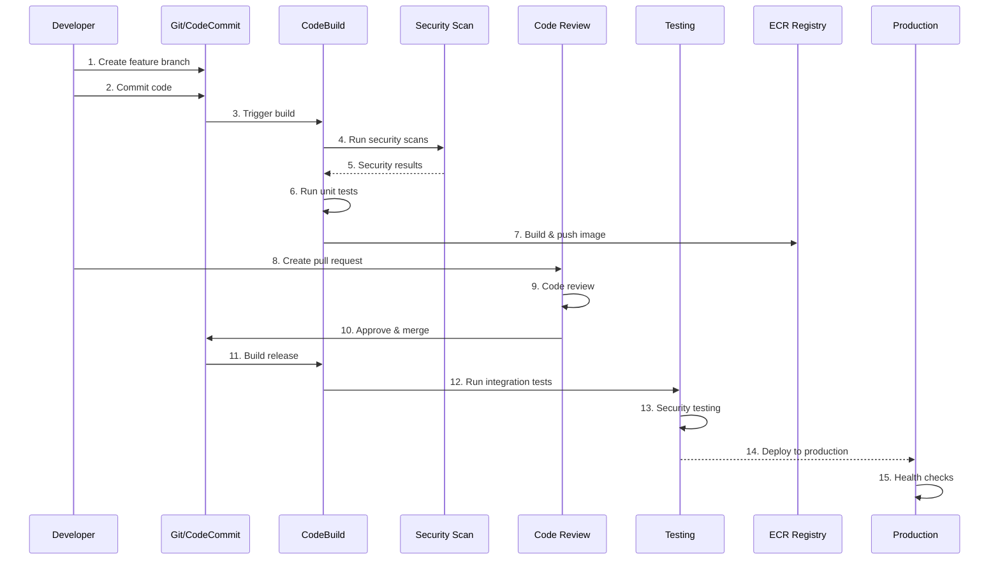

# SECURAA Secure Software Development Lifecycle (SDLC)
## Comprehensive Production-Ready SDLC Process Documentation

---

## Document Control

| **Document Title** | SECURAA Secure SDLC Process - Overview |
|-------------------|----------------------------------------|
| **Document ID** | SECURAA-SDLC-001 |
| **Version** | 2.0 |
| **Date** | November 13, 2025 |
| **Classification** | Customer-Facing - Confidential |
| **Owner** | Engineering & Security Team |
| **Review Cycle** | Quarterly |

---

## Executive Summary

This document describes the comprehensive Secure Software Development Lifecycle (SDLC) implemented at SECURAA for developing, testing, deploying, and maintaining our Security Orchestration, Automation and Response (SOAR) platform. Our SDLC integrates security at every phase of development, from initial requirements gathering through production operations and maintenance.

### Key Highlights

- **Security-First Approach**: Security integrated into every phase of development
- **Cloud-Native Infrastructure**: Built on AWS services (CodeCommit, CodeBuild, ECR, IAM)
- **Automated Security**: Continuous security testing and vulnerability scanning
- **Compliance-Ready**: Aligned with SOC 2, ISO 27001, and GDPR requirements
- **Microservices Architecture**: 530+ microservices with containerized deployment
- **Multi-Repository Structure**: Organized codebase across specialized repositories

### SDLC Process Overview



---

## Table of Contents

This comprehensive SDLC documentation is organized into the following sections:

1. **SDLC Overview** (This Document)
   - Executive Summary
   - SDLC Principles
   - Technology Stack
   - Infrastructure Overview
   - Document Navigation

2. **Requirements & Planning Phase**
   - Security Requirements Gathering
   - Threat Modeling
   - Risk Assessment
   - Compliance Requirements

3. **Secure Design Phase**
   - Architecture Security Review
   - Data Flow Analysis
   - Security Controls Design
   - Technology Selection

4. **Secure Development Phase**
   - Git Workflow on AWS CodeCommit
   - Branch Strategy
   - Secure Coding Standards
   - Code Review Process
   - Pull Request Guidelines

5. **Security Testing Phase**
   - Static Application Security Testing (SAST)
   - Dynamic Application Security Testing (DAST)
   - Dependency Vulnerability Scanning
   - Penetration Testing
   - Security Acceptance Criteria

6. **Build & Deployment Phase**
   - AWS CodeBuild Integration
   - Docker Container Security
   - ECR Image Management
   - IAM Security Policies
   - Deployment Automation

7. **Operations & Monitoring Phase**
   - Security Monitoring
   - Log Management
   - Performance Monitoring
   - Incident Detection

8. **CI/CD Security Pipeline**
   - Automated Security Scanning
   - Build Pipeline Security
   - Deployment Pipeline Security

---

## SDLC Core Principles

### 1. Security by Design

Security is not an afterthought but a fundamental requirement integrated from the earliest stages of development.

**Implementation**:
- Threat modeling conducted for all new features
- Security requirements defined alongside functional requirements
- Security architecture review before implementation begins
- Secure coding standards enforced through automated tools

### 2. Defense in Depth

Multiple layers of security controls protect against various threat vectors.

**Implementation**:
- Network security (VPC, security groups, NACLs)
- Application security (input validation, authentication, authorization)
- Data security (encryption at rest and in transit)
- Infrastructure security (IAM policies, least privilege access)
- Monitoring and detection (logging, alerting, SIEM integration)

### 3. Least Privilege

Users, services, and applications are granted the minimum permissions necessary to perform their functions.

**Implementation**:
- IAM roles with minimal required permissions
- Service accounts with specific scope
- Regular access reviews and permission audits
- Time-bound elevated access for administrative tasks

### 4. Continuous Security

Security is continuously assessed and improved throughout the development lifecycle and production operations.

**Implementation**:
- Automated security scanning in CI/CD pipeline
- Regular vulnerability assessments
- Continuous monitoring and alerting
- Security metrics and KPIs tracking
- Regular security training and awareness

### 5. Shift Left Security

Security testing and validation occur as early as possible in the development process.

**Implementation**:
- Security requirements in planning phase
- Threat modeling during design
- SAST tools during development
- Pre-commit hooks for security checks
- Automated security tests in CI/CD

### 6. Automation First

Security processes are automated wherever possible to ensure consistency and reduce human error.

**Implementation**:
- Automated security scanning (SAST, DAST, dependency checks)
- Automated compliance checks
- Automated deployment with security gates
- Automated incident detection and alerting
- Automated remediation for known issues

---

## Technology Stack

### Development Languages

| Language | Usage | Version | Security Tools |
|----------|-------|---------|----------------|
| **Go** | Backend services, microservices | 1.17+ | GoSec, Nancy, govulncheck |
| **JavaScript/React** | Frontend UI | React 18.2+ | ESLint Security, npm audit |
| **Python** | Utilities, batch processing | 3.8+ | Bandit, Safety |
| **Shell Script** | Deployment automation | Bash | ShellCheck |

### Infrastructure & DevOps



**Core Infrastructure Components**:

1. **AWS CodeCommit**
   - Private Git repositories
   - Branch protection rules
   - Pull request workflows
   - IAM-based access control

2. **AWS CodeBuild**
   - Automated build pipeline
   - Security scanning integration
   - Docker image building
   - Artifact generation (RPM packages)

3. **Amazon ECR (Elastic Container Registry)**
   - Private Docker image registry
   - Image vulnerability scanning
   - Image signing and verification
   - Lifecycle policies for image management

4. **AWS IAM (Identity and Access Management)**
   - Role-based access control (RBAC)
   - Service roles for automation
   - Policy-based permissions
   - Multi-factor authentication (MFA)

5. **Amazon EC2**
   - Application hosting
   - Security groups for network isolation
   - Encrypted EBS volumes
   - Systems Manager for patch management

6. **AWS CloudWatch**
   - Application logging
   - Metrics collection
   - Security event monitoring
   - Alerting and notifications

### Database & Storage

| Technology | Purpose | Security Features |
|------------|---------|-------------------|
| **MongoDB 7.0** | Primary database | Authentication, encryption at rest, TLS |
| **PostgreSQL** | Relational data | Role-based access, SSL/TLS, encrypted |
| **Amazon S3** | Object storage | Encryption, versioning, access logging |
| **InfluxDB** | Time-series metrics | Authentication, HTTPS |

### Container & Orchestration

| Technology | Purpose | Security Features |
|------------|---------|-------------------|
| **Docker** | Containerization | Image scanning, rootless containers |
| **Docker Compose** | Local development | Network isolation, secrets management |
| **Docker Swarm** | Production orchestration | Encrypted overlay networks, secrets |

---

## Repository Structure

SECURAA's codebase is organized across multiple specialized repositories:

### Core Repositories

#### 1. **build_securaa**
**Purpose**: Build automation, deployment scripts, CI/CD configuration

**Contents**:
- Build scripts (`build_securaa.sh`)
- AWS CodeBuild specifications (`Core_BuildSpec.yaml`, `Wrapper_BuildSpec.yaml`)
- Deployment automation (`deployment_scripts/`)
- Package building (RPM, DEB)
- Database migration scripts
- Installation scripts

**Key Files**:
```
build_securaa/
├── build_securaa.sh              # Main build orchestration
├── aws_codebuild/
│   ├── Core_BuildSpec.yaml       # Core services build
│   └── Wrapper_BuildSpec.yaml    # Integration services build
├── core_scripts/
│   ├── functions_aws.sh          # AWS-specific functions
│   └── docker_ecr_login.sh       # ECR authentication
├── deployment_scripts/           # Deployment automation
├── pkg/                          # Package definitions
└── securaa/                      # Core application code
```

#### 2. **zona_services**
**Purpose**: Core microservices (530+ services)

**Service Categories**:
- User management (`zona_user`)
- Integration orchestration (`zona_integrations`)
- SIEM connectors (`zona_siem`)
- Playbook execution (`zona_playbook`)
- Query builder (`zona_querybuilder`)
- Custom utilities (`zona_custom`, `zona_custom_utils`)
- API management (`zona_apis_manager`)
- SSH client (`zona_sshclient`)
- PDF generation (`zona_pdf`)
- Health monitoring (`zona_primary_server_health_check`)
- Shard management (`zona_shard_handler`)
- SIA APIs (`zona_sia_apis`)

**Architecture**:
- Each service is independently deployable
- Microservices communicate via REST APIs
- Service discovery and registration
- Containerized deployment

#### 3. **securaa**
**Purpose**: Core application backend logic

**Components**:
- Authentication and authorization
- API endpoints
- Business logic
- Database operations
- Common utilities

#### 4. **securaa_lib**
**Purpose**: Shared security library

**Features**:
- Encryption/decryption (`encrypt_decrypt/`)
- JWT token management
- Cryptographic operations (AES-256)
- Security utilities
- Authentication helpers

**Key Implementation**:
```go
// AES-256-CBC encryption
func CredentialsEncrypt(data string, key string) (string, error)
func CredentialsDecrypt(encrypted string, key string) (string, error)
```

#### 5. **zona_batch**
**Purpose**: Background batch processing

**Batch Jobs**:
- `core_process_batch` - Core data processing
- `csam_connector` - CSAM integration
- `auto_purge_batch` - Data retention enforcement
- `report_batch` - Report generation
- `sbot` - Security bot automation
- `sla_breach_monitor_batch` - SLA monitoring

#### 6. **integrations**
**Purpose**: Third-party system integrations (722+ integrations)

**Integration Categories**:
- SIEM platforms (Splunk, QRadar, LogRhythm, etc.)
- Threat intelligence (VirusTotal, AlienVault, etc.)
- Ticketing systems (ServiceNow, Jira, etc.)
- EDR/Endpoint security (CrowdStrike, Carbon Black, etc.)
- Cloud security (AWS Security Hub, Azure Sentinel, etc.)
- Network security (Palo Alto, Cisco, Fortinet, etc.)

**Integration Structure**:
```
integrations/
├── zona_splunk/
├── zona_qradar/
├── zona_servicenow/
├── zona_virustotal/
└── ... (722+ integrations)
```

#### 7. **zonareact**
**Purpose**: Frontend React application

**Features**:
- User interface
- Dashboard visualizations
- Case management UI
- Playbook designer
- Custom widgets
- Real-time updates

**Technology**:
- React 18.2
- Redux for state management
- Material-UI components
- Chart visualizations (Recharts, D3)
- Markdown editor (Quill)

#### 8. **securaa_db**
**Purpose**: Database schemas and migrations

**Contents**:
- MongoDB initialization scripts
- Schema definitions
- Migration scripts
- Seed data
- Database versioning

#### 9. **securaa_pylib**
**Purpose**: Python utility libraries

**Components**:
- Custom Python utilities
- Integration helpers
- Data processing libraries

---

## Development Workflow Overview

### Git Branching Strategy



**Branch Types**:
- `main` - Production-ready code
- `release` - Release candidates
- `dev` - Development integration branch
- `feature/*` - Feature development
- `bugfix/*` - Bug fixes
- `hotfix/*` - Production hotfixes

### Development Process Flow



---

## Security Gates

Each phase of the SDLC includes mandatory security gates that must be passed before proceeding:

### Phase Security Gates

| Phase | Security Gate | Tools | Pass Criteria |
|-------|--------------|-------|---------------|
| **Requirements** | Security requirements defined | Threat modeling | All security requirements documented |
| **Design** | Security architecture review | Manual review | Architecture approved by security team |
| **Development** | Code security scan | GoSec, ESLint | No critical/high vulnerabilities |
| **Development** | Dependency scan | Nancy, npm audit | No known vulnerabilities |
| **Testing** | SAST scan | GoSec, Bandit | Security issues addressed |
| **Testing** | DAST scan | OWASP ZAP | No high-risk findings |
| **Build** | Container scan | Docker scan, Trivy | No critical vulnerabilities in images |
| **Build** | Compliance check | Custom scripts | Passes compliance requirements |
| **Deployment** | Security approval | Manual | Security team sign-off |
| **Production** | Security monitoring | CloudWatch, SIEM | Monitoring active and alerting |

---

## Compliance Alignment

Our SDLC is designed to support compliance with major security and privacy frameworks:

### SOC 2 Type II Alignment

| Trust Service Criteria | SDLC Implementation |
|------------------------|---------------------|
| **CC6.1** - Logical Access Controls | IAM roles, branch protection, code review |
| **CC6.6** - Encryption at Rest | Encrypted databases, S3 encryption |
| **CC6.7** - Encryption in Transit | TLS/HTTPS enforcement |
| **CC7.2** - Security Monitoring | CloudWatch, security logging, SIEM |
| **CC8.1** - Change Management | Git workflow, pull requests, deployment approval |

### ISO 27001:2022 Alignment

| Control | SDLC Implementation |
|---------|---------------------|
| **A.8.1** - Inventory of Assets | Repository documentation, service registry |
| **A.8.3** - Media Handling | Encrypted storage, access logging |
| **A.14.2** - Security in Development | Secure SDLC, security testing |
| **A.14.2.5** - Secure Development Principles | Secure coding standards, code review |
| **A.18.1.3** - Protection of Records | Audit logging, log retention |

### GDPR Compliance

| Requirement | SDLC Implementation |
|-------------|---------------------|
| **Data Protection by Design** | Privacy requirements in design phase |
| **Data Minimization** | Data flow analysis, only collect necessary data |
| **Security of Processing** | Encryption, access controls, security testing |
| **Data Breach Notification** | Incident response, security monitoring |

---

## Metrics & KPIs

We track key performance indicators to measure SDLC effectiveness:

### Security Metrics

| Metric | Target | Measurement Frequency |
|--------|--------|----------------------|
| **Critical vulnerabilities** | 0 | Continuous |
| **High vulnerabilities** | < 5 | Weekly |
| **Mean time to remediation (Critical)** | < 24 hours | Per incident |
| **Mean time to remediation (High)** | < 7 days | Per incident |
| **Security test coverage** | > 80% | Monthly |
| **Failed security scans** | < 5% | Per build |
| **Dependency vulnerabilities** | 0 critical | Weekly |

### Development Metrics

| Metric | Target | Measurement Frequency |
|--------|--------|----------------------|
| **Build success rate** | > 95% | Daily |
| **Code review completion time** | < 48 hours | Per PR |
| **Deployment frequency** | Multiple per week | Weekly |
| **Change failure rate** | < 10% | Monthly |
| **Mean time to recovery** | < 1 hour | Per incident |

---

## Roles & Responsibilities

### Development Team

**Responsibilities**:
- Follow secure coding standards
- Write security-focused unit tests
- Participate in code reviews
- Address security findings promptly
- Complete security training

### Security Team

**Responsibilities**:
- Define security requirements
- Conduct threat modeling
- Review security architecture
- Perform security testing
- Approve production deployments
- Respond to security incidents

### DevOps Team

**Responsibilities**:
- Maintain CI/CD pipeline
- Manage AWS infrastructure
- Configure security tools
- Monitor system health
- Automate security checks

### QA Team

**Responsibilities**:
- Execute security test cases
- Perform DAST scanning
- Validate security requirements
- Document security issues
- Verify remediation

---

## Document Navigation

This SDLC documentation is organized into multiple documents for easy navigation:

1. **01_SDLC_Overview.md** (This Document) - Executive summary and overview
2. **02_Requirements_Phase.md** - Security requirements and threat modeling
3. **03_Design_Phase.md** - Secure architecture and design review
4. **04_Development_Phase.md** - Coding standards, Git workflow, code review
5. **05_Testing_Phase.md** - Security testing, SAST, DAST, penetration testing
6. **06_Build_Deployment_Phase.md** - AWS CodeBuild, ECR, IAM, deployment
7. **07_Operations_Monitoring.md** - Production operations and security monitoring
8. **08_CI_CD_Security_Pipeline.md** - Automated security in CI/CD

---

## Version History

| Version | Date | Author | Changes |
|---------|------|--------|---------|
| 1.0 | October 2024 | Security Team | Initial SDLC documentation |
| 2.0 | November 13, 2025 | Security & Engineering | Comprehensive update with AWS infrastructure |

---

## Contact Information

**Document Owner**: Engineering & Security Leadership  
**Security Team**: security@securaa.com  
**Engineering Team**: engineering@securaa.com  

**For Questions or Feedback**:
- Slack: #security-sdlc
- Email: sdlc-feedback@securaa.com

---

*This document is confidential and intended for customer-facing purposes to demonstrate SECURAA's commitment to secure software development practices.*
