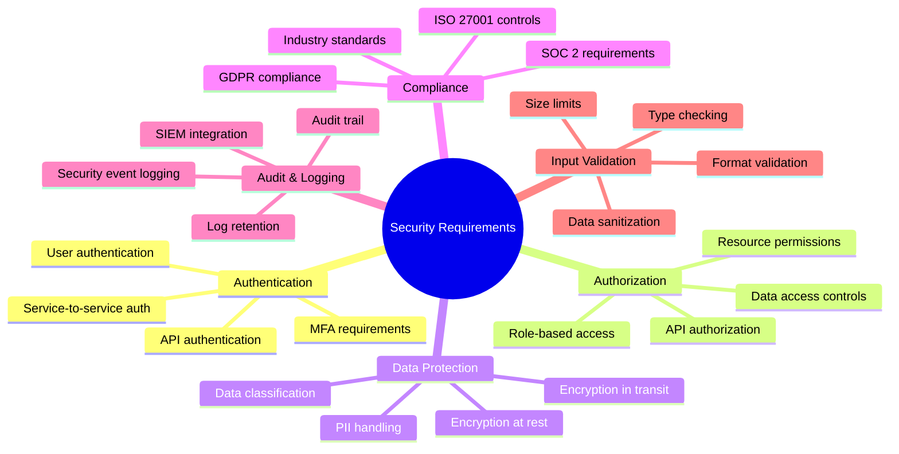
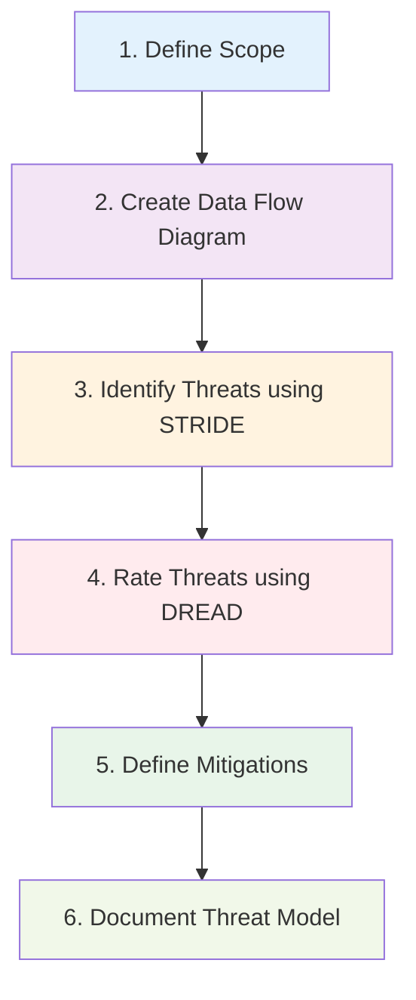
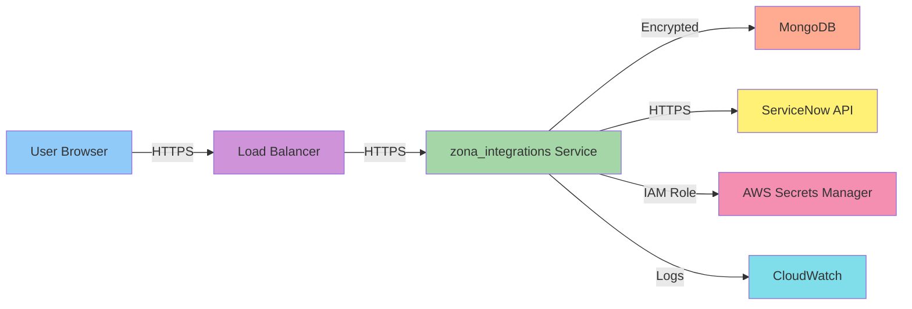
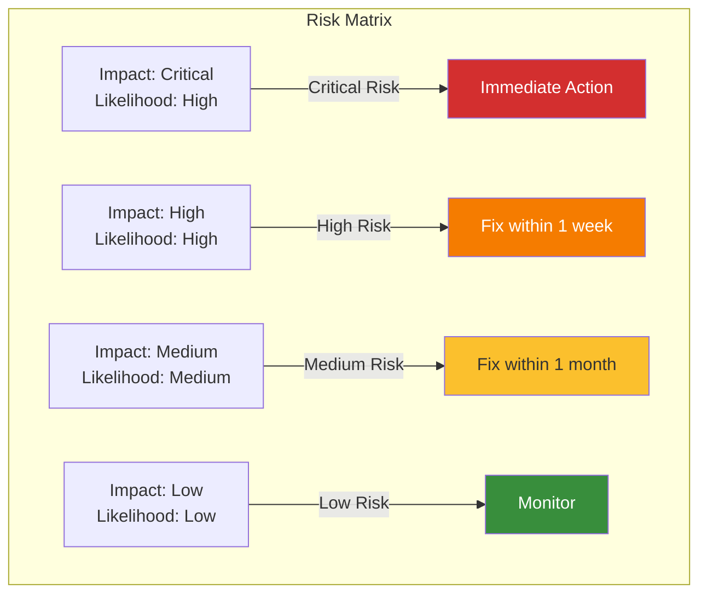

# SECURAA Secure SDLC - Requirements & Planning Phase
## Security Requirements Gathering and Threat Modeling

---

## Document Control

| **Document Title** | SECURAA SDLC - Requirements & Planning Phase |
|-------------------|----------------------------------------------|
| **Document ID** | SECURAA-SDLC-002 |
| **Version** | 2.0 |
| **Date** | November 13, 2025 |
| **Classification** | Customer-Facing - Confidential |

---

## Phase Overview

The Requirements & Planning Phase is the foundation of SECURAA's secure development lifecycle. During this phase, we identify security requirements, assess risks, model threats, and establish security acceptance criteria for the feature or project.

### Phase Objectives

1. **Define Security Requirements** - Establish clear, testable security requirements
2. **Conduct Threat Modeling** - Identify potential security threats and vulnerabilities
3. **Assess Risks** - Evaluate and prioritize security risks
4. **Plan Security Controls** - Design appropriate security controls and countermeasures
5. **Establish Acceptance Criteria** - Define measurable security success criteria

### Phase Duration

- **Simple Feature**: 1-2 days
- **Medium Feature**: 3-5 days
- **Major Feature/Project**: 1-2 weeks

---

## Security Requirements Gathering

### Types of Security Requirements



### Security Requirements Template

For each feature, we document:

```markdown
## Security Requirements: [Feature Name]

### 1. Authentication Requirements
- [ ] Define authentication method (JWT, OAuth, API key, etc.)
- [ ] Specify authentication endpoints
- [ ] Define session management
- [ ] Specify MFA requirements (if applicable)

### 2. Authorization Requirements
- [ ] Define roles and permissions
- [ ] Specify resource access controls
- [ ] Define API authorization model
- [ ] Document least privilege implementation

### 3. Data Protection Requirements
- [ ] Identify sensitive data elements
- [ ] Specify encryption requirements (at rest/in transit)
- [ ] Define data classification
- [ ] Specify data retention and deletion policies

### 4. Input Validation Requirements
- [ ] Define input validation rules
- [ ] Specify allowed data types and formats
- [ ] Define size and length limits
- [ ] Specify sanitization requirements

### 5. Audit & Logging Requirements
- [ ] Define security events to log
- [ ] Specify log retention period
- [ ] Define log format and fields
- [ ] Specify SIEM integration requirements

### 6. Compliance Requirements
- [ ] Identify applicable compliance frameworks
- [ ] Document specific compliance controls
- [ ] Define compliance testing requirements
- [ ] Specify documentation requirements

### 7. Security Testing Requirements
- [ ] Define SAST requirements
- [ ] Define DAST requirements
- [ ] Specify penetration testing needs
- [ ] Define security acceptance tests
```

### Example: New Integration Security Requirements

**Feature**: ServiceNow Advanced Integration

**Security Requirements**:

```yaml
authentication:
  method: OAuth 2.0
  token_type: Bearer
  token_expiry: 3600 seconds
  refresh_token: Required
  mfa_enforcement: Required for admin operations

authorization:
  roles:
    - integration_admin: Full access to integration configuration
    - integration_user: Read-only access to integration data
    - integration_operator: Execute integration tasks
  api_permissions:
    - endpoint: /api/integrations/servicenow/config
      required_role: integration_admin
    - endpoint: /api/integrations/servicenow/execute
      required_role: integration_operator

data_protection:
  sensitive_data:
    - ServiceNow credentials (encrypted with AES-256)
    - API tokens (stored in AWS Secrets Manager)
    - Customer ticket data (encrypted at rest)
  encryption:
    at_rest: AES-256-GCM
    in_transit: TLS 1.3
  data_classification: Confidential

input_validation:
  ticket_id:
    type: string
    pattern: "^[A-Z]{3}[0-9]{7}$"
    max_length: 10
  priority:
    type: enum
    values: [1, 2, 3, 4, 5]
  description:
    type: string
    max_length: 10000
    sanitization: HTML entities escaped

audit_logging:
  events:
    - Integration configuration changes
    - Authentication success/failure
    - API calls with parameters
    - Data access events
  retention: 365 days
  format: JSON
  destination: CloudWatch Logs + SIEM

compliance:
  frameworks:
    - SOC 2 CC6.1 (Logical Access)
    - ISO 27001 A.9.4.1 (Information Access Restriction)
  controls:
    - Access control enforcement
    - Encryption of sensitive data
    - Audit logging
```

---

## Threat Modeling

We use the STRIDE methodology for threat modeling:

### STRIDE Threat Categories

| Category | Description | Example Threats |
|----------|-------------|----------------|
| **S**poofing | Impersonating someone/something | Forged authentication tokens, fake API calls |
| **T**ampering | Modifying data or code | SQL injection, configuration tampering |
| **R**epudiation | Denying an action was performed | Missing audit logs, unsigned transactions |
| **I**nformation Disclosure | Exposing information | Data leaks, exposed credentials |
| **D**enial of Service | Making system unavailable | Resource exhaustion, DDoS attacks |
| **E**levation of Privilege | Gaining unauthorized access | Privilege escalation, broken access control |

### Threat Modeling Process



### Step 1: Data Flow Diagram

**Example**: Integration Data Flow



### Step 2: Identify Threats

**STRIDE Analysis for Integration Service**:

| Component | Spoofing | Tampering | Repudiation | Info Disclosure | DoS | Elevation |
|-----------|----------|-----------|-------------|-----------------|-----|-----------|
| **API Endpoint** | Forged JWT tokens | Modified API parameters | Missing request logs | Exposed error messages | Request flooding | Broken authorization |
| **Database** | Fake service accounts | NoSQL injection | No change tracking | Unencrypted data | Connection exhaustion | SQL injection → admin |
| **External API** | Fake ServiceNow | MITM attacks | Missing audit | API key leakage | Rate limiting abuse | Using stolen credentials |
| **Secrets Storage** | Unauthorized access | Modified secrets | No access logs | Plaintext storage | - | IAM policy exploit |

### Step 3: Rate Threats (DREAD)

**DREAD Scoring**:
- **D**amage Potential (0-10)
- **R**eproducibility (0-10)
- **E**xploitability (0-10)
- **A**ffected Users (0-10)
- **D**iscoverability (0-10)

**Example Threat Rating**:

```yaml
threat_id: T-001
threat_name: "SQL Injection in Integration Query"
category: Tampering
dread_score:
  damage: 9        # Could expose all customer data
  reproducibility: 8  # Easy to reproduce with known techniques
  exploitability: 7   # Requires some SQL knowledge
  affected_users: 10  # All customers affected
  discoverability: 6  # Moderate - requires API access
  total: 40/50       # High Risk
risk_level: HIGH
mitigation_required: YES
```

### Step 4: Define Mitigations

**Mitigation Strategy Template**:

```markdown
### Threat: [Threat Name]
**Risk Level**: [Critical/High/Medium/Low]
**STRIDE Category**: [Spoofing/Tampering/etc.]

#### Mitigations:
1. **Preventive Controls**
   - [Control 1: e.g., Input validation]
   - [Control 2: e.g., Parameterized queries]

2. **Detective Controls**
   - [Control 1: e.g., SQL injection detection in WAF]
   - [Control 2: e.g., Anomaly detection in logs]

3. **Corrective Controls**
   - [Control 1: e.g., Automatic query termination]
   - [Control 2: e.g., Incident response playbook]

#### Residual Risk: [After mitigations applied]
```

### Threat Model Document Template

```markdown
# Threat Model: [Feature/Component Name]

## Overview
- **Date**: [Date]
- **Participants**: [Names]
- **Scope**: [What's included/excluded]
- **Assets**: [What we're protecting]

## Data Flow Diagram
[Include diagram]

## Threats Identified

### T-001: [Threat Name]
- **Category**: STRIDE category
- **Risk**: HIGH/MEDIUM/LOW
- **Description**: [Detailed description]
- **Attack Scenario**: [How it could be exploited]
- **Mitigation**: [How we'll prevent/detect/respond]
- **Residual Risk**: [Risk after mitigation]
- **Owner**: [Who's responsible]
- **Due Date**: [When mitigation must be implemented]

[Repeat for each threat]

## Security Requirements
[Derived from threats]

## Assumptions
[Security assumptions made]

## External Dependencies
[Third-party services, libraries, etc.]
```

---

## Risk Assessment

### Risk Rating Matrix



### Risk Assessment Process

1. **Identify Assets**
   - Data assets (customer data, credentials, PII)
   - System assets (servers, databases, APIs)
   - Business assets (reputation, compliance, revenue)

2. **Identify Threats**
   - From threat modeling (STRIDE analysis)
   - From historical incidents
   - From industry threat intelligence

3. **Identify Vulnerabilities**
   - Technical vulnerabilities (software flaws)
   - Configuration vulnerabilities (misconfigurations)
   - Process vulnerabilities (weak procedures)

4. **Calculate Risk**
   - Risk = Likelihood × Impact
   - Use consistent scoring methodology
   - Document assumptions

5. **Prioritize Risks**
   - Critical risks: Address immediately
   - High risks: Address in current sprint
   - Medium risks: Address in next release
   - Low risks: Monitor and reassess

### Risk Register Template

```yaml
risk_id: RISK-001
risk_name: "Hardcoded API Credentials"
category: Information Disclosure
asset: "Integration Service Credentials"
threat: "Credential theft from source code"
vulnerability: "Credentials stored in configuration files"

likelihood: HIGH
  reasoning: "Configuration files are in version control"
  score: 8/10

impact: CRITICAL
  reasoning: "Could compromise all customer integrations"
  score: 10/10

risk_score: 80/100
risk_level: CRITICAL

current_controls:
  - "Private Git repository"
  - "Access controls on repository"

planned_mitigations:
  - mitigation: "Migrate to AWS Secrets Manager"
    owner: "DevOps Team"
    due_date: "2025-11-20"
    status: "In Progress"
  - mitigation: "Remove credentials from version control history"
    owner: "Security Team"
    due_date: "2025-11-22"
    status: "Not Started"

residual_risk: MEDIUM
  reasoning: "After migration, only authorized services can access"
  score: 30/100
```

---

## Compliance Requirements

### Compliance Framework Mapping

For each feature, identify applicable compliance requirements:

#### SOC 2 Type II Mapping

```yaml
feature: "User Authentication System"

soc2_controls:
  CC6.1:
    requirement: "Logical and Physical Access Controls"
    implementation:
      - "MFA for administrative access"
      - "Role-based access control"
      - "Session timeout after 30 minutes"
    evidence:
      - "IAM policy configurations"
      - "Authentication logs"
      - "Access review reports"

  CC6.6:
    requirement: "Encryption at Rest"
    implementation:
      - "AES-256 encryption for passwords (bcrypt)"
      - "Encrypted database volumes"
      - "Encrypted backup storage"
    evidence:
      - "Encryption configuration documentation"
      - "Database encryption verification"

  CC7.2:
    requirement: "System Monitoring"
    implementation:
      - "Failed login attempt monitoring"
      - "Unusual access pattern detection"
      - "Real-time security alerting"
    evidence:
      - "CloudWatch dashboards"
      - "SIEM integration logs"
      - "Alert configurations"
```

#### ISO 27001 Mapping

```yaml
feature: "Data Processing Module"

iso27001_controls:
  A.9.4.1:
    requirement: "Information Access Restriction"
    implementation:
      - "Need-to-know access principle"
      - "Data classification enforcement"
      - "Access logging and monitoring"

  A.10.1.1:
    requirement: "Policy on Cryptographic Controls"
    implementation:
      - "TLS 1.3 for all communications"
      - "AES-256-GCM for data at rest"
      - "Secure key management (AWS KMS)"

  A.14.2.5:
    requirement: "Secure System Engineering Principles"
    implementation:
      - "Secure coding standards"
      - "Security code review"
      - "Automated security testing"
```

#### GDPR Requirements

```yaml
feature: "Customer Data Management"

gdpr_requirements:
  data_protection_by_design:
    - "Privacy requirements in initial design"
    - "Data minimization principles"
    - "Purpose limitation enforcement"

  data_subject_rights:
    - "Right to access implementation"
    - "Right to erasure (delete) capability"
    - "Right to portability (export) feature"

  security_of_processing:
    - "Encryption of personal data"
    - "Regular security testing"
    - "Access controls and authentication"

  breach_notification:
    - "Security event logging"
    - "Automated breach detection"
    - "72-hour notification capability"
```

---

## Security Acceptance Criteria

Security acceptance criteria must be defined and agreed upon before development begins.

### Acceptance Criteria Template

```gherkin
Feature: Secure Integration Authentication

  Background:
    Given the integration service is running
    And security monitoring is enabled

  Scenario: Successful authentication with valid credentials
    Given a valid API key for ServiceNow integration
    When I call the integration endpoint with the API key
    Then the request should be authenticated successfully
    And the authentication event should be logged
    And the response should not contain sensitive information

  Scenario: Failed authentication with invalid credentials
    Given an invalid API key
    When I call the integration endpoint
    Then the request should be rejected with 401 status
    And the failed authentication should be logged
    And the user should be locked out after 5 failures
    And security team should be alerted after 3 failures

  Scenario: Authorization check for admin operations
    Given a user with "integration_operator" role
    When I attempt to modify integration configuration
    Then the request should be rejected with 403 status
    And the authorization failure should be logged

  Scenario: Encryption of sensitive data
    Given integration credentials need to be stored
    When credentials are saved to the database
    Then they must be encrypted with AES-256
    And the encryption key must be stored in AWS Secrets Manager
    And unencrypted credentials must never be logged

  Scenario: Input validation
    Given malicious input with SQL injection attempt
    When I submit the input to the integration endpoint
    Then the input should be rejected
    And the injection attempt should be logged as security event
    And the request should return 400 Bad Request

  Scenario: Rate limiting enforcement
    Given a user makes 101 requests in 1 minute
    When the 101st request is made
    Then the request should be rate limited
    And the response should be 429 Too Many Requests
    And the rate limit event should be logged
```

---

## Requirements Phase Checklist

Before proceeding to the Design Phase, ensure:

### Security Requirements
- [ ] All security requirements documented
- [ ] Authentication requirements defined
- [ ] Authorization model specified
- [ ] Data protection requirements identified
- [ ] Input validation requirements defined
- [ ] Audit logging requirements specified
- [ ] Compliance requirements identified

### Threat Modeling
- [ ] Data flow diagram created
- [ ] STRIDE analysis completed
- [ ] Threats identified and documented
- [ ] Threats rated using DREAD
- [ ] Mitigations defined for high/critical threats
- [ ] Threat model reviewed by security team

### Risk Assessment
- [ ] Assets identified
- [ ] Risks assessed and rated
- [ ] Risk register updated
- [ ] Mitigation plans created
- [ ] Residual risks accepted

### Compliance
- [ ] Applicable compliance frameworks identified
- [ ] Compliance requirements mapped
- [ ] Compliance controls defined
- [ ] Evidence requirements documented

### Acceptance Criteria
- [ ] Security acceptance criteria defined
- [ ] Criteria are measurable and testable
- [ ] Criteria reviewed by security team
- [ ] Criteria approved by product owner

### Documentation
- [ ] Security requirements document created
- [ ] Threat model document completed
- [ ] Risk assessment documented
- [ ] All documents reviewed and approved

---

## Tools & Templates

### Tools Used in This Phase

| Tool/Process | Purpose | Owner |
|--------------|---------|-------|
| **Threat Modeling Workshop** | Collaborative threat identification | Security Team |
| **JIRA Security Ticket** | Track security requirements | Product Team |
| **Confluence** | Document threat models and requirements | Engineering Team |
| **Risk Register (Excel/Confluence)** | Track and manage risks | Security Team |

### Document Templates

Available templates:
- `Security_Requirements_Template.md`
- `Threat_Model_Template.md`
- `Risk_Assessment_Template.yaml`
- `Security_Acceptance_Criteria_Template.feature`

Location: `/SECURAA_SDLC/templates/`

---

## Phase Exit Criteria

The Requirements & Planning Phase is complete when:

1. ✅ **Security requirements are fully documented and approved**
2. ✅ **Threat model is completed and reviewed by security team**
3. ✅ **High and critical risks have mitigation plans**
4. ✅ **Compliance requirements are identified and mapped**
5. ✅ **Security acceptance criteria are defined and agreed upon**
6. ✅ **All required documentation is complete and stored**
7. ✅ **Security team has signed off to proceed to Design Phase**

---

## Next Phase

Once all exit criteria are met, proceed to **[03_Design_Phase.md](03_Design_Phase.md)** for secure architecture design and security review.

---

*This document is part of the SECURAA Secure SDLC documentation suite. For questions, contact security@securaa.com*
