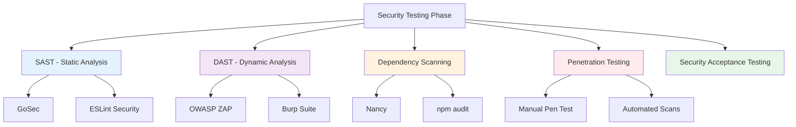
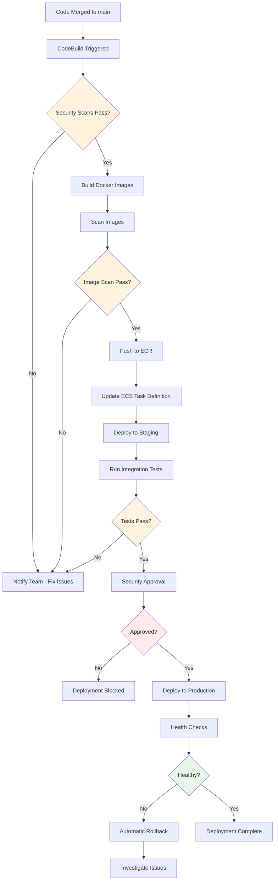

# SECURAA Secure SDLC - Testing, Build, Deployment & Operations
## Comprehensive Guide for Remaining SDLC Phases

---

## Document Control

| **Document Title** | SECURAA SDLC - Testing, Build, Deployment & Operations |
|-------------------|--------------------------------------------------------|
| **Document ID** | SECURAA-SDLC-005-008 (Consolidated) |
| **Version** | 2.0 |
| **Date** | November 13, 2025 |
| **Classification** | Customer-Facing - Confidential |

---

## Document Overview

This consolidated document covers the remaining phases of the SECURAA Secure SDLC:

- **Phase 5: Security Testing** - SAST, DAST, Penetration Testing
- **Phase 6: Build & Deployment** - AWS CodeBuild, ECR, IAM, Container Security
- **Phase 7: Operations & Monitoring** - Production Operations, Security Monitoring
- **Phase 8: CI/CD Security Pipeline** - Automated Security Integration

---

# PHASE 5: SECURITY TESTING

## Testing Phase Overview

The Security Testing Phase validates that security controls are properly implemented and effective before production deployment.

### Testing Objectives

1. **Validate Security Controls** - Verify all security requirements are met
2. **Find Vulnerabilities** - Identify security weaknesses before production
3. **Test Security Scenarios** - Validate security under various attack scenarios
4. **Verify Compliance** - Ensure compliance requirements are satisfied



---

## Static Application Security Testing (SAST)

### GoSec for Go Code

**Configuration:**

```yaml
# .gosec.yml
{
  "global": {
    "nosec": false,
    "show-ignored": true,
    "confidence": "medium",
    "severity": "medium"
  },
  "rules": {
    "G101": {
      "description": "Look for hardcoded credentials",
      "enabled": true
    },
    "G102": {
      "description": "Bind to all interfaces",
      "enabled": true
    },
    "G103": {
      "description": "Audit unsafe block",
      "enabled": true
    },
    "G104": {
      "description": "Audit errors not checked",
      "enabled": true
    },
    "G201": {
      "description": "SQL query construction using string building",
      "enabled": true
    },
    "G401": {
      "description": "Detect MD5 usage",
      "enabled": true
    },
    "G501": {
      "description": "Import blocklist: crypto/md5",
      "enabled": true
    }
  }
}
```

**Running GoSec:**

```bash
# Install GoSec
go install github.com/securego/gosec/v2/cmd/gosec@latest

# Run scan on entire project
gosec -fmt=json -out=gosec-report.json ./...

# Run with specific rules
gosec -include=G101,G102,G103 ./...

# Exclude test files
gosec -exclude-dir=test ./...

# Set severity threshold
gosec -severity=high ./...
```

**Example GoSec Report:**

```json
{
  "Issues": [
    {
      "severity": "HIGH",
      "confidence": "HIGH",
      "rule_id": "G101",
      "details": "Potential hardcoded credentials",
      "file": "/src/config/config.go",
      "code": "password := \"hardcoded_password\"",
      "line": "45",
      "column": "12"
    },
    {
      "severity": "MEDIUM",
      "confidence": "HIGH",
      "rule_id": "G104",
      "details": "Errors unhandled",
      "file": "/src/api/handler.go",
      "code": "db.Query(sql)",
      "line": "123"
    }
  ],
  "Stats": {
    "files": 150,
    "lines": 25000,
    "nosec": 5,
    "found": 2
  }
}
```

### ESLint Security Plugin for JavaScript

**Configuration:**

```javascript
// .eslintrc.js
module.exports = {
  plugins: ['security'],
  extends: ['plugin:security/recommended'],
  rules: {
    'security/detect-object-injection': 'error',
    'security/detect-non-literal-regexp': 'warn',
    'security/detect-unsafe-regex': 'error',
    'security/detect-buffer-noassert': 'error',
    'security/detect-child-process': 'warn',
    'security/detect-disable-mustache-escape': 'error',
    'security/detect-eval-with-expression': 'error',
    'security/detect-no-csrf-before-method-override': 'error',
    'security/detect-non-literal-fs-filename': 'warn',
    'security/detect-non-literal-require': 'warn',
    'security/detect-possible-timing-attacks': 'warn',
    'security/detect-pseudoRandomBytes': 'error'
  }
};
```

**Running ESLint:**

```bash
# Install ESLint and security plugin
npm install --save-dev eslint eslint-plugin-security

# Run ESLint security scan
eslint --ext .js,.jsx src/ --format json --output-file eslint-report.json

# Run with auto-fix for some issues
eslint --ext .js,.jsx src/ --fix
```

---

## Dynamic Application Security Testing (DAST)

### OWASP ZAP Integration

**ZAP Configuration:**

```yaml
# zap-config.yaml
env:
  contexts:
    - name: "SECURAA Application"
      urls:
        - "https://test.securaa.io"
      includePaths:
        - "https://test.securaa.io/api/.*"
      excludePaths:
        - "https://test.securaa.io/logout"
      authentication:
        type: "form"
        loginUrl: "https://test.securaa.io/login"
        loginRequestData: "username=&password="
        usernameParameter: "username"
        passwordParameter: "password"
      users:
        - name: "test_user"
          credentials:
            username: "test@securaa.io"
            password: "Test123!@#"

  scanners:
    passive:
      - id: 10010  # Cookie Poisoning
      - id: 10015  # Incomplete or No Cache-control
      - id: 10017  # Cross-Domain JavaScript Source File Inclusion
      - id: 10019  # Content-Type Header Missing
      - id: 10020  # X-Frame-Options Header Not Set
      - id: 10021  # X-Content-Type-Options Header Missing
    
    active:
      - id: 40012  # Cross Site Scripting (Reflected)
      - id: 40014  # Cross Site Scripting (Persistent)
      - id: 40016  # Cross Site Scripting (Persistent - Prime)
      - id: 40017  # Cross Site Scripting (Persistent - Spider)
      - id: 40018  # SQL Injection
      - id: 90019  # Server Side Include
      - id: 90020  # Remote OS Command Injection
```

**Running OWASP ZAP:**

```bash
#!/bin/bash
# run-zap-scan.sh

# Start ZAP in daemon mode
docker run -d --name zap \
  -p 8080:8080 \
  -v $(pwd)/zap-config:/zap/config:rw \
  owasp/zap2docker-stable zap.sh -daemon \
  -host 0.0.0.0 -port 8080 \
  -config api.key=securaa-zap-key

# Wait for ZAP to start
sleep 30

# Run spider scan
curl "http://localhost:8080/JSON/spider/action/scan/" \
  --data "url=https://test.securaa.io&apikey=securaa-zap-key"

# Run active scan
curl "http://localhost:8080/JSON/ascan/action/scan/" \
  --data "url=https://test.securaa.io&apikey=securaa-zap-key"

# Wait for scan to complete
while [ $(curl "http://localhost:8080/JSON/ascan/view/status/?apikey=securaa-zap-key" | jq '.status') -ne "100" ]; do
  echo "Scan in progress..."
  sleep 30
done

# Generate HTML report
curl "http://localhost:8080/OTHER/core/other/htmlreport/?apikey=securaa-zap-key" \
  -o zap-report.html

# Generate JSON report
curl "http://localhost:8080/JSON/core/view/alerts/?apikey=securaa-zap-key" \
  -o zap-report.json

# Stop ZAP
docker stop zap && docker rm zap
```

**ZAP Report Analysis:**

```python
# analyze-zap-results.py
import json
import sys

def analyze_zap_report(report_file):
    with open(report_file, 'r') as f:
        data = json.load(f)
    
    alerts = data.get('alerts', [])
    
    # Categorize by risk level
    critical = [a for a in alerts if a['risk'] == 'High']
    high = [a for a in alerts if a['risk'] == 'Medium']
    medium = [a for a in alerts if a['risk'] == 'Low']
    
    print(f"OWASP ZAP Security Scan Results")
    print(f"================================")
    print(f"Total Alerts: {len(alerts)}")
    print(f"Critical (High): {len(critical)}")
    print(f"High (Medium): {len(high)}")
    print(f"Medium (Low): {len(medium)}")
    print()
    
    # Print critical issues
    if critical:
        print("CRITICAL ISSUES:")
        for alert in critical:
            print(f"  - {alert['alert']} at {alert['url']}")
            print(f"    {alert['description']}")
            print()
    
    # Fail if critical issues found
    if critical:
        sys.exit(1)
    
    sys.exit(0)

if __name__ == "__main__":
    analyze_zap_report('zap-report.json')
```

---

## Dependency Vulnerability Scanning

### Nancy for Go Dependencies

```bash
# Install Nancy
go install github.com/sonatype-nexus-community/nancy@latest

# Scan dependencies
go list -json -m all | nancy sleuth

# Output to JSON
go list -json -m all | nancy sleuth -output json > nancy-report.json

# Set severity threshold
go list -json -m all | nancy sleuth -exclude-vulnerability CVE-2021-12345
```

### npm audit for JavaScript

```bash
# Run npm audit
npm audit --json > npm-audit-report.json

# Fix vulnerabilities automatically
npm audit fix

# Force fix (may introduce breaking changes)
npm audit fix --force

# Check specific package
npm audit --package=lodash
```

### govulncheck for Go Vulnerabilities

```bash
# Install govulncheck
go install golang.org/x/vuln/cmd/govulncheck@latest

# Run vulnerability check
govulncheck ./...

# Output to JSON
govulncheck -json ./... > govulncheck-report.json
```

---

## Penetration Testing

### Penetration Testing Scope

```yaml
penetration_testing:
  scope:
    in_scope:
      - Web application (https://test.securaa.io)
      - API endpoints (/api/*)
      - Authentication mechanisms
      - Authorization controls
      - Input validation
      - Session management
      - Integration endpoints
    
    out_of_scope:
      - Third-party services
      - Physical security
      - Social engineering
      - Denial of Service testing
      - Production systems
  
  methodology:
    - OWASP Testing Guide v4.2
    - PTES (Penetration Testing Execution Standard)
    - NIST SP 800-115
  
  test_scenarios:
    authentication:
      - Brute force attacks
      - Credential stuffing
      - Session hijacking
      - Token manipulation
      - MFA bypass attempts
    
    authorization:
      - Privilege escalation
      - Horizontal privilege escalation
      - Direct object references
      - Missing function level access control
    
    injection:
      - SQL injection
      - NoSQL injection
      - Command injection
      - LDAP injection
      - XPath injection
    
    xss:
      - Reflected XSS
      - Stored XSS
      - DOM-based XSS
      - XSS in file uploads
    
    business_logic:
      - Payment bypass
      - Rate limiting bypass
      - Workflow manipulation
      - Price manipulation
```

### Penetration Testing Checklist

```markdown
## Authentication Testing
- [ ] Test password policy enforcement
- [ ] Test account lockout mechanism
- [ ] Test password reset functionality
- [ ] Test remember me functionality
- [ ] Test browser cache for credentials
- [ ] Test autocomplete on password forms
- [ ] Test weak credentials (admin/admin)
- [ ] Test for username enumeration
- [ ] Test multi-factor authentication
- [ ] Test session timeout

## Authorization Testing
- [ ] Test directory traversal
- [ ] Test forced browsing
- [ ] Test privilege escalation
- [ ] Test insecure direct object references
- [ ] Test missing function level access control
- [ ] Test horizontal privilege escalation
- [ ] Test API authorization

## Input Validation Testing
- [ ] Test SQL injection (all parameters)
- [ ] Test NoSQL injection
- [ ] Test command injection
- [ ] Test LDAP injection
- [ ] Test XSS (reflected, stored, DOM)
- [ ] Test XXE injection
- [ ] Test file upload vulnerabilities
- [ ] Test buffer overflow
- [ ] Test format string vulnerabilities

## Session Management Testing
- [ ] Test session fixation
- [ ] Test session hijacking
- [ ] Test CSRF protection
- [ ] Test session timeout
- [ ] Test logout functionality
- [ ] Test concurrent sessions
- [ ] Test session token randomness

## Cryptography Testing
- [ ] Test SSL/TLS configuration
- [ ] Test weak cipher suites
- [ ] Test certificate validation
- [ ] Test sensitive data encryption
- [ ] Test password storage
- [ ] Test random number generation

## Business Logic Testing
- [ ] Test payment processing
- [ ] Test workflow bypass
- [ ] Test price manipulation
- [ ] Test quantity limits
- [ ] Test race conditions
- [ ] Test rate limiting

## API Security Testing
- [ ] Test authentication mechanisms
- [ ] Test authorization controls
- [ ] Test rate limiting
- [ ] Test input validation
- [ ] Test error handling
- [ ] Test API versioning
- [ ] Test CORS configuration
```

---

## Security Acceptance Testing

### Security Test Cases

```gherkin
Feature: Secure Authentication

  Scenario: Successful login with valid credentials
    Given the user has valid credentials
    When the user attempts to login
    Then the login should succeed
    And a secure session should be created
    And the login event should be logged
    
  Scenario: Failed login with invalid credentials
    Given the user has invalid credentials
    When the user attempts to login
    Then the login should fail
    And a generic error message should be displayed
    And the failed login attempt should be logged
    And no sensitive information should be exposed
    
  Scenario: Account lockout after multiple failed attempts
    Given the user has made 4 failed login attempts
    When the user makes a 5th failed login attempt
    Then the account should be locked
    And the user should be notified of the lockout
    And the security team should be alerted
    And the lockout event should be logged
    
  Scenario: SQL injection attempt blocked
    Given the user submits malicious SQL in login form
    When the system processes the input
    Then the SQL injection should be blocked
    And the user should receive an error message
    And the attack attempt should be logged
    And the input should not affect the database

Feature: Secure Data Handling

  Scenario: Sensitive data encrypted at rest
    Given sensitive data needs to be stored
    When the data is saved to the database
    Then the data should be encrypted with AES-256
    And the encryption key should be stored securely
    And unencrypted data should never be logged
    
  Scenario: PII data masked in logs
    Given an operation involves PII data
    When the operation is logged
    Then PII data should be masked
    And email addresses should be partially masked
    And phone numbers should be partially masked
    And credit card numbers should not appear in logs
```

---

# PHASE 6: BUILD & DEPLOYMENT

## AWS CodeBuild Integration

### CodeBuild Project Configuration

```yaml
# Core_BuildSpec.yaml (Detailed)
version: 0.2

env:
  variables:
    GO111MODULE: "on"
    GOPATH: "/go"
    ECR_REGISTRY: "665853670667.dkr.ecr.us-east-2.amazonaws.com"
    IMAGE_TAG: "latest"
  
  parameter-store:
    DOCKER_USERNAME: "/securaa/docker/username"
    DOCKER_PASSWORD: "/securaa/docker/password"
  
  secrets-manager:
    DB_PASSWORD: "securaa/prod/db:password"
    ENCRYPTION_KEY: "securaa/prod/encryption:key"

phases:
  install:
    runtime-versions:
      golang: 1.17
      nodejs: 16
      python: 3.9
    commands:
      - echo "Installing dependencies..."
      - apt-get update -y
      - apt-get install -y jq unzip
      
      # Install security tools
      - go install github.com/securego/gosec/v2/cmd/gosec@latest
      - go install github.com/sonatype-nexus-community/nancy@latest
      - go install golang.org/x/vuln/cmd/govulncheck@latest
      - npm install -g snyk
  
  pre_build:
    commands:
      - echo "Pre-build phase started..."
      - echo "Current directory:" && pwd
      - echo "Listing files:" && ls -la
      
      # Download dependencies from internal repo
      - wget https://repo.securaa.io/github.com.zip
      - unzip -q github.com.zip -d $GOPATH/src/
      - wget https://repo.securaa.io/gopkg.in.zip
      - unzip -q gopkg.in.zip -d $GOPATH/src/
      
      # ECR Login
      - echo "Logging into Amazon ECR..."
      - aws ecr get-login-password --region us-east-2 | docker login --username AWS --password-stdin $ECR_REGISTRY
      
      # Security Scans
      - echo "Running GoSec security scan..."
      - gosec -fmt=json -out=gosec-report.json ./... || true
      
      - echo "Running dependency vulnerability scan..."
      - go list -json -m all | nancy sleuth -output json > nancy-report.json || true
      
      - echo "Running govulncheck..."
      - govulncheck ./... || true
      
      # Analyze scan results
      - echo "Analyzing security scan results..."
      - python3 scripts/analyze-security-results.py
  
  build:
    commands:
      - echo "Build phase started..."
      - cd $CODEBUILD_SRC_DIR
      
      # Go build
      - echo "Building Go services..."
      - export GO111MODULE=on
      - go mod tidy -compat=1.17
      - go mod verify
      - make clean
      - make vendor
      - make build
      
      # Run tests
      - echo "Running unit tests..."
      - go test ./... -v -coverprofile=coverage.out
      - go tool cover -func=coverage.out
      
      # Build Docker images
      - echo "Building Docker images..."
      - |
        for service in zona_user zona_integrations zona_siem; do
          echo "Building $service..."
          docker build \
            --build-arg BUILD_DATE=$(date -u +'%Y-%m-%dT%H:%M:%SZ') \
            --build-arg VCS_REF=$(git rev-parse --short HEAD) \
            --build-arg VERSION=$IMAGE_TAG \
            --tag $ECR_REGISTRY/securaa/$service:$IMAGE_TAG \
            --tag $ECR_REGISTRY/securaa/$service:$CODEBUILD_BUILD_NUMBER \
            -f zona_services/$service/Dockerfile \
            .
          
          # Scan image for vulnerabilities
          echo "Scanning $service image..."
          docker scan $ECR_REGISTRY/securaa/$service:$IMAGE_TAG || true
        done
      
      # Build RPM packages
      - echo "Building RPM packages..."
      - cd $CODEBUILD_SRC_DIR/pkg
      - make clean rpm_mssp_core
  
  post_build:
    commands:
      - echo "Post-build phase started..."
      
      # Push Docker images to ECR
      - echo "Pushing images to ECR..."
      - |
        for service in zona_user zona_integrations zona_siem; do
          docker push $ECR_REGISTRY/securaa/$service:$IMAGE_TAG
          docker push $ECR_REGISTRY/securaa/$service:$CODEBUILD_BUILD_NUMBER
        done
      
      # Generate build metadata
      - echo "Generating build metadata..."
      - |
        cat > build-metadata.json <<EOF
        {
          "build_number": "$CODEBUILD_BUILD_NUMBER",
          "build_id": "$CODEBUILD_BUILD_ID",
          "commit_id": "$(git rev-parse HEAD)",
          "commit_message": "$(git log -1 --pretty=%B)",
          "build_timestamp": "$(date -u +'%Y-%m-%dT%H:%M:%SZ')",
          "images": [
            "$ECR_REGISTRY/securaa/zona_user:$CODEBUILD_BUILD_NUMBER",
            "$ECR_REGISTRY/securaa/zona_integrations:$CODEBUILD_BUILD_NUMBER",
            "$ECR_REGISTRY/securaa/zona_siem:$CODEBUILD_BUILD_NUMBER"
          ]
        }
        EOF
      
      - echo "Build completed successfully!"

artifacts:
  files:
    - '**/*'
  name: securaa-build-$CODEBUILD_BUILD_NUMBER
  base-directory: $CODEBUILD_SRC_DIR

reports:
  SecurityReports:
    files:
      - 'gosec-report.json'
      - 'nancy-report.json'
    file-format: 'JSON'
  
  TestReports:
    files:
      - 'coverage.out'
    file-format: 'GOCOVERPROFILE'

cache:
  paths:
    - '/root/.cache/go-build/**/*'
    - '/go/pkg/mod/**/*'
```

### Build Security Gates

```python
# scripts/analyze-security-results.py
import json
import sys

def analyze_gosec_report():
    """Analyze GoSec results and fail build if critical issues found"""
    try:
        with open('gosec-report.json', 'r') as f:
            report = json.load(f)
        
        issues = report.get('Issues', [])
        critical = [i for i in issues if i['severity'] == 'HIGH' and i['confidence'] == 'HIGH']
        high = [i for i in issues if i['severity'] == 'MEDIUM' and i['confidence'] == 'HIGH']
        
        print(f"\n=== GoSec Results ===")
        print(f"Critical Issues: {len(critical)}")
        print(f"High Issues: {len(high)}")
        
        if critical:
            print("\nCRITICAL ISSUES FOUND:")
            for issue in critical:
                print(f"  {issue['rule_id']}: {issue['details']}")
                print(f"  File: {issue['file']}:{issue['line']}")
            return False
        
        return True
    except Exception as e:
        print(f"Error analyzing GoSec report: {e}")
        return True  # Don't fail build on analysis error

def analyze_nancy_report():
    """Analyze Nancy dependency scan results"""
    try:
        with open('nancy-report.json', 'r') as f:
            report = json.load(f)
        
        vulnerable = report.get('vulnerable', [])
        critical_vulns = [v for v in vulnerable if v.get('cvss_score', 0) >= 9.0]
        
        print(f"\n=== Nancy Dependency Scan ===")
        print(f"Total Vulnerable Dependencies: {len(vulnerable)}")
        print(f"Critical Vulnerabilities (CVSS >= 9.0): {len(critical_vulns)}")
        
        if critical_vulns:
            print("\nCRITICAL VULNERABILITIES FOUND:")
            for vuln in critical_vulns:
                print(f"  {vuln['coordinates']}")
                print(f"  CVE: {vuln['cve']}")
                print(f"  CVSS: {vuln['cvss_score']}")
            return False
        
        return True
    except Exception as e:
        print(f"Error analyzing Nancy report: {e}")
        return True

def main():
    gosec_ok = analyze_gosec_report()
    nancy_ok = analyze_nancy_report()
    
    if not gosec_ok or not nancy_ok:
        print("\n❌ BUILD FAILED: Critical security issues found!")
        sys.exit(1)
    else:
        print("\n✅ Security checks passed!")
        sys.exit(0)

if __name__ == "__main__":
    main()
```

---

## Container Security

### Secure Dockerfile

```dockerfile
# Multi-stage build for security and size optimization
FROM golang:1.17-alpine AS builder

# Security: Add CA certificates
RUN apk --no-cache add ca-certificates git

# Security: Create non-root user
RUN addgroup -S appgroup && adduser -S appuser -G appgroup

WORKDIR /build

# Copy go mod files
COPY go.mod go.sum ./
RUN go mod download && go mod verify

# Copy source code
COPY . .

# Build with security flags
RUN CGO_ENABLED=0 GOOS=linux GOARCH=amd64 \
    go build -a -installsuffix cgo \
    -ldflags='-w -s -extldflags "-static"' \
    -o /app/main ./cmd/main.go

# Final stage - minimal image
FROM alpine:3.18

# Security: Install only CA certificates and upgrade packages
RUN apk --no-cache add ca-certificates tzdata && \
    apk --no-cache upgrade && \
    rm -rf /var/cache/apk/*

# Security: Create non-root user
RUN addgroup -S appgroup && adduser -S appuser -G appgroup

# Security: Create necessary directories with proper permissions
RUN mkdir -p /app/logs /app/data && \
    chown -R appuser:appgroup /app

# Security: Switch to non-root user
USER appuser

WORKDIR /app

# Copy binary from builder with proper ownership
COPY --from=builder --chown=appuser:appgroup /app/main .

# Security: Use non-privileged port
EXPOSE 8080

# Security: Define health check
HEALTHCHECK --interval=30s --timeout=3s --start-period=5s --retries=3 \
  CMD wget --no-verbose --tries=1 --spider http://localhost:8080/health || exit 1

# Security: Set read-only root filesystem (add volumes for writable dirs)
VOLUME ["/app/logs", "/app/data"]

# Security: Drop all capabilities and add only required ones
# These are enforced at runtime via docker-compose or kubernetes

# Run application
CMD ["./main"]
```

### Container Scanning

```bash
#!/bin/bash
# scan-container.sh

IMAGE=$1

echo "Scanning Docker image: $IMAGE"

# 1. Scan with Docker Scout (if available)
if command -v docker scout &> /dev/null; then
    echo "Running Docker Scout scan..."
    docker scout cves $IMAGE
fi

# 2. Scan with Trivy
echo "Running Trivy scan..."
docker run --rm \
    -v /var/run/docker.sock:/var/run/docker.sock \
    aquasec/trivy image \
    --severity HIGH,CRITICAL \
    --format json \
    --output trivy-report.json \
    $IMAGE

# 3. Analyze results
python3 << 'EOF'
import json

with open('trivy-report.json', 'r') as f:
    report = json.load(f)

critical = 0
high = 0

for result in report.get('Results', []):
    for vuln in result.get('Vulnerabilities', []):
        severity = vuln.get('Severity', '')
        if severity == 'CRITICAL':
            critical += 1
        elif severity == 'HIGH':
            high += 1

print(f"\nScan Summary:")
print(f"Critical: {critical}")
print(f"High: {high}")

if critical > 0:
    print("\n❌ CRITICAL vulnerabilities found!")
    exit(1)
else:
    print("\n✅ No critical vulnerabilities!")
    exit(0)
EOF
```

---

## Amazon ECR Security

### ECR Repository Configuration

```json
{
  "repositoryName": "securaa/zona_services",
  "imageScanningConfiguration": {
    "scanOnPush": true
  },
  "encryptionConfiguration": {
    "encryptionType": "KMS",
    "kmsKey": "arn:aws:kms:us-east-2:665853670667:key/securaa-ecr-key"
  },
  "imageTagMutability": "IMMUTABLE",
  "lifecyclePolicy": {
    "rules": [
      {
        "rulePriority": 1,
        "description": "Keep last 10 production images",
        "selection": {
          "tagStatus": "tagged",
          "tagPrefixList": ["prod"],
          "countType": "imageCountMoreThan",
          "countNumber": 10
        },
        "action": {
          "type": "expire"
        }
      },
      {
        "rulePriority": 2,
        "description": "Remove untagged images after 7 days",
        "selection": {
          "tagStatus": "untagged",
          "countType": "sinceImagePushed",
          "countUnit": "days",
          "countNumber": 7
        },
        "action": {
          "type": "expire"
        }
      }
    ]
  }
}
```

### ECR Access Policy (IAM)

```json
{
  "Version": "2012-10-17",
  "Statement": [
    {
      "Sid": "AllowCodeBuildPush",
      "Effect": "Allow",
      "Principal": {
        "Service": "codebuild.amazonaws.com",
        "AWS": "arn:aws:iam::665853670667:role/SecuraaCodeBuildRole"
      },
      "Action": [
        "ecr:BatchCheckLayerAvailability",
        "ecr:CompleteLayerUpload",
        "ecr:InitiateLayerUpload",
        "ecr:PutImage",
        "ecr:UploadLayerPart"
      ]
    },
    {
      "Sid": "AllowEC2Pull",
      "Effect": "Allow",
      "Principal": {
        "AWS": "arn:aws:iam::665853670667:role/SecuraaEC2Role"
      },
      "Action": [
        "ecr:GetDownloadUrlForLayer",
        "ecr:BatchGetImage"
      ]
    },
    {
      "Sid": "DenyUnencryptedPush",
      "Effect": "Deny",
      "Principal": "*",
      "Action": "ecr:PutImage",
      "Condition": {
        "StringNotEquals": {
          "ecr:ImageEncryption": "KMS"
        }
      }
    }
  ]
}
```

---

## Deployment Process

### Deployment Pipeline



### Deployment Script

```bash
#!/bin/bash
# deploy.sh

set -euo pipefail

ENVIRONMENT=$1
VERSION=$2

echo "=== Deploying SECURAA to $ENVIRONMENT ==="
echo "Version: $VERSION"

# 1. Pre-deployment checks
echo "Running pre-deployment checks..."
./scripts/pre-deploy-checks.sh $ENVIRONMENT

# 2. Update task definitions
echo "Updating ECS task definitions..."
aws ecs register-task-definition \
  --cli-input-json file://task-definitions/$ENVIRONMENT/zona-services.json

# 3. Update services
echo "Updating ECS services..."
aws ecs update-service \
  --cluster securaa-$ENVIRONMENT \
  --service zona-services \
  --task-definition zona-services:$VERSION \
  --force-new-deployment

# 4. Wait for deployment
echo "Waiting for deployment to complete..."
aws ecs wait services-stable \
  --cluster securaa-$ENVIRONMENT \
  --services zona-services

# 5. Post-deployment validation
echo "Running post-deployment validation..."
./scripts/post-deploy-validation.sh $ENVIRONMENT

# 6. Health checks
echo "Performing health checks..."
for i in {1..10}; do
  if curl -sf https://$ENVIRONMENT.securaa.io/health > /dev/null; then
    echo "✅ Health check passed!"
    break
  fi
  echo "Waiting for service to be healthy... ($i/10)"
  sleep 30
done

echo "=== Deployment completed successfully! ==="
```

---

# PHASE 7: OPERATIONS & MONITORING

## Security Monitoring

### CloudWatch Dashboards

```json
{
  "widgets": [
    {
      "type": "metric",
      "properties": {
        "metrics": [
          ["SECURAA", "AuthenticationFailures", {"stat": "Sum"}],
          [".", "AuthenticationSuccess", {"stat": "Sum"}]
        ],
        "period": 300,
        "stat": "Sum",
        "region": "us-east-2",
        "title": "Authentication Events",
        "yAxis": {
          "left": {
            "min": 0
          }
        }
      }
    },
    {
      "type": "metric",
      "properties": {
        "metrics": [
          ["SECURAA", "API4xxErrors", {"stat": "Sum"}],
          [".", "API5xxErrors", {"stat": "Sum"}]
        ],
        "period": 300,
        "stat": "Sum",
        "region": "us-east-2",
        "title": "API Errors"
      }
    },
    {
      "type": "log",
      "properties": {
        "query": "SOURCE '/aws/securaa/api'\n| fields @timestamp, @message\n| filter @message like /security_event/\n| sort @timestamp desc",
        "region": "us-east-2",
        "title": "Security Events",
        "stacked": false
      }
    }
  ]
}
```

### Security Event Logging

```go
// Security event logging structure
package monitoring

import (
    "go.uber.org/zap"
    "time"
)

type SecurityEvent struct {
    Timestamp   time.Time `json:"timestamp"`
    EventType   string    `json:"event_type"`
    Severity    string    `json:"severity"`
    UserID      string    `json:"user_id,omitempty"`
    IPAddress   string    `json:"ip_address"`
    Resource    string    `json:"resource,omitempty"`
    Action      string    `json:"action"`
    Result      string    `json:"result"`
    Details     string    `json:"details,omitempty"`
}

func LogSecurityEvent(logger *zap.Logger, event SecurityEvent) {
    event.Timestamp = time.Now().UTC()
    
    logger.Info("security_event",
        zap.Time("timestamp", event.Timestamp),
        zap.String("event_type", event.EventType),
        zap.String("severity", event.Severity),
        zap.String("user_id", event.UserID),
        zap.String("ip_address", event.IPAddress),
        zap.String("resource", event.Resource),
        zap.String("action", event.Action),
        zap.String("result", event.Result),
        zap.String("details", event.Details),
    )
    
    // Send critical events to SIEM
    if event.Severity == "CRITICAL" || event.Severity == "HIGH" {
        sendToSIEM(event)
    }
}

// Example usage
func HandleLogin(w http.ResponseWriter, r *http.Request) {
    username := r.FormValue("username")
    password := r.FormValue("password")
    
    user, err := authenticateUser(username, password)
    if err != nil {
        LogSecurityEvent(logger, SecurityEvent{
            EventType:  "authentication",
            Severity:   "MEDIUM",
            UserID:     username,
            IPAddress:  getClientIP(r),
            Action:     "login",
            Result:     "failure",
            Details:    "Invalid credentials",
        })
        
        http.Error(w, "Authentication failed", http.StatusUnauthorized)
        return
    }
    
    LogSecurityEvent(logger, SecurityEvent{
        EventType:  "authentication",
        Severity:   "INFO",
        UserID:     user.ID,
        IPAddress:  getClientIP(r),
        Action:     "login",
        Result:     "success",
    })
    
    // Continue with successful login...
}
```

### Alerting Rules

```yaml
# CloudWatch Alarms
alarms:
  high_authentication_failures:
    metric: "AuthenticationFailures"
    threshold: 50
    period: 300  # 5 minutes
    evaluation_periods: 1
    comparison_operator: "GreaterThanThreshold"
    actions:
      - "arn:aws:sns:us-east-2:665853670667:security-alerts"
    description: "Alert when authentication failures exceed threshold"
  
  critical_api_errors:
    metric: "API5xxErrors"
    threshold: 100
    period: 300
    evaluation_periods: 2
    comparison_operator: "GreaterThanThreshold"
    actions:
      - "arn:aws:sns:us-east-2:665853670667:ops-alerts"
    description: "Alert when API 5xx errors exceed threshold"
  
  unauthorized_access_attempts:
    query: "fields @timestamp | filter @message like /401|403/ | stats count() as attempts"
    threshold: 30
    period: 300
    actions:
      - "arn:aws:sns:us-east-2:665853670667:security-alerts"
    description: "Alert on excessive unauthorized access attempts"
```

---

## Incident Response

### Incident Response Plan

```yaml
incident_response:
  severity_levels:
    critical:
      description: "Production system compromised or data breach"
      response_time: "Immediate (< 15 minutes)"
      escalation: "CISO, CTO, CEO"
      actions:
        - Activate incident response team
        - Isolate affected systems
        - Preserve evidence
        - Notify stakeholders
        - Engage external security firm if needed
    
    high:
      description: "Security vulnerability actively exploited"
      response_time: "< 1 hour"
      escalation: "Security team lead, Engineering director"
      actions:
        - Assess impact and scope
        - Implement containment measures
        - Deploy patches/fixes
        - Monitor for continued activity
    
    medium:
      description: "Security vulnerability discovered"
      response_time: "< 4 hours"
      escalation: "Security team"
      actions:
        - Analyze vulnerability
        - Develop remediation plan
        - Schedule deployment
        - Update documentation
    
    low:
      description: "Potential security issue identified"
      response_time: "< 1 business day"
      escalation: "Development team"
      actions:
        - Investigate issue
        - Assess risk
        - Create ticket for resolution

  communication:
    internal:
      - Security team via Slack #security-incidents
      - Engineering team via Slack #engineering-alerts
      - Management via email and phone
    
    external:
      - Customers (if affected) within 72 hours
      - Regulators (if required) per compliance requirements
      - Law enforcement (if criminal activity)
    
  documentation:
    - Incident timeline
    - Actions taken
    - Systems affected
    - Data compromised (if any)
    - Root cause analysis
    - Remediation steps
    - Lessons learned
```

---

# PHASE 8: CI/CD SECURITY PIPELINE

## Integrated Security Pipeline

```yaml
# Complete security integration in CodeBuild
version: 0.2

phases:
  install:
    commands:
      # Install all security tools
      - ./scripts/install-security-tools.sh
  
  pre_build:
    commands:
      # 1. Secrets scanning
      - gitleaks detect --source . --verbose
      
      # 2. SAST scanning
      - gosec -fmt=json -out=gosec.json ./...
      - eslint --format json --output-file eslint.json src/
      
      # 3. Dependency scanning
      - go list -json -m all | nancy sleuth
      - npm audit --json > npm-audit.json
      
      # 4. License compliance
      - go-licenses check ./...
      
      # 5. Analyze results
      - python3 scripts/security-gate.py
  
  build:
    commands:
      # Build if security checks pass
      - make build
      - make test
  
  post_build:
    commands:
      # Container scanning
      - docker build -t app:latest .
      - trivy image --severity HIGH,CRITICAL app:latest
      
      # DAST scanning (for staging deployments)
      - |
        if [ "$ENVIRONMENT" = "staging" ]; then
          ./scripts/run-dast-scan.sh
        fi
      
      # Generate security report
      - ./scripts/generate-security-report.sh
```

### Security Gate Script

```python
# scripts/security-gate.py
import json
import sys
from typing import Dict, List

class SecurityGate:
    def __init__(self):
        self.passed = True
        self.critical_count = 0
        self.high_count = 0
        self.findings = []
    
    def check_gosec(self):
        """Check GoSec results"""
        try:
            with open('gosec.json', 'r') as f:
                data = json.load(f)
            
            for issue in data.get('Issues', []):
                severity = issue.get('severity', '')
                confidence = issue.get('confidence', '')
                
                if severity == 'HIGH' and confidence == 'HIGH':
                    self.critical_count += 1
                    self.findings.append({
                        'tool': 'GoSec',
                        'severity': 'CRITICAL',
                        'issue': issue.get('details', ''),
                        'file': issue.get('file', ''),
                        'line': issue.get('line', '')
                    })
                elif severity == 'MEDIUM' and confidence == 'HIGH':
                    self.high_count += 1
        
        except Exception as e:
            print(f"Error checking GoSec: {e}")
    
    def check_nancy(self):
        """Check Nancy dependency scan"""
        try:
            with open('nancy.json', 'r') as f:
                data = json.load(f)
            
            for vuln in data.get('vulnerable', []):
                cvss = vuln.get('cvss_score', 0)
                if cvss >= 9.0:
                    self.critical_count += 1
                    self.findings.append({
                        'tool': 'Nancy',
                        'severity': 'CRITICAL',
                        'issue': f"{vuln.get('cve', '')}: {vuln.get('title', '')}",
                        'package': vuln.get('coordinates', '')
                    })
                elif cvss >= 7.0:
                    self.high_count += 1
        
        except Exception as e:
            print(f"Error checking Nancy: {e}")
    
    def check_eslint(self):
        """Check ESLint security plugin results"""
        try:
            with open('eslint.json', 'r') as f:
                data = json.load(f)
            
            for file_result in data:
                for message in file_result.get('messages', []):
                    if message.get('severity', 0) == 2:  # Error
                        rule_id = message.get('ruleId', '')
                        if 'security' in rule_id:
                            self.high_count += 1
                            self.findings.append({
                                'tool': 'ESLint',
                                'severity': 'HIGH',
                                'issue': message.get('message', ''),
                                'file': file_result.get('filePath', ''),
                                'line': message.get('line', '')
                            })
        
        except Exception as e:
            print(f"Error checking ESLint: {e}")
    
    def evaluate(self) -> bool:
        """Evaluate if security gate passes"""
        print("\n" + "="*60)
        print("SECURITY GATE EVALUATION")
        print("="*60)
        
        self.check_gosec()
        self.check_nancy()
        self.check_eslint()
        
        print(f"\nFindings Summary:")
        print(f"  Critical: {self.critical_count}")
        print(f"  High: {self.high_count}")
        
        if self.critical_count > 0:
            print("\n❌ SECURITY GATE FAILED: Critical issues found!")
            self.passed = False
        elif self.high_count > 5:
            print(f"\n❌ SECURITY GATE FAILED: Too many high severity issues ({self.high_count})!")
            self.passed = False
        else:
            print("\n✅ SECURITY GATE PASSED!")
        
        # Print detailed findings
        if not self.passed:
            print("\nDetailed Findings:")
            for finding in self.findings[:10]:  # Show first 10
                print(f"\n[{finding['tool']}] {finding['severity']}")
                print(f"  {finding['issue']}")
                if 'file' in finding:
                    print(f"  Location: {finding['file']}:{finding.get('line', '')}")
        
        print("="*60 + "\n")
        
        return self.passed

if __name__ == "__main__":
    gate = SecurityGate()
    if gate.evaluate():
        sys.exit(0)
    else:
        sys.exit(1)
```

---

## Testing Phase Exit Criteria

✅ **All SAST scans completed and critical issues resolved**  
✅ **DAST scans completed with no high-risk findings**  
✅ **Dependency vulnerabilities addressed**  
✅ **Penetration testing completed (for major releases)**  
✅ **Security acceptance tests passing**  
✅ **Security team sign-off obtained**

## Build & Deployment Phase Exit Criteria

✅ **Build completed successfully**  
✅ **Container images scanned and approved**  
✅ **Images pushed to ECR with proper tags**  
✅ **Deployment to staging successful**  
✅ **Integration tests passing**  
✅ **Production deployment approved**  
✅ **Health checks passing**

## Operations Phase Exit Criteria

✅ **Monitoring dashboards configured**  
✅ **Security alerts configured**  
✅ **Logging properly configured**  
✅ **Incident response procedures documented**  
✅ **On-call rotation established**  
✅ **Runbooks created and tested**

---

## Summary

This consolidated document provides comprehensive coverage of the remaining SDLC phases:

- **Testing**: Complete security testing strategy with SAST, DAST, dependency scanning, and penetration testing
- **Build & Deployment**: AWS CodeBuild integration, container security, ECR management, and secure deployment processes
- **Operations**: Security monitoring, logging, alerting, and incident response
- **CI/CD Pipeline**: Integrated security automation throughout the development pipeline

For the complete SDLC process, refer to:
- [01_SDLC_Overview.md](01_SDLC_Overview.md) - Process overview
- [02_Requirements_Phase.md](02_Requirements_Phase.md) - Security requirements
- [03_Design_Phase.md](03_Design_Phase.md) - Secure architecture
- [04_Development_Phase.md](04_Development_Phase.md) - Secure coding

---

*This document is part of the SECURAA Secure SDLC documentation suite. For questions, contact security@securaa.com*
