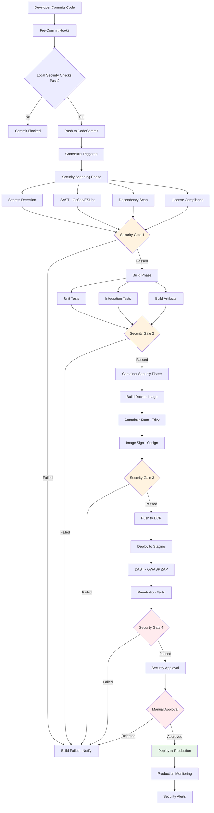

# SECURAA Secure SDLC - CI/CD Security Pipeline
## Comprehensive Automated Security Integration

---

## Document Control

| **Document Title** | SECURAA SDLC - CI/CD Security Pipeline |
|-------------------|----------------------------------------|
| **Document ID** | SECURAA-SDLC-008 |
| **Version** | 2.0 |
| **Date** | November 13, 2025 |
| **Classification** | Customer-Facing - Confidential |
| **Status** | Published |

---

## Table of Contents

1. [CI/CD Security Overview](#cicd-security-overview)
2. [Security Pipeline Architecture](#security-pipeline-architecture)
3. [Pre-Commit Security Hooks](#pre-commit-security-hooks)
4. [AWS CodeBuild Security Integration](#aws-codebuild-security-integration)
5. [Security Gates and Thresholds](#security-gates-and-thresholds)
6. [Automated Security Testing](#automated-security-testing)
7. [Container Security Pipeline](#container-security-pipeline)
8. [Continuous Security Monitoring](#continuous-security-monitoring)
9. [Security Metrics and Reporting](#security-metrics-and-reporting)
10. [Pipeline Security Best Practices](#pipeline-security-best-practices)

---

## CI/CD Security Overview

### Philosophy: Security as Code

The SECURAA CI/CD pipeline implements **"Security as Code"** - treating security controls, policies, and tests as code that is version-controlled, automated, and continuously validated.

### Key Principles

1. **Shift Left Security** - Identify and fix security issues as early as possible
2. **Automated Security Testing** - Every commit triggers automated security scans
3. **Fail Fast** - Stop the pipeline immediately when critical security issues are found
4. **Security Gates** - Define clear security criteria that must be met before progression
5. **Continuous Compliance** - Automated compliance checking at every stage
6. **Immutable Artifacts** - All artifacts are immutable and traceable
7. **Defense in Depth** - Multiple layers of security validation



---

## Security Pipeline Architecture

### Pipeline Stages

```yaml
# Complete CI/CD Security Pipeline Configuration
pipeline_stages:
  stage_1_pre_commit:
    name: "Developer Workstation"
    security_controls:
      - Secrets detection (git-secrets, gitleaks)
      - SAST (GoSec, ESLint)
      - Code formatting and linting
      - Unit tests with security scenarios
    tools:
      - pre-commit hooks
      - husky (for JavaScript)
    gate: "Block commit if critical issues found"
    
  stage_2_commit_validation:
    name: "AWS CodeCommit"
    security_controls:
      - Branch protection rules
      - Signed commits validation
      - PR security checklist
      - Code review requirements
    tools:
      - AWS CodeCommit
      - Git hooks
    gate: "Require security team review for sensitive changes"
    
  stage_3_build_security:
    name: "AWS CodeBuild - Security Phase"
    security_controls:
      - Secrets scanning (full repository)
      - SAST (GoSec, ESLint, Semgrep)
      - Dependency vulnerability scanning (Nancy, npm audit)
      - License compliance checking
      - Code coverage analysis
    tools:
      - AWS CodeBuild
      - Security scanning tools
    gate: "Fail build if critical vulnerabilities found"
    
  stage_4_artifact_build:
    name: "AWS CodeBuild - Build Phase"
    security_controls:
      - Secure build environment
      - Immutable artifact creation
      - Build provenance generation
      - SBOM generation
    tools:
      - AWS CodeBuild
      - Docker
      - Go build tools
    gate: "Build must succeed with all tests passing"
    
  stage_5_container_security:
    name: "Container Security Validation"
    security_controls:
      - Container image scanning (Trivy, ECR scanning)
      - Base image validation
      - Container configuration security
      - Image signing (Cosign)
    tools:
      - Trivy
      - AWS ECR
      - Cosign
    gate: "Block deployment if high/critical vulnerabilities found"
    
  stage_6_staging_deployment:
    name: "Staging Environment"
    security_controls:
      - DAST scanning (OWASP ZAP)
      - API security testing
      - Integration security tests
      - Performance security tests
    tools:
      - OWASP ZAP
      - Custom security tests
    gate: "All security tests must pass"
    
  stage_7_production_approval:
    name: "Security Approval Gate"
    security_controls:
      - Security team review
      - Compliance validation
      - Risk assessment
      - Change approval
    tools:
      - Manual review process
      - AWS CodePipeline approval action
    gate: "Require explicit security approval"
    
  stage_8_production_deployment:
    name: "Production Environment"
    security_controls:
      - Blue-green deployment
      - Canary deployment
      - Automatic rollback on security alerts
      - Production security monitoring
    tools:
      - AWS ECS
      - CloudWatch
      - Custom deployment scripts
    gate: "Health checks and security monitoring must pass"
```

---

## Pre-Commit Security Hooks

### Git Pre-Commit Configuration

```bash
#!/bin/bash
# .git/hooks/pre-commit
# SECURAA Pre-Commit Security Hook

set -e

echo "🔒 Running SECURAA Pre-Commit Security Checks..."

# Color codes for output
RED='\033[0;31m'
GREEN='\033[0;32m'
YELLOW='\033[1;33m'
NC='\033[0m' # No Color

# Track if any checks fail
CHECKS_FAILED=0

# 1. Secrets Detection
echo -e "\n${YELLOW}[1/6] Checking for secrets...${NC}"
if command -v gitleaks &> /dev/null; then
    if ! gitleaks protect --staged --verbose; then
        echo -e "${RED}❌ Secrets detected in staged files!${NC}"
        CHECKS_FAILED=1
    else
        echo -e "${GREEN}✅ No secrets detected${NC}"
    fi
else
    echo -e "${YELLOW}⚠️  gitleaks not installed, skipping secrets check${NC}"
fi

# 2. Go Security Scanning
echo -e "\n${YELLOW}[2/6] Running GoSec security scan...${NC}"
if command -v gosec &> /dev/null; then
    # Get list of staged Go files
    GO_FILES=$(git diff --cached --name-only --diff-filter=ACM | grep '\.go$' || true)
    
    if [ -n "$GO_FILES" ]; then
        if ! gosec -quiet ./...; then
            echo -e "${RED}❌ GoSec found security issues!${NC}"
            CHECKS_FAILED=1
        else
            echo -e "${GREEN}✅ GoSec scan passed${NC}"
        fi
    else
        echo -e "${GREEN}✅ No Go files to scan${NC}"
    fi
else
    echo -e "${YELLOW}⚠️  gosec not installed, skipping Go security scan${NC}"
fi

# 3. Go Dependency Check
echo -e "\n${YELLOW}[3/6] Checking Go dependencies for vulnerabilities...${NC}"
if command -v nancy &> /dev/null; then
    if ! go list -json -m all | nancy sleuth --quiet; then
        echo -e "${RED}❌ Vulnerable dependencies detected!${NC}"
        CHECKS_FAILED=1
    else
        echo -e "${GREEN}✅ No vulnerable dependencies${NC}"
    fi
else
    echo -e "${YELLOW}⚠️  nancy not installed, skipping dependency check${NC}"
fi

# 4. JavaScript/TypeScript Security Linting
echo -e "\n${YELLOW}[4/6] Running ESLint security checks...${NC}"
JS_FILES=$(git diff --cached --name-only --diff-filter=ACM | grep -E '\.(js|jsx|ts|tsx)$' || true)

if [ -n "$JS_FILES" ]; then
    if command -v eslint &> /dev/null; then
        if ! eslint $JS_FILES; then
            echo -e "${RED}❌ ESLint security issues found!${NC}"
            CHECKS_FAILED=1
        else
            echo -e "${GREEN}✅ ESLint checks passed${NC}"
        fi
    else
        echo -e "${YELLOW}⚠️  eslint not installed, skipping JavaScript security check${NC}"
    fi
else
    echo -e "${GREEN}✅ No JavaScript files to check${NC}"
fi

# 5. License Compliance Check
echo -e "\n${YELLOW}[5/6] Checking license compliance...${NC}"
# Check if go.mod was modified
if git diff --cached --name-only | grep -q "go.mod"; then
    if command -v go-licenses &> /dev/null; then
        if ! go-licenses check ./...; then
            echo -e "${RED}❌ License compliance issues found!${NC}"
            CHECKS_FAILED=1
        else
            echo -e "${GREEN}✅ License compliance check passed${NC}"
        fi
    else
        echo -e "${YELLOW}⚠️  go-licenses not installed, skipping license check${NC}"
    fi
else
    echo -e "${GREEN}✅ No dependency changes to check${NC}"
fi

# 6. Run Unit Tests with Security Focus
echo -e "\n${YELLOW}[6/6] Running unit tests...${NC}"
if [ -f "Makefile" ] && grep -q "^test:" Makefile; then
    if ! make test-fast; then
        echo -e "${RED}❌ Unit tests failed!${NC}"
        CHECKS_FAILED=1
    else
        echo -e "${GREEN}✅ Unit tests passed${NC}"
    fi
elif [ -f "go.mod" ]; then
    if ! go test -short ./...; then
        echo -e "${RED}❌ Go tests failed!${NC}"
        CHECKS_FAILED=1
    else
        echo -e "${GREEN}✅ Go tests passed${NC}"
    fi
else
    echo -e "${YELLOW}⚠️  No test configuration found, skipping tests${NC}"
fi

# Final result
echo -e "\n${YELLOW}━━━━━━━━━━━━━━━━━━━━━━━━━━━━━━━━━━━━━━━━${NC}"
if [ $CHECKS_FAILED -eq 1 ]; then
    echo -e "${RED}❌ Pre-commit checks FAILED!${NC}"
    echo -e "${RED}Please fix the issues above before committing.${NC}"
    echo -e "${YELLOW}━━━━━━━━━━━━━━━━━━━━━━━━━━━━━━━━━━━━━━━━${NC}"
    exit 1
else
    echo -e "${GREEN}✅ All pre-commit checks PASSED!${NC}"
    echo -e "${YELLOW}━━━━━━━━━━━━━━━━━━━━━━━━━━━━━━━━━━━━━━━━${NC}"
    exit 0
fi
```

### Pre-Commit Installation Script

```bash
#!/bin/bash
# install-pre-commit-hooks.sh

echo "Installing SECURAA Pre-Commit Security Hooks..."

# Make hooks directory if it doesn't exist
mkdir -p .git/hooks

# Copy pre-commit hook
cp scripts/pre-commit .git/hooks/pre-commit
chmod +x .git/hooks/pre-commit

# Install security tools if not present
echo "Checking for required security tools..."

# Install gitleaks
if ! command -v gitleaks &> /dev/null; then
    echo "Installing gitleaks..."
    go install github.com/zricethezav/gitleaks/v8@latest
fi

# Install gosec
if ! command -v gosec &> /dev/null; then
    echo "Installing gosec..."
    go install github.com/securego/gosec/v2/cmd/gosec@latest
fi

# Install nancy
if ! command -v nancy &> /dev/null; then
    echo "Installing nancy..."
    go install github.com/sonatype-nexus-community/nancy@latest
fi

# Install go-licenses
if ! command -v go-licenses &> /dev/null; then
    echo "Installing go-licenses..."
    go install github.com/google/go-licenses@latest
fi

echo "✅ Pre-commit hooks installed successfully!"
echo "Run 'git commit' to trigger security checks."
```

---

## AWS CodeBuild Security Integration

### Complete Security BuildSpec

```yaml
# buildspec-security.yml - Dedicated Security Scanning Phase
version: 0.2

env:
  variables:
    SECURITY_SCAN_ENABLED: "true"
    FAIL_ON_CRITICAL: "true"
    FAIL_ON_HIGH: "false"
    MAX_HIGH_VULNERABILITIES: "10"
  
  parameter-store:
    SNYK_TOKEN: "/securaa/security/snyk-token"
    SONARQUBE_TOKEN: "/securaa/security/sonarqube-token"

phases:
  install:
    runtime-versions:
      golang: 1.17
      nodejs: 16
      python: 3.9
    
    commands:
      - echo "Installing security scanning tools..."
      
      # Install Go security tools
      - go install github.com/securego/gosec/v2/cmd/gosec@latest
      - go install github.com/sonatype-nexus-community/nancy@latest
      - go install golang.org/x/vuln/cmd/govulncheck@latest
      - go install github.com/google/go-licenses@latest
      
      # Install gitleaks
      - wget https://github.com/zricethezav/gitleaks/releases/download/v8.18.0/gitleaks_8.18.0_linux_x64.tar.gz
      - tar -xzf gitleaks_8.18.0_linux_x64.tar.gz
      - mv gitleaks /usr/local/bin/
      - chmod +x /usr/local/bin/gitleaks
      
      # Install Trivy
      - wget -qO - https://aquasecurity.github.io/trivy-repo/deb/public.key | apt-key add -
      - echo "deb https://aquasecurity.github.io/trivy-repo/deb $(lsb_release -sc) main" | tee -a /etc/apt/sources.list.d/trivy.list
      - apt-get update
      - apt-get install -y trivy
      
      # Install JavaScript security tools
      - npm install -g eslint eslint-plugin-security snyk
      
      # Install Python tools
      - pip3 install bandit safety

  pre_build:
    commands:
      - echo "Starting comprehensive security scanning..."
      - mkdir -p security-reports
      
      # ========================================
      # 1. SECRETS DETECTION
      # ========================================
      - echo "Running secrets detection with gitleaks..."
      - |
        gitleaks detect \
          --source . \
          --report-path security-reports/gitleaks-report.json \
          --report-format json \
          --verbose || {
            echo "❌ SECURITY ALERT: Secrets detected in repository!"
            cat security-reports/gitleaks-report.json
            if [ "$FAIL_ON_CRITICAL" = "true" ]; then
              exit 1
            fi
          }
      
      # ========================================
      # 2. STATIC APPLICATION SECURITY TESTING (SAST)
      # ========================================
      
      # GoSec - Go SAST
      - echo "Running GoSec static analysis..."
      - |
        gosec -fmt=json -out=security-reports/gosec-report.json ./... || {
          echo "⚠️  GoSec found security issues"
          cat security-reports/gosec-report.json | jq '.Issues[] | select(.severity == "HIGH" and .confidence == "HIGH")'
        }
      
      # ESLint Security - JavaScript/TypeScript SAST
      - echo "Running ESLint security analysis..."
      - |
        if [ -f "package.json" ]; then
          npm install
          eslint \
            --ext .js,.jsx,.ts,.tsx \
            --format json \
            --output-file security-reports/eslint-report.json \
            src/ || echo "⚠️  ESLint found issues"
        fi
      
      # Semgrep - Multi-language SAST
      - echo "Running Semgrep security analysis..."
      - |
        docker run --rm -v $(pwd):/src returntocorp/semgrep \
          --config=auto \
          --json \
          --output=/src/security-reports/semgrep-report.json \
          /src || echo "⚠️  Semgrep found issues"
      
      # ========================================
      # 3. DEPENDENCY VULNERABILITY SCANNING
      # ========================================
      
      # Nancy - Go dependencies
      - echo "Running Nancy dependency scan..."
      - |
        go list -json -m all | nancy sleuth \
          --output json > security-reports/nancy-report.json || {
            echo "⚠️  Nancy found vulnerable dependencies"
            cat security-reports/nancy-report.json | jq '.vulnerable'
          }
      
      # govulncheck - Go vulnerabilities
      - echo "Running govulncheck..."
      - |
        govulncheck -json ./... > security-reports/govulncheck-report.json || {
          echo "⚠️  govulncheck found vulnerabilities"
        }
      
      # npm audit - JavaScript dependencies
      - echo "Running npm audit..."
      - |
        if [ -f "package.json" ]; then
          npm audit --json > security-reports/npm-audit-report.json || {
            echo "⚠️  npm audit found vulnerabilities"
            cat security-reports/npm-audit-report.json | jq '.vulnerabilities'
          }
        fi
      
      # Snyk - Multi-language dependency scanning
      - echo "Running Snyk security scan..."
      - |
        snyk test \
          --json \
          --severity-threshold=high > security-reports/snyk-report.json || {
            echo "⚠️  Snyk found vulnerabilities"
          }
      
      # ========================================
      # 4. LICENSE COMPLIANCE CHECKING
      # ========================================
      - echo "Checking license compliance..."
      - |
        go-licenses report ./... > security-reports/licenses.txt || {
          echo "⚠️  License compliance issues found"
        }
      
      # ========================================
      # 5. CODE QUALITY AND SECURITY METRICS
      # ========================================
      - echo "Running code quality analysis..."
      - |
        # Calculate cyclomatic complexity
        gocyclo -over 15 . > security-reports/complexity-report.txt || true
        
        # Check code coverage
        go test -coverprofile=security-reports/coverage.out ./...
        go tool cover -func=security-reports/coverage.out > security-reports/coverage-summary.txt
      
      # ========================================
      # 6. SECURITY GATE EVALUATION
      # ========================================
      - echo "Evaluating security gate..."
      - python3 scripts/security-gate.py
      
      # ========================================
      # 7. GENERATE SECURITY SUMMARY
      # ========================================
      - echo "Generating security summary report..."
      - python3 scripts/generate-security-summary.py

  build:
    commands:
      - echo "Security scanning phase completed!"
      - echo "Security reports available in security-reports/ directory"

artifacts:
  files:
    - 'security-reports/**/*'
  name: security-scan-reports-$CODEBUILD_BUILD_NUMBER

reports:
  SecurityReports:
    files:
      - 'security-reports/gosec-report.json'
      - 'security-reports/nancy-report.json'
      - 'security-reports/eslint-report.json'
      - 'security-reports/snyk-report.json'
    file-format: 'JSON'
```

### Advanced Security Gate Script

```python
#!/usr/bin/env python3
# scripts/security-gate.py - Advanced Security Gate Evaluation

import json
import sys
import os
from typing import Dict, List, Tuple
from dataclasses import dataclass
from enum import Enum

class Severity(Enum):
    CRITICAL = "CRITICAL"
    HIGH = "HIGH"
    MEDIUM = "MEDIUM"
    LOW = "LOW"
    INFO = "INFO"

@dataclass
class Finding:
    tool: str
    severity: Severity
    title: str
    description: str
    file_path: str = ""
    line_number: int = 0
    cve: str = ""
    cvss_score: float = 0.0
    remediation: str = ""

class SecurityGate:
    def __init__(self):
        self.findings: List[Finding] = []
        self.passed = True
        self.critical_count = 0
        self.high_count = 0
        self.medium_count = 0
        self.low_count = 0
        
        # Thresholds from environment or defaults
        self.fail_on_critical = os.getenv('FAIL_ON_CRITICAL', 'true').lower() == 'true'
        self.fail_on_high = os.getenv('FAIL_ON_HIGH', 'false').lower() == 'true'
        self.max_high_vulnerabilities = int(os.getenv('MAX_HIGH_VULNERABILITIES', '10'))
        
    def load_gosec_report(self):
        """Parse GoSec SAST results"""
        try:
            with open('security-reports/gosec-report.json', 'r') as f:
                report = json.load(f)
            
            for issue in report.get('Issues', []):
                severity_map = {
                    'HIGH': Severity.HIGH,
                    'MEDIUM': Severity.MEDIUM,
                    'LOW': Severity.LOW
                }
                
                confidence = issue.get('confidence', '')
                issue_severity = issue.get('severity', 'LOW')
                
                # Elevate to CRITICAL if HIGH severity and HIGH confidence
                if issue_severity == 'HIGH' and confidence == 'HIGH':
                    severity = Severity.CRITICAL
                else:
                    severity = severity_map.get(issue_severity, Severity.LOW)
                
                finding = Finding(
                    tool='GoSec',
                    severity=severity,
                    title=issue.get('rule', ''),
                    description=issue.get('details', ''),
                    file_path=issue.get('file', ''),
                    line_number=int(issue.get('line', 0)),
                    remediation="Review and fix the security issue in the code"
                )
                
                self.findings.append(finding)
                self._increment_severity_count(severity)
                
        except FileNotFoundError:
            print("⚠️  GoSec report not found")
        except Exception as e:
            print(f"❌ Error parsing GoSec report: {e}")
    
    def load_nancy_report(self):
        """Parse Nancy dependency scan results"""
        try:
            with open('security-reports/nancy-report.json', 'r') as f:
                report = json.load(f)
            
            for vuln in report.get('vulnerable', []):
                cvss = vuln.get('cvss_score', 0)
                
                # Map CVSS to severity
                if cvss >= 9.0:
                    severity = Severity.CRITICAL
                elif cvss >= 7.0:
                    severity = Severity.HIGH
                elif cvss >= 4.0:
                    severity = Severity.MEDIUM
                else:
                    severity = Severity.LOW
                
                finding = Finding(
                    tool='Nancy',
                    severity=severity,
                    title=vuln.get('title', ''),
                    description=vuln.get('description', ''),
                    cve=vuln.get('cve', ''),
                    cvss_score=cvss,
                    remediation=f"Update dependency: {vuln.get('coordinates', '')}"
                )
                
                self.findings.append(finding)
                self._increment_severity_count(severity)
                
        except FileNotFoundError:
            print("⚠️  Nancy report not found")
        except Exception as e:
            print(f"❌ Error parsing Nancy report: {e}")
    
    def load_eslint_report(self):
        """Parse ESLint security results"""
        try:
            with open('security-reports/eslint-report.json', 'r') as f:
                report = json.load(f)
            
            for file_result in report:
                for message in file_result.get('messages', []):
                    rule_id = message.get('ruleId', '')
                    
                    # Only process security-related rules
                    if 'security' not in rule_id.lower():
                        continue
                    
                    # Map ESLint severity (1=warn, 2=error)
                    eslint_severity = message.get('severity', 1)
                    if eslint_severity == 2:
                        severity = Severity.HIGH
                    else:
                        severity = Severity.MEDIUM
                    
                    finding = Finding(
                        tool='ESLint',
                        severity=severity,
                        title=rule_id,
                        description=message.get('message', ''),
                        file_path=file_result.get('filePath', ''),
                        line_number=message.get('line', 0),
                        remediation="Review and fix the security issue"
                    )
                    
                    self.findings.append(finding)
                    self._increment_severity_count(severity)
                    
        except FileNotFoundError:
            print("⚠️  ESLint report not found")
        except Exception as e:
            print(f"❌ Error parsing ESLint report: {e}")
    
    def load_snyk_report(self):
        """Parse Snyk vulnerability results"""
        try:
            with open('security-reports/snyk-report.json', 'r') as f:
                report = json.load(f)
            
            for vuln in report.get('vulnerabilities', []):
                severity_map = {
                    'critical': Severity.CRITICAL,
                    'high': Severity.HIGH,
                    'medium': Severity.MEDIUM,
                    'low': Severity.LOW
                }
                
                severity = severity_map.get(
                    vuln.get('severity', 'low').lower(),
                    Severity.LOW
                )
                
                finding = Finding(
                    tool='Snyk',
                    severity=severity,
                    title=vuln.get('title', ''),
                    description=vuln.get('description', ''),
                    cve=vuln.get('identifiers', {}).get('CVE', [''])[0],
                    cvss_score=vuln.get('cvssScore', 0),
                    remediation=vuln.get('fixedIn', ['No fix available'])[0]
                )
                
                self.findings.append(finding)
                self._increment_severity_count(severity)
                
        except FileNotFoundError:
            print("⚠️  Snyk report not found")
        except Exception as e:
            print(f"❌ Error parsing Snyk report: {e}")
    
    def load_gitleaks_report(self):
        """Parse Gitleaks secrets detection results"""
        try:
            with open('security-reports/gitleaks-report.json', 'r') as f:
                report = json.load(f)
            
            for secret in report:
                finding = Finding(
                    tool='Gitleaks',
                    severity=Severity.CRITICAL,  # Secrets are always critical
                    title="Secret Detected",
                    description=f"Secret found: {secret.get('Description', '')}",
                    file_path=secret.get('File', ''),
                    line_number=secret.get('StartLine', 0),
                    remediation="Remove the secret and rotate credentials immediately"
                )
                
                self.findings.append(finding)
                self.critical_count += 1
                
        except FileNotFoundError:
            print("✅ No secrets detected")
        except Exception as e:
            print(f"❌ Error parsing Gitleaks report: {e}")
    
    def _increment_severity_count(self, severity: Severity):
        """Increment the appropriate severity counter"""
        if severity == Severity.CRITICAL:
            self.critical_count += 1
        elif severity == Severity.HIGH:
            self.high_count += 1
        elif severity == Severity.MEDIUM:
            self.medium_count += 1
        elif severity == Severity.LOW:
            self.low_count += 1
    
    def evaluate(self) -> bool:
        """Evaluate all security findings and determine if gate passes"""
        
        print("\n" + "="*80)
        print("🔒 SECURAA SECURITY GATE EVALUATION")
        print("="*80)
        
        # Load all security reports
        print("\n📊 Loading security scan results...")
        self.load_gitleaks_report()
        self.load_gosec_report()
        self.load_nancy_report()
        self.load_eslint_report()
        self.load_snyk_report()
        
        # Display summary
        print("\n📈 Security Findings Summary:")
        print(f"   🔴 Critical: {self.critical_count}")
        print(f"   🟠 High:     {self.high_count}")
        print(f"   🟡 Medium:   {self.medium_count}")
        print(f"   🟢 Low:      {self.low_count}")
        print(f"   📋 Total:    {len(self.findings)}")
        
        # Evaluate gate criteria
        print("\n🚦 Evaluating Security Gate Criteria:")
        
        # Check 1: Critical vulnerabilities
        if self.critical_count > 0:
            print(f"   ❌ FAILED: {self.critical_count} critical vulnerabilities found")
            if self.fail_on_critical:
                self.passed = False
        else:
            print("   ✅ PASSED: No critical vulnerabilities")
        
        # Check 2: High vulnerabilities
        if self.high_count > self.max_high_vulnerabilities:
            print(f"   ❌ FAILED: {self.high_count} high vulnerabilities " +
                  f"(threshold: {self.max_high_vulnerabilities})")
            if self.fail_on_high:
                self.passed = False
        else:
            print(f"   ✅ PASSED: High vulnerabilities within threshold " +
                  f"({self.high_count}/{self.max_high_vulnerabilities})")
        
        # Display critical and high findings
        if self.critical_count > 0 or self.high_count > 0:
            print("\n🔍 Critical and High Severity Findings:")
            
            critical_findings = [f for f in self.findings if f.severity == Severity.CRITICAL]
            high_findings = [f for f in self.findings if f.severity == Severity.HIGH]
            
            for finding in critical_findings[:5]:  # Show first 5
                self._print_finding(finding)
            
            for finding in high_findings[:5]:  # Show first 5
                self._print_finding(finding)
            
            if len(critical_findings) + len(high_findings) > 10:
                print(f"\n   ... and {len(critical_findings) + len(high_findings) - 10} more")
        
        # Final verdict
        print("\n" + "="*80)
        if self.passed:
            print("✅ SECURITY GATE: PASSED")
            print("="*80 + "\n")
            return True
        else:
            print("❌ SECURITY GATE: FAILED")
            print("="*80)
            print("\n🛠️  Action Required:")
            print("   1. Review and fix all critical security issues")
            print("   2. Address high severity vulnerabilities")
            print("   3. Review security reports in security-reports/ directory")
            print("   4. Re-run the build after fixes\n")
            return False
    
    def _print_finding(self, finding: Finding):
        """Pretty print a security finding"""
        severity_icons = {
            Severity.CRITICAL: "🔴",
            Severity.HIGH: "🟠",
            Severity.MEDIUM: "🟡",
            Severity.LOW: "🟢",
        }
        
        icon = severity_icons.get(finding.severity, "ℹ️")
        print(f"\n   {icon} [{finding.tool}] {finding.title}")
        print(f"      Severity: {finding.severity.value}")
        if finding.file_path:
            print(f"      Location: {finding.file_path}:{finding.line_number}")
        if finding.cve:
            print(f"      CVE: {finding.cve} (CVSS: {finding.cvss_score})")
        if finding.description:
            print(f"      Description: {finding.description[:100]}...")
        if finding.remediation:
            print(f"      Remediation: {finding.remediation}")

def main():
    """Main entry point"""
    gate = SecurityGate()
    
    if gate.evaluate():
        sys.exit(0)
    else:
        sys.exit(1)

if __name__ == "__main__":
    main()
```

---

## Security Gates and Thresholds

### Security Gate Configuration

```yaml
# security-gate-config.yml
security_gates:
  gate_1_secrets:
    name: "Secrets Detection Gate"
    enabled: true
    fail_on_finding: true
    tools:
      - gitleaks
    criteria:
      - no_secrets_in_code: true
      - no_credentials_in_config: true
    action_on_failure: "Block commit/build immediately"
    
  gate_2_sast:
    name: "Static Application Security Testing Gate"
    enabled: true
    fail_on_finding: false
    tools:
      - gosec
      - eslint-security
      - semgrep
    criteria:
      - max_critical: 0
      - max_high: 10
      - max_medium: 50
    action_on_failure: "Fail build and notify security team"
    
  gate_3_dependencies:
    name: "Dependency Vulnerability Gate"
    enabled: true
    fail_on_finding: false
    tools:
      - nancy
      - npm-audit
      - snyk
    criteria:
      - max_critical_cvss: 0  # No CVSS >= 9.0
      - max_high_cvss: 5      # Max 5 vulnerabilities with CVSS >= 7.0
      - must_have_fix_available: true
    action_on_failure: "Fail build if critical or no fix available"
    
  gate_4_license:
    name: "License Compliance Gate"
    enabled: true
    fail_on_finding: true
    tools:
      - go-licenses
    criteria:
      - allowed_licenses:
          - MIT
          - Apache-2.0
          - BSD-2-Clause
          - BSD-3-Clause
          - ISC
      - forbidden_licenses:
          - GPL-3.0
          - AGPL-3.0
    action_on_failure: "Fail build and require manual review"
    
  gate_5_container:
    name: "Container Security Gate"
    enabled: true
    fail_on_finding: false
    tools:
      - trivy
      - docker-scout
    criteria:
      - max_critical: 0
      - max_high: 5
      - no_malware: true
      - must_be_signed: true
    action_on_failure: "Block ECR push"
    
  gate_6_dast:
    name: "Dynamic Application Security Testing Gate"
    enabled: true
    fail_on_finding: false
    environment: staging
    tools:
      - owasp-zap
      - burp-suite
    criteria:
      - max_high_risk: 0
      - max_medium_risk: 10
    action_on_failure: "Block production deployment"
    
  gate_7_compliance:
    name: "Compliance Validation Gate"
    enabled: true
    fail_on_finding: true
    criteria:
      - soc2_compliant: true
      - iso27001_compliant: true
      - gdpr_compliant: true
      - pci_dss_compliant: false  # Not required for SECURAA
    action_on_failure: "Block production deployment"
    
  gate_8_manual_approval:
    name: "Security Team Manual Approval"
    enabled: true
    required_for:
      - production_deployment
      - security_sensitive_changes
    approvers:
      - security-team
      - ciso
    action_on_failure: "Block deployment"
```

---

## Container Security Pipeline

### Container Build and Scan Process

```yaml
# buildspec-container.yml
version: 0.2

phases:
  build:
    commands:
      - echo "Building secure Docker images..."
      
      # Build image with security labels
      - |
        docker build \
          --build-arg BUILD_DATE=$(date -u +'%Y-%m-%dT%H:%M:%SZ') \
          --build-arg VCS_REF=$(git rev-parse --short HEAD) \
          --build-arg VERSION=${CODEBUILD_BUILD_NUMBER} \
          --label "com.securaa.build-date=$(date -u +'%Y-%m-%dT%H:%M:%SZ')" \
          --label "com.securaa.vcs-ref=$(git rev-parse HEAD)" \
          --label "com.securaa.version=${CODEBUILD_BUILD_NUMBER}" \
          --label "com.securaa.security-scanned=true" \
          --tag securaa/app:${CODEBUILD_BUILD_NUMBER} \
          --tag securaa/app:latest \
          -f Dockerfile \
          .
      
      # Scan with Trivy
      - echo "Scanning image with Trivy..."
      - |
        trivy image \
          --severity HIGH,CRITICAL \
          --exit-code 1 \
          --no-progress \
          --format json \
          --output trivy-report.json \
          securaa/app:${CODEBUILD_BUILD_NUMBER} || {
            echo "❌ Container scan failed!"
            cat trivy-report.json | jq '.Results[].Vulnerabilities[] | select(.Severity == "CRITICAL" or .Severity == "HIGH")'
            exit 1
          }
      
      # Generate SBOM (Software Bill of Materials)
      - echo "Generating SBOM..."
      - |
        trivy image \
          --format cyclonedx \
          --output sbom.json \
          securaa/app:${CODEBUILD_BUILD_NUMBER}
      
      # Sign image with Cosign
      - echo "Signing container image..."
      - |
        cosign sign \
          --key awskms:///alias/securaa-image-signing \
          securaa/app:${CODEBUILD_BUILD_NUMBER}
      
      # Verify signature
      - echo "Verifying image signature..."
      - |
        cosign verify \
          --key awskms:///alias/securaa-image-signing \
          securaa/app:${CODEBUILD_BUILD_NUMBER}
      
      # Push to ECR
      - echo "Pushing to ECR..."
      - |
        aws ecr get-login-password --region us-east-2 | \
          docker login --username AWS --password-stdin \
          ${ECR_REGISTRY}
        
        docker tag securaa/app:${CODEBUILD_BUILD_NUMBER} \
          ${ECR_REGISTRY}/securaa/app:${CODEBUILD_BUILD_NUMBER}
        
        docker push ${ECR_REGISTRY}/securaa/app:${CODEBUILD_BUILD_NUMBER}
```

---

## Continuous Security Monitoring

### Pipeline Monitoring Configuration

```python
# scripts/pipeline-security-monitor.py
"""
Continuous monitoring of CI/CD pipeline security metrics
"""

import boto3
import json
from datetime import datetime, timedelta
from typing import Dict, List

class PipelineSecurityMonitor:
    def __init__(self):
        self.cloudwatch = boto3.client('cloudwatch', region_name='us-east-2')
        self.codebuild = boto3.client('codebuild', region_name='us-east-2')
        
    def publish_security_metrics(self, build_id: str, metrics: Dict):
        """Publish security metrics to CloudWatch"""
        
        namespace = 'SECURAA/Security/Pipeline'
        timestamp = datetime.utcnow()
        
        metric_data = [
            {
                'MetricName': 'CriticalVulnerabilities',
                'Value': metrics.get('critical_count', 0),
                'Unit': 'Count',
                'Timestamp': timestamp,
                'Dimensions': [
                    {'Name': 'BuildId', 'Value': build_id},
                    {'Name': 'Pipeline', 'Value': 'SECURAA-Main'}
                ]
            },
            {
                'MetricName': 'HighVulnerabilities',
                'Value': metrics.get('high_count', 0),
                'Unit': 'Count',
                'Timestamp': timestamp,
                'Dimensions': [
                    {'Name': 'BuildId', 'Value': build_id},
                    {'Name': 'Pipeline', 'Value': 'SECURAA-Main'}
                ]
            },
            {
                'MetricName': 'SecurityGatesPassed',
                'Value': 1 if metrics.get('passed') else 0,
                'Unit': 'Count',
                'Timestamp': timestamp,
                'Dimensions': [
                    {'Name': 'BuildId', 'Value': build_id},
                    {'Name': 'Pipeline', 'Value': 'SECURAA-Main'}
                ]
            },
            {
                'MetricName': 'SecurityScanDuration',
                'Value': metrics.get('scan_duration_seconds', 0),
                'Unit': 'Seconds',
                'Timestamp': timestamp,
                'Dimensions': [
                    {'Name': 'BuildId', 'Value': build_id}
                ]
            }
        ]
        
        self.cloudwatch.put_metric_data(
            Namespace=namespace,
            MetricData=metric_data
        )
        
        print(f"✅ Published {len(metric_data)} security metrics to CloudWatch")
    
    def check_security_trends(self, days: int = 7) -> Dict:
        """Analyze security trends over time"""
        
        end_time = datetime.utcnow()
        start_time = end_time - timedelta(days=days)
        
        # Get critical vulnerabilities trend
        response = self.cloudwatch.get_metric_statistics(
            Namespace='SECURAA/Security/Pipeline',
            MetricName='CriticalVulnerabilities',
            Dimensions=[
                {'Name': 'Pipeline', 'Value': 'SECURAA-Main'}
            ],
            StartTime=start_time,
            EndTime=end_time,
            Period=86400,  # 1 day
            Statistics=['Sum', 'Average', 'Maximum']
        )
        
        trend = {
            'critical_vulnerabilities': response['Datapoints'],
            'period_days': days,
            'analysis': self._analyze_trend(response['Datapoints'])
        }
        
        return trend
    
    def _analyze_trend(self, datapoints: List) -> str:
        """Analyze if security is improving or degrading"""
        if len(datapoints) < 2:
            return "Insufficient data"
        
        sorted_points = sorted(datapoints, key=lambda x: x['Timestamp'])
        first_half = sorted_points[:len(sorted_points)//2]
        second_half = sorted_points[len(sorted_points)//2:]
        
        first_avg = sum(p['Average'] for p in first_half) / len(first_half)
        second_avg = sum(p['Average'] for p in second_half) / len(second_half)
        
        if second_avg < first_avg * 0.8:
            return "✅ Improving - vulnerabilities decreasing"
        elif second_avg > first_avg * 1.2:
            return "⚠️ Degrading - vulnerabilities increasing"
        else:
            return "➡️ Stable - no significant change"

# Usage in buildspec
monitor = PipelineSecurityMonitor()
monitor.publish_security_metrics(
    build_id=os.getenv('CODEBUILD_BUILD_ID'),
    metrics={
        'critical_count': gate.critical_count,
        'high_count': gate.high_count,
        'passed': gate.passed,
        'scan_duration_seconds': scan_duration
    }
)
```

---

## Security Metrics and Reporting

### Security Dashboard Metrics

```yaml
# CloudWatch Dashboard for CI/CD Security
security_metrics:
  vulnerability_metrics:
    - metric: "CriticalVulnerabilities"
      threshold: 0
      alert: "Immediate"
    
    - metric: "HighVulnerabilities"
      threshold: 10
      alert: "Within 24 hours"
    
    - metric: "MediumVulnerabilities"
      threshold: 50
      alert: "Within 1 week"
  
  pipeline_metrics:
    - metric: "SecurityScanDuration"
      target: "< 5 minutes"
    
    - metric: "SecurityGatePassRate"
      target: "> 95%"
    
    - metric: "BuildFailuresDueToSecurity"
      target: "< 5% of total builds"
  
  compliance_metrics:
    - metric: "SecurityApprovalTime"
      target: "< 2 hours"
    
    - metric: "VulnerabilityRemediationTime"
      critical_target: "< 24 hours"
      high_target: "< 7 days"
```

### Weekly Security Report Generator

```python
# scripts/generate-weekly-security-report.py
"""
Generate weekly security report for CI/CD pipeline
"""

import boto3
import json
from datetime import datetime, timedelta
from jinja2 import Template

def generate_weekly_report():
    """Generate comprehensive weekly security report"""
    
    cloudwatch = boto3.client('cloudwatch', region_name='us-east-2')
    
    # Get metrics for the past week
    end_time = datetime.utcnow()
    start_time = end_time - timedelta(days=7)
    
    report_data = {
        'period': f"{start_time.strftime('%Y-%m-%d')} to {end_time.strftime('%Y-%m-%d')}",
        'total_builds': get_total_builds(cloudwatch, start_time, end_time),
        'security_gate_pass_rate': get_pass_rate(cloudwatch, start_time, end_time),
        'vulnerabilities_found': get_vulnerabilities_summary(cloudwatch, start_time, end_time),
        'top_security_issues': get_top_issues(start_time, end_time),
        'remediation_metrics': get_remediation_metrics(start_time, end_time),
        'trend_analysis': analyze_trends(cloudwatch, start_time, end_time)
    }
    
    # Generate HTML report
    template = Template(REPORT_TEMPLATE)
    html_report = template.render(**report_data)
    
    # Save report
    with open(f'security-report-{end_time.strftime("%Y%m%d")}.html', 'w') as f:
        f.write(html_report)
    
    # Send to stakeholders
    send_report_email(html_report)
    
    return report_data

REPORT_TEMPLATE = """
<!DOCTYPE html>
<html>
<head>
    <title>SECURAA CI/CD Security Report</title>
    <style>
        body { font-family: Arial, sans-serif; margin: 40px; }
        .header { background: #2c3e50; color: white; padding: 20px; }
        .metric { background: #ecf0f1; padding: 15px; margin: 10px 0; }
        .critical { color: #e74c3c; font-weight: bold; }
        .success { color: #27ae60; font-weight: bold; }
    </style>
</head>
<body>
    <div class="header">
        <h1>🔒 SECURAA CI/CD Security Report</h1>
        <p>Period: {{ period }}</p>
    </div>
    
    <div class="metric">
        <h2>📊 Pipeline Metrics</h2>
        <p>Total Builds: {{ total_builds }}</p>
        <p class="{{ 'success' if security_gate_pass_rate > 95 else 'critical' }}">
            Security Gate Pass Rate: {{ security_gate_pass_rate }}%
        </p>
    </div>
    
    <div class="metric">
        <h2>🔍 Vulnerabilities Detected</h2>
        <p class="critical">Critical: {{ vulnerabilities_found.critical }}</p>
        <p>High: {{ vulnerabilities_found.high }}</p>
        <p>Medium: {{ vulnerabilities_found.medium }}</p>
        <p>Low: {{ vulnerabilities_found.low }}</p>
    </div>
    
    <div class="metric">
        <h2>🎯 Top Security Issues</h2>
        <ol>
        
            <li>{{ issue.title }} ({{ issue.count }} occurrences)</li>
        
        </ol>
    </div>
    
    <div class="metric">
        <h2>⏱️ Remediation Metrics</h2>
        <p>Average Time to Fix Critical: {{ remediation_metrics.critical_avg_hours }} hours</p>
        <p>Average Time to Fix High: {{ remediation_metrics.high_avg_hours }} hours</p>
    </div>
    
    <div class="metric">
        <h2>📈 Trend Analysis</h2>
        <p>{{ trend_analysis }}</p>
    </div>
</body>
</html>
"""
```

---

## Phase Exit Criteria

### CI/CD Security Pipeline Maturity Checklist

✅ **Pre-Commit Hooks Implemented**
- Secrets detection configured
- SAST scanning active
- Dependency checking enabled
- Pre-commit hooks installed on all developer machines

✅ **AWS CodeBuild Security Integration**
- Security scanning phase implemented
- All security tools installed and configured
- Security gate script functional
- Reports generated and stored

✅ **Security Gates Configured**
- Gate thresholds defined
- Gate criteria documented
- Automated gate evaluation implemented
- Manual approval process established

✅ **Container Security Implemented**
- Container scanning integrated
- Image signing configured
- SBOM generation active
- ECR security policies applied

✅ **Monitoring and Alerting Active**
- CloudWatch metrics publishing
- Security alerts configured
- Dashboard created
- Weekly reports automated

✅ **Documentation Complete**
- Pipeline security documented
- Runbooks created
- Team trained on security pipeline
- Incident response procedures defined

---

## Pipeline Security Best Practices

### 1. Principle of Least Privilege

```json
{
  "Version": "2012-10-17",
  "Statement": [
    {
      "Sid": "CodeBuildMinimalPermissions",
      "Effect": "Allow",
      "Action": [
        "logs:CreateLogGroup",
        "logs:CreateLogStream",
        "logs:PutLogEvents",
        "s3:GetObject",
        "s3:PutObject",
        "ecr:GetAuthorizationToken",
        "ecr:BatchCheckLayerAvailability",
        "ecr:PutImage"
      ],
      "Resource": [
        "arn:aws:logs:us-east-2:665853670667:log-group:/aws/codebuild/securaa-*",
        "arn:aws:s3:::securaa-artifacts/*",
        "arn:aws:ecr:us-east-2:665853670667:repository/securaa/*"
      ]
    }
  ]
}
```

### 2. Immutable Artifacts

- All build artifacts are versioned and immutable
- ECR images tagged with build number (not just `latest`)
- Artifacts signed with cryptographic signatures
- Audit trail maintained for all artifacts

### 3. Security Scanning at Every Stage

- **Pre-Commit**: Developer workstation
- **Commit**: Git hooks
- **Build**: AWS CodeBuild
- **Container**: Image scanning
- **Deployment**: DAST in staging
- **Runtime**: Production monitoring

### 4. Fail Fast, Fail Secure

- Stop pipeline immediately when critical issues found
- No automatic fallback to insecure configurations
- Clear error messages with remediation guidance
- Automated rollback on security failures

### 5. Continuous Improvement

- Track security metrics over time
- Regular security pipeline audits
- Update security tools regularly
- Incorporate lessons learned from incidents

---

## Summary

The SECURAA CI/CD Security Pipeline provides:

- **Comprehensive Security Coverage**: From pre-commit to production
- **Automated Security Testing**: SAST, DAST, dependency scanning, container scanning
- **Security Gates**: Enforced security criteria at every stage
- **Continuous Monitoring**: Real-time security metrics and alerting
- **Compliance Validation**: Automated compliance checking
- **Immutable Artifacts**: Secure, traceable build artifacts
- **Defense in Depth**: Multiple layers of security validation

The pipeline ensures that security is integrated into every phase of the development lifecycle, enabling rapid, secure software delivery.

---

**Related Documents:**
- [01_SDLC_Overview.md](01_SDLC_Overview.md) - SDLC process overview
- [04_Development_Phase.md](04_Development_Phase.md) - Secure development practices
- [05_Testing_Build_Deployment_Operations.md](05_Testing_Build_Deployment_Operations.md) - Testing and deployment

---

*This document is part of the SECURAA Secure SDLC documentation suite. For questions, contact security@securaa.com*
