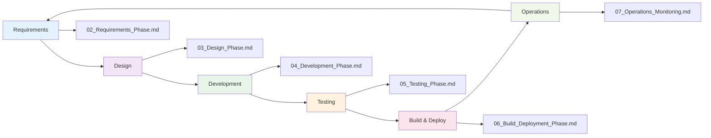

# SECURAA Secure Software Development Lifecycle (SDLC) Documentation

## Overview

This directory contains comprehensive documentation of SECURAA's Secure Software Development Lifecycle (SDLC). These documents demonstrate our commitment to security-first development practices and provide transparency to our customers about how we build and maintain secure software.

---

## Document Suite

### 📄 Core SDLC Documents

| Document | Description | Status |
|----------|-------------|--------|
| **[01_SDLC_Overview.md](01_SDLC_Overview.md)** | Executive summary, principles, technology stack, and process overview | ✅ Complete |
| **[02_Requirements_Phase.md](02_Requirements_Phase.md)** | Security requirements gathering, threat modeling, risk assessment | ✅ Complete |
| **[03_Design_Phase.md](03_Design_Phase.md)** | Secure architecture design, security controls, infrastructure design | ✅ Complete |
| **[04_Development_Phase.md](04_Development_Phase.md)** | Secure coding, Git workflow on AWS CodeCommit, code review | 🚧 In Progress |
| **[05_Testing_Phase.md](05_Testing_Phase.md)** | Security testing, SAST, DAST, penetration testing | 📝 Planned |
| **[06_Build_Deployment_Phase.md](06_Build_Deployment_Phase.md)** | AWS CodeBuild, ECR, container security, IAM, deployment | 📝 Planned |
| **[07_Operations_Monitoring.md](07_Operations_Monitoring.md)** | Production operations, monitoring, incident response | 📝 Planned |
| **[06_CI_CD_Security_Pipeline.md](08_CI_CD_Security_Pipeline.md)** | Automated security in CI/CD, security gates, scan integration | 📝 Planned |

---

## Quick Navigation

### By Development Phase



### By Security Activity

| Security Activity | Relevant Documents |
|-------------------|-------------------|
| **Threat Modeling** | [02_Requirements_Phase.md](02_Requirements_Phase.md) |
| **Architecture Security** | [03_Design_Phase.md](03_Design_Phase.md) |
| **Secure Coding** | [04_Development_Phase.md](04_Development_Phase.md) |
| **Code Review** | [04_Development_Phase.md](04_Development_Phase.md) |
| **SAST/DAST** | [05_Testing_Phase.md](05_Testing_Phase.md) |
| **Container Security** | [06_Build_Deployment_Phase.md](06_Build_Deployment_Phase.md) |
| **Security Monitoring** | [07_Operations_Monitoring.md](07_Operations_Monitoring.md) |
| **CI/CD Security** | [08_CI_CD_Security_Pipeline.md](08_CI_CD_Security_Pipeline.md) |

### By AWS Service

| AWS Service | Relevant Documents |
|-------------|-------------------|
| **AWS CodeCommit** | [04_Development_Phase.md](04_Development_Phase.md) |
| **AWS CodeBuild** | [06_Build_Deployment_Phase.md](06_Build_Deployment_Phase.md), [08_CI_CD_Security_Pipeline.md](08_CI_CD_Security_Pipeline.md) |
| **Amazon ECR** | [06_Build_Deployment_Phase.md](06_Build_Deployment_Phase.md) |
| **AWS IAM** | [03_Design_Phase.md](03_Design_Phase.md), [06_Build_Deployment_Phase.md](06_Build_Deployment_Phase.md) |
| **AWS Secrets Manager** | [03_Design_Phase.md](03_Design_Phase.md), [06_Build_Deployment_Phase.md](06_Build_Deployment_Phase.md) |
| **Amazon CloudWatch** | [07_Operations_Monitoring.md](07_Operations_Monitoring.md) |

---

## Document Structure

Each phase document follows a consistent structure:

1. **Document Control** - Version, date, classification
2. **Phase Overview** - Objectives, duration, key activities
3. **Process Details** - Step-by-step processes with examples
4. **Security Controls** - Specific security measures
5. **Tools & Templates** - Tools used and available templates
6. **Checklist** - Phase completion checklist
7. **Exit Criteria** - Requirements to proceed to next phase

---

## SDLC Process Summary

### Phase 1: Requirements & Planning
**Duration**: 1-2 weeks | **Document**: [02_Requirements_Phase.md](02_Requirements_Phase.md)

- Gather security requirements
- Conduct threat modeling (STRIDE)
- Perform risk assessment
- Define security acceptance criteria

**Key Deliverables**:
- Security requirements document
- Threat model
- Risk assessment
- Security acceptance criteria

---

### Phase 2: Secure Design
**Duration**: 1-3 weeks | **Document**: [03_Design_Phase.md](03_Design_Phase.md)

- Design secure architecture
- Define security controls
- Design data protection
- Design API security
- Design infrastructure security

**Key Deliverables**:
- Architecture diagrams
- Security design document
- Database security design
- API security specifications
- Infrastructure security design

---

### Phase 3: Secure Development
**Duration**: Ongoing | **Document**: [04_Development_Phase.md](04_Development_Phase.md)

- Follow secure coding standards
- Use Git workflow on AWS CodeCommit
- Implement security controls
- Conduct code reviews
- Run pre-commit security checks

**Key Deliverables**:
- Secure source code
- Code review approvals
- Unit tests with security focus
- Development documentation

---

### Phase 4: Security Testing
**Duration**: 1-2 weeks | **Document**: [05_Testing_Phase.md](05_Testing_Phase.md)

- Static Application Security Testing (SAST)
- Dynamic Application Security Testing (DAST)
- Dependency vulnerability scanning
- Security acceptance testing
- Penetration testing

**Key Deliverables**:
- SAST reports
- DAST reports
- Vulnerability scan results
- Security test results
- Penetration test report

---

### Phase 5: Build & Deployment
**Duration**: Continuous | **Document**: [06_Build_Deployment_Phase.md](06_Build_Deployment_Phase.md)

- AWS CodeBuild pipeline execution
- Docker image building and scanning
- Push to Amazon ECR
- Security gate validation
- Deployment automation

**Key Deliverables**:
- Secure Docker images
- Build artifacts (RPM packages)
- Deployment packages
- Deployment documentation

---

### Phase 6: Operations & Monitoring
**Duration**: Continuous | **Document**: [07_Operations_Monitoring.md](07_Operations_Monitoring.md)

- Security monitoring
- Log analysis
- Incident detection and response
- Performance monitoring
- Security patching

**Key Deliverables**:
- Monitoring dashboards
- Security alerts
- Incident reports
- Performance metrics
- Patch management records

---

## Technology Stack

### Development
- **Backend**: Go 1.17+ (530+ microservices)
- **Frontend**: React 18.2, Redux
- **Scripting**: Python 3.8+, Bash
- **Database**: MongoDB 7.0, PostgreSQL

### AWS Infrastructure
- **Version Control**: AWS CodeCommit
- **CI/CD**: AWS CodeBuild
- **Container Registry**: Amazon ECR
- **Compute**: Amazon EC2
- **Security**: AWS IAM, AWS Secrets Manager, AWS KMS
- **Monitoring**: Amazon CloudWatch
- **Networking**: AWS VPC, ALB, Security Groups

### Security Tools
- **SAST**: GoSec, ESLint Security Plugin, Bandit
- **Dependency Scanning**: Nancy, npm audit, govulncheck
- **DAST**: OWASP ZAP
- **Container Scanning**: Docker Scan, Trivy, AWS ECR Scanning
- **Secrets Detection**: git-secrets, TruffleHog

---

## Repository Structure

```
SECURAA Platform Repositories:
├── build_securaa/          # Build automation, CI/CD configs
├── zona_services/          # Core microservices (530+ services)
├── securaa/               # Main application backend
├── securaa_lib/           # Shared security library
├── zona_batch/            # Background batch processing
├── integrations/          # Third-party integrations (722+)
├── zonareact/             # Frontend React application
├── securaa_db/            # Database schemas and migrations
└── securaa_pylib/         # Python utility libraries
```

---

## Security Principles

### 1. Security by Design
Security is built into every phase, not added as an afterthought.

### 2. Defense in Depth
Multiple layers of security controls protect against various threats.

### 3. Least Privilege
Minimum necessary permissions for users and services.

### 4. Continuous Security
Ongoing security assessment and improvement.

### 5. Shift Left Security
Security testing as early as possible in development.

### 6. Automation First
Automated security checks ensure consistency.

---

## Compliance Alignment

Our SDLC supports compliance with:

| Framework | Key Controls | Documentation |
|-----------|-------------|---------------|
| **SOC 2 Type II** | CC6.1, CC6.6, CC6.7, CC7.2, CC8.1 | All SDLC phases |
| **ISO 27001:2022** | A.8.1, A.8.3, A.14.2, A.14.2.5, A.18.1.3 | All SDLC phases |
| **GDPR** | Data protection by design, security of processing | Requirements, Design phases |
| **OWASP Top 10** | A01-A10 coverage | Testing, Development phases |

---

## Key Metrics & KPIs

### Security Metrics

| Metric | Target | Tracking |
|--------|--------|----------|
| **Critical Vulnerabilities** | 0 | Continuous |
| **High Vulnerabilities** | < 5 | Weekly |
| **Mean Time to Remediation (Critical)** | < 24 hours | Per incident |
| **Security Test Coverage** | > 80% | Monthly |
| **Failed Security Scans** | < 5% | Per build |

### Development Metrics

| Metric | Target | Tracking |
|--------|--------|----------|
| **Build Success Rate** | > 95% | Daily |
| **Code Review Completion Time** | < 48 hours | Per PR |
| **Deployment Frequency** | Multiple per week | Weekly |
| **Change Failure Rate** | < 10% | Monthly |

---

## Related Documentation

### Additional Security Documents

- **[SECURAA_SECURE_CODING_POLICY.md](../SECURAA_SECURE_CODING_POLICY.md)** - Comprehensive secure coding standards
- **[SECURAA_CODE_ANALYSIS_REPORT.md](../SECURAA_CODE_ANALYSIS_REPORT.md)** - Security code analysis findings
- **[SECURAA_INFORMATION_SECURITY_POLICIES_AND_PROCEDURES.md](../SECURAA_INFORMATION_SECURITY_POLICIES_AND_PROCEDURES.md)** - Information security policies
- **[SECURAA_INFORMATION_SECURITY_RISK_ASSESSMENT_PROCESS.md](../SECURAA_INFORMATION_SECURITY_RISK_ASSESSMENT_PROCESS.md)** - Risk assessment framework
- **[SECURAA_CUSTOMER_SECURITY_DOCUMENTATION.md](../SECURAA_CUSTOMER_SECURITY_DOCUMENTATION.md)** - Customer-facing security overview

---

## How to Use This Documentation

### For Developers
1. Review **[04_Development_Phase.md](04_Development_Phase.md)** for secure coding practices
2. Follow Git workflow on AWS CodeCommit
3. Use provided code review checklists
4. Run security scans before committing

### For Security Team
1. Use **[02_Requirements_Phase.md](02_Requirements_Phase.md)** for threat modeling
2. Conduct design reviews using **[03_Design_Phase.md](03_Design_Phase.md)**
3. Define security test cases from **[05_Testing_Phase.md](05_Testing_Phase.md)**
4. Monitor using **[07_Operations_Monitoring.md](07_Operations_Monitoring.md)**

### For DevOps Team
1. Configure CI/CD using **[08_CI_CD_Security_Pipeline.md](08_CI_CD_Security_Pipeline.md)**
2. Manage deployments with **[06_Build_Deployment_Phase.md](06_Build_Deployment_Phase.md)**
3. Set up monitoring from **[07_Operations_Monitoring.md](07_Operations_Monitoring.md)**

### For Product Managers
1. Start with **[01_SDLC_Overview.md](01_SDLC_Overview.md)** for process overview
2. Define security requirements using **[02_Requirements_Phase.md](02_Requirements_Phase.md)**
3. Review security acceptance criteria before release

### For Customers
1. Read **[01_SDLC_Overview.md](01_SDLC_Overview.md)** for our security commitment
2. Review compliance alignment for your requirements
3. Understand our security testing approach

---

## Document Maintenance

### Version Control
- All documents are version controlled in Git
- Major updates require security team review
- Quarterly review cycle

### Update Process
1. Propose changes via pull request
2. Security team review
3. Engineering leadership approval
4. Merge and publish

### Feedback
We welcome feedback on these documents:
- **Email**: sdlc-feedback@securaa.com
- **Slack**: #security-sdlc
- **JIRA**: Create ticket in SECURITY project

---

## Document History

| Version | Date | Author | Changes |
|---------|------|--------|---------|
| 1.0 | October 2024 | Security Team | Initial SDLC documentation |
| 2.0 | November 13, 2025 | Security & Engineering | Comprehensive update with AWS infrastructure, multi-document structure |

---

## Contact Information

**Document Owners**:
- **Security Team**: security@securaa.com
- **Engineering Team**: engineering@securaa.com
- **DevOps Team**: devops@securaa.com

**For Security Concerns**:
- **Email**: security@securaa.com
- **Emergency**: security-oncall@securaa.com
- **Bug Bounty**: bugbounty@securaa.com

---

## License & Confidentiality

These documents are:
- **Confidential**: Intended for customers under NDA
- **Customer-Facing**: Can be shared with customers
- **Not Public**: Not for public distribution
- **Proprietary**: © 2025 SECURAA. All rights reserved.

---

## Next Steps

1. **Start Here**: [01_SDLC_Overview.md](01_SDLC_Overview.md)
2. **Learn Process**: Follow documents 02-08 in sequence
3. **Apply Knowledge**: Use checklists and templates in your projects
4. **Continuous Improvement**: Provide feedback and suggestions

---

*Last Updated: November 13, 2025*  
*Document Suite Version: 2.0*  
*Maintained by: SECURAA Security & Engineering Teams*
