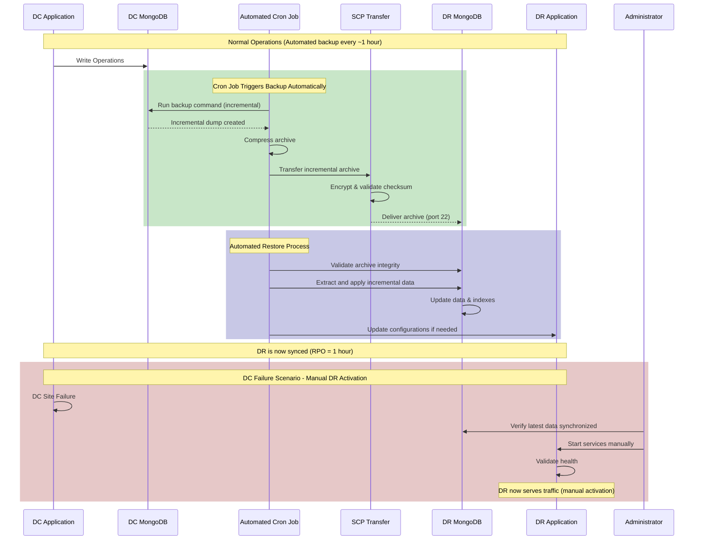

# High Availability and Disaster Recovery (HA/DR) Architecture

## Executive Summary

The Securaa solution implements a High Availability (HA) and Disaster Recovery (DR) architecture designed to ensure business continuity, data protection, and recovery capabilities. 

**Local Site HA (Fully Automatic):** Each site (DC and DR independently) operates a 3-server MongoDB replica set (Server 1 Primary, Server 2 Secondary, Server 3 Arbiter) providing **automatic failover within 20-35 minutes** for server-level failures. Primary↔Secondary data sync is achieved through **Hot Sync (oplog-based replication)** within each site, ensuring near real-time data synchronization (~1 minute lag) between Primary and Secondary nodes.

**Cross-Site DR (Automated Incremental Backup & Restore):** Between DC and DR sites, data synchronization uses **automated cron-based incremental backups** (recommended interval: 1 hour, and configurable) transferred via SCP. **Data synchronization runs automatically; only DR site activation requires manual administrator intervention** when the entire DC site fails. There are no automated cross-site failover agents.

**Key Architecture Points:**
- **Hot Sync (Oplog)**: Used ONLY within each site (DC Primary → DC Secondary; DR Primary → DR Secondary) for local HA
- **Incremental Backup/Restore**: Used for cross-site synchronization (DC → DR) with 1-hour intervals (Configurable)
- **RPO**: Data sync in ~1 minute within each site (Hot Sync); ~1 hour (configurable) between DC and DR (Incremental Backup)

## Table of Contents

1. [Architecture Overview](#architecture-overview)
2. [High Availability Components](#high-availability-components)
3. [Disaster Recovery Setup](#disaster-recovery-setup)
     - [DC–DR Incremental Backup & Restore (Cross-Site)](#dc–dr-incremental-backup--restore)
     - [Hot Sync (Within Each Site Only)](#hot-sync-oplog-replication---within-each-site-only)
4. [Failover Mechanisms](#failover-mechanisms)
5. [Data Synchronization](#data-synchronization)
6. [Recovery Procedures](#recovery-procedures)
7. [Conclusion](#conclusion)

---

## Architecture Overview

The SOAR Services platform implements an HA/DR strategy with two different synchronization technologies:

**Within Each Site (Local HA):**
- **Hot Sync (Oplog-based replication)**: Used for PRIMARY → SECONDARY synchronization within DC site and within DR site independently
- Near real-time data synchronization (~1 minute lag)
- Enables automatic failover within 20-35 minutes
- SECONDARY performs continuous health checks. If the PRIMARY server does not respond within the configured time window, the secondary server automatically takes over. The default duration is 20 minutes.

**Between Sites (Cross-Site DR):**
- **DC–DR Incremental Backup & Restore**: Used ONLY for DC → DR cross-site synchronization
- Automated cron-based periodic incremental backups (default: every 1 hour)
- Transferred via SCP (port 22)

The architecture uses three-server MongoDB replica sets locally within each site (DC and DR operate independently) with Hot Sync for local HA, while cross-site DR relies on automated incremental backup/restore for DC → DR synchronization.

```mermaid
graph TB
    subgraph DC["<b>SOAR DC Site</b>"]
        subgraph DC_HA["<b>SOAR DC HA Setup</b>"]
            DC_PRI["<b>PRIMARY</b><br/>Port: 27017<br/>IP: 192.0.2.10<br/>✓ Data Master"]
            DC_SEC1["<b>SECONDARY</b><br/>Port: 27017<br/>IP: 192.0.2.11<br/>✓ Data Replica"]
            DC_SEC2["<b>SECONDARY (Arbiter)</b><br/>Port: 27017<br/>IP: 192.0.2.12<br/>✗ No Data<br/>✓ Voting Only"]
            
            DC_PRI ---|"Data Replication"| DC_SEC1
            DC_PRI -.->|"Heartbeat Only"| DC_SEC2
            DC_SEC1 -.->|"Heartbeat"| DC_SEC2
        end
    end

    subgraph DR["<b>SOAR DR Site</b>"]
        subgraph DR_HA["<b>SOAR DR HA Setup</b>"]
            DR_PRI["<b>PRIMARY</b><br/>Port: 27017<br/>IP: 203.0.113.10<br/>✓ Data Master"]
            DR_SEC1["<b>SECONDARY(optional)</b><br/>Port: 27017<br/>IP: 203.0.113.11<br/>✓ Data Replica"]
            DR_SEC2["<b>SECONDARY (Arbiter - if only secondary exist)</b><br/>Port: 27017<br/>IP: 203.0.113.12<br/>✗ No Data<br/>✓ Voting Only"]
            
            DR_PRI ---|"Data Replication"| DR_SEC1
            DR_PRI -.->|"Heartbeat Only"| DR_SEC2
            DR_SEC1 -.->|"Heartbeat"| DR_SEC2
        end
    end

    USER["<b>👤 User</b>"]

    %% Cross-site backup/restore
    DC -.->|"<b>Port: 22</b><br/>Database Backup and Restore"| DR

    %% User access
    USER -->|"<b>UI Port: 443</b><br/>Securaa UI (DC Primary IP)"| DC_PRI
    USER -.->|"<b>UI Port: 443</b><br/>Securaa UI (DR Primary IP)<br/>(Manual Failover)"| DR_PRI

    classDef primaryStyle fill:#4169e1,stroke:#1e3a8a,stroke-width:3px,color:#fff,font-weight:bold
    classDef secondaryStyle fill:#10b981,stroke:#047857,stroke-width:3px,color:#fff,font-weight:bold
    classDef arbiterStyle fill:#6b7280,stroke:#374151,stroke-width:3px,color:#fff,font-weight:bold
    classDef userStyle fill:#f59e0b,stroke:#b45309,stroke-width:3px,color:#fff,font-weight:bold
    classDef siteStyle fill:#e5e7eb,stroke:#6b7280,stroke-width:2px,color:#000
    
    class DC_PRI,DR_PRI primaryStyle
    class DC_SEC1,DR_SEC1 secondaryStyle
    class DC_SEC2,DR_SEC2 arbiterStyle
    class USER userStyle
    class DC_HA,DR_HA siteStyle
```



---

## High Availability Components

### 1. Three-Server MongoDB Replica Set Architecture (per site) - Fully Automatic

Each site runs a MongoDB replica set across three separate servers: 1 Primary, 1 Secondary (data-bearing), and 1 Arbiter (voting-only, no data). This provides distributed HA with **fully automatic elections, automatic failover, and automatic data replication** with quick recovery from server failures.

Key properties:
- **PRIMARY Node (Port 27017)**: Runs SOAR Primary application + MongoDB Primary; handles all read and write operations; **automatically replicates data to Secondary**
- **SECONDARY Node (Port 27017)**: Runs SOAR Secondary application + MongoDB Secondary; maintains a complete copy of data; **automatically participates in elections**; **automatically becomes Primary on failover**
- **SECONDARY Node (Arbiter - Port 27017)**: Runs Arbiter service only (labeled as "SECONDARY" in diagrams); **automatically participates in elections**; **does NOT store data**; acts as tiebreaker
- **Automatic election within ~15–35 seconds and failover within 20-35 minutes** (no manual intervention required)
- **All operations (read + write) performed on Primary node only**
- When the Secondary becomes Primary, all read/write operations **automatically switch** to the new Primary
- **All three MongoDB instances use port 27017**
- **Each component runs on a separate physical/virtual machine**

### 2. Cross‑Site Disaster Recovery (Automatic Sync, Manual Activation)

The DR site maintains an identical 3-server MongoDB replica set architecture as the DC site (1 Primary + 1 Secondary with data + 1 Arbiter without data). DR activation is a **manual process** that requires administrator intervention, but data synchronization is **automatic**.

- **Manual DR Activation** — Administrators manually activate DR site during DC disasters
- **Automatic Data Synchronization** — Automated periodic backups transferred over SCP (port 22) or automated oplog-based sync
- **No Automated Failover Agents** — Synchronization runs automatically via cron jobs or oplog replication; DR activation is manual
- **Identical Architecture** — DR site has the same 3-server structure (1 Primary + 1 Secondary data-bearing + 1 Arbiter voting-only)

Both synchronization approaches are described in the Disaster Recovery Setup section below.

### 3. Detailed Three-Server MongoDB Replica Set Architecture


---

## Disaster Recovery Setup

This section describes cross-site DC→DR synchronization (Incremental Backup & Restore) and local HA replication (Hot Sync within each site).

### DC–DR Incremental Backup & Restore (Cross-Site Only)

Overview:
- Automated periodic backups are taken at DC and automatically restored to DR at administrator-defined intervals. Default recommendation: every 1 hour.

Process:
1. Automated cron job performs MongoDB logical/physical and file backups at the DC (incremental dumps or snapshots).
2. Compress and automatically transfer backup archives to the DR system via SCP (port 22).
3. Automated process validates archives and restores MongoDB data and files to their locations on the DR site servers.

Behavior:
- DR instance can remain active and continuously running (services can be available for testing).
- Data on DR is updated on each automated restore based on administrator-defined intervals (≈ every 1 hour recommended).
- Initial downtime: the first restore to a new DR environment requires downtime on DR while the baseline restore completes — depends on production data size (typical order: ≈ 1 hour; varies).
- Sync duration: ≈ 1 hour per incremental cycle (depends on data volume and transfer frequency).
- RPO is bounded by the backup interval (default 1 hour recommendation).

Notes and operational considerations:
- Ensure sufficient DR storage and retention for incremental chains.
- Validate incremental chain integrity and version compatibility during each transfer.
- DR services may be kept active for testing/read access; **DR activation for production traffic requires manual administrator intervention**.

#### Incremental Backup & Restore Workflow



### Hot Sync (Oplog Replication) - Within Each Site Only

**Important**: Hot Sync (MongoDB oplog-based replication) is used **ONLY for local HA within each site**, NOT for cross-site DC→DR synchronization.

**Within DC Site:**
- DC PRIMARY automatically replicates oplog entries to DC SECONDARY over port 27017
- Near real-time data synchronization (~1 minute lag)
- Enables automatic failover: DC SECONDARY can become PRIMARY within 20-35 minutes

**Within DR Site:**
- DR PRIMARY automatically replicates oplog entries to DR SECONDARY over port 27017  
- Near real-time data synchronization (~1 minute lag)
- Enables automatic failover: DR SECONDARY can become PRIMARY within 20-35 minutes

**NOT Used for Cross-Site:**
- Hot Sync/oplog replication is NOT used between DC and DR sites
- DC→DR synchronization uses Incremental Backup & Restore only (1-hour intervals)

Notes and operational considerations:
- Hot Sync operates independently within each site for local high availability
- Monitor oplog window sizes and network reliability within each site
- Configure appropriate oplog retention for each replica set
- Cross-site synchronization relies on automated incremental backups, not oplog replication

#### Hot Sync Replication Workflow (Within Each Site)


**Note**: The same Hot Sync (oplog replication) process operates independently within the DR site (DR Primary → DR Secondary).

---

## Failover Mechanisms

### 1. DC–DR Incremental Backup & Restore Failover (Automatic Sync, Manual Activation)

- Detection: Administrator monitors DC and detects unavailability.
- Automated cron jobs have already synchronized the latest incremental backups to DR.
- Administrator validates latest incremental backup is present and intact on DR.
- Administrator manually starts and validates services on DR (data is already synchronized automatically).
- Users are redirected (DNS / load balancer / manual configuration) to DR UI.

Estimated timings:
- Detection phase: minutes to hours (depends on manual monitoring).
- Service activation: ≈ 5–15 minutes (data is already synchronized; only service startup required).
- Total RTO depends on detection time plus manual service activation time.

#### Incremental Backup Failover Flow


### 2. Local HA Failover (Automatic - Within Each Site)

**Within DC Site or DR Site:**
- When PRIMARY fails, MongoDB replica set automatically initiates election
- SECONDARY and Arbiter participate in voting
- SECONDARY is promoted to PRIMARY automatically (20-35 minutes)
- Application automatically reconnects to new PRIMARY
- No manual intervention required

**Process:**
1. PRIMARY node becomes unavailable (hardware failure, network issue, etc.)
2. SECONDARY and Arbiter detect missed heartbeats
3. Automatic election begins (SECONDARY + Arbiter vote)
4. SECONDARY wins election and becomes new PRIMARY
5. SOAR application automatically reconnects to new PRIMARY
6. Normal operations resume

**Estimated timings:**
- Election process: 10-15 seconds
- Application reconnection: 5-20 seconds  
- **Total Failover: 20-35 minutes end-to-end**
- **No manual intervention required**

#### Local HA Failover Flow (Within Site)

```mermaid
flowchart TD
    A["🟢 <b>Normal Operations</b><br/>PRIMARY + SECONDARY + Arbiter"] --> B["� Continuous Heartbeats"]
    
    B --> C{"PRIMARY<br/>Responding?"}
    C -->|"Yes"| A
    
    C -->|"No"| D["⚠ <b>PRIMARY Failure Detected</b><br/>Missed Heartbeats"]
    D --> E["<b>⚡ Automatic Election</b><br/>SECONDARY + Arbiter Vote"]
    
    E --> F["✅ SECONDARY Promoted<br/>to PRIMARY"]
    F --> G["� Application Auto-Reconnects<br/>to New PRIMARY"]
    
    G --> H["✅ <b>Operations Resumed</b><br/>20-35 minutes total"]
    
    H --> I{"Original PRIMARY<br/>Recovered?"}
    I -->|"No"| J["Continue with<br/>New PRIMARY"]
    I -->|"Yes"| K["Original joins as<br/>SECONDARY"]
    
    classDef normalOps fill:#d4edda,stroke:#155724,stroke-width:2px,color:#000
    classDef warning fill:#fff3cd,stroke:#856404,stroke-width:2px,color:#000
    classDef auto fill:#cfe2ff,stroke:#084298,stroke-width:2px,color:#000
    classDef success fill:#d1e7dd,stroke:#0a3622,stroke-width:2px,color:#000
    
    class A,H,J,K normalOps
    class D warning
    class E,F,G auto
    class V,AC active
    class T,U,AA success
```



### 3. Local Site Failover (MongoDB replica set)

- Within each site, the 3-server replica set (1 PRIMARY + 1 SECONDARY with data + 1 Arbiter without data) offers automatic election on Primary failure (15–35 seconds).

#### Local MongoDB Replica Set Failover Flow

```mermaid
flowchart TD
    A["🟢 <b>MongoDB Replica Set</b><br/>Normal Operations"] --> B["All 3 instances on Port 27017<br/>🔵 PRIMARY | 🟢 SECONDARY (data) | ⚪ Arbiter (no data)"]
    
    B --> C{"⚠ PRIMARY<br/>Node Fails?"}
    C -->|"No"| A
    
    C -->|"Yes"| D["🔔 SECONDARY + Arbiter<br/>Detect Missing Heartbeat"]
    D --> E["⏱ 10-15 seconds<br/>Failure Detection"]
    
    E --> F["🗳 Election Initiated<br/>SECONDARY + Arbiter Vote"]
    F --> G["✋ SECONDARY + Arbiter<br/>Cast Votes (2 out of 3)"]
    G --> H["⏱ 5-20 seconds<br/>Election Process"]
    
    H --> I{"Majority<br/>Achieved?"}
    I -->|"No"| J["🔄 Retry Election"]
    J --> F
    
    I -->|"Yes"| K["🎯 <b>SECONDARY Promoted</b><br/>to New Primary"]
    K --> L["✓ New PRIMARY Port 27017<br/>Accepts ALL Read/Write"]
    
    L --> M["🔌 Application<br/>Auto-Reconnects to New Primary"]
    M --> N["🔍 Failed PRIMARY Detected"]
    
    N --> O{"Old PRIMARY<br/>Can Restart?"}
    O -->|"Yes"| P["🔄 Restart MongoDB on Old PRIMARY"]
    P --> Q["➕ Rejoins as Secondary"]
    Q --> R["🔄 Syncs Latest Data<br/>from New Primary"]
    R --> S["✅ <b>Replica Set Healthy</b><br/>PRIMARY + SECONDARY + Arbiter"]
    
    O -->|"No"| T["⚠ Manual Intervention<br/>Required"]
    T --> U["🔧 Admin Investigates<br/>Root Cause"]
    U --> V{"Can Fix?"}
    V -->|"Yes"| P
    V -->|"No"| W["⚠ Run with 2 Nodes<br/>(1 data + 1 arbiter)<br/>Reduced Redundancy"]
    
    classDef normalOps fill:#d4edda,stroke:#155724,stroke-width:3px,color:#000
    classDef warning fill:#fff3cd,stroke:#856404,stroke-width:3px,color:#000
    classDef critical fill:#f8d7da,stroke:#721c24,stroke-width:3px,color:#000
    classDef election fill:#cfe2ff,stroke:#084298,stroke-width:3px,color:#000
    classDef success fill:#d1e7dd,stroke:#0a3622,stroke-width:3px,color:#000
    
    class A,S normalOps
    class C,D,E,N,O warning
    class T,U,W critical
    class F,G,H,I,J election
    class K,L,M,P,Q,R success
```



**Failover Characteristics:**
- **PRIMARY Fail Detection Time**: 20 minutes (default heartbeat timeout, configurable)
- **MongoDB Election Time**: 5-20 seconds (across servers within site, minimal latency)
- **Total Failover**: 20-35 minutes end-to-end
- **Data Consistency**: Zero data loss with proper write concerns

---

## Data Synchronization

We support two cross-site synchronization methods; the synchronization descriptions below incorporate both modes.

### 1. DC–DR Incremental Backup Synchronization

- Backup agent at DC detects changes and produces incremental dumps.
- Archives compressed and transferred over SCP (port 22).
- Transfer integrity validated (checksums).
- Restore agent on DR applies increments to the DR MongoDB.
- Default configurable interval: 1 hour; can be tuned to smaller or larger windows depending on bandwidth and RPO needs.
- Sync duration: ~1 hour typical for incremental cycle (varies on data volume).

#### Incremental Backup Data Flow


### 2. Hot Sync (Oplog) Synchronization - Within Each Site Only

**Important**: Hot Sync (oplog replication) operates **ONLY within each site**, not between DC and DR.

**Within DC Site:**
- MongoDB oplog entries are streamed from DC PRIMARY to DC SECONDARY via port 27017
- Near real-time replication within the site: typical lag ~1 minute
- Enables automatic failover within 20-35 minutes

**Within DR Site:**
- MongoDB oplog entries are streamed from DR PRIMARY to DR SECONDARY via port 27017
- Near real-time replication within the site: typical lag ~1 minute
- Enables automatic failover within 20-35 minutes

**Between Sites:**
- DC and DR do NOT use oplog replication
- Cross-site synchronization uses Incremental Backup & Restore only

#### Hot Sync Data Flow (Within Each Site)

```mermaid
graph TB
    subgraph DC_SITE["<b>🏢 DC Site - Local Hot Sync (Port 27017)</b>"]
        DC_APP["🖥 <b>SOAR Application</b>"] --> DC_PRI["🔵 <b>DC PRIMARY</b><br/>Port 27017"]
        DC_PRI --> DC_WRITE["✍ Write to Database"]
        DC_WRITE --> DC_OPLOG["📋 Generate Oplog Entry"]
        DC_OPLOG --> DC_SEC["� <b>DC SECONDARY</b><br/>Port 27017<br/>Receives Oplog"]
        DC_SEC --> DC_APPLY["⚙ Apply Operations<br/>(~1 min lag)"]
        DC_APPLY --> DC_DATA["💾 Replicated Data"]
        DC_OPLOG -.-> DC_ARB["⚪ <b>DC Arbiter</b><br/>Heartbeat Only<br/>No Data"]
    end
    
    subgraph DR_SITE["<b>🏢 DR Site - Local Hot Sync (Port 27017)</b>"]
        DR_APP["🖥 <b>SOAR Application</b>"] --> DR_PRI["� <b>DR PRIMARY</b><br/>Port 27017"]
        DR_PRI --> DR_WRITE["✍ Write to Database"]
        DR_WRITE --> DR_OPLOG["� Generate Oplog Entry"]
        DR_OPLOG --> DR_SEC["� <b>DR SECONDARY</b><br/>Port 27017<br/>Receives Oplog"]
        DR_SEC --> DR_APPLY["⚙ Apply Operations<br/>(~1 min lag)"]
        DR_APPLY --> DR_DATA["💾 Replicated Data"]
        DR_OPLOG -.-> DR_ARB["⚪ <b>DR Arbiter</b><br/>Heartbeat Only<br/>No Data"]
    end
    
    subgraph CROSS_SITE["<b>� Cross-Site DC → DR (Port 22 SCP)</b>"]
        DC_BACKUP["📂 DC Incremental Backup<br/>Every 1 hour"] --> SCP["� SCP Transfer<br/>Port 22"]
        SCP --> DR_RESTORE["📂 DR Restore<br/>Automated"]
    end
    
    DC_SITE -.->|"NOT Oplog<br/>Uses Backup/Restore"| CROSS_SITE
    CROSS_SITE -.->|"NOT Oplog<br/>Uses Backup/Restore"| DR_SITE
    
    classDef dcStyle fill:#d4edda,stroke:#155724,stroke-width:3px,color:#000
    classDef drStyle fill:#fff3cd,stroke:#856404,stroke-width:3px,color:#000
    classDef crossStyle fill:#e2e8f0,stroke:#475569,stroke-width:3px,color:#000
    
    class DC_APP,DC_PRI,DC_WRITE,DC_OPLOG,DC_SEC,DC_APPLY,DC_DATA dcStyle
    class DR_APP,DR_PRI,DR_WRITE,DR_OPLOG,DR_SEC,DR_APPLY,DR_DATA drStyle
    class DC_BACKUP,SCP,DR_RESTORE crossStyle
```



#### Oplog Window and Data Consistency (Within Each Site)

```mermaid
graph LR
    A["✍ <b>Write Operation</b>"] -->|"⚡ 0 seconds"| B["🔵 <b>PRIMARY</b><br/>Commits<br/>Port 27017"]
    B -->|"⚡ < 1 second"| C["🟢 SECONDARY<br/>Replicates Oplog<br/>Port 27017"]
    B -->|"💓 Heartbeat only"| D["⚪ Arbiter<br/>No data<br/>Port 27017"]
    B -->|"📋 Oplog Entry"| E["📋 Oplog Stream"]
    E -->|"⏱ < 1 minute"| C
    C -->|"⚙ Apply Time"| F["💾 SECONDARY<br/>Data Updated"]
    
    G["📊 Typical Total Lag<br/>(Within Site)"] -.->|"~1 minute"| H["⏱ ~1 minute"]
    
    I["⚠ Network Issues?"] -.-> J["💾 Oplog Buffered<br/>at PRIMARY"]
    J -.->|"🔄 Auto-resume"| K["✓ Resumes When<br/>Network Restored"]
    
    classDef writeOps fill:#d4edda,stroke:#155724,stroke-width:2px,color:#000
    classDef replication fill:#cfe2ff,stroke:#084298,stroke-width:2px,color:#000
    classDef dataOps fill:#fff3cd,stroke:#856404,stroke-width:2px,color:#000
    classDef buffer fill:#f8d7da,stroke:#721c24,stroke-width:2px,color:#000
    
    class A,B,C writeOps
    class E,F replication
    class F,H dataOps
    class J buffer
```



**Note**: This oplog replication operates independently within DC site and within DR site. There is NO oplog replication between DC and DR sites.

### Data Integrity and Validation

Common checks for both methods:
- Pre-transfer: verify replica set health on DC; ensure oplog retention (Hot Sync) or incremental chain integrity (Backup).
- Transfer: checksum validation, retries and alerting on failures.
- Post-transfer: restore/replication validation; monitoring to confirm DR readiness.

---

## Recovery Procedures

### 1. DR Activation — DC–DR Incremental Backup & Restore (Manual Process)

1. Administrator detects primary outage via monitoring.
2. Administrator confirms latest incremental backup archive is available and validated on DR.
3. If DR baseline not present, administrator performs manual baseline restore (initial baseline may take ≈ 1 hour).
4. Administrator manually applies subsequent increments until caught up to the most recent consistent point.
5. Administrator manually starts and validates application services on DR.
6. Administrator redirects traffic (DNS/load balancer) to DR site.
7. Administrator monitors system health and application correctness.

Rollback / Failback:
- After primary is restored, administrator manually replicates incremental changes from DR back to DC if needed.
- Administrator gradually shifts traffic back to DC once verified.

### 2. DR Activation — Hot Sync (Manual Process)

1. Administrator detects DC unavailability through monitoring.
2. Administrator runs manual activation procedure: manually start services on DR, manually configure DB for write operations, manually update connection strings, manually run service health checks.
3. Administrator redirects traffic to DR.
4. Continue monitoring and, after DC recovery, administrator coordinates manual failback (controlled data synchronization).

### 3. Local MongoDB Recovery (Automatic)

- For MongoDB PRIMARY node failures within a site, the replica set will **automatically** elect the SECONDARY node to become the new Primary (with Arbiter providing the deciding vote). Application reconnection logic should handle transient disconnects during the 15-35 second election process.
- **All automatic processes**: Local site failover (DC Primary↔Secondary or DR Primary↔Secondary), data replication within each site, cross-site data synchronization (cron jobs or oplog).
- **Only manual process**: Cross-site DR activation (activating DR site when entire DC site fails).

---

## Failover Test Plan (short)

- Test 1 (Periodic Backup mode): Simulate DC outage; administrator manually validates DR archive availability; administrator manually measures baseline restore time and incremental application; verify app functionality on DR after manual activation.
- Test 2 (Hot Sync mode): Verify oplog replication under load; simulate DC unavailability; administrator manually activates DR and verifies data consistency.
- Test 3 (Local automatic failover): Simulate PRIMARY node failure (power off or network disconnect); ensure replica set election automatically promotes SECONDARY to Primary (with Arbiter voting) and app reconnection within expected window (20–35 min).

Success criteria:
- Data consistency within expected RPO (backup interval for Backup mode; near real-time for Hot Sync).
- Manual RTO within planned window based on administrator response time (document test results).
- Clear documentation and runbooks for manual DR activation procedures.

---

## Conclusion

The platform uses two different synchronization technologies:

1. **Hot Sync (Oplog Replication)**: Used **ONLY within each site** (DC Primary → DC Secondary; DR Primary → DR Secondary) for local high availability. Provides near real-time replication (~1 minute lag) and enables automatic failover within 20-35 minutes.

2. **DC–DR Incremental Backup & Restore**: Used **ONLY for cross-site synchronization** (DC → DR). Automated cron-based incremental backups (recommended: every 1 hour) automatically transfer and restore to DR via SCP. Initial baseline setup may require ≈ 1 hour.

**Key Architecture Points:**
- **Local Site HA (Automatic)**: Each site (DC and DR) has 3-server MongoDB replica set (1 PRIMARY + 1 SECONDARY with data + 1 Arbiter without data) with automatic failover (20-35 minutes)
- **Hot Sync (Oplog Replication)**: Used ONLY within each site for PRIMARY → SECONDARY replication (~1 minute lag)
- **Cross-Site DR (Incremental Backup)**: DC to DR synchronization uses automated cron-based incremental backups (1-hour intervals via SCP)
- **2x Data Redundancy**: PRIMARY and SECONDARY store complete copies of data; Arbiter has no data
- **No Automated Cross-Site Failover**: Automated backup synchronization runs continuously; DR activation is manual
- **Identical Architecture**: DR site mirrors DC site structure (3 servers: 2 data-bearing + 1 arbiter)

### Automation Summary: What's Automatic vs Manual

**✅ AUTOMATIC (No Manual Intervention Required):**
1. **Local HA Failover**: DC Primary ↔ DC Secondary switchover (20-35 minutes)
2. **Local HA Failover**: DR Primary ↔ DR Secondary switchover (20-35 minutes)
3. **Data Replication (Hot Sync)**: PRIMARY → SECONDARY within each site (continuous oplog replication, ~1 minute lag)
4. **Cross-Site Data Sync**: DC → DR synchronization via automated cron jobs (Incremental Backup, every 1 hour)
5. **Health Monitoring**: Heartbeat between PRIMARY, SECONDARY, and Arbiter within each site
6. **Election Process**: Automatic Primary election when failure detected within each site

**⚠️ MANUAL (Requires Administrator Intervention):**
1. **DR Site Activation**: Administrator must manually activate DR site when DC site fails completely
2. **Traffic Redirection**: DNS/load balancer configuration to point users to DR site
3. **Service Verification**: Post-activation health checks and validation

**Key Principle**: 
- **Hot Sync (oplog replication)**: Used ONLY within DC site and within DR site for local HA
- **Incremental Backup & Restore**: Used ONLY for cross-site DC→DR synchronization
- Within each site, everything is automatic including Primary↔Secondary failover
- Only cross-site DR activation requires manual intervention

### Synchronization Technology Comparison

| **Aspect** | **Incremental Backup & Restore<br/>(Cross-Site DC→DR)** | **Hot Sync (Oplog Replication)<br/>(Within Each Site)** |
|------------|----------------------------------------|-------------------------------|
| **Purpose** | Cross-site DR synchronization | Local HA within site |
| **Scope** | DC site → DR site | DC Primary → DC Secondary<br/>DR Primary → DR Secondary |
| **Synchronization Method** | Automated cron incremental backups via SCP | Continuous automated oplog replication |
| **Default Interval** | 1 hour recommended | Near real-time (~1 minute lag) |
| **Network Ports** | Port 22 (SSH/SCP) | Port 27017 (MongoDB) |
| **RPO (Recovery Point Objective)** | 1 hour (backup interval) | ~1 minute (replication lag) |
| **RTO (Recovery Time Objective)** | Manual DR activation (5-15 min) | Automatic failover (20-35 minutes) |
| **Activation** | Manual by administrator (cross-site) | Automatic (within site) |
| **Initial Setup Time** | ~1 hour (baseline restore) | Immediate (replica set setup) |
| **Data Loss on Failover** | Up to 1 hour (cross-site) | Up to ~1 minute (within site) |
| **Bandwidth Requirements** | Moderate (periodic transfers) | Higher (continuous streaming) |
| **Complexity** | Simple (automated cron jobs) | Moderate (oplog management, monitoring) |
| **Automation Level** | Automated sync + manual activation | Fully automatic |
| **Best For** | Cross-site disaster recovery | Local high availability |
| **Failover Type** | Manual cross-site DR activation | Automatic local failover |

**Important**: These two technologies serve different purposes and are used together:
- **Hot Sync**: Provides automatic local HA within each site
- **Incremental Backup**: Provides cross-site DR capability between DC and DR

### Architecture Decision Guide

```mermaid
flowchart TD
    A["🎯 <b>HA/DR Architecture</b>"] --> B["<b>Within Each Site (DC & DR)</b><br/>Hot Sync - Oplog Replication"]
    A --> C["<b>Between Sites (DC → DR)</b><br/>Incremental Backup & Restore"]
    
    B --> D["✅ Automatic Failover<br/>20-35 minutes<br/>RPO: ~1 minute<br/>(LOCAL HA)"]
    C --> E["✅ Automated Sync (1 hour)<br/>⚠️ Manual DR Activation<br/>RPO: ~1 hour<br/>(CROSS-SITE DR)"]
    
    D --> F["<b>Combined Architecture</b><br/>Local HA (automatic) + Cross-Site DR (manual activation)"]
    E --> F
    
    F --> G["✅ <b>Deployment Complete</b><br/>• Hot Sync within sites<br/>• Incremental Backup between sites"]
    
    classDef start fill:#cfe2ff,stroke:#084298,stroke-width:3px,color:#000
    classDef hotSync fill:#d1e7dd,stroke:#0a3622,stroke-width:3px,color:#000
    classDef backup fill:#fff3cd,stroke:#856404,stroke-width:3px,color:#000
    classDef success fill:#d1e7dd,stroke:#0a3622,stroke-width:4px,color:#000
    
    class A start
    class B,D hotSync
    class C,E backup
    class F,G success
```



### Complete HA/DR Architecture Summary

```mermaid
graph TB
    subgraph OVERVIEW["<b>🎯 OVERVIEW</b>"]
        TITLE["<b>Securaa HA/DR Architecture</b>"]
    end
    
    subgraph LHA["<b>🔄 LOCAL HA - Both DC & DR Sites (Hot Sync)</b>"]
        LHA1["<b>MongoDB Replica Set</b><br/>3 Servers (2 data + 1 arbiter)<br/>Port 27017"]
        LHA2["<b>Oplog Replication</b><br/>PRIMARY → SECONDARY<br/>~1 min lag"]
        LHA3["<b>Auto Failover</b><br/>⏱ 20-35 minutes"]
        LHA4["<b>2x Data Redundancy</b><br/>PRIMARY + SECONDARY (data)<br/>+ Arbiter (voting only)"]
        
        LHA1 --> LHA2 --> LHA3 --> LHA4
    end
    
    subgraph IB["<b>📦 CROSS-SITE DR: Incremental Backup & Restore (DC → DR)</b>"]
        IB1["⏱ Every 1 hour<br/>(Automated Cron)"]
        IB2["🔒 SCP Transfer<br/>Port 22"]
        IB3["✅ DR Standby State<br/>(Data Synchronized)"]
        IB4["📊 RPO: 1 hour"]
        IB5["⏱ RTO: 5-15 min<br/>(Manual Activation)"]
        
        IB1 --> IB2 --> IB3
        IB4 -.-> IB5
    end
    
    subgraph FO["<b>🚨 FAILOVER TYPES</b>"]
        FO1["<b>Within Site (Automatic)</b><br/>PRIMARY → SECONDARY<br/>20-35 minutes"]
        FO2["<b>Cross-Site (Manual)</b><br/>DC → DR Activation<br/>Admin intervention required"]
    end
    
    TITLE --> LHA1
    TITLE --> IB1
    TITLE --> FO1
    
    LHA4 -.->|"Local HA"| FO1
    IB3 -.->|"Cross-Site DR"| FO2
    
    classDef titleStyle fill:#4169e1,stroke:#1e3a8a,stroke-width:4px,color:#fff,font-size:16px
    classDef localHA fill:#d1e7dd,stroke:#0a3622,stroke-width:3px,color:#000
    classDef backup fill:#fff3cd,stroke:#856404,stroke-width:3px,color:#000
    classDef failover fill:#f8d7da,stroke:#721c24,stroke-width:3px,color:#000
    
    class TITLE titleStyle
    class LHA1,LHA2,LHA3,LHA4 localHA
    class IB1,IB2,IB3,IB4,IB5 backup
    class FO1,FO2 failover
```



---

## MongoDB Replica Set Architecture Explained

### Understanding the Three-Server Configuration (1 Primary + 1 Secondary + 1 Arbiter)

Each site (DC and DR) operates a MongoDB replica set distributed across three separate servers:

#### Component Distribution

**PRIMARY Node (Port 27017):**
- Example IP: 192.0.2.10 (DC), 203.0.113.10 (DR)
- Hosts **SOAR Application** (UI & services on HTTPS port 443)
- Runs **MongoDB Primary instance** (port 27017)
- Handles **ALL** read operations from applications
- Handles **ALL** write operations from applications  
- Replicates data changes to Secondary node via oplog
- Sends heartbeat signals to Secondary and Arbiter
- Only one Primary exists at any time

**SECONDARY Node (Port 27017):**
- Example IP: 192.0.2.11 (DC), 203.0.113.11 (DR)
- Hosts **SOAR Application** in standby mode (UI & services on HTTPS port 443)
- Runs **MongoDB Secondary instance** (port 27017)
- Maintains a **complete copy** of all data from Primary
- Continuously applies oplog entries from Primary to stay synchronized
- **Does NOT serve read operations** in this configuration (all reads go to Primary)
- Participates in elections when Primary fails
- Becomes the new Primary if elected during failover
- Acts as data redundancy and failover candidate

**SECONDARY Node (Arbiter - Port 27017):**
- Example IP: 192.0.2.12 (DC), 203.0.113.12 (DR)
- Labeled as "SECONDARY" in architecture diagrams but functions as an **Arbiter**
- Runs **MongoDB Arbiter instance** (port 27017)
- **Does NOT store any data** (no database files, no SOAR application)
- Participates in elections only (voting member)
- Provides tiebreaker vote between Primary and Secondary
- Consumes minimal resources (CPU, memory, disk)
- Sends/receives heartbeat signals only
- Cannot become Primary

**Important Note:** All three MongoDB instances run on port 27017. They are differentiated by their physical/virtual server location and replica set member configuration, not by different ports. Only PRIMARY and SECONDARY (data-bearing) nodes store data; the Arbiter node stores no data.

### Operation Flow

**Normal Operations (All traffic to PRIMARY node on Port 27017):**
```
Application → PRIMARY (Port 27017: 192.0.2.10) → [ALL Reads + Writes]
PRIMARY → SECONDARY (Port 27017: 192.0.2.11) → [Oplog replication - DATA]
PRIMARY ↔ SECONDARY ↔ Arbiter (Port 27017: 192.0.2.12) → [Heartbeat signals only]
Users → PRIMARY SOAR (HTTPS 443: 192.0.2.10) → [Active UI & Services]
```

**Failover Scenario (PRIMARY node fails):**
```
1. PRIMARY (Port 27017: 192.0.2.10) fails → No heartbeat detected
2. SECONDARY (192.0.2.11) + Arbiter (192.0.2.12) → Initiate election
3. SECONDARY receives majority vote (2 out of 3) → Promoted to Primary
4. Application → New PRIMARY (Port 27017: 192.0.2.11) → [ALL Reads + Writes]
5. Users → New PRIMARY SOAR (HTTPS 443: 192.0.2.11) → [Active UI & Services]
6. Old PRIMARY restarts → Rejoins as Secondary (Port 27017)
```

### Key Characteristics

- **Three-Server Architecture**: Distributed deployment across separate physical/virtual servers
- **2x Data Redundancy**: 2 nodes store complete copies of data (PRIMARY + SECONDARY); Arbiter has no data
- **Single Port Configuration**: All three replica set members use port 27017
- **Single Point of Read/Write**: All operations always go to the current Primary node (never split between nodes)
- **Automatic Failover**: SECONDARY can be automatically promoted when PRIMARY fails (20-35 minutes)
- **Data Redundancy**: 2 complete copies of data (PRIMARY + SECONDARY); Arbiter stores no data
- **Election Quorum**: Requires majority vote (2 out of 3) to elect new Primary
- **Zero Data Loss**: SECONDARY stays synchronized; no data loss on failover with proper write concerns
- **Application Failover**: When MongoDB fails over to SECONDARY, the SOAR application on that server also becomes active
- **Arbiter Role**: Provides tiebreaker vote; minimal resource usage; no data storage

This design provides high availability through distributed server architecture, with all MongoDB instances using the standard port 27017 and automatic server-level failover between Server 1 and Server 2.

---

*This document was updated to explicitly describe both DC–DR Incremental Backup & Restore and Hot Sync (oplog) modes, their processes, timings, and failover behaviors. Adjust configuration parameters (backup interval, detection threshold, directory sync interval) to match your operational requirements and test before production cutover.*

