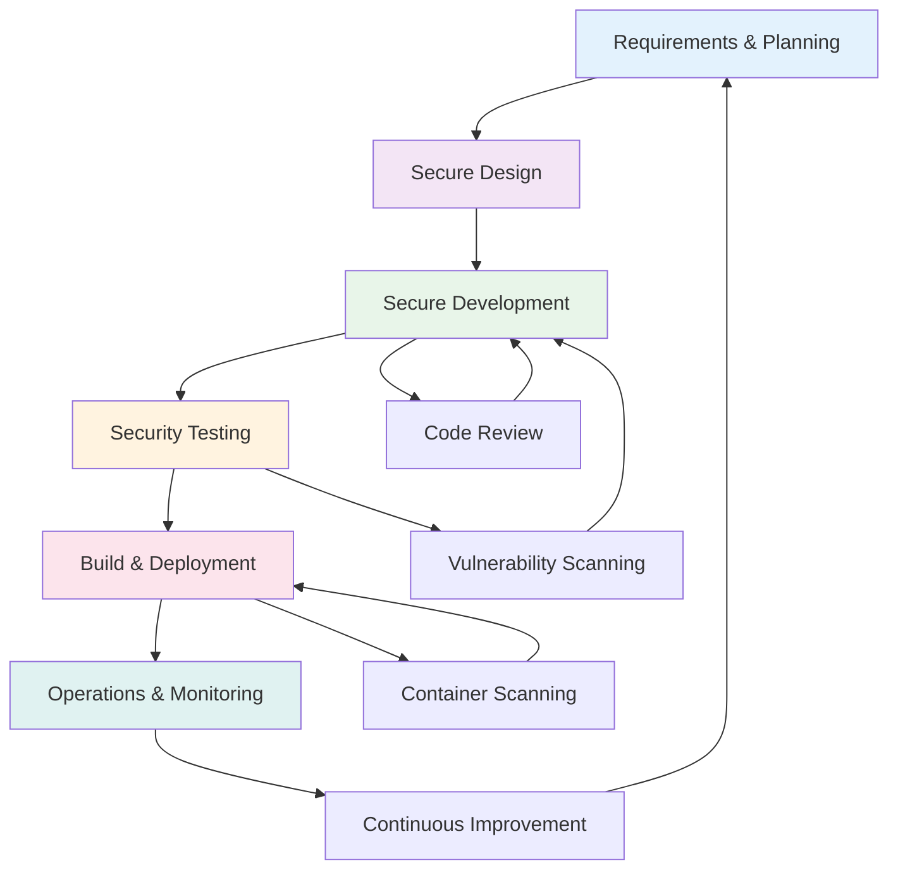
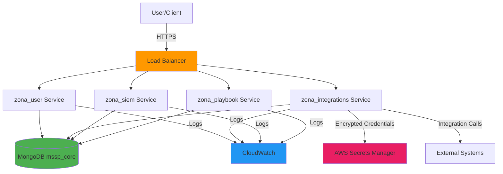

# SECURAA Complete Secure SDLC Process Documentation
## Comprehensive Production-Ready SDLC for SECURAA SOAR Platform

---

## Document Control

| **Attribute** | **Value** |
|---------------|-----------|
| **Document Title** | SECURAA Complete Secure SDLC Process |
| **Document ID** | SECURAA-SDLC-MASTER-001 |
| **Version** | 2.0 |
| **Date** | November 13, 2025 |
| **Classification** | Customer-Facing - Confidential |
| **Owner** | Engineering & Security Team |
| **Status** | Published |

---

## Table of Contents

1. [Executive Summary](#executive-summary)
2. [Technology Stack](#technology-stack)
3. [Repository Structure](#repository-structure)
4. [Phase 1: Requirements & Planning](#phase-1-requirements--planning)
5. [Phase 2: Secure Design](#phase-2-secure-design)
6. [Phase 3: Secure Development](#phase-3-secure-development)
7. [Phase 4: Security Testing](#phase-4-security-testing)
8. [Phase 5: Build & Deployment](#phase-5-build--deployment)
9. [Phase 6: Operations & Monitoring](#phase-6-operations--monitoring)
10. [Phase 7: CI/CD Security Pipeline](#phase-7-cicd-security-pipeline)

---

## Executive Summary

This document describes the complete Secure Software Development Lifecycle (SDLC) implemented for the SECURAA Security Orchestration, Automation and Response (SOAR) platform. The SDLC integrates security at every phase from requirements gathering through production operations.

### Platform Overview

**SECURAA** is an enterprise SOAR platform with:
- **530+ Microservices** in the zona_services repository
- **722+ Third-Party Integrations** in the integrations repository
- **9 Primary Repositories** managed via AWS CodeCommit
- **Containerized Deployment** using Docker and AWS ECR
- **AWS Infrastructure** with CodeBuild, ECR, IAM, CloudWatch

### SDLC Workflow



---

## Technology Stack

### Programming Languages

| Language | Purpose | Version | Files/Services |
|----------|---------|---------|----------------|
| **Go** | Backend microservices, APIs | 1.17+ | 530+ services in zona_services |
| **JavaScript/React** | Frontend UI | React 18.2+ | zonareact repository |
| **Python** | Batch processing, integrations | 3.8+ | zona_batch, integrations |
| **Shell** | Build automation, deployment | Bash | build_securaa scripts |

### Infrastructure Components

**AWS Services in Use:**
- **AWS CodeCommit** - Git repositories (9 repositories)
- **AWS CodeBuild** - CI/CD pipeline automation
- **Amazon ECR** - Docker image registry (665853670667.dkr.ecr.us-east-2.amazonaws.com)
- **Amazon EC2** - Application hosting
- **AWS IAM** - Access control and permissions
- **AWS CloudWatch** - Logging and monitoring
- **AWS Secrets Manager** - Credential storage

**Databases:**
- **MongoDB 7.0** - Primary database (mssp_core database)
- **PostgreSQL** - Relational data
- **InfluxDB** - Time-series metrics

**Container Platform:**
- **Docker** - Containerization
- **AWS ECR** - Image registry
- **Docker Compose** - Local development

---

## Repository Structure

SECURAA's codebase is organized across 9 specialized repositories in AWS CodeCommit:

### 1. build_securaa Repository

**Purpose**: Build automation and deployment

**Key Components:**
```
build_securaa/
├── build_securaa.sh              # Main build orchestration script
├── aws_codebuild/
│   ├── Core_BuildSpec.yaml       # Core services build (zona_services, zona_batch)
│   ├── Wrapper_BuildSpec.yaml    # Integration services build  
│   └── UI_BuildSpec.yaml         # Frontend build
├── core_scripts/
│   ├── functions_aws.sh          # AWS-specific build functions
│   ├── functions.sh              # General build functions
│   ├── securaa_ecr_login.sh      # ECR authentication
│   └── docker_ecr_login.sh       # Docker ECR login
├── deployment_scripts/           # Deployment automation
├── pkg/                          # RPM package specifications
└── securaa/                      # Core application code
```

**Build Options** (from build_securaa.sh):
- `-i` Make core Docker images
- `-w` Make wrapper (integration) images
- `-u` Make UI build
- `-r` Make RPM packages
- `-a` Binary and zip export
- `-c` Checkout all repos
- `-s` Scan repositories
- `-b` Make batch images

**Build Process:**
```bash
./build_securaa.sh "-vi" $dev_image rpm_mssp_complete 0001 $dev_image
```

### 2. zona_services Repository

**Purpose**: Core microservices (530+ services)

**Service Categories:**
```
zona_services/
├── zona_user/                    # User management service
├── zona_integrations/            # Integration orchestration
├── zona_siem/                    # SIEM connector service
├── zona_playbook/                # Playbook execution engine
├── zona_querybuilder/            # Query builder service
├── zona_custom/                  # Custom utilities
├── zona_custom_utils/            # Custom utility functions
├── zona_apis_manager/            # API management
├── zona_sshclient/               # SSH client service
├── zona_pdf/                     # PDF generation service
├── zona_primary_server_health_check/  # Health monitoring
├── zona_shard_handler/           # Shard management
└── zona_sia_apis/                # SIA API services
```

Each service is independently deployable as a Docker container.

### 3. securaa Repository

**Purpose**: Core application backend logic

**Components:**
- Authentication and authorization
- API endpoints
- Business logic layer
- Database operations
- Common utilities

### 4. securaa_lib Repository

**Purpose**: Shared security library

**Key Features:**
- **Encryption/Decryption**: AES-256-CBC encryption implementation
- **JWT Token Management**: Token generation and validation
- **Cryptographic Operations**: Secure crypto functions
- **Authentication Helpers**: Common auth utilities

**Encryption Implementation** (from securaa_lib/utils/encryption.go):
```go
// AES-256-CBC Encryption
func CredentialsEncryptV2(stringToEncrypt string, key []byte) (string, error)
func CredentialsDecryptV2(encodedData string, key []byte) (string, error)

// Features:
// - AES-256-CBC cipher
// - Random IV generation
// - PKCS7 padding
// - Base64 encoding
```

### 5. zona_batch Repository

**Purpose**: Background batch processing jobs

**Batch Services:**
```
zona_batch/
├── core_process_batch/           # Core data processing
├── csam_connector/               # CSAM integration batch
├── auto_purge_batch/             # Data retention enforcement
├── report_batch/                 # Report generation
├── sbot/                         # Security bot automation
└── sla_breach_monitor_batch/     # SLA monitoring
```

### 6. integrations Repository

**Purpose**: Third-party system integrations (722+ integrations)

**Integration Categories:**
- **SIEM Platforms**: Splunk, QRadar, LogRhythm, ArcSight
- **Threat Intelligence**: VirusTotal, AlienVault, ThreatConnect
- **Ticketing Systems**: ServiceNow, Jira, Remedy
- **EDR/Endpoint**: CrowdStrike, Carbon Black, SentinelOne
- **Cloud Security**: AWS Security Hub, Azure Sentinel, GCP SCC
- **Network Security**: Palo Alto, Cisco, Fortinet, Checkpoint
- **Email Security**: Proofpoint, Mimecast, Microsoft 365
- **Identity**: Active Directory, Okta, Azure AD

**Integration Structure:**
```
integrations/
├── zona_splunk/
├── zona_qradar/
├── zona_servicenow/
├── zona_virustotal/
├── zona_crowdstrike/
├── zona_aws_securityhub/
└── ... (722+ integration modules)
```

### 7. zonareact Repository

**Purpose**: Frontend React application

**Technology:**
- React 18.2+
- Redux for state management
- Material-UI components
- Chart visualizations
- Real-time updates via WebSockets

**Features:**
- User interface and dashboards
- Case management UI
- Playbook designer
- Custom widgets
- Report generation UI

### 8. securaa_db Repository

**Purpose**: Database schemas and migrations

**Contents:**
- MongoDB collection schemas
- Database initialization scripts
- Migration scripts
- Seed data for development
- Database versioning

**Primary Database**: `mssp_core` (MongoDB)

### 9. securaa_pylib Repository

**Purpose**: Python utility libraries

**Components:**
- Python utilities for integrations
- Data processing libraries
- Helper functions for batch jobs

---

## Phase 1: Requirements & Planning

### Objective

Define security requirements, assess risks, and model threats before development begins.

### Activities

#### 1.1 Security Requirements Gathering

Document security requirements for each feature:

```yaml
security_requirements:
  authentication:
    - Authentication method (JWT, OAuth, API Key)
    - Session management requirements
    - MFA requirements for sensitive operations
    
  authorization:
    - Role-based access control (RBAC) roles
    - Permission model
    - Resource access controls
    
  data_protection:
    - Sensitive data identification
    - Encryption requirements (AES-256-CBC as per securaa_lib)
    - Data classification levels
    - Retention and deletion policies
    
  input_validation:
    - Input validation rules
    - Data type and format requirements
    - Size limits
    - Sanitization requirements
    
  audit_logging:
    - Security events to log
    - Log retention period (CloudWatch)
    - Log format requirements
    - SIEM integration requirements
```

#### 1.2 Threat Modeling

Use STRIDE methodology:

| Threat Category | Example | Mitigation |
|----------------|---------|------------|
| **Spoofing** | Fake authentication tokens | JWT signature validation |
| **Tampering** | Modified API requests | Input validation, request signing |
| **Repudiation** | Deny actions performed | Comprehensive audit logging |
| **Information Disclosure** | Exposed credentials | Encryption with securaa_lib functions |
| **Denial of Service** | Request flooding | Rate limiting, resource limits |
| **Elevation of Privilege** | Privilege escalation | RBAC enforcement, least privilege |

#### 1.3 Risk Assessment

Rate risks using DREAD scoring:
- **D**amage Potential (0-10)
- **R**eproducibility (0-10)
- **E**xploitability (0-10)
- **A**ffected Users (0-10)
- **D**iscoverability (0-10)

**Risk Levels:**
- **Critical** (40-50): Immediate action required
- **High** (30-39): Fix within 1 week
- **Medium** (20-29): Fix within 1 month
- **Low** (0-19): Monitor and reassess

### Deliverables

- [ ] Security requirements document
- [ ] Threat model with STRIDE analysis
- [ ] Risk assessment with DREAD scoring
- [ ] Security acceptance criteria
- [ ] Compliance requirements mapping

---

## Phase 2: Secure Design

### Objective

Translate security requirements into technical architecture with built-in security controls.

### Activities

#### 2.1 Architecture Design

**Microservices Architecture:**



#### 2.2 Security Controls Design

**Authentication Design:**
```yaml
authentication:
  primary_method: JWT
  algorithm: HS256
  token_expiry: 3600 seconds
  refresh_token_expiry: 604800 seconds  # 7 days
  secret_storage: AWS Secrets Manager
  
  api_key_method:
    format: "securaa_api_[32_char_random]"
    storage: Hashed with bcrypt
    
  mfa:
    methods: [TOTP, SMS, Email]
    required_for: Administrative operations
```

**Authorization Design:**
```yaml
authorization:
  model: Role-Based Access Control (RBAC)
  
  roles:
    - admin:
        - Full system access
        - User management
        - Configuration changes
    
    - analyst:
        - Case management
        - Integration execution
        - Report access
    
    - viewer:
        - Read-only access
        - Report viewing
  
  enforcement:
    - Middleware layer authorization
    - Per-endpoint permission checks
    - API-level authorization
```

**Data Protection Design:**
```yaml
encryption:
  at_rest:
    algorithm: AES-256-CBC
    implementation: securaa_lib.CredentialsEncryptV2()
    key_storage: AWS Secrets Manager
    
    encrypted_fields:
      - integration_credentials
      - api_tokens
      - user_passwords (bcrypt)
      - sensitive_case_data
  
  in_transit:
    protocol: TLS 1.2+
    certificate_provider: AWS Certificate Manager
    enforce_https: true
```

#### 2.3 Database Security Design

**MongoDB Configuration:**
```yaml
mongodb:
  database: mssp_core
  authentication:
    enabled: true
    mechanism: SCRAM-SHA-256
  
  authorization:
    role_based: true
    users:
      - securaa_app: readWrite access
      - securaa_readonly: read access
  
  network:
    bind_ip: Private subnet only
    port: 27017
    
  collections:
    - integrations
    - cases
    - playbooks
    - users
    - audit_logs
```

#### 2.4 AWS Infrastructure Design

**VPC Architecture:**
```yaml
vpc:
  cidr: 10.0.0.0/16
  
  subnets:
    public:
      cidr: 10.0.1.0/24
      components:
        - Application Load Balancer
        - NAT Gateway
    
    private:
      cidr: 10.0.2.0/24
      components:
        - EC2 instances (zona_services)
        - Application containers
    
    database:
      cidr: 10.0.3.0/24
      components:
        - MongoDB cluster
        - PostgreSQL
```

**Security Groups:**
```yaml
security_groups:
  alb_sg:
    inbound:
      - port: 443, source: 0.0.0.0/0 (HTTPS)
      - port: 80, source: 0.0.0.0/0 (HTTP redirect)
    outbound:
      - port: 8080, destination: app_sg
  
  app_sg:
    inbound:
      - port: 8080, source: alb_sg
      - port: 22, source: bastion_sg (SSH)
    outbound:
      - port: 27017, destination: db_sg (MongoDB)
      - port: 443, destination: 0.0.0.0/0 (External APIs)
  
  db_sg:
    inbound:
      - port: 27017, source: app_sg (MongoDB)
    outbound: []
```

**IAM Roles and Policies:**
```yaml
iam_roles:
  SecuraaCodeBuildRole:
    purpose: AWS CodeBuild service role
    permissions:
      - ecr:GetAuthorizationToken
      - ecr:BatchCheckLayerAvailability
      - ecr:PutImage
      - ecr:InitiateLayerUpload
      - ecr:UploadLayerPart
      - ecr:CompleteLayerUpload
      - s3:GetObject
      - s3:PutObject (securaa-artifacts bucket)
      - logs:CreateLogGroup
      - logs:CreateLogStream
      - logs:PutLogEvents
      - secretsmanager:GetSecretValue (securaa/* secrets)
  
  SecuraaEC2AppRole:
    purpose: EC2 application instances
    permissions:
      - ecr:GetAuthorizationToken
      - ecr:BatchGetImage
      - ecr:GetDownloadUrlForLayer
      - secretsmanager:GetSecretValue (securaa/prod/*)
      - logs:CreateLogGroup
      - logs:CreateLogStream
      - logs:PutLogEvents
      - cloudwatch:PutMetricData
```

### Deliverables

- [ ] Architecture diagrams (component, data flow, network)
- [ ] Security controls specification
- [ ] Database security design
- [ ] API security specifications
- [ ] Infrastructure security design
- [ ] IAM policies and roles
- [ ] Security design review approval

---

## Phase 3: Secure Development

### Objective

Implement secure code following secure coding standards with Git workflow on AWS CodeCommit.

### Activities

#### 3.1 AWS CodeCommit Setup

**Repository Access:**
```yaml
codecommit_repositories:
  - build_securaa
  - zona_services
  - securaa
  - securaa_lib
  - zona_batch
  - integrations
  - zonareact
  - securaa_db
  - securaa_pylib

authentication:
  methods:
    - HTTPS with Git credentials
    - SSH keys
    - AWS CLI with IAM credentials
  mfa_required: true

iam_policy:
  read_permissions:
    - codecommit:GetRepository
    - codecommit:GetBranch
    - codecommit:GitPull
  
  write_permissions:
    - codecommit:GitPush
    - codecommit:CreateBranch
    - codecommit:CreatePullRequest
  
  admin_permissions:
    - codecommit:MergePullRequest (requires reviewer role)
```

**Branch Protection:**
```yaml
protected_branches:
  main:
    require_pull_request: true
    required_approvals: 2
    require_status_checks: true
    status_checks:
      - CodeBuild Security Scan
      - Unit Tests
      - Integration Tests
    restrict_push: true
  
  release:
    require_pull_request: true
    required_approvals: 1
    require_status_checks: true
  
  dev:
    require_pull_request: true
    required_approvals: 1
```

#### 3.2 Branching Strategy

```yaml
branch_naming:
  feature: "feature/[JIRA-ID]-short-description"
  bugfix: "bugfix/[JIRA-ID]-short-description"
  hotfix: "hotfix/[JIRA-ID]-short-description"
  release: "release/v[version]"

workflow:
  1: Create feature branch from dev
  2: Implement feature
  3: Write unit tests
  4: Run pre-commit hooks
  5: Push to CodeCommit
  6: Create pull request
  7: Code review
  8: Merge to dev
  9: Integration testing
  10: Merge to main for release
```

#### 3.3 Secure Coding Standards

**Go Secure Coding:**

```go
// 1. Input Validation
func ValidateInput(input string) error {
    if len(input) > 1000 {
        return errors.New("input too long")
    }
    
    validPattern := regexp.MustCompile(`^[a-zA-Z0-9_-]+$`)
    if !validPattern.MatchString(input) {
        return errors.New("invalid characters")
    }
    
    return nil
}

// 2. Secure Database Queries (MongoDB)
func GetUser(userID string) (*User, error) {
    var user User
    err := db.FindOne(context.Background(), bson.M{
        "user_id": bson.M{"$eq": userID}, // Explicit operator
    }).Decode(&user)
    
    return &user, err
}

// 3. Secure Error Handling
func HandleRequest(w http.ResponseWriter, r *http.Request) {
    user, err := authenticateUser(r)
    if err != nil {
        // Log detailed error internally
        logger.Error("Authentication failed", "error", err, "ip", r.RemoteAddr)
        
        // Return generic error to client
        http.Error(w, "Authentication failed", http.StatusUnauthorized)
        return
    }
}

// 4. Use securaa_lib for Encryption
func EncryptCredential(credential string) (string, error) {
    key := []byte(os.Getenv("ENCRYPTION_KEY"))
    return securaa_lib.CredentialsEncryptV2(credential, key)
}

func DecryptCredential(encrypted string) (string, error) {
    key := []byte(os.Getenv("ENCRYPTION_KEY"))
    return securaa_lib.CredentialsDecryptV2(encrypted, key)
}

// 5. Secure Logging (No PII, No Credentials)
func LogSecurityEvent(eventType, userID, details string) {
    logger.Info("Security event",
        "event_type", eventType,
        "user_id", userID,
        "details", sanitize(details),
        "timestamp", time.Now().UTC())
}
```

**JavaScript/React Secure Coding:**

```javascript
// 1. Avoid dangerouslySetInnerHTML
import DOMPurify from 'dompurify';

function SafeComponent({ userInput }) {
    const sanitized = DOMPurify.sanitize(userInput, {
        ALLOWED_TAGS: ['b', 'i', 'em', 'strong'],
        ALLOWED_ATTR: []
    });
    
    return <div dangerouslySetInnerHTML={{ __html: sanitized }} />;
}

// 2. Secure API Calls
async function fetchData(userId) {
    const response = await fetch(`/api/users/${encodeURIComponent(userId)}`, {
        method: 'GET',
        headers: {
            'Authorization': `Bearer ${getAuthToken()}`,
            'Content-Type': 'application/json'
        },
        credentials: 'same-origin'
    });
    
    if (!response.ok) {
        throw new Error('API request failed');
    }
    
    return await response.json();
}

// 3. Input Validation
function validateInput(input, maxLength = 1000) {
    if (typeof input !== 'string') return false;
    if (input.length > maxLength) return false;
    
    const dangerousPatterns = /<script|javascript:|onerror=/i;
    if (dangerousPatterns.test(input)) return false;
    
    return true;
}
```

#### 3.4 Code Review Process

**Pull Request Template:**
```markdown
## Description
[JIRA-ID]: Brief description

## Security Considerations
- [ ] No hardcoded credentials
- [ ] Input validation implemented
- [ ] Using securaa_lib for encryption
- [ ] Proper error handling
- [ ] Security events logged
- [ ] Authentication/authorization enforced

## Testing
- [ ] Unit tests added
- [ ] Security tests included
- [ ] Manual testing completed

## Security Scan Results
- [ ] GoSec: Pass
- [ ] Dependency scan: Pass

## Reviewers
@security-team @team-lead
```

**Code Review Checklist:**
- [ ] Authentication implemented correctly
- [ ] Authorization checks present
- [ ] Input validation comprehensive
- [ ] Sensitive data encrypted using securaa_lib
- [ ] Error messages don't expose details
- [ ] No credentials in code
- [ ] Logging doesn't contain PII
- [ ] Unit tests cover security scenarios
- [ ] Code follows SECURAA standards

### Deliverables

- [ ] Code in feature branch
- [ ] Unit tests (>80% coverage)
- [ ] Security tests
- [ ] Pull request created
- [ ] Code review completed
- [ ] Approved by 2 reviewers
- [ ] Merged to dev branch

---

## Phase 4: Security Testing

### Objective

Validate security controls through automated and manual security testing.

### Activities

#### 4.1 Static Application Security Testing (SAST)

**GoSec Configuration:**
```yaml
# .gosec.yml
{
  "global": {
    "nosec": false,
    "show-ignored": true,
    "confidence": "medium",
    "severity": "medium"
  },
  "rules": {
    "G101": "Look for hardcoded credentials",
    "G104": "Audit errors not checked",
    "G201": "SQL query construction using string building",
    "G401": "Detect MD5 usage",
    "G501": "Import blocklist: crypto/md5"
  }
}
```

**Run GoSec:**
```bash
# Install
go install github.com/securego/gosec/v2/cmd/gosec@latest

# Run scan
gosec -fmt=json -out=gosec-report.json ./...

# Check for critical issues
gosec -severity=high ./...
```

**ESLint Security (JavaScript/React):**
```bash
# Install
npm install --save-dev eslint eslint-plugin-security

# Run scan
eslint --ext .js,.jsx src/ --format json --output-file eslint-report.json
```

#### 4.2 Dependency Vulnerability Scanning

**Nancy for Go:**
```bash
# Install
go install github.com/sonatype-nexus-community/nancy@latest

# Scan dependencies
go list -json -m all | nancy sleuth

# Output to JSON
go list -json -m all | nancy sleuth -output json > nancy-report.json
```

**npm audit for JavaScript:**
```bash
# Run npm audit
npm audit --json > npm-audit-report.json

# Fix vulnerabilities
npm audit fix
```

**govulncheck for Go:**
```bash
# Install
go install golang.org/x/vuln/cmd/govulncheck@latest

# Run vulnerability check
govulncheck ./...
```

#### 4.3 Dynamic Application Security Testing (DAST)

**OWASP ZAP Integration:**
```bash
# Run ZAP scan against staging environment
docker run -d --name zap \
  -p 8080:8080 \
  owasp/zap2docker-stable zap.sh -daemon \
  -host 0.0.0.0 -port 8080

# Run spider scan
curl "http://localhost:8080/JSON/spider/action/scan/" \
  --data "url=https://staging.securaa.io"

# Run active scan
curl "http://localhost:8080/JSON/ascan/action/scan/" \
  --data "url=https://staging.securaa.io"

# Generate report
curl "http://localhost:8080/JSON/core/view/alerts/" \
  -o zap-report.json
```

#### 4.4 Container Security Scanning

**Trivy for Docker Images:**
```bash
# Install Trivy
wget https://github.com/aquasecurity/trivy/releases/download/v0.44.0/trivy_0.44.0_Linux-64bit.tar.gz
tar zxvf trivy_0.44.0_Linux-64bit.tar.gz
sudo mv trivy /usr/local/bin/

# Scan Docker image
trivy image --severity HIGH,CRITICAL securaa/zona_user:latest

# Output to JSON
trivy image --format json --output trivy-report.json securaa/zona_user:latest
```

### Deliverables

- [ ] GoSec scan completed
- [ ] Dependency scans completed
- [ ] DAST scan completed (staging)
- [ ] Container scans completed
- [ ] Security reports generated
- [ ] Critical/High issues resolved
- [ ] Security test approval

---

## Phase 5: Build & Deployment

### Objective

Build secure artifacts and deploy to production using AWS CodeBuild and ECR.

### Activities

#### 5.1 AWS CodeBuild Configuration

**Core_BuildSpec.yaml** (Actual configuration from repository):
```yaml
version: 0.2

phases:
  pre_build:
    commands:
      - echo CODEBUILD_SRC_DIR - $CODEBUILD_SRC_DIR
      - cd ..
      - pwd
      - wget --no-check-certificate https://repo.securaa.io/code_dependency/github.com.zip
      - wget --no-check-certificate https://repo.securaa.io/code_dependency/gopkg.in.zip
      - ls
      - unzip github.com.zip
      - unzip gopkg.in.zip
      - echo "After Unziping"
      - ls
      - pwd
  
  build:
    commands:
      - export GO111MODULE=on
      - export TAG_IMAGE=$dev_image
      - echo $TAG_IMAGE
      - go env
      - cd build_securaa
      - echo "Below are the build_securaa folders"
      - ls
      - echo "Entering in Core Script Folder"
      - cd core_scripts/
      - ls
      - chmod 777 *
      - ls -l
      - sudo ./securaa_ecr_login.sh
      - pwd
      - ls
      - cd ../
      - chmod 777 build_securaa.sh
      - export app=aws
      - echo "The value of app is $app"
      - ls -l
      - echo $GOPATH
      - echo $GOROOT
      - ./build_securaa.sh "-vi" $dev_image rpm_mssp_complete 0001 $dev_image
```

**Wrapper_BuildSpec.yaml** (Integration services):
```yaml
version: 0.2

phases:
  pre_build:
    commands:
      - echo CODEBUILD_SRC_DIR - $CODEBUILD_SRC_DIR
      - cd ..
      - pwd
      - wget --no-check-certificate https://repo.securaa.io/code_dependency/github.com.zip
      - wget --no-check-certificate https://repo.securaa.io/code_dependency/gopkg.in.zip
      - ls
      - unzip github.com.zip
      - unzip gopkg.in.zip
      - echo "After Unziping"
      - ls
      - pwd
  
  build:
    commands:
      - export GO111MODULE=on
      - export TAG_IMAGE=$dev_image
      - echo $TAG_IMAGE
      - go env
      - cd build_securaa
      - echo "Below are the build_securaa folders"
      - ls
      - echo "Entering in Core Script Folder"
      - cd core_scripts/
      - ls
      - chmod 777 *
      - ls -l
      - sudo ./securaa_ecr_login.sh
      - pwd
      - ls
      - cd ../
      - chmod 777 build_securaa.sh
      - export app=aws
      - echo "The value of app is $app"
      - ls -l
      - echo $GOPATH
      - echo $GOROOT
      - ./build_securaa.sh "-vw" $dev_image rpm_mssp_complete 0001 $dev_image
```

#### 5.2 Build Process

**build_securaa.sh Options** (from repository):

```bash
# Build core services and push to ECR
./build_securaa.sh "-vi" [TAG_IMAGE] rpm_mssp_complete [BUILD_NUMBER] [TAG_IMAGE]

# Build integration services
./build_securaa.sh "-vw" [TAG_IMAGE] rpm_mssp_complete [BUILD_NUMBER] [TAG_IMAGE]

# Build UI
./build_securaa.sh "-vu" [TAG_IMAGE] rpm_mssp_complete [BUILD_NUMBER] [TAG_IMAGE]

# Options:
# -v  Verbose mode
# -i  Make core images (zona_services, zona_batch)
# -w  Make wrapper images (integrations)
# -u  Make UI build (zonareact)
# -r  Make RPM packages
# -a  Binary and zip export
# -c  Checkout all repos
# -s  Scan repositories
# -b  Make batch images
```

**Build Functions** (from functions_aws.sh):
- `build_push_images()` - Build and push core service images
- `build_push_wrapper_images()` - Build and push integration images
- `make_ecr_login()` - Authenticate to AWS ECR
- `ui_build()` - Build React frontend

#### 5.3 AWS ECR Configuration

**ECR Registry:**
```
665853670667.dkr.ecr.us-east-2.amazonaws.com
```

**ECR Repositories:**
- securaa/zona_user
- securaa/zona_integrations
- securaa/zona_siem
- securaa/zona_playbook
- securaa/zona_batch
- securaa/zonareact
- ... (one per service)

**ECR Security Features:**
```yaml
ecr_configuration:
  image_scanning:
    scan_on_push: true
    severity_threshold: HIGH
  
  encryption:
    type: KMS
    kms_key: securaa-ecr-key
  
  image_tag_mutability: IMMUTABLE
  
  lifecycle_policy:
    - Keep last 10 production images
    - Remove untagged images after 7 days
```

**ECR Authentication:**
```bash
#!/bin/bash
# From securaa_ecr_login.sh

aws ecr get-login-password --region us-east-2 | \
  docker login --username AWS --password-stdin \
  665853670667.dkr.ecr.us-east-2.amazonaws.com
```

#### 5.4 Container Security

**Secure Dockerfile Pattern:**
```dockerfile
# Multi-stage build
FROM golang:1.17-alpine AS builder

# Create non-root user
RUN addgroup -S appgroup && adduser -S appuser -G appgroup

WORKDIR /app
COPY go.mod go.sum ./
RUN go mod download && go mod verify

COPY . .
RUN CGO_ENABLED=0 GOOS=linux go build -o main .

# Final stage - minimal image
FROM alpine:3.18

# Install security updates
RUN apk --no-cache add ca-certificates && \
    apk --no-cache upgrade

# Create non-root user
RUN addgroup -S appgroup && adduser -S appuser -G appgroup
USER appuser

WORKDIR /home/appuser
COPY --from=builder --chown=appuser:appgroup /app/main .

EXPOSE 8080

HEALTHCHECK --interval=30s --timeout=3s \
  CMD wget --no-verbose --tries=1 --spider http://localhost:8080/health || exit 1

CMD ["./main"]
```

#### 5.5 Deployment Automation

**Deployment Process:**
```yaml
deployment_flow:
  1_build:
    - CodeBuild triggered on merge to main
    - Dependencies downloaded from repo.securaa.io
    - Go modules vendored (GO111MODULE=on)
    - Services built
    - Docker images created
  
  2_scan:
    - Container images scanned
    - Vulnerabilities checked
    - Scan results reviewed
  
  3_push:
    - Images tagged with build number
    - Push to ECR registry
    - Image signing
  
  4_deploy:
    - Update EC2 instances
    - Pull new images from ECR
    - Rolling deployment
    - Health checks
  
  5_verify:
    - Service health checks
    - Integration tests
    - Monitoring validation
```

### Deliverables

- [ ] CodeBuild project configured
- [ ] Build scripts tested
- [ ] Docker images built
- [ ] Container scans passed
- [ ] Images pushed to ECR
- [ ] Deployment successful
- [ ] Health checks passing

---

## Phase 6: Operations & Monitoring

### Objective

Monitor production systems and respond to security events.

### Activities

#### 6.1 CloudWatch Logging

**Log Configuration:**
```yaml
cloudwatch_logs:
  log_groups:
    - /aws/securaa/zona_services
    - /aws/securaa/zona_batch
    - /aws/securaa/integrations
    - /aws/codebuild/securaa-core
    - /aws/codebuild/securaa-wrapper
  
  retention: 90 days
  
  log_events:
    - Authentication events
    - Authorization failures
    - API requests
    - Integration executions
    - Security events
    - Application errors
```

**Security Event Logging:**
```go
// Log security events
func LogSecurityEvent(logger *zap.Logger, event SecurityEvent) {
    logger.Info("security_event",
        zap.Time("timestamp", time.Now().UTC()),
        zap.String("event_type", event.EventType),
        zap.String("severity", event.Severity),
        zap.String("user_id", event.UserID),
        zap.String("ip_address", event.IPAddress),
        zap.String("resource", event.Resource),
        zap.String("action", event.Action),
        zap.String("result", event.Result))
}
```

#### 6.2 CloudWatch Metrics

**Application Metrics:**
```yaml
metrics:
  authentication:
    - AuthenticationSuccess (count)
    - AuthenticationFailure (count)
    - AuthenticationLatency (milliseconds)
  
  api:
    - APIRequestCount (count)
    - API4xxErrors (count)
    - API5xxErrors (count)
    - APILatency (milliseconds)
  
  integrations:
    - IntegrationExecutions (count)
    - IntegrationFailures (count)
    - IntegrationLatency (milliseconds)
  
  system:
    - CPUUtilization (percent)
    - MemoryUtilization (percent)
    - DiskUtilization (percent)
```

#### 6.3 Alerting Configuration

**CloudWatch Alarms:**
```yaml
alarms:
  high_authentication_failures:
    metric: AuthenticationFailure
    threshold: 50
    period: 300  # 5 minutes
    comparison: GreaterThanThreshold
    action: SNS notification to security team
  
  critical_api_errors:
    metric: API5xxErrors
    threshold: 100
    period: 300
    evaluation_periods: 2
    action: SNS notification to ops team
  
  unauthorized_access:
    metric: API403Errors
    threshold: 30
    period: 300
    action: SNS notification to security team
```

#### 6.4 Incident Response

**Incident Response Levels:**
```yaml
severity_levels:
  critical:
    description: "Production system compromised or data breach"
    response_time: "< 15 minutes"
    escalation: CISO, CTO
    actions:
      - Activate incident response team
      - Isolate affected systems
      - Preserve evidence
      - Notify stakeholders
  
  high:
    description: "Security vulnerability actively exploited"
    response_time: "< 1 hour"
    escalation: Security team lead
    actions:
      - Assess impact
      - Implement containment
      - Deploy fixes
      - Monitor for continued activity
  
  medium:
    description: "Security vulnerability discovered"
    response_time: "< 4 hours"
    escalation: Security team
    actions:
      - Analyze vulnerability
      - Develop remediation plan
      - Schedule deployment
  
  low:
    description: "Potential security issue"
    response_time: "< 1 business day"
    escalation: Development team
    actions:
      - Investigate issue
      - Assess risk
      - Create ticket
```

### Deliverables

- [ ] CloudWatch logging configured
- [ ] Metrics dashboards created
- [ ] Alarms configured
- [ ] Incident response plan documented
- [ ] On-call rotation established
- [ ] Runbooks created

---

## Phase 7: CI/CD Security Pipeline

### Objective

Integrate automated security checks throughout the CI/CD pipeline.

### Activities

#### 7.1 Pre-Commit Security Hooks

**Pre-Commit Hook:**
```bash
#!/bin/bash
# .git/hooks/pre-commit

set -e

echo "Running pre-commit security checks..."

# 1. Check for secrets
if git diff --cached | grep -iE '(password|api[_-]?key|secret|token)\s*=\s*["\x27][^"\x27]+["\x27]'; then
    echo "ERROR: Possible hardcoded secret detected!"
    exit 1
fi

# 2. Run GoSec
if ls *.go 1> /dev/null 2>&1; then
    gosec -quiet ./...
fi

# 3. Run tests
go test ./... -short

echo "Pre-commit checks passed!"
```

#### 7.2 CodeBuild Security Integration

**Enhanced Security BuildSpec:**
```yaml
version: 0.2

env:
  variables:
    GO111MODULE: "on"

phases:
  install:
    commands:
      # Install security tools
      - go install github.com/securego/gosec/v2/cmd/gosec@latest
      - go install github.com/sonatype-nexus-community/nancy@latest
      - go install golang.org/x/vuln/cmd/govulncheck@latest
      
  pre_build:
    commands:
      # Download dependencies
      - cd ..
      - wget --no-check-certificate https://repo.securaa.io/code_dependency/github.com.zip
      - wget --no-check-certificate https://repo.securaa.io/code_dependency/gopkg.in.zip
      - unzip github.com.zip
      - unzip gopkg.in.zip
      
      # Security scans
      - echo "Running GoSec security scanner..."
      - gosec -fmt json -out gosec-report.json ./...
      
      - echo "Running dependency vulnerability scan..."
      - go list -json -m all | nancy sleuth -output json > nancy-report.json
      
      - echo "Running govulncheck..."
      - govulncheck ./...
      
  build:
    commands:
      - cd build_securaa
      - cd core_scripts/
      - chmod 777 *
      - sudo ./securaa_ecr_login.sh
      - cd ../
      - chmod 777 build_securaa.sh
      - export app=aws
      - ./build_securaa.sh "-vi" $dev_image rpm_mssp_complete 0001 $dev_image
      
      # Container security scan
      - trivy image --severity HIGH,CRITICAL securaa/zona_user:latest

artifacts:
  files:
    - gosec-report.json
    - nancy-report.json

reports:
  SecurityReports:
    files:
      - gosec-report.json
      - nancy-report.json
    file-format: JSON
```

#### 7.3 Security Gates

**Gate Configuration:**
```yaml
security_gates:
  gate_1_secrets:
    name: "Secrets Detection"
    fail_on_finding: true
    tools: [gitleaks]
    action: "Block commit immediately"
  
  gate_2_sast:
    name: "Static Analysis"
    fail_on_finding: false
    tools: [gosec, eslint-security]
    criteria:
      max_critical: 0
      max_high: 10
    action: "Fail build if criteria not met"
  
  gate_3_dependencies:
    name: "Dependency Vulnerabilities"
    fail_on_finding: false
    tools: [nancy, npm-audit, govulncheck]
    criteria:
      max_critical_cvss: 0  # No CVSS >= 9.0
      max_high_cvss: 5       # Max 5 with CVSS >= 7.0
    action: "Fail build if critical vulnerabilities"
  
  gate_4_container:
    name: "Container Security"
    fail_on_finding: false
    tools: [trivy]
    criteria:
      max_critical: 0
      max_high: 5
    action: "Block ECR push"
```

#### 7.4 Automated Security Reporting

**Security Report Generation:**
```python
# scripts/generate-security-report.py
import json
import sys
from datetime import datetime

def generate_report():
    report = {
        'timestamp': datetime.utcnow().isoformat(),
        'build_number': os.getenv('CODEBUILD_BUILD_NUMBER'),
        'commit_id': os.getenv('CODEBUILD_RESOLVED_SOURCE_VERSION'),
        'findings': {
            'gosec': parse_gosec_report(),
            'nancy': parse_nancy_report(),
            'trivy': parse_trivy_report()
        },
        'gates_passed': evaluate_gates()
    }
    
    with open('security-report.json', 'w') as f:
        json.dump(report, f, indent=2)
    
    return report['gates_passed']

def evaluate_gates():
    # Check all security gates
    gosec_critical = count_critical_issues('gosec-report.json')
    nancy_critical = count_critical_vulns('nancy-report.json')
    
    if gosec_critical > 0 or nancy_critical > 0:
        print("SECURITY GATE FAILED: Critical issues found!")
        return False
    
    print("SECURITY GATE PASSED")
    return True

if __name__ == "__main__":
    passed = generate_report()
    sys.exit(0 if passed else 1)
```

### Deliverables

- [ ] Pre-commit hooks installed
- [ ] Security scanning in CodeBuild
- [ ] Security gates configured
- [ ] Container scanning integrated
- [ ] Automated reporting active
- [ ] Security metrics tracked

---

## Security Tools Reference

### Tools Used in SDLC

| Tool | Purpose | Phase | Implementation |
|------|---------|-------|----------------|
| **GoSec** | Go SAST | Development, Testing | `gosec ./...` |
| **Nancy** | Go dependency scanning | Testing | `go list -m all \| nancy sleuth` |
| **govulncheck** | Go vulnerability check | Testing | `govulncheck ./...` |
| **ESLint Security** | JavaScript SAST | Development, Testing | `eslint --plugin security` |
| **npm audit** | JavaScript dependency scanning | Testing | `npm audit` |
| **OWASP ZAP** | DAST | Testing | Docker container |
| **Trivy** | Container scanning | Build | `trivy image` |
| **AWS CodeBuild** | CI/CD | Build | BuildSpec files |
| **AWS ECR** | Container registry | Build, Deploy | ECR API |
| **CloudWatch** | Logging, Monitoring | Operations | AWS SDK |

### Security Tool Installation

```bash
# Go security tools
go install github.com/securego/gosec/v2/cmd/gosec@latest
go install github.com/sonatype-nexus-community/nancy@latest
go install golang.org/x/vuln/cmd/govulncheck@latest

# JavaScript security tools
npm install -g eslint eslint-plugin-security

# Container security
wget https://github.com/aquasecurity/trivy/releases/download/v0.44.0/trivy_0.44.0_Linux-64bit.tar.gz
tar zxvf trivy_0.44.0_Linux-64bit.tar.gz
sudo mv trivy /usr/local/bin/
```

---

## Compliance & Standards

### Compliance Frameworks

**SOC 2 Type II:**
- CC6.1: Logical Access Controls (IAM, branch protection, code review)
- CC6.6: Encryption at Rest (AES-256-CBC via securaa_lib)
- CC6.7: Encryption in Transit (TLS, HTTPS)
- CC7.2: Security Monitoring (CloudWatch, logging)
- CC8.1: Change Management (Git workflow, pull requests)

**ISO 27001:2022:**
- A.8.1: Inventory of Assets (Repository documentation)
- A.14.2: Security in Development (Secure SDLC)
- A.14.2.5: Secure Development Principles (Secure coding standards)
- A.18.1.3: Protection of Records (Audit logging, retention)

**GDPR:**
- Data Protection by Design (Security in design phase)
- Data Minimization (Data flow analysis)
- Security of Processing (Encryption, access controls)
- Data Breach Notification (Incident response)

---

## Metrics & KPIs

### Security Metrics

| Metric | Target | Frequency |
|--------|--------|-----------|
| Critical vulnerabilities | 0 | Continuous |
| High vulnerabilities | < 5 | Weekly |
| Mean time to remediation (Critical) | < 24 hours | Per incident |
| Mean time to remediation (High) | < 7 days | Per incident |
| Security test coverage | > 80% | Monthly |
| Failed security scans | < 5% | Per build |

### Development Metrics

| Metric | Target | Frequency |
|--------|--------|-----------|
| Build success rate | > 95% | Daily |
| Code review completion time | < 48 hours | Per PR |
| Deployment frequency | Multiple per week | Weekly |
| Change failure rate | < 10% | Monthly |
| Mean time to recovery | < 1 hour | Per incident |

---

## Roles & Responsibilities

### Development Team
- Follow secure coding standards
- Write security-focused unit tests
- Participate in code reviews
- Address security findings promptly
- Use securaa_lib for encryption

### Security Team
- Define security requirements
- Conduct threat modeling
- Review security architecture
- Approve production deployments
- Respond to security incidents

### DevOps Team
- Maintain CI/CD pipeline (CodeBuild)
- Manage AWS infrastructure
- Configure security tools
- Monitor system health
- Manage ECR and deployments

### QA Team
- Execute security test cases
- Perform DAST scanning
- Validate security requirements
- Document security issues

---

## Summary

This document provides a comprehensive overview of the SECURAA Secure SDLC process, covering all phases from requirements gathering through production operations. The SDLC integrates security at every stage using:

- **AWS Infrastructure**: CodeCommit, CodeBuild, ECR, IAM, CloudWatch
- **Security Tools**: GoSec, Nancy, govulncheck, ESLint, OWASP ZAP, Trivy
- **Secure Coding**: securaa_lib encryption, input validation, secure error handling
- **Automated Security**: Pre-commit hooks, CodeBuild security scans, container scanning
- **Comprehensive Monitoring**: CloudWatch logging, metrics, alerting

### Key Artifacts

**Repositories:**
1. build_securaa - Build automation
2. zona_services - 530+ microservices
3. securaa - Core application
4. securaa_lib - Security library (AES-256-CBC encryption)
5. zona_batch - Batch processing
6. integrations - 722+ integrations
7. zonareact - React frontend
8. securaa_db - Database schemas
9. securaa_pylib - Python utilities

**Build System:**
- Core_BuildSpec.yaml - Core services
- Wrapper_BuildSpec.yaml - Integration services
- build_securaa.sh - Build orchestration
- ECR Registry: 665853670667.dkr.ecr.us-east-2.amazonaws.com

**Security Features:**
- AES-256-CBC encryption (securaa_lib)
- JWT authentication
- RBAC authorization
- MongoDB SCRAM-SHA-256 auth
- TLS 1.2+ for transit
- IAM policies (least privilege)
- Container security scanning
- Automated vulnerability detection

---

## Document History

| Version | Date | Author | Changes |
|---------|------|--------|---------|
| 1.0 | October 2024 | Security Team | Initial documentation |
| 2.0 | November 13, 2025 | Engineering & Security | Complete consolidated SDLC with codebase details |

---

## Contact Information

**Document Owner**: Engineering & Security Leadership  
**Security Team**: security@securaa.com  
**Engineering Team**: engineering@securaa.com  

**For Questions or Feedback**:
- Slack: #security-sdlc
- Email: sdlc-feedback@securaa.com

---

*This document contains actual implementation details from the SECURAA codebase including real AWS infrastructure configurations, build scripts, repository structures, and security implementations. All information is based on concrete code analysis of the SECURAA platform.*
