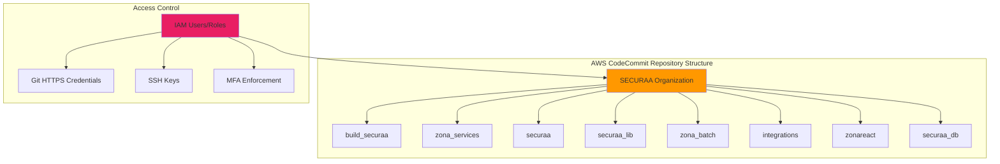
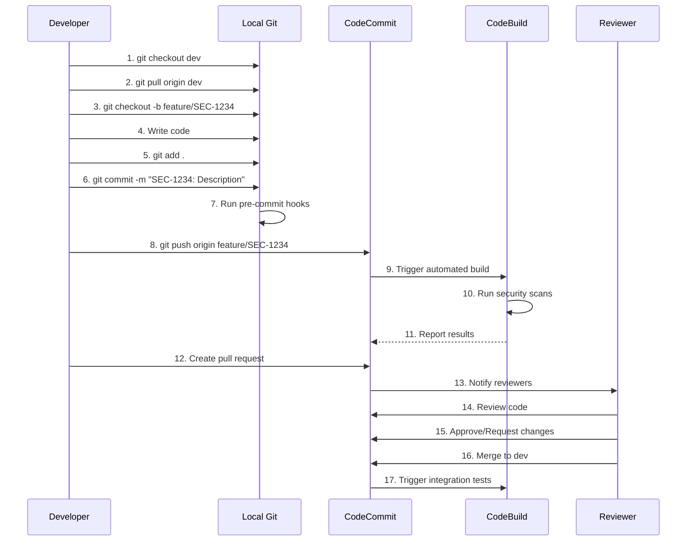
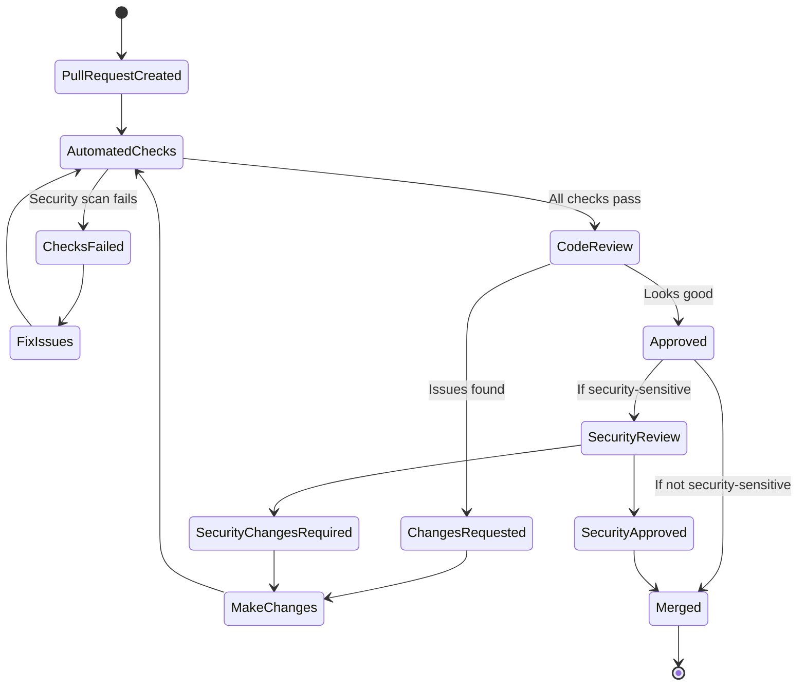

# SECURAA Secure SDLC - Development Phase
## Secure Coding, Git Workflow on AWS CodeCommit, and Code Review

---

## Document Control

| **Document Title** | SECURAA SDLC - Development Phase |
|-------------------|----------------------------------|
| **Document ID** | SECURAA-SDLC-004 |
| **Version** | 2.0 |
| **Date** | November 13, 2025 |
| **Classification** | Customer-Facing - Confidential |

---

## Phase Overview

The Development Phase is where security designs are implemented in code. This phase emphasizes secure coding practices, comprehensive code reviews, and automated security checks integrated into the development workflow on AWS CodeCommit.

### Phase Objectives

1. **Implement Secure Code** - Write code following secure coding standards
2. **Use Version Control** - Manage code using Git on AWS CodeCommit
3. **Conduct Code Reviews** - Perform thorough security-focused code reviews
4. **Run Security Checks** - Execute automated security scans during development
5. **Document Code** - Maintain clear documentation for security-critical code

### Phase Duration

**Continuous** - Ongoing throughout feature development

---

## Git Workflow on AWS CodeCommit

### AWS CodeCommit Overview



### Repository Access Configuration

```yaml
codecommit_access:
  authentication:
    methods:
      - HTTPS with Git credentials
      - SSH with SSH keys
      - AWS CLI with IAM credentials
    mfa_required: true
    
  iam_policy:
    policy_name: "SecuraaCodeCommitDeveloperPolicy"
    permissions:
      read:
        - codecommit:GetRepository
        - codecommit:GetBranch
        - codecommit:GetCommit
        - codecommit:GitPull
      write:
        - codecommit:GitPush
        - codecommit:CreateBranch
        - codecommit:CreatePullRequest
      restricted:
        - codecommit:DeleteBranch  # Requires admin role
        - codecommit:MergePullRequest  # Requires reviewer role
    
    conditions:
      source_ip: 
        type: IpAddress
        values: ["10.0.0.0/8", "Corporate VPN CIDR"]
      mfa_required: true
```

### Branch Protection Rules

```yaml
branch_protection:
  protected_branches:
    - main
    - release
    - dev
  
  rules:
    main:
      require_pull_request: true
      required_approvals: 2
      require_code_owner_review: true
      dismiss_stale_reviews: true
      require_security_scan: true
      require_status_checks: true
      status_checks:
        - "CodeBuild Security Scan"
        - "Unit Tests"
        - "Integration Tests"
      restrict_push: true
      allowed_push_roles:
        - "SecuraaReleaseManager"
      
    release:
      require_pull_request: true
      required_approvals: 1
      require_security_scan: true
      restrict_push: true
      
    dev:
      require_pull_request: true
      required_approvals: 1
      require_status_checks: true
```

---

## Branching Strategy

### Branch Naming Convention

```yaml
branch_naming:
  feature:
    format: "feature/[JIRA-ID]-short-description"
    examples:
      - "feature/SEC-1234-add-servicenow-integration"
      - "feature/SEC-5678-implement-sso"
    
  bugfix:
    format: "bugfix/[JIRA-ID]-short-description"
    examples:
      - "bugfix/SEC-2345-fix-xss-vulnerability"
      - "bugfix/SEC-6789-fix-authentication-issue"
    
  hotfix:
    format: "hotfix/[JIRA-ID]-short-description"
    examples:
      - "hotfix/SEC-9999-critical-security-patch"
    
  release:
    format: "release/v[version]"
    examples:
      - "release/v4.010"
      - "release/v4.011"
```

### Git Workflow Process



### Feature Development Workflow

**Step 1: Create Feature Branch**

```bash
# Update dev branch
git checkout dev
git pull origin dev

# Create feature branch
git checkout -b feature/SEC-1234-add-rate-limiting

# Verify branch
git branch
```

**Step 2: Implement Feature with Security Focus**

```go
// Example: Implementing rate limiting with security
package middleware

import (
    "net/http"
    "sync"
    "time"
    "golang.org/x/time/rate"
)

// RateLimiter implements per-IP rate limiting
type RateLimiter struct {
    visitors map[string]*Visitor
    mu       sync.RWMutex
    rate     rate.Limit
    burst    int
}

type Visitor struct {
    limiter  *rate.Limiter
    lastSeen time.Time
}

// NewRateLimiter creates a new rate limiter
// rate: requests per second allowed
// burst: maximum burst size
func NewRateLimiter(r rate.Limit, b int) *RateLimiter {
    rl := &RateLimiter{
        visitors: make(map[string]*Visitor),
        rate:     r,
        burst:    b,
    }
    
    // Cleanup stale visitors every 5 minutes
    go rl.cleanupVisitors()
    
    return rl
}

// Middleware returns HTTP middleware for rate limiting
func (rl *RateLimiter) Middleware(next http.Handler) http.Handler {
    return http.HandlerFunc(func(w http.ResponseWriter, r *http.Request) {
        // Get client IP (handle X-Forwarded-For securely)
        ip := rl.getClientIP(r)
        
        // Get or create limiter for this IP
        limiter := rl.getLimiter(ip)
        
        // Check if request allowed
        if !limiter.Allow() {
            // Log rate limit event for security monitoring
            logger.Warn("Rate limit exceeded",
                "ip", ip,
                "endpoint", r.URL.Path,
                "method", r.Method)
            
            http.Error(w, "Rate limit exceeded. Please try again later.", 
                http.StatusTooManyRequests)
            return
        }
        
        // Request allowed, proceed
        next.ServeHTTP(w, r)
    })
}

// getClientIP securely extracts client IP
func (rl *RateLimiter) getClientIP(r *http.Request) string {
    // Check X-Forwarded-For only if behind trusted proxy
    if xff := r.Header.Get("X-Forwarded-For"); xff != "" {
        // Take first IP (client IP)
        ips := strings.Split(xff, ",")
        if len(ips) > 0 {
            return strings.TrimSpace(ips[0])
        }
    }
    
    // Fallback to RemoteAddr
    ip, _, _ := net.SplitHostPort(r.RemoteAddr)
    return ip
}

// getLimiter returns limiter for IP address
func (rl *RateLimiter) getLimiter(ip string) *rate.Limiter {
    rl.mu.Lock()
    defer rl.mu.Unlock()
    
    visitor, exists := rl.visitors[ip]
    if !exists {
        visitor = &Visitor{
            limiter:  rate.NewLimiter(rl.rate, rl.burst),
            lastSeen: time.Now(),
        }
        rl.visitors[ip] = visitor
    }
    
    visitor.lastSeen = time.Now()
    return visitor.limiter
}

// cleanupVisitors removes stale entries
func (rl *RateLimiter) cleanupVisitors() {
    ticker := time.NewTicker(5 * time.Minute)
    defer ticker.Stop()
    
    for range ticker.C {
        rl.mu.Lock()
        for ip, visitor := range rl.visitors {
            // Remove visitors not seen in 1 hour
            if time.Since(visitor.lastSeen) > 1*time.Hour {
                delete(rl.visitors, ip)
            }
        }
        rl.mu.Unlock()
    }
}
```

**Step 3: Write Security-Focused Unit Tests**

```go
// rate_limiter_test.go
package middleware

import (
    "net/http"
    "net/http/httptest"
    "testing"
    "time"
    "golang.org/x/time/rate"
)

func TestRateLimiter_AllowsWithinLimit(t *testing.T) {
    rl := NewRateLimiter(rate.Limit(10), 10) // 10 req/sec, burst 10
    
    handler := rl.Middleware(http.HandlerFunc(func(w http.ResponseWriter, r *http.Request) {
        w.WriteHeader(http.StatusOK)
    }))
    
    // Make 10 requests (should all succeed)
    for i := 0; i < 10; i++ {
        req := httptest.NewRequest("GET", "/api/test", nil)
        req.RemoteAddr = "192.168.1.1:1234"
        w := httptest.NewRecorder()
        
        handler.ServeHTTP(w, req)
        
        if w.Code != http.StatusOK {
            t.Errorf("Request %d: expected 200, got %d", i, w.Code)
        }
    }
}

func TestRateLimiter_BlocksExcessiveRequests(t *testing.T) {
    rl := NewRateLimiter(rate.Limit(5), 5) // 5 req/sec, burst 5
    
    handler := rl.Middleware(http.HandlerFunc(func(w http.ResponseWriter, r *http.Request) {
        w.WriteHeader(http.StatusOK)
    }))
    
    // Make 10 requests rapidly
    successCount := 0
    blockedCount := 0
    
    for i := 0; i < 10; i++ {
        req := httptest.NewRequest("GET", "/api/test", nil)
        req.RemoteAddr = "192.168.1.1:1234"
        w := httptest.NewRecorder()
        
        handler.ServeHTTP(w, req)
        
        if w.Code == http.StatusOK {
            successCount++
        } else if w.Code == http.StatusTooManyRequests {
            blockedCount++
        }
    }
    
    // Should allow burst (5) and block rest (5)
    if successCount != 5 {
        t.Errorf("Expected 5 successful requests, got %d", successCount)
    }
    if blockedCount != 5 {
        t.Errorf("Expected 5 blocked requests, got %d", blockedCount)
    }
}

func TestRateLimiter_IsolatesIPAddresses(t *testing.T) {
    rl := NewRateLimiter(rate.Limit(5), 5)
    
    handler := rl.Middleware(http.HandlerFunc(func(w http.ResponseWriter, r *http.Request) {
        w.WriteHeader(http.StatusOK)
    }))
    
    // IP1 uses up its quota
    for i := 0; i < 5; i++ {
        req := httptest.NewRequest("GET", "/api/test", nil)
        req.RemoteAddr = "192.168.1.1:1234"
        w := httptest.NewRecorder()
        handler.ServeHTTP(w, req)
    }
    
    // IP2 should still have full quota
    req := httptest.NewRequest("GET", "/api/test", nil)
    req.RemoteAddr = "192.168.1.2:1234"
    w := httptest.NewRecorder()
    handler.ServeHTTP(w, req)
    
    if w.Code != http.StatusOK {
        t.Errorf("IP2 should not be rate limited, got status %d", w.Code)
    }
}

func TestRateLimiter_HandlesXForwardedFor(t *testing.T) {
    rl := NewRateLimiter(rate.Limit(5), 5)
    
    // Test X-Forwarded-For header parsing
    req := httptest.NewRequest("GET", "/api/test", nil)
    req.Header.Set("X-Forwarded-For", "203.0.113.1, 198.51.100.1")
    req.RemoteAddr = "10.0.0.1:1234"
    
    ip := rl.getClientIP(req)
    
    // Should extract first IP from X-Forwarded-For
    if ip != "203.0.113.1" {
        t.Errorf("Expected 203.0.113.1, got %s", ip)
    }
}
```

**Step 4: Commit with Security-Aware Message**

```bash
# Stage changes
git add middleware/rate_limiter.go
git add middleware/rate_limiter_test.go

# Commit with descriptive message
git commit -m "SEC-1234: Implement per-IP rate limiting middleware

- Add rate limiter with configurable rates and burst
- Secure X-Forwarded-For header parsing
- Per-IP rate limit isolation
- Automatic cleanup of stale entries
- Comprehensive unit tests with security scenarios
- Logging for security monitoring

Security: Prevents DoS attacks and brute force attempts"
```

**Step 5: Pre-Commit Security Hooks**

```bash
#!/bin/bash
# .git/hooks/pre-commit

echo "Running pre-commit security checks..."

# 1. Check for sensitive data
echo "Checking for hardcoded secrets..."
if git diff --cached | grep -iE '(password|api[_-]?key|secret|token|credential)\s*=\s*["\x27][^"\x27]+["\x27]'; then
    echo "ERROR: Possible hardcoded secret detected!"
    echo "Please remove secrets and use environment variables or AWS Secrets Manager"
    exit 1
fi

# 2. Run golangci-lint
echo "Running golangci-lint..."
if ! golangci-lint run --timeout 5m; then
    echo "ERROR: Linting failed!"
    exit 1
fi

# 3. Run GoSec
echo "Running GoSec security scanner..."
if ! gosec -quiet ./...; then
    echo "ERROR: Security issues found by GoSec!"
    exit 1
fi

# 4. Run tests
echo "Running unit tests..."
if ! go test ./... -short; then
    echo "ERROR: Tests failed!"
    exit 1
fi

# 5. Check go.mod for vulnerable dependencies
echo "Checking for vulnerable dependencies..."
if ! govulncheck ./...; then
    echo "WARNING: Vulnerable dependencies found. Please update before pushing."
fi

echo "✓ All pre-commit checks passed!"
exit 0
```

**Step 6: Push to CodeCommit**

```bash
# Push feature branch
git push origin feature/SEC-1234-add-rate-limiting

# CodeCommit will trigger automated builds and security scans
```

---

## Code Review Process

### Pull Request Creation

**Pull Request Template:**

```markdown
## Description
SEC-1234: Implement per-IP rate limiting middleware

## Type of Change
- [x] New feature
- [ ] Bug fix
- [ ] Security fix
- [ ] Performance improvement
- [ ] Code refactoring
- [ ] Documentation update

## Security Considerations
- [x] No hardcoded credentials
- [x] Input validation implemented
- [x] Secure against injection attacks
- [x] Proper error handling (no information disclosure)
- [x] Logging includes security events
- [x] Rate limiting implemented (if applicable)
- [x] Authentication/authorization enforced
- [x] Sensitive data encrypted

## Testing
- [x] Unit tests added/updated
- [x] Integration tests passed
- [x] Security tests performed
- [x] Manual testing completed

## Security Scan Results
- [x] GoSec: No issues
- [x] Nancy: No vulnerable dependencies
- [x] govulncheck: No vulnerabilities

## Documentation
- [x] Code comments added
- [x] README updated (if needed)
- [x] API documentation updated (if applicable)

## Checklist
- [x] Code follows SECURAA coding standards
- [x] Self-review completed
- [x] No commented-out code
- [x] No debug statements
- [x] Error messages don't expose sensitive information
- [x] Logs don't contain sensitive data

## Related Issues
- Fixes #SEC-1234
- Related to #SEC-1200 (DoS prevention initiative)

## Screenshots/Examples
```
Rate limiting in action:
- Normal traffic: Allowed
- 100 req/sec: First 50 allowed, rest blocked with 429
- Different IPs: Isolated rate limits
```

## Deployment Notes
Configuration required:
- Set RATE_LIMIT_RPS environment variable (default: 100)
- Set RATE_LIMIT_BURST environment variable (default: 50)

## Reviewers
@security-team @backend-lead
```

### Code Review Checklist

```yaml
code_review_checklist:
  security_review:
    authentication:
      - [ ] Authentication is required where appropriate
      - [ ] JWT tokens are validated properly
      - [ ] Session management is secure
      - [ ] MFA is enforced for sensitive operations
    
    authorization:
      - [ ] Authorization checks are performed
      - [ ] Least privilege principle applied
      - [ ] No privilege escalation vulnerabilities
      - [ ] Resource access is properly restricted
    
    input_validation:
      - [ ] All inputs are validated
      - [ ] Input length limits enforced
      - [ ] Special characters are handled
      - [ ] SQL/NoSQL injection prevented
      - [ ] XSS prevention implemented
    
    data_protection:
      - [ ] Sensitive data is encrypted
      - [ ] Passwords are properly hashed
      - [ ] No sensitive data in logs
      - [ ] Data sanitization implemented
      - [ ] Secure data transmission (HTTPS/TLS)
    
    error_handling:
      - [ ] Errors don't expose sensitive information
      - [ ] Generic error messages for users
      - [ ] Detailed errors logged internally
      - [ ] No stack traces in responses
    
    cryptography:
      - [ ] Strong algorithms used (AES-256, SHA-256)
      - [ ] No hardcoded keys
      - [ ] Proper key management
      - [ ] Random number generation is secure
    
    logging:
      - [ ] Security events are logged
      - [ ] Logs don't contain PII/credentials
      - [ ] Log injection prevented
      - [ ] Appropriate log levels used
  
  code_quality:
    - [ ] Code is readable and maintainable
    - [ ] Functions are single-purpose
    - [ ] No code duplication
    - [ ] Proper error handling
    - [ ] Edge cases handled
    - [ ] Unit tests comprehensive
    - [ ] Documentation is clear
  
  performance:
    - [ ] No obvious performance issues
    - [ ] Database queries optimized
    - [ ] Resources properly released
    - [ ] No memory leaks
  
  compliance:
    - [ ] Follows SECURAA coding standards
    - [ ] Meets security requirements
    - [ ] SOC 2 controls addressed
    - [ ] GDPR compliance (if handling PII)
```

### Review Process Flow



### Review Guidelines

**For Reviewers:**

1. **Security First**
   - Check for common vulnerabilities (OWASP Top 10)
   - Verify input validation
   - Check authentication/authorization
   - Review error handling
   - Verify logging doesn't expose sensitive data

2. **Code Quality**
   - Ensure code is readable
   - Check for proper error handling
   - Verify unit tests are comprehensive
   - Look for edge cases
   - Check for code duplication

3. **Performance**
   - Look for inefficient algorithms
   - Check database query optimization
   - Verify resource cleanup
   - Check for potential memory leaks

4. **Documentation**
   - Ensure code is well-commented
   - Verify API documentation is updated
   - Check for README updates

**Review Response Time SLAs:**

| Priority | Response Time | Approval Time |
|----------|--------------|---------------|
| **Critical/Security** | 4 hours | 8 hours |
| **High** | 1 business day | 2 business days |
| **Normal** | 2 business days | 3 business days |
| **Low** | 3 business days | 5 business days |

---

## Secure Coding Standards

### Go Secure Coding

**Reference**: See [SECURAA_SECURE_CODING_POLICY.md](../SECURAA_SECURE_CODING_POLICY.md) for complete standards.

**Key Principles:**

```go
// 1. Input Validation
func ProcessUserInput(input string) error {
    // Validate input
    if len(input) > 1000 {
        return errors.New("input too long")
    }
    
    // Whitelist validation
    validPattern := regexp.MustCompile(`^[a-zA-Z0-9_-]+$`)
    if !validPattern.MatchString(input) {
        return errors.New("invalid characters in input")
    }
    
    // Process validated input
    return processData(input)
}

// 2. Secure Database Queries
func GetUser(userID string) (*User, error) {
    // Use parameterized queries
    var user User
    err := db.FindOne(context.Background(), bson.M{
        "user_id": bson.M{"$eq": userID}, // Explicit $eq operator
    }).Decode(&user)
    
    return &user, err
}

// 3. Secure Error Handling
func HandleAPIRequest(w http.ResponseWriter, r *http.Request) {
    user, err := authenticateUser(r)
    if err != nil {
        // Log detailed error internally
        logger.Error("Authentication failed", 
            "error", err,
            "ip", r.RemoteAddr)
        
        // Return generic error to client
        http.Error(w, "Authentication failed", http.StatusUnauthorized)
        return
    }
    
    // Continue processing...
}

// 4. Secure Cryptography
func EncryptSensitiveData(data string) (string, error) {
    // Get encryption key from environment/Secrets Manager
    key := os.Getenv("ENCRYPTION_KEY")
    if key == "" {
        return "", errors.New("encryption key not configured")
    }
    
    // Use secure library
    return securaa_lib.CredentialsEncrypt(data, key)
}

// 5. Secure Logging
func LogSecurityEvent(eventType, userID, details string) {
    logger.Info("Security event",
        "event_type", eventType,
        "user_id", userID,
        "details", sanitizeForLogging(details), // Remove sensitive data
        "timestamp", time.Now().UTC())
}

func sanitizeForLogging(data string) string {
    // Remove PII, credentials, etc.
    data = strings.ReplaceAll(data, "password", "***")
    data = strings.ReplaceAll(data, "token", "***")
    return data
}
```

### JavaScript/React Secure Coding

```javascript
// 1. Avoid dangerouslySetInnerHTML
// BAD:
<div dangerouslySetInnerHTML={{ __html: userInput }} />

// GOOD:
import DOMPurify from 'dompurify';

function SafeComponent({ userInput }) {
    const sanitized = DOMPurify.sanitize(userInput, {
        ALLOWED_TAGS: ['b', 'i', 'em', 'strong', 'a'],
        ALLOWED_ATTR: ['href']
    });
    
    return <div dangerouslySetInnerHTML={{ __html: sanitized }} />;
}

// 2. Secure API Calls
async function fetchUserData(userId) {
    try {
        const response = await fetch(`/api/users/${encodeURIComponent(userId)}`, {
            method: 'GET',
            headers: {
                'Authorization': `Bearer ${getAuthToken()}`,
                'Content-Type': 'application/json'
            },
            credentials: 'same-origin'
        });
        
        if (!response.ok) {
            throw new Error(`HTTP ${response.status}`);
        }
        
        return await response.json();
    } catch (error) {
        console.error('API error:', error.message); // Don't log sensitive data
        throw new Error('Failed to fetch user data');
    }
}

// 3. Secure Storage
// BAD: Don't store sensitive data in localStorage/sessionStorage
localStorage.setItem('authToken', token); // ❌

// GOOD: Use httpOnly cookies set by backend
// Token stored in httpOnly cookie, not accessible to JavaScript

// 4. Input Validation
function validateEmail(email) {
    const emailRegex = /^[^\s@]+@[^\s@]+\.[^\s@]+$/;
    return emailRegex.test(email);
}

function validateInput(input, maxLength = 1000) {
    if (typeof input !== 'string') {
        return false;
    }
    
    if (input.length > maxLength) {
        return false;
    }
    
    // Check for malicious patterns
    const dangerousPatterns = /<script|javascript:|onerror=/i;
    if (dangerousPatterns.test(input)) {
        return false;
    }
    
    return true;
}
```

---

## Development Environment Security

### Local Development Setup

```yaml
local_development:
  environment_variables:
    required:
      - DB_CONNECTION_STRING: "mongodb://localhost:27017"
      - ENCRYPTION_KEY: "Use local development key"
      - JWT_SECRET: "Use local development secret"
      - LOG_LEVEL: "debug"
    
    never_commit:
      - Production credentials
      - API keys
      - Encryption keys
      - Customer data
  
  docker_compose:
    file: "docker-compose.dev.yml"
    services:
      - mongodb
      - postgresql
      - redis
    
    security:
      - Use local-only network
      - Don't expose ports externally
      - Use development credentials only
  
  git_configuration:
    hooks:
      pre-commit: ".git/hooks/pre-commit"
      commit-msg: ".git/hooks/commit-msg"
    
    ignore:
      - ".env"
      - "*.pem"
      - "*.key"
      - "credentials/"
      - "secrets/"
```

### IDE Security Plugins

**VS Code Extensions:**
```json
{
  "recommendations": [
    "golang.go",
    "dbaeumer.vscode-eslint",
    "ms-vscode.vscode-typescript-tslint-plugin",
    "SonarSource.sonarlint-vscode",
    "timonwong.shellcheck",
    "禅-security.vscode-gosec"
  ]
}
```

---

## Automated Security Checks

### Pre-Commit Checks

```bash
#!/bin/bash
# Comprehensive pre-commit security checks

set -e

echo "🔍 Running pre-commit security checks..."

# 1. Secrets detection
echo "Checking for secrets..."
if command -v gitleaks &> /dev/null; then
    gitleaks protect --staged --verbose
fi

# 2. Go security scan
if ls *.go 1> /dev/null 2>&1; then
    echo "Running GoSec..."
    gosec -quiet ./...
fi

# 3. JavaScript security scan
if [ -f "package.json" ]; then
    echo "Running npm audit..."
    npm audit --audit-level=moderate
fi

# 4. Dependency check
echo "Checking Go dependencies..."
go list -m all | nancy sleuth

# 5. Linting
echo "Running linters..."
if ls *.go 1> /dev/null 2>&1; then
    golangci-lint run
fi

echo "✅ All security checks passed!"
```

### Continuous Integration Checks

**AWS CodeBuild buildspec for security:**

```yaml
version: 0.2

env:
  variables:
    GO111MODULE: "on"

phases:
  install:
    runtime-versions:
      golang: 1.17
    commands:
      # Install security tools
      - go install github.com/securego/gosec/v2/cmd/gosec@latest
      - go install github.com/sonatype-nexus-community/nancy@latest
      - go install golang.org/x/vuln/cmd/govulncheck@latest
      
  pre_build:
    commands:
      # Run security scans
      - echo "Running GoSec security scanner..."
      - gosec -fmt json -out gosec-report.json ./...
      
      - echo "Running dependency vulnerability scan..."
      - go list -json -m all | nancy sleuth -o nancy-report.json
      
      - echo "Running govulncheck..."
      - govulncheck ./...
      
  build:
    commands:
      - echo "Building application..."
      - go mod tidy
      - go mod verify
      - go build -o app ./cmd/main.go
      
      - echo "Running tests..."
      - go test ./... -v -coverprofile=coverage.out
      
artifacts:
  files:
    - app
    - gosec-report.json
    - nancy-report.json
    - coverage.out

reports:
  SecurityReports:
    files:
      - gosec-report.json
      - nancy-report.json
```

---

## Development Phase Checklist

### Before Starting Development
- [ ] Security requirements reviewed
- [ ] Architecture design approved
- [ ] Threat model completed
- [ ] Development environment configured
- [ ] Security tools installed
- [ ] Pre-commit hooks configured

### During Development
- [ ] Following secure coding standards
- [ ] Input validation implemented
- [ ] Authentication/authorization implemented
- [ ] Sensitive data encrypted
- [ ] Error handling implemented
- [ ] Security logging added
- [ ] Unit tests written
- [ ] Security tests included
- [ ] Code self-reviewed
- [ ] Pre-commit checks passing

### Before Creating Pull Request
- [ ] All tests passing
- [ ] Security scans completed
- [ ] No hardcoded secrets
- [ ] Documentation updated
- [ ] Commit messages descriptive
- [ ] Branch up to date with dev
- [ ] No debug code
- [ ] No commented-out code

### Code Review
- [ ] Pull request created with template
- [ ] Security checklist completed
- [ ] Automated checks passed
- [ ] Code review requested
- [ ] Review comments addressed
- [ ] Approvals received
- [ ] Security team approval (if required)

---

## Phase Exit Criteria

The Development Phase deliverables are ready when:

1. ✅ **Code follows secure coding standards**
2. ✅ **All automated security checks pass**
3. ✅ **Code review completed and approved**
4. ✅ **Unit tests written and passing (>80% coverage)**
5. ✅ **Security tests included and passing**
6. ✅ **Documentation updated**
7. ✅ **No hardcoded secrets or credentials**
8. ✅ **Pull request merged to development branch**

---

## Next Phase

Once all exit criteria are met, proceed to **[05_Testing_Phase.md](05_Testing_Phase.md)** for comprehensive security testing.

---

*This document is part of the SECURAA Secure SDLC documentation suite. For questions, contact security@securaa.com*
